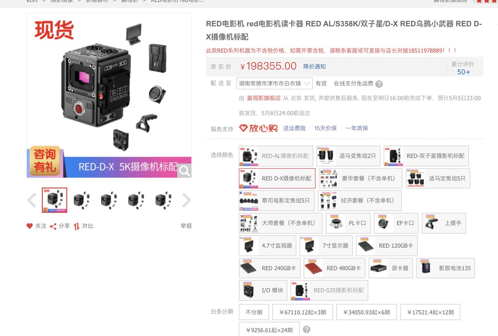

# AI时代的糟糕大批判！

当火箭飞速前进的时候里面的燃料是与火箭一同飞行的，燃料们以为自己搭上了火箭的便车，殊不知燃料始终是燃料，不是乘客 [1]

人工智能，能治工人！[10]

代码越多，码农越困难，这是劳动产品对劳动者的异化。[11]

*我们确定是AI这趟列车的乘客吗，而不是燃料吗？*

## 不回避真正的悲哀

每个社会的发展，靠的是整个社会基本共识的整体进步，而不是一部分人将另一部分嘴捂住，粉饰出来的进步。[28]

- 什么是消极。是一杯水剩下半杯多觉得自己可能会渴死。
- 什么是事实。是杯子里没有水，你觉得你会渴死。
- 什么是洗脑。是你的杯子里明明没有水，但有人拍拍你的肩膀，指一指守着水桶的人，说你不会渴死的，你也觉得自己真的会像人家一样不会渴死。
- 什么是悲哀。是舞台后的你要渴死了，有人在舞台前汇报演出，却演一个有水可喝的人，台下掌声雷动，人民不缺水了，拉下大幕，别人把你的尸体踢到一边。[17]

## 基本概念 [87]

1. 资本主义（Capitalism）是资本属于个人所拥有的经济制度，是以私有制为基础。
2. 社会主义（socialism）是一种社会学思想，诞生于16世纪初，主张整个社会应作为整体，由社会拥有和控制产品、资本、土地、资产等，其管理和分配基于公众利益。
马克思和恩格斯对社会主义提出了他们的理论体系，亦认为社会主义社会是资本主义社会向共产主义社会过渡的社会形态。
3. 共产主义（Communism）是一种政治观点和思想体系，发源地为德国，现今的共产主义奉马克思、恩格斯思想为基本思想。共产主义主张消灭生产资料私有制，并建立一个没有阶级制度、没有剥削、没有压迫，实现人类自我解放的社会，也是社会化集体大生产的社会，面对恶势力也会团结一致。

## 资本主义

资本主义 [61]喜爱强调自由，而对于一无所有的无力应对机器的劳动者而言，这意味着“自由”的接受了征服者与资本的支配[20]

所谓自由或者规矩，只是对资本有利就是自由或者规矩，对资本不利就修改规则让你自由。[74]

国家与意识形态并不绑定，一个国家里有各个意识形态，主要看那种意识形态主导。

### 资本与资本主义的区别

资本主义是资本洗脑术的孕育温床，比如将一个经济组织所创造的成就和价值体量，全部归功于一个人的身上，让这个人成为资本代理人，形成具有聚众效应、又极度神化的崇拜效果。[66]

因为资本如果不能继续保持增值，它就会被更能增殖的资本淘汰、吞噬[88]

所谓“资本家是资本人格化的体现”指的是，作为资本家，只要你处在这个位置上的时候，你的行为模式会完全按照资本的积累需要而进行。也就是说，一旦有了这么一种身份之后，资本家一定程度上是失去了选择的自由的。他只有近可能把公司越做越大，净利润越来越高，而不会想着去减少自己的所得而回馈劳工的。[90] 贪欲，是成为资本家入门条件[91]

### 市场经济的经济危机

而工业时代的市场经济，总不可能命令工厂生产什么、人民买什么吧，只能是什么东西赚钱，工厂闻风而动生产什么，结果动不动就产能过剩。

到那个时候，资本家有钱却不买东西，工人想买东西却没钱，而工厂的东西卖不出去导致破产，紧接着便是工人下岗市场瘫痪。

历次经济危机基本都是这个套路。[54]

### 控制论资本主义

齐瑟默尔：我认为马克思的全部理论都基于一个思维错误。他认为劳动是价值的唯一源泉，忽略了资本主义不只是通过剥削工人，而是通过不断的技术进步在发展。[50]

赛博朋克时代，底层劳动力由于被机器高效率而替代，而显得毫无剥削价值，而被时代淘汰只能以或卖身或抢劫来维持生活，而精英又高度依赖大公司垄断的算力、数据，脱离则毫无价值，被束缚在大公司中，焦虑地缩短机器能替代他们的死期到来。[4]

### 信息资本主义

以微电子、计算机、通讯、电视、广播、光电、纳米、生物和网络技术为标志的信 息技术革命，已经对当代资本主义的经济生活、政治生活 、文化生活和全部社会生活 以及相应的制 度都产生了深刻而重大的影响，社会整体被信息化、网络化、数字化。 [6]

而信息资本主义就是资本主义进入信息社会后的新社会形态。

信息资本主义体现了资本家对信息资本的不懈追求，信息资本家凭借其在信息资本上的优势地位和他们倡导制定的**知识产权法**保护下实施“合法”的信息垄断，以此来牟取比传统行业高许多倍的超额垄断利润。 [2]例如：超70家影视单位视频平台联合艺人以保护版权为由，高举合法正确的旗号，背后都是垄断，排斥影视区自媒体。[8] [29] 控诉[9]、网易云被腾讯的版权壁垒打压[27]

信息资本主义的运行实质是资本家将“属于全人类的信息”、“属于个人的信息”、“信息处理途径”、“信息对智慧进化的影响”转化为资本，进而用这种资本将社会组织形式转变为对资本家有利的状态。

资本也可能会阻止了生产力发展[48]，因为为了个人的盈利，社会没有稀缺反要创造人为的稀缺。

### 平台私人垄断

一个巨头崛起，千万个普通从业者倒下，街边的小店主，小工厂主，小作家纷纷破产。[82]

看似新公司雨后春笋般的出来，后面其实互联网的寡头打的垄断地位。现在的少数几家的互联网平台已经控制了大多数的衣食住行等基础生活设施，而文娱行业是意识形态的重要宣传口，如果被资本掌控，意味我们的思想场被轻易左右，从此将永远看不到威胁平台方利益的真相。

#### 平台不平等协议

默许的“我已阅读并同意《用户协议》”[36] 手游厂商虚拟财产所有权归运营商所有。17年快手，用户在快手上传内容的知识产权都属于快手。原告方要花大量精力去论述用户协议是霸王条款不合理，才能使合同纠纷变为财产纠纷。虚拟财产争议[75]

#### 平台禁言封杀

新媒介与新技术的另一方面效果体现在人对社会文化、现实观念的转变上。按照鲍德里亚的阐述，我们正越发地生活在一个新的世界中，在这里，以信息复制和图像传播为基础的社会再生产秩序正逐渐代替以劳动力和物质生产为基础的旧工业秩序。图像和信息符号正在成为我们了解现实的主要来源。我们正生活在一个被复制和仿造了的世界中。我们无时无刻地被广告、影视、信息爆炸所笼罩着并置身于“超现实”之中（1975）。对真实的证明显得那么不可能，因为我们所掌握的一切都只是复制品而已。从这个角度来看，电影对于复制的概念有着广泛的理解和体现，小到对经典段落的模仿（或戏仿，以突出其互文性的消解意义），大到对整个影片的时代背景的旧貌还原与历史追溯，甚至是夸张地再现场景与话语环境……这一切都或多或少地引导我们对现实、历史以及自身认识层面的再生产的真实性抱着一种怀疑的心态。[62]

而现在这种现实的复制也被控制了。

个人经历：发了一条"好一个无法申诉"的知乎回答，被封7天。所谓平台的规则，解释权归平台所有的或甚至可以无视掉。使得表达受阻、获取真实信息的通道被限制

如何看待部分年轻人对B站《后浪》的消极态度?很多回答，评论区被官方关闭，无关闭理由，也没有收到任何通知。

"习近平告诉你，新时代应该这么干！"视频评论区已关闭[60]

而如果由于什么原因得罪平台而被平台封杀 [3]。其后果是极为可怕的。

GME散户被封杀[74]

#### 平台信息监视

获取手机的不必要的权限，通过信息，了解你的一切，控制着你的一切，从生活到想法。面对越来越无处不在的设备，我们不断有意或无意输入自己的信息，从生活习惯到作息时间；从你的爱好，到你的政治倾向。更直接的，有些互联网公司还会在招聘简历里要求填写中加很多不必要的私人信息。

知识的不对称由权力的不对称来维持。巨大的他者通过全球范围的基础设施，以无法察觉的自动化运作过程达成制度化，同时使得群众将这种运作视作社会参与的必需基础。这是诱惑用户加入这个提取数据的过程。这种社会依赖性是监控项目的核心。对高效生活的强烈需要消解了抵抗监视项目的倾向。这种冲突产生了一种心理麻木，使人们习惯于被追踪，解析，挖掘和修改——或者将它们置于合理化的状态中。[7]

然后反手又把用户的数据贩卖。[13]

用自然语言算法监控社交网络平台来跟踪市场[74]

#### 平台利用大数据

平台留用大数据，而贡献大数据的是用户，是人民。--我说的，难道不是吗

大数据”来源于人们在以计算机为中介开展的行动中产生的小数据。对于数据收集来说，没有什么是微不足道的，例如，Facebook的“喜欢”选项，谷歌搜索，电子邮件，文本，照片，歌曲和视频，位置，通信模式，网络，购买，移动，每次点击，拼写错误的单词，页面视图等等。这些数据被获取，数据化，抽象，聚合，分析，打包，出售，进一步分析并再次出售。这些碎片化的数据流被技术专家称为“数据废气”。一旦将某些数据定义为废物，对此种数据的提取和货币化就不太可能受到公众的质疑。

谷歌成为最大和最成功的“大数据”公司，因为它拥有访问量最大的网站，因而拥有最大的数据废气。……他们选择了广告模式。这一模式依赖于对用户数据的获取，将其作为专有分析和算法生产的原材料，再通过谷歌精确的特有竞拍方式将处理后的数据卖给对应的广告商。随着谷歌收入的快速增长，他们推动了更加全面的数据收集。大数据分析的新科学在很大程度上受到谷歌的巨大推动。[7]

蚂蚁依靠海量数据，勾画精细的用户画像，了解还款能力，网贷坏账率低。又通过资产证券化，循环放贷的模式，加了高杠杆。[26]

#### 平台大数据杀熟

各个用户在同一平台的同一商品价格不同[27]

#### 平台舆论控制

有 “信息富人”们通过这种信息的不对称而掌握了更多的权力，并利用对他们有利的信息来影响公众，操纵政治和决策。 [6] 例如：某大选 (美国选举的实质，诚如列宁批判美式民主所言，这是有钱人的游戏。需要广告，介绍你自己。而广告往往是资本家财团的钱。[57])

历史：研究糖对心血管疾病的作用，资本家用钱买通科学家，从22个国家里人为剔除只剩下7个国家[47]

"马克思研究过当时发表的文章，得出结论的是，对穷人的小偷小摸、犯罪活动，不仅报道太多、而且有所夸大，白领犯罪、政治丑闻提的更少。"[49]

删帖、限流、压热度。[52]我们看不到失败人士，是因为失败人士被剥夺了话语权[79]

#### 工人作息混乱

在资本家看来,工人的一分钟一秒钟,都是他口袋里的鈔票,因此他对工人的一分钟一秒钟也是不肯放过的。

996（应付劳动法：允许探索适应新技术、新业态、新产业、新模式发展需要的特殊工时管理制度。[21]）致猝死[24]、上厕所需计时[12]、新的8小时工作制（中、晚各一个半小时工资，回不去家，工资又跟绩效挂钩），得了一身慢性病[20]而老板不会心疼！

成百上干的“人民富豪”一起不死不休,带着成百上千万无产阶级互相杀伐

弹性工作？？？无非是让我在逼迫下承认我是自愿的。让子弹飞！

#### 平台外包

以网约车为例，这种商业模式看似让消费者打车更方便了，但却让大量网约车司机成为没有任何社会保障的“零工”。网约车司机社会保障的缺失，最后要么他们自己承担，要么社会来承担。从这个角度讲，不要光看到网约车这个互联网商业模式带来的创新，更要看到它背后的社会溢出性成本。[41]

#### 平台奶头乐用户

平台上，信息多要么是碎片化的，要么是娱乐化的。[14]《信息资本主义时代批判宣言》中说此种信息更有益于思想管理，生产下一代的知识劳工。[19]

掩盖事实的最好办法不是一味掩盖，而是真真假假、虚虚实实[40]、转移话题、转移矛盾[43]（5分钟、小费将老板与雇工的矛盾转移到消费者与雇工的矛盾、精神资本家的保护[44]、培养工贼（将做坏事的转移给别人如HR、出了事解雇管理层）[45]、培养中产阶级（高消费显示差异被所谓的奢侈品割韭菜、来削弱无产阶级力量、渴望稳定更好剥削；高薪抱怨996挑拨起阶级内部的矛盾）

内容平台上，沉迷虚拟世界的人去供养那些分享享受优渥和新奇生活（打电竞、玩极限运动、汉服cos）（什么是后浪，前浪的儿子和女儿！[18]）或是打色情擦边球（宅舞区）的人[16]。大数据推荐系统保证了沉迷。

内容平台以点击率、曝光率、流量为先，如B站，近期充满了消费主义和资本主义的批判，不料成为了文化工业、消费主义、资本主义的一部分[37]

#### 平台恶心拉新

PDD为了拉新，搞500元红包，实际上永远领不了[22]背后是一味追求以所谓的用户量、活跃度、在APP的留存时间所考量的估值。

#### 平台超卖商品

某些限量商品它商家可能只有500个货，但是拼多多在卖的时候却可能卖出1000份，多出来的500份拼多多会在付款之后直接强制取消订单，并说是因为账号不满足购买条件(重复购买之类)，但真相确是拼多多为了营销限量商品在拼多多平台非常容易购买到的假象，进行了超卖。[22]评论区——奶贝加晚了

#### 平台金融借贷

打着科技公司的招牌干金融，金融产品层层打包。[75]用低息（日利率）掩盖高年利率的[72]

#### 平台随意封号

微信成了互联网时代的基础设施，涵盖工作社交、政事服务、健康码、etc、水电费。而掌握微信的是资本驱动的对股东负责的商业公司。社交与支付绑定的问题是，如果聊天存在问题，就把支付系统也一起禁用。微信随意被封，资金冻结。而腾讯人工客服少之又少[77]

#### 平台疯狂扩张

以互联网+、信息化的口号，来干社区团购卖菜，抢走最没文化的劳动人民的钱。

### 大佬操纵市场

马斯克凭借推特言论，操纵狗狗币、比特币的价格，涨跌波动巨大[23]

辟谣消息不实，游族董事长“住院恢复治疗，各项体征稳定”，结果没几天人没了。当天公司的人股票就抛了。

阿里上市正面消息拉升股价卖股份，负面消息拉低股价退市回购[73]

Robinhood只准卖不准买GME股票[74]拔网线、删代码、禁止交易[75]

#### 律师函警告

造谣别人造谣，诽谤别人诽谤，很难追究行政、刑事责任。诽谤的主体却不能是公司。PDD猝死由于竞业协议，一直是以供应商的身份参与公告，去外包公司。固化证据要坏，不能给人家撒谎的机会。[24]

对个人动不动几千万的索赔，律师应诉费，按照索赔的金额比例来。

买版面，来掩盖真实的恶心信息。

#### 消费主义

1. 将概念与商品绑定。（你买我的商品、服务才是成功）[46]
1. 培养习惯（电动牙刷）
1. 夸大需求（冲牙器、漱口水）
1. 拔高标准（日本女生审美：卖去毛膏）
1. 纵容黄牛（黄牛使得商品更加稀缺）
1. 制造贩卖焦虑（时代脱轨论，失败，补习班的卷）
1. 加快产品的更新（羡慕，同一个人收割很多次）

### 开源？还是剥削？

各大厂开源背后暗藏对制定规则（起先的一套开源代码有极大的学习成本）的野心，把竞品扼杀在摇篮中。[25]而对于之后的开源开发者，却沦为廉价的甚至是免费的（我就是免费）、随时可以替换的劳动力和大厂所谓拥抱“自由开源"的宣传拉声望的工具人。把核心控制在自己手中，而把高风险少收益的旁支末节交给开源。[47]大厂的稳定恰恰来源于码农的可替代性[58]

fb的张航主张代码开源，为了行业的发展。但我却提出，这只有助于大公司的发展。小厂或个体研究者在数据不多算力不强的情况，公开算法被其他大厂医用，就毫无竞争力可言。一边要求小厂或个体研究者分享，自己又守着核心数据、大量算力的嘴脸真的是恶心。

云公司最爱搞AI比赛，前10名获得奖励，其他的陪着练蛊，还陪着给硬件厂、服务器滋滋滋送钱。[55]

将用户转变为免费的劳动力可是互联网行业的一大创举啊![76]

#### 旧时代的例子

Google要的是大家的浏览器都能流畅跑自己的应用，而不是大家都用自家的浏览器。但是，IE太强 势，Firefox不够强势，Opera万年1％市场，市场需要一个更强势的力量来推动浏览器跑步向前。Chrome就是这股力量。但是，Google认 为只有Chrome不够，他们希望能有Chrome阵营。因为浏览器是众口难调的，总有不喜欢Chrome的人，而Google不可能一个个去满足，那么 最好的方法就是，提供一个Chromium，让其他公司制造自己的浏览器，把Chrome抢不到的那部分用户都占据掉。

打个比方。

Google是做物流的，他希望大家都能通过他运东西。但是，他发现一个问题，很多人家里到他公司的路不通——要么不好走，要么不够宽，大家就不爱用Google。

Google于是想出了一个办法——给买家修路。他不光自己修，而且还提供工具让别人修。别人可以免费拿他的工具来修路。到后来，很多地方都用上了Google的修路工具，修出来的路都是Google标准，Google自家的大货车可以跑的飞快，而他支出的仅仅是工具钱。

Chromium就是那个修路的工具，做出来的各种浏览器就是修好的路，通过这些浏览器，用户可以用更好更快的网上体验，或者说使用Google产品的体验。Google Map、Google Earth、GMail、Driver……这些Google服务都是很依赖高性能浏览器的，你根本无法想象在IE6上用这些网站体验有多烂。

因为Google的努力，现在Chromium系遍地开花，而且其他浏览器也因为Chrome的压力而加快了进化的脚步。现在条条大路通Google，Google的目的已经达成了。[56]

## 社会主义

![资本主义国家视角的各种主义[35]](img/captial-isms.png)
![社会主义国家视角的各种主义[35]](img/social-isms.png)

希望占有资源和支配他人的欲望产生了私有制和资本主义，希望受到他人善意和认同的欲望产生了新式宗教，希望探索新的环境、学到新的知识的欲望促进了人类的智慧进化和文明发展。作为资本主义的对立思想，社会主义以第二种欲望中对人与人之间善意的期盼和第三种欲望中对全人类普遍进步的追求为基础产生。 [5]

社会主义的本质，是解放生产力，发展生产力，消灭剥削，消除两极分化，最终达到共同富裕。[63]

### 信息社会主义

信息资本主义与信息社会主义的本质区别是什么?两者之间是否存在着趋同点的下行(经济形态和技术形态)和不同点的上行(上层建筑?)是否意味着国家之间社会形态的划 分在当代的重心从技术和经济层面转向了上层建筑，主要取决于执政党的性质和意识形态和社会 终极价值(追求目标的不同)

从信息资本主义国家的实践来看，信息化对于人们教育文化水平有较高的要求，而不具备中等甚至高等教育背景的人们往往由于不具备起码的工作能力而排斥在劳动市场之外，或者只能从事低收入的工作，因此，在信息化过程中往往会出现社会成员贫富分化加剧的现象，即所谓“数字鸿沟”，这也是资本主义的内在要求所使然 。那么社会主义由于追求的是共 同富裕，所以信息社会主义的目标理所当然是要消除这种贫富鸿沟，例如通过信息共享来达到这一目标，由此体现了信息社会主义和信息资本主义在上层建筑层次上的重要区别[5]

如果信息社会主义实现的话，那么它肯定已不是社会主义的初级阶段，因为无论从生产力水平还是人均的财富，都应该是比较发达和富足的水平，摆脱了社会主义初级阶段的基本贫穷和不发达状态，此时即使不是高级阶段，也至少是社会主义的“中级阶段”[5]

### 马克思主义的反思（完全自己写的，欢迎来辩）

无产阶级，对于生产资料的实际掌握并不能完全弥补弱势地位（也永远不可能完全最优的实际上掌握并能使用所有的生产资料，永远要参与非自产产品的分配），对于强大的资本阶级，无产阶级还弱势的是外部资本的输血（资本阶级远比无产阶级更团结）、产业链的全盘控制、营销时控制定价。

小布尔乔亚，爱用社会达尔文说被淘汰，说马克思的都是仇富。具有两面性：妥协性软弱性。得势的时候个人奋斗，失势的时候外部压迫。[85]

如何破左派无能、右派无德？

#### 常见行为：

1. 购买行为，本质是选择自己不生产，花钱去利用（选择用资本去夺取）他人的成果。
1. 搭便车（白嫖）行为，本质是选择自己不生产，不花钱去直接利用他人的成果。
1. 生产行为，要么为了自我满足、要么为了交换到满足自己的需要的产品。

真正的问题不在于行为如何，真正的问题是有的个体没法以满意的代价满足其需求，即人永远是目的，而非手段。

#### 其他行为

其他的有可能的行为：

1. 抢劫行为，本质是选择用暴力去夺取他人的成果。
1. 杀戮行为，本质是选择用暴力去夺取他人的成果，并剥夺他人的享用成果的权力，也同时使得别人无法生产。
1. 移民（主/被动）行为，本质是由于他国人民更容易奴役/管理、能实现更低成本去生产。
1. 收税行为，本质是选择用法律权力（孕育在潜在的军事的暴力中）去夺取他人的成果。
1. 逃税行为，将老板个人消费计入公司成本，降低利润，进而减少税收[84]默认富人们成立各种基金会来规避遗产税 [89]
1. 财政分配行为，本质是为没能力或没职能去生产、购买的个体直接送他人的成果。
1. 进出口行为，本质是选择自己不生产，花钱去利用（选择用资本去夺取）他国的成果。
1. 储蓄行为，本质是此刻不能或不是最佳的花钱去利用（选择用资本去夺取）他人的成果的机会，存在银行的场所去积累钱的行为。
1. 投资或借贷行为，本质是选择放弃此刻花钱（此刻无法、不是最佳）去利用（选择用资本去夺取）他人的成果的机会，来换取有未来有更多钱（本金+利息或股息或其他）的机会。
1. 抄袭行为，本质是选择模仿去低成本复制他人的成果。[34]
1. 躺平/禁欲行为，本质是教化自我去降低需求。[38]
1. 奶头乐行为，本质是以他人排练出来的虚拟品经历（娱乐业、短视频、游戏、黄）、赌[46]、毒[42]，去发泄情感需求。
1. 产业转移行为，本质是由于他国能实现更低成本去生产。[39]
1. 剥削行为，资本家仗着自己拥有生产资料而利用劳动者出卖劳动力，获取更多资本以期望利用更多他人成果的行为.[92]

#### 价格的应然与实然

应然：马氏劳动价值论里，商品“应该”按照社会必要劳动时间来“定价”[30]。

实然：而实际上的商品交易时的价格常常是，先排除自我生产必要性，再以一种只考虑到消费、而对实际的生产过程中原材料、生产、运输、运营、销售知之甚少的视角，在了解的有限的他人现有成功或承诺成果的范围，最愿意承受的代价（不一定最低、不一定最满意、也不定有实际的使用价值，是完全的心理上认为的且实际能支付的），是一种单纯的以货币量化的结果。

归谬法：假想自动化已发展到顶点，所有的生产和服务都用不著人类劳动了。任何人都没有收入，但生产和服务却仍有价值。[32]

#### 社会主义有没有危机？

#### 警惕数字、GDP论

中国看上去比美英富得多。这里的街道、机场、地铁、高铁、剧院、人行道、公园，令纽约或巴黎相形见绌。但中国还不算富，人均GDP仍较低，但这恰恰是“中国特色社会主义”如此了不起并优于西方资本主义的地方。中国不必达到人均收入约5万美元以上，才能实现繁荣、赋予国民更好的生活、保护好环境并促进伟大文化。[70]

当我们不需要的东西，我们才习惯用数字代替。真正需要的东西，我们用身体去亲自体验。

#### 第四产业

而在互联网等方式的信息产业(第四产业：对“克拉克大分类法”（第一产业：农业，第二产业：工业，第三产业：服务，除第一、二产业外的所有其他产业）的延伸，该产业是指对本身无明显利润但是可以提升其他产业利润的公共产业。也可以称之为知识产业，或者信息产业。第四产业中劳动对象由“物质资料”向“非物质资料”即“人本身”的转化，就成为人类第四次产业分工区别于前三次产业分工的一个本质特征。[64])里

由于极低的边际传播成本，

1. 存在搭便车行为，这种搭便车极大地方便了抄袭方，反抑制了生产方的创新。
2. 存在明星行为，赢家更容易通吃，企业要么垄断要么死，加剧了恶性竞争。所谓明星行为，是依托网络媒介，将自己的影响力延展开，不再限于某个小地方，上限拉高，成了网红，而由于网络效应，边际收益递增，收入过亿成为可能，可头部网红也并不幸福，网络暴力、抑郁、焦虑常伴左右；而更多的是无人问津的小主播[80]。

更多马克思主义[31] 马克思对中国的思考[51]

#### 手段：计划经济 or 市场经济 ？

##### 计划经济

地方政府一方面运用计划经济的方式低价购地，另一方面利用市场经济方式高价供地，形成“地价剪刀差”，提供了“寻租”空间；地价房价大涨扩大收入差距；抬高实体经济成本，开工厂不如炒房子诱发产业空心化风险。[59]

而由于一线大城市的基础设施建设得好，导致更多人向一线大城市聚集，造成房价市场供不应求，劳动人民一方面被市场经济贩卖低价劳动力，一方面给市场经济方式高价供养房。

市场基础设施属于经济学家所说的公共品：它能使很多人受益，但不能向所有受益的人合理的收费。[61]

##### 市场经济

所谓的市场经济，并不完全市场化，短期来看，日常用品的价格不是按供需调节，而是价格调节了供需，各个商场里的固定价、不讲价；对于高昂、难以支付的物品，我们只能欺骗自己不需要。特别是白酒、房价这种期望上价值会继续升值的资产，价格越贵越有利卖不出去，越能储存下来、价值越高。

市场经济还会带来内卷内耗。

##### 商业道德

商业道德,可持续性,企业社会责任之间的关系[78] 只是考虑更长远的赚钱。

而giao哥、老八身为草根，为了钱和命运，只能不体面地抓短视频的红利[80]

##### 投机倒把？

发现和运用机会本身值得赞扬，可碰上机遇的却告诉我们要奋斗。

#### 警惕政府主义

马克思说马克思主义和政府主义最大的区别就在于不能把剥削的外在形式和剥削混为一谈。[67]真正的重要的区别不是谁掌握生产资料，而是谁在生产，谁在掠夺生产成果去享受（主动而不是没有能力投入生产）？

警惕那些让你奉献的人，他们奉献啥了？[65] 出现了某些特权阶级[69]

某些媒体把人民总体的功劳简单概括为社会主义的体制的功劳或者归于某些领导的功劳[71]，这本身就不社会主义！

当他们说国家应该是民主的、民选的、人民又游行示威的权力，那是因为他们在掌权。当他们发现民众要夺权，就。。[75]

寻租（外文名：rent seeking, 又称为竞租）是指在没有从事生产的情况下，为垄断社会资源或维持垄断地位，从而得到垄断利润（亦即经济租）所从事的一种非生产性寻利活动。 政府运用行政权力对企业和个人的经济活动进行干预和管制，妨碍了市场竞争的作用，从而创造了少数**有特权者**取得超额收入的机会。[78]

> 关于国有企事业单位“同工不同酬”
> 关于同工不同酬，《人民日报》曾给出过一个统计数据：同一个单位，干同样的活儿，聘用工和正式工、农民工和城镇工、编制外和编制内，收入甚至会差出10倍。这种二元用工体制下“按身份分配”的现象被媒体炮轰了很多年，却至今未见改变——越是公众眼中的“好单位”，越是要讲编制的“铁饭碗”，临时工与正式工的待遇差别越大。最近爆出很多与“临时工”有关的事件，出问题时总是拿他们来堵枪口，平日工作中他们却干着最苦最累的活儿，拿着最低最少的工资。[93]

#### 真的有益大众

三北防护林，给贫困乡村基础设施建设，为家家户户消灭贫困。

住房教育医疗三座大山的压力怎么办？[83]

### 态度

#### 中国政府的态度

我国社会主要矛盾已经转化为人民日益增长的美好生活需要和不平衡不充分的发展之间的矛盾！

从2017年对独角兽企业采取了高度支持态度，到2020年12月11日强化反垄断和防止资本无序扩张，21年对阿里、美团大厂等垄断破坏市场行为进行罚款制裁。

#### 我的态度

1. 全世界无产者，联合起来！
1. 绝不宽恕每一个资产/特权阶级的狗！你们吃的是每一个鲜活的人！
1. 共同富裕，才是真正的社会主义。
1. 白猫\黑猫，只抓到老鼠自己吃只是自私的能猫、渣猫，让猫都有老鼠吃才是好猫.
1. 生产力不存在是永远先进的[53]，先进生产力永远要服务人。
1. 思考先富凭什么带动后富，并行动？远比喊喊共同富裕的口号有意义多了。
1. 什么能代表最广大的人民的根本利益，怎么才能证明真的是？

疑问：

1. 人民民主专政里有多少个工人？
1. 拥护祖国统一的爱国者也算统治阶级的一部分的话，那是否一味着只要是爱国XFH而不工作就是统治阶级？[86]

[1]: https://www.bilibili.com/video/BV1Uq4y177S1
[2]: https://wiki.mbalib.com/wiki/%E4%BF%A1%E6%81%AF%E8%B5%84%E6%9C%AC%E4%B8%BB%E4%B9%89
[3]: https://www.bilibili.com/video/BV1fK4y1W7nN?from=search&seid=2454162071381999081
[4]: https://www.bilibili.com/video/BV1NK4y1L7gw?from=search&seid=2454162071381999081
[5]: https://zhuanlan.zhihu.com/p/35481240
[6]: https://doc.mbalib.com/view/05a23f5057ea6492cf4a23e1a988becb.html
[7]: https://www.sohu.com/a/455488656_558442
[8]: https://static.cdsb.com/micropub/Articles/202104/532ea950c5be08f404318b935c950de4.html
[9]: https://www.bilibili.com/video/BV1L54y1j758?from=search&seid=14329003370424701724
[10]: https://www.zhihu.com/question/426967823/answer/1539709385
[11]: https://www.zhihu.com/question/426967823/answer/1542952442
[12]: https://www.zhihu.com/question/426967823
[13]: https://zhuanlan.zhihu.com/p/37181872
[14]: https://www.zhihu.com/question/351872270/answer/911748530
[15]: https://www.zhihu.com/question/392559297/answer/1200640517
[16]: https://www.zhihu.com/question/392559297/answer/1199812279
[17]: https://www.zhihu.com/question/392559297/answer/1199898079
[18]: https://www.zhihu.com/question/392559297/answer/1201222397
[19]: https://www.bilibili.com/video/BV1Q5411g7VK
[20]: https://www.bilibili.com/video/BV1Jf4y1i7Vd?from=search&seid=2192804776703324698
[21]: https://www.bilibili.com/video/BV1Uz4y1o77H?from=search&seid=4185552788087985184
[22]: https://www.bilibili.com/video/BV1qB4y1u7Jx
[23]: https://www.bilibili.com/video/BV185411u7fx
[24]: https://www.bilibili.com/video/BV1Fy4y1m7y5/?spm_id_from=trigger_reload
[25]: https://www.bilibili.com/video/BV1zp4y1i71y
[26]: https://www.bilibili.com/video/BV1Ra411A7CN
[27]: https://www.bilibili.com/video/BV1Wy4y1q75u
[28]: https://www.zhihu.com/question/48030023/answer/110635161
[29]: https://www.bilibili.com/video/BV1pB4y1c7Kd?from=search&seid=15169767110615128413
[30]: https://www.zhihu.com/question/310758658/answer/1820484498
[31]: https://www.marxists.org/chinese/index.html
[32]: https://www.marxists.org/chinese/ernest-mandel/1964book/01.htm
[33]: https://www.bilibili.com/video/BV1Po4y1m7md
[34]: https://www.bilibili.com/video/BV1Xo4y117T3?spm_id_from=333.851.b_7265636f6d6d656e64.1
[35]: https://www.youtube.com/watch?v=uZrGT8MsddQ
[36]: https://www.zhihu.com/question/22232797/answer/93535756
[37]: https://www.zhihu.com/question/405640024/answer/1857956288
[38]: https://www.zhihu.com/question/405640024/answer/1564661735
[39]: https://www.zhihu.com/question/405640024/answer/1861665805
[40]: https://www.zhihu.com/question/405640024/answer/1869504757
[41]: https://www.zhihu.com/question/405640024/answer/1639539077
[42]: https://www.zhihu.com/question/277246072/answer/414094449
[43]: https://www.bilibili.com/video/BV1zt4y1i7UC
[44]: https://www.bilibili.com/video/BV1Dt4y1S7M1
[45]: https://www.bilibili.com/video/BV1Ha4y1E7HZ
[46]: https://www.bilibili.com/video/BV1YA411E7cT
[47]: https://www.bilibili.com/video/BV1za411c7v6
[48]: https://www.bilibili.com/video/BV1zf4y1r7CA
[49]: https://www.bbc.com/zhongwen/simp/world-43988465
[50]: https://www.dw.com/zh/%E4%B8%93%E8%AE%BF%E9%A9%AC%E5%85%8B%E6%80%9D%E8%B5%84%E6%9C%AC%E8%AE%BA%E7%9A%84%E6%80%9D%E7%BB%B4%E9%94%99%E8%AF%AF%E5%9C%A8%E5%93%AA%E9%87%8C/a-40507701
[51]: http://www.12371.cn/special/jjmks/dsyj/
[52]: https://www.zhihu.com/question/438091232/answer/1663546464
[53]: https://www.zhihu.com/question/438091232/answer/1668413818
[54]: https://www.zhihu.com/question/21824072/answer/1461702202
[55]: https://www.zhihu.com/question/352212884/answer/878696028
[56]: https://www.zhihu.com/question/23668839/answer/27590281
[57]: https://www.bilibili.com/video/BV14h411v7aY?from=search&seid=15205302309078165225
[58]: https://www.bilibili.com/video/BV1ch41117qE?from=search&seid=3567381299212200171
[59]: https://finance.sina.cn/zl/2016-08-24/zl-ifxvcsrm2353099.d.html
[60]: https://www.bilibili.com/video/BV1bx411M78W?from=search&seid=8757289022985735868
[61]: https://www.marxists.org/chinese/dictionary-of-marxism/marxist.org-chinese-dictionary-of-marxism-C.htm#2
[62]: https://zh.wikipedia.org/wiki/%E8%A7%A3%E6%9E%84%E4%B8%BB%E4%B9%89
[63]: https://baike.baidu.com/item/%E7%A4%BE%E4%BC%9A%E4%B8%BB%E4%B9%89%E6%9C%AC%E8%B4%A8
[64]: https://baike.baidu.com/item/%E7%AC%AC%E5%9B%9B%E4%BA%A7%E4%B8%9A#:~:text=%E7%AC%AC%E5%9B%9B%E4%BA%A7%E4%B8%9A%E6%98%AF%E4%BB%8B,%E7%A7%B0%E4%B9%8B%E4%B8%BA%E5%85%AC%E5%85%B1%E4%BA%A7%E4%B8%9A%E3%80%82
[65]: https://www.zhihu.com/question/391794083/answer/1680557568
[66]: https://www.zhihu.com/question/391794083/answer/1336445899
[67]: https://www.zhihu.com/question/419020309/answer/1490930652
[68]: http://www.stats.gov.cn/tjsj/zxfb/202101/t20210118_1812425.html
[69]: https://zhuanlan.zhihu.com/p/103452924
[70]: https://zhuanlan.zhihu.com/p/74421463
[71]: https://www.zhihu.com/question/408039874/answer/1589024109
[72]: https://www.bilibili.com/video/BV1Pz4y1Z7iA?from=search&seid=17866019046339404845
[73]: https://www.bilibili.com/video/BV1vK4y1A7Vm?from=search&seid=3562146131533301298
[74]: https://www.bilibili.com/video/BV1jK4y1p7BU?from=search&seid=16606275451331470183
[75]: https://www.bilibili.com/video/BV1pA411u7nB/?spm_id_from=333.788.recommend_more_video.4
[76]: https://www.bilibili.com/video/BV1Qp4y1B7P4
[77]: https://www.bilibili.com/video/BV1h54y127zE?from=search&seid=14322026685179697513
[78]: https://baike.baidu.com/item/%E5%AF%BB%E7%A7%9F#:~:text=%E5%AF%BB%E7%A7%9F%EF%BC%88%E5%A4%96%E6%96%87%E5%90%8D%EF%BC%9Arent,%E5%8F%96%E5%BE%97%E8%B6%85%E9%A2%9D%E6%94%B6%E5%85%A5%E7%9A%84%E6%9C%BA%E4%BC%9A%E3%80%82
[79]: https://www.bilibili.com/video/BV1aK4y157xv?from=search&seid=14322026685179697513
[80]: https://www.bilibili.com/video/BV1o7411V7k5?from=search&seid=13385844298253475363
[81]: https://www.zhihu.com/question/392292530
[82]: https://www.zhihu.com/question/392292530/answer/1206537615
[83]: https://www.zhihu.com/question/392292530/answer/1209208013
[84]: https://www.zhihu.com/question/392292530/answer/1211133773
[85]: https://www.zhihu.com/question/392292530/answer/1209379373
[86]: https://baike.baidu.com/item/%E6%97%A0%E4%BA%A7%E9%98%B6%E7%BA%A7%E4%B8%93%E6%94%BF/1007677
[87]: https://www.zhihu.com/question/392292530/answer/1207615863
[88]: https://www.zhihu.com/question/320073567/answer/654630504
[89]: https://www.zhihu.com/question/320073567/answer/1742299684
[90]: https://www.zhihu.com/question/320073567/answer/665369259
[91]: https://www.zhihu.com/question/320073567/answer/807554405
[92]: https://www.zhihu.com/question/320073567/answer/1637046650
[93]: https://www.zhihu.com/question/320073567/answer/665278628
