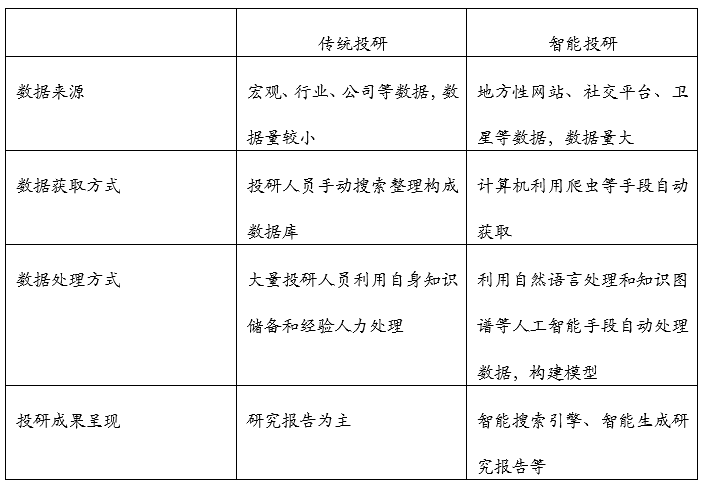

智能投研
========

定义
----

在基础的金融数据基础上，通过深度学习、自然语音处理等等人工智能算法，对数据、时间和结论信息进行\ **自动分析处理**\ ，为金融机构从业人员提供辅助，以提高行业工作效率。\ `1 <https://www.weiyangx.com/362573.html>`__

需求
----

随着互联网的普及，我们已身处信息爆炸时代，投研业务面临数据量过大、数据渠道过多、数据结构多样、数据真假难辨等突出问题，这些问题单靠传统的投研处理方法和手段已很难胜任或很难长期胜任，急需利器。

投研作为投资业务链条的一环，交易、风控等都在快速智能化发展，投研同样需要变革；保持分析的客观性是投研工作的基本要求，借助现代科技手段，既可以提高各类投研工作的效率，又可以\ **弥补人类主观情绪**\ 的干扰。

投行业务及证券研究业务中涉及大量的固定格式的文档撰写工作，如招股说明书、研究报告及投资意向书等。这些报告的撰写需要初级研究员投入大量的时间及精力进行数据整理以及文本复制粘贴的工作。而这些文档中，有大量内容可以利用模板生成，比如公司股权变更、会计数据变更等等。\ **利用自然语言处理及OCR技术**\ 可以方便快捷的完成以上工作，并最终形成文档。\ `6 <http://www.cstf.org.cn/newsdetail.asp?types=36&num=1165>`__

传统投研 VS 智能投研
--------------------

   传统投研 VS 智能投研

基本流程
--------

1. 数据获取（金融数据、另类数据）
2. 数据处理（结构化、模块化、建立联系）–模式化、标准化的工作
3. 数据分析（建立公司、关键股东等动态知识图谱\ `3 <https://zhuanlan.zhihu.com/p/46750171>`__\ ）
4. 观点输出（\ **输出观点**\ 、分析结果）–\ **核心价值**

智能投研 VS 智能投顾
--------------------

-  智能投顾主要是将人工智能辅助引入投顾业务。智能投顾更加偏向于站在客户立场上为客户提供资产配置建议，对客户资金配置到股票、债券、基金等品种上的份额提供合理建议，收取咨询服务费，主要面向C端客户
-  智能投研则是将人工智能引入投研业务中。智能投研更加偏向于辅助资产管理，服务于金融机构的投研人员，主要面向B端。

知识抽取
--------

在金融领域，迅速、全面、准确地获取有价值的行业信息是决定一个企业成败的关键。近些年，随着互联网和金融行业的快速发展，每天都有大量的金融文本产生,面对着海量的公司年报、公告、新闻，其内容分散，数据稀疏，无结构化信息等特点逐渐凸显。如何在数据爆炸的信息中高效找到有价值的知识，将有价值的无结构化信息进行半结构化或结构化是首先需要解决的问题，而信息抽取则是知识发现的核心之一。

目前在金融领域中，\ **文本内容的知识抽取**\ 主要依靠人工判断，分析人员一般需要阅读大量的相关文档(如：年报、公告、行业分析报告、新闻等)，然后从中获取关键信息，为决策提供依据。这种手工作业的方式效率较低，且依赖于从业人员的经验，学习门槛较高，不利于企业业务进一步拓展。\ `4 <https://www.zhihu.com/question/41187047/answer/1262911922>`__

CCKS
2020：面向金融领域的小样本跨类迁移事件抽取\ `7 <https://github.com/xiaoqian19940510/CCKS-2020-event-extraction>`__

情绪分类
--------

搜集大量财经新闻资讯透过NLP自然语言处理技术,分析文章针对原始文章萃取、摘要、并建立财经新闻情绪分类模型,用以分析特定行业与企业的正向、负向信息\ `8 <https://innovate.awssummit.cn/play.aspx?eid=7>`__

智能投研产业链
--------------

上游数据源与数据采集、中游数据处理、下游为各类用户。

TODO:\ `1 <https://www.weiyangx.com/362573.html>`__

不是替代，而是辅助
------------------

智能投研不是替代投研人员，更无法替代资深的投研人员。毕竟很多信息还需要现场调研获取和确认，分析模型、逻辑也需要逐步完善，服务于基金经理、交易员的有灵魂的报告还离不开人去加工润色。如果非要说替代，那替代的首先是价值含量低的工作，比如当前很多公司临时聘用实习生来做的数据采集、处理、分析等工作；其次是那些没有掌握智能投研利器的从业人员。

智能投研在可预见的将来仍将以做辅助工作为主，投研的核心是\ **优秀的投研人员输出观点**\ ，根据有效市场理论，正是因为不同投研人员的预期不同，所以才能为客户赚取超额收益，从而跑赢市场。

相关企业
--------

国内外的初创企业也是非常重要的推动力量,比如
AlphaSense推出的智能擭索引擎,使用自然语言处理技术来提取对投资可能产生影响的关键信息。

国内比如文因互联强化自身深度语义分析和深度文档分析能力的技术优势,过自然语言处理和知识图谱,来对金融数据进行结构化地提取和分析;阿博茨与汇添富基金合作,为汇添富提供智能投研系统,通过应用知识图谱、大数据和A算法,针对投硏数据进行搜索定位从而提高信息阅读效率,辅助投研。此外比如通联数据的萝卜投研、香侬科技熵简科技等也在智能投研方面有相应布局\ `5 <http://www.199it.com/archives/1223002.html>`__

更多
----

http://gb.oversea.cnki.net/KCMS/detail/detail.aspx?filename=1020099658.nh&dbcode=CMFD&dbname=CMFDREF
