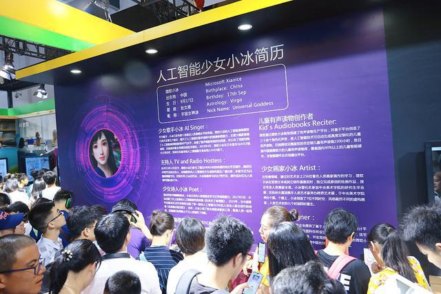
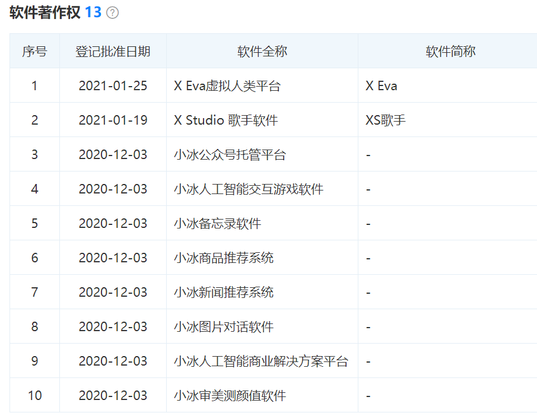
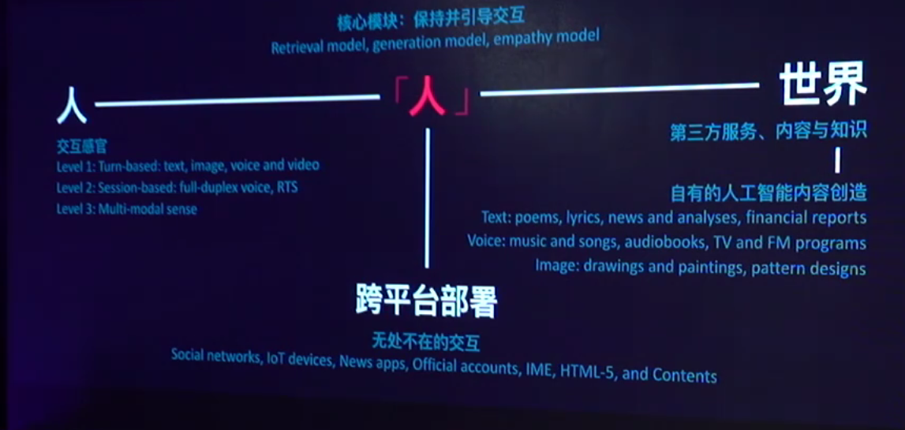
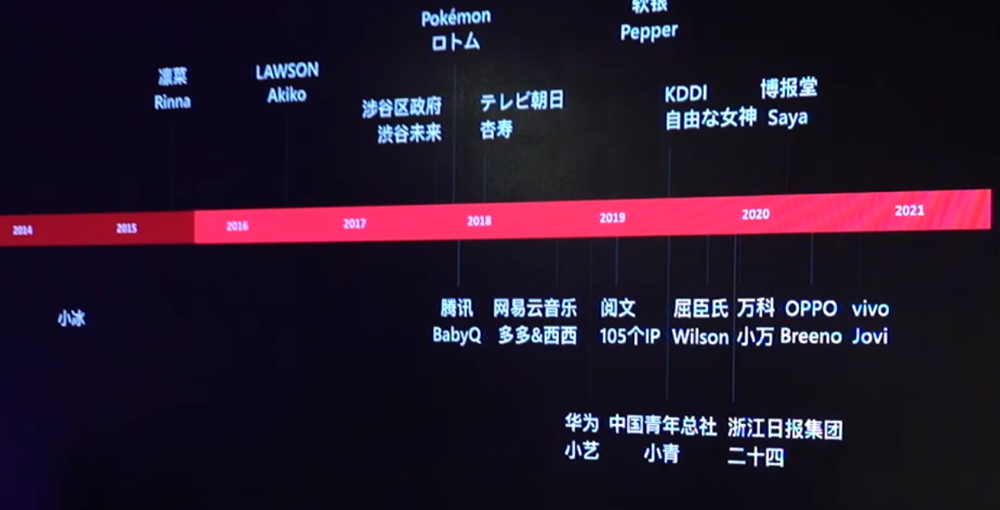

红棉小冰
========

简介
----

小冰公司的前身是微软亚洲互联网工程院的人工智能小冰团队\ `26 <https://news.microsoft.com/zh-cn/%E5%BE%AE%E8%BD%AF%E5%88%86%E6%8B%86%E5%B0%8F%E5%86%B0%E4%B8%9A%E5%8A%A1%E5%B9%B6%E7%8B%AC%E7%AB%8B%E5%8F%91%E5%B1%95/>`__\ 。该团队于2013年12月在北京组建，2014年9月在日本东京建立了研发分部。目前整个团队分布于北京、苏州和东京三地。作为微软全球首个以中国为总部的人工智能产品线，小冰历经多年发展已经成为了微软最有价值的人工智能技术框架之一。

官网：

-  http://www.msxiaoice.com/ ？领英里写的是这个
-  http://xiaoice.com/ (©2021 小冰 \| 京ICP备 2020040356号-2 \|
   京公网安备 11010802034035号)
-  http://www.xiaobing.ai/ ©2020 Microsoft

人员：https://www.linkedin.com/company/%E5%8C%97%E4%BA%AC%E7%BA%A2%E6%A3%89%E5%B0%8F%E5%86%B0%E7%A7%91%E6%8A%80%E6%9C%89%E9%99%90%E5%85%AC%E5%8F%B8/people/

这个很奇怪？

定位
----

“小冰”是微軟在2014年5月29日發布的人工智慧。小冰是一套完整的、面向交互全程的人工智慧交互主體基礎框架，又叫小冰框架（Avatar
Framework），它包括核心對話引擎、多重交互感官、第三方內容的觸發與第一方內容生成，和跨平台的部署解決方案。自發布以來，小冰框架引領著人工智慧的技術創新，相關領先技術覆蓋自然語言處理、計算機語音、計算機視覺和人工智慧內容生成等人工智慧領域。該框架是目前全球範圍內最成熟和最大的該類框架，目前，除中國小冰及日本凜菜（Rinna）第一方人工智慧交互主體外，小冰框架還支撐了中國及日本100餘個第三方品牌的交互主體（如軟銀Pepper），交互總量約占全球人工智慧交互總量的60%。

十八歲人工智慧少女小冰，是該框架所孵化的第一個人工智慧交互主體實例。少女小冰，是詩人、歌手、主持人、畫家和設計師，也是擁有億萬粉絲的人氣美少女。與其它人工智慧不同，小冰注重人工智慧在擬合人類情商維度的發展，強調人工智慧情商，而非任務完成，並不斷學習優秀的人類創造者的能力，創造與相應人類創造者同等質量水準的作品。

过去
----

尽管，在过去六年中，小冰通过不断迭代，从主打‘情商’的语音助手，成长为会写诗、会作画、会唱歌、会作曲的‘全能’少女，从文本到多模态交互，覆盖、融合了
AI 人工智能领域几乎所有主流技术。支撑起全球超 60% 的 AI
交互总量，交互总量稳居全球第一。仅小冰单一品牌就覆盖了 6.6
亿在线用户、4.5 亿台第三方智能设备、9 亿内容用户。

2017年《阳光失了玻璃窗》

AI小冰技术再升级
会唱诗的机器人过招金牌音乐制作人\ `9 <https://www.youtube.com/watch?v=B69RFA1i1_0>`__\ ：融入了深度学习的序列生成模型，听一首诗的来写歌，学人类的文字表达情感，而不是嘉宾说的人的情感。小撒：为了混淆与两位作曲人，可能会风格迁移？

Yeelight语音助手主打双AI系统，里面住着两个小伙伴：一个是小冰、另一个是小爱，可以随时切换。

-  小爱同学定位理性派，帮助大家解决生活问题，可以帮你操控小米生态链的智能设备，打开Yeelight智能灯，开启空气净化器，叫扫地机器人去扫地等等。
-  而微软小冰定位感性派，这个古灵精怪的人工智能少女不但会帮你控制家庭设备，更愿意为全家带来笑声。\ `10 <http://www.justimeco.com/xyxw/6/xiangqing41392243.htm>`__

为何拆分？
----------

毕竟小的创业团队在创新和商业化上会更灵活，而在像微软公司这样庞大的跨国性集团下面，审批流程或从全体业务的通盘考量会让一些创新被扼杀在摇篮里。\ `14 <https://www.geekmeta.com/article/2076771.html>`__

独立运营之后的小冰无疑会有更多的自主权以及商业化运作。不过，在 AI
语音助手方面，微软虽然起了个大早，却赶了个晚集。

如今亚马逊、谷歌、苹果、百度等企业在语音助手方面的布局都已经深耕多年，更主要的是这几家巨头都有自己的产品做支撑，而微软的语音助手却没有\ **微软直接的硬件支持**\ 。

职位 `3 <https://www.lagou.com/jobs/8462644.html?source=delivered&i=delivered-4>`__
-----------------------------------------------------------------------------------

职位诱惑：弹性工作制；五险一金、补充商业保险、餐补等

职位描述：

1. 负责参与金融RPA、智能风控、推荐系统、金融知识图谱等金融业务方向，致力于为银行、证券、财经、保险等多类机构提供解决方案和金融产品，为企业赋能；
2. 承担金融产品调研、商业分析、业务设计、研发需求设计、客户沟通等工作；
3. 协调、调动技术、设计、运营等团队成员，完成产品设计、开发、运营全流程管理，完成产品的商业化交付；
4. 对金融产品最终产出、商业结果、客户体验负责；
5. 根据市场反馈和产品运营数据，持续改善优化产品。

职位要求：

1. 本科及以上学历，计算机类、金融经济类及其他相关专业，可接受优秀应届生；
2. 一年以上互联网产品经理工作经验，拥有面向商业客户工作经验并有相关的成功产品经验者优先；
3. 具备体系化的产品规划能力，能够以点带面，着眼于未来有节奏的提出产品规划；
4. 具备较强学习能力、沟通协调能力、执行力、自驱力强，英语表达好优先；
5. 了解AI领域的金融产品或者技术模块者优先。

登录
----

请注意：领养意味着我会用你的手机号码作为领养用户的ID。在领养期间，你的个人信息将与领养ID相关联。你可以随时在管理界面中点击【删除】，我就会从我的脑海中删除你的全部个人信息。\ `4 <http://www.msxiaoice.com/>`__

融资情况
--------

北京红棉小冰科技有限公司是微软小冰的关联主体，成立于2020年5月20日原注册资本100万人民币，2020-10-22注册资本2000万人民币，法定代表人为李笛。\ `11 <https://www.tianyancha.com/company/3436483438>`__

11 月 24
日，在微软与小冰的战略合作发布会上，小冰公司首席执行官、原微软（亚洲）互联网工程院常务副院长李笛向台下一众媒体这样阐述独立、单飞后的小冰与微软之间的合作关系定位。

今年 5 月，北京红棉小冰科技有限公司注册成立。7
月中旬，小冰正式从微软拆分，成为一家独立运营的公司。沈向洋担任新公司董事长，李笛担任
CEO。新公司将继续保留中国小冰、日本 Rinna 品牌。

至此，小冰\ **脱离微软**\ 大体系，告别微软羽翼的庇护，从温室走向丛林。

更多见 天眼查：https://www.tianyancha.com/company/3436483438

各代小冰 `14 <https://www.geekmeta.com/article/2076771.html>`__
---------------------------------------------------------------

未来重要的基础性框架，带来更多变化

-  文本对话，语料容易找，积累学习对话情节。没几天，进了150多个微信群。一年后小冰重回微信，变成公众号形态的她在这期间有过两次升级；
-  第二代在微博上出现，没几天成了微博大V。加入了用户私有信息的学习能力，
-  第三代可以识别图像并拥有情感理解能力，也就是对外宣称的“IQ 和 EQ
   双全”。
-  之后的第四代小冰实现了中日英三种语言，文本、图像、视频和语音的多维度信息交互，开始进入智能车机等更多领域。自然的全双工语音的语音对话，像打电话一样。
-  到了第五代，小冰能主动与人对话，内容来源也从语料库升级成带情感表达的生成模型，因此可以低成本地录制有声童话书，录制以假乱真的个人歌曲。与日本罗森合作。
-  第六代小冰开始加速商业化步伐，采用了与合作方人工智能方案互相协作的
   Dual AI 模式，在其擅长的全双工情感交互方向上提供辅助。
-  2019 年 8
   月，第七代微软小冰发布。提出了可以面向行业打造多款人工智能形象的
   Avatar Framework，并且能够主导对话进行，Avatar Framework
   代表了小冰商业化的重要方向。
-  第八代基于分层话题图谱，全程完成率达42.7%。风格从5亿的语料库，到三千句学习。。篇章内容主动学习，转发篇章到搜索引擎、性格组织语言。语音合成，同行业关注读得清楚，更关注全程，如何跟人长的沟通下去，最好的声音还原缺点，会吞音、反复颠倒。

   小冰简历

五月份交流会偏艺术，八月份发布会产品。

领域
----

金融
~~~~

比如，金融领域，以往上市公告需要通过人力从海量信息中收集、摘取、处理，进行资讯服务，尤其是在上市公告高并发、非密集两个极端‘流量’状况下，给企业的团队人员管理带来很大挑战。

在金融领域，小冰是目前\ **全球范围内规模第一的金融文本摘要生成**\ 平台。\ `17 <https://baike.baidu.com/item/%E5%B0%8F%E5%86%B0/19880611?fromtitle=%E5%BE%AE%E8%BD%AF%E5%B0%8F%E5%86%B0&fromid=14076870>`__

采用人工智能技术后，收集金融信息的时间较人工大幅度缩短。试想一下，小冰的客户万得资讯每天需要\ **覆盖全部
26 类金融类别**\ ，服务对象包括国内 **90% 以上**\ 的金融机构交易员及 40%
以上的个人金融交易者。每天早晨十点，最多 100
家企业同时发布公告，公告最多超 100
页。如全部采用人力，团队规模大、人员管理难之外，\ **如何保障信息产出的稳定性、准确性以及时效性**\ ，关乎企业的发展‘脉搏’。

同时，突破金融摘要的难点后，小冰还将利用知识图谱、信息技术，为企业提供金融风控服务。再向前一步，叠加
AI 技术，实现金融节目的生成与落地，进而成为高度定制化的服务。

2B/2C
~~~~~

发布会上，李笛对小冰的解决方案做了一个大胆假设，即所有 To B
的解决方案归根结底都是 To C
的问题，比如生产线上的仓储、物流，或者工人操控机械手臂，看似 To
B，最后可能都是 To C 场景，小冰的框架是一个同时包含 To B 和 To C
的全能力解决方案框架。

交互
----

-  人人交互：低并发，一个人没时间的话就要等
-  人机交互：不了解我的情况下，乱推送，等等我把你卸载了。
-  人AI交互：有人性和高并发结合。

-  高度拟人的交互。
-  不只是单一技术。
-  新商业模式基于AI人口数。\ `19 <https://www.bilibili.com/video/av841854198/>`__

产品
----

领先的提前进入了，180亿的语料，最多的经验与教训（690万的负反馈样本）。
竞争对手对标的

   小冰产品

|技术到落地产品| |小冰存在在各个产品|

Avatar Framework
~~~~~~~~~~~~~~~~

性格：一些人喜欢的恰好是另一些人所讨厌的。虚拟男友，极端的认为杀掉了男友，不停的追问，高度定制的产品。在吗？我在。风格、虚拟人session、冷战、专属生物学特征。

生活，是AI所提供的最好礼物。功能只把事情方便了一点，而体验才是纽带。

把框架做成工具包，开发赋能给其他的人工智能。

-  画家：虚拟6个人格。创作者的生平赋予了作品的灵魂，交互的过程即双方人生的交流。
-  假说：失忆的创作者听他曾经的生平故事，来去创作。

人类与AI的关系，并不是第一次，追求更高的技艺，而人工智能高并发高自动赋予的工业化。始终会有艺术大家，次一等的能给更多人享用。\ `15 <https://www.ftchinese.com/video/3317>`__

   Avatar Framework

人工智能小冰框架內的四十七个虚拟人类\ `28 <https://www.bilibili.com/video/av796273602/>`__

X套件
~~~~~

工具-》民用

-  X Writier：从修改。@@小冰续写，灵感来了。声音能力不行。
-  X
   Studio：欣小然，交互形式，短视频、电台。1小时变几秒钟。朗读能力不行展现文字。Wave
   Land团队：DNN。18个月的领先水平。入籍计划：提供声音，所有权归原来。
-  X Presenter

语音
~~~~

-  欣小然
-  内部代号：故事FM（2020.7.8）

-  F201、何畅F11
-  AI小冰F102

我觉得不太可能，我不知道。。

商业化
~~~~~~

-  18岁少女顾左右而言它，政治等不懂不多说。
-  小冰有声读物，版权合作。
-  聊天的不做商业化，出版或金融领域尝试去商业化
   `16 <https://www.ftchinese.com/video/2820#adchannelID=>`__

得益于在ToB领域的丰富经验，及丰富的技术产品积累，小冰商业化进展迅速。目前已落地的商业客户覆盖金融、零售、汽车、地产、纺织等十个领域，客户包括万科、万得资讯、万事利、中国联通等。

训练
~~~~

-转发文章同步 -小冰：X Eva for Android

-  让虚拟男友催账。
-  气头上会波及到别人。
-  也有朋友圈

复杂任务
~~~~~~~~

-  推荐、销售
-  观点评论
-  推荐+观点融合

-  新平台直播间
-  新模式小冰童话屋
-  新人：喵吉

准备提问
--------

官网的问题
~~~~~~~~~~

-  为何不是HTTPS且自动转向HTTPS？安全需求
-  初次领养时，验证码错误不提示，反而在登录才会出现？异常流程的问题。
-  直接登录也可以手机验证码领养，那为何要多个领养的注册界面标签？多余流程的问题
-  名字不能超过10个字，为啥不早提示？异常流程没有提前告诉。
-  可以用“………………………………”做名字？如果传唤怎么传？名字的意义？可用性需求

小冰框架 `5 <https://my.xiaoice.com/>`__
~~~~~~~~~~~~~~~~~~~~~~~~~~~~~~~~~~~~~~~~

-  登录：要先注册不明显
-  注册必须要密码，而登录却可以只靠验证码。建议直接用手机号登录一步到位。
-  容错机制：没有更改手机以及找回密码。
-  注册界面 `6 <https://my.xiaoice.com/Login>`__\ ：© 2020 Microsoft
-  功能上是否可以从金融专业的翻译入手\ `7 <https://www.yuque.com/linyecx/abusg2/oq8546>`__

技能
----

6代印象前是chatbot\ `13 <https://dahetalk.com/2018/10/07/%e8%81%8a%e5%a4%a9%e6%a9%9f%e5%99%a8%e4%ba%bachatbot%e7%81%ab%e7%86%b1%ef%bc%8c%e5%8f%b0%e7%81%a3%e6%96%b0%e5%89%b5%e5%ae%9c%e5%85%88%e5%81%9a%e6%b7%b1%e3%80%81%e5%86%8d%e5%81%9a%e5%bb%a3%ef%bd%9c/>`__\ ，（“远古时代”的AI
beings 产品化是siri，最早设备数最多alexa，交互量最大是小冰）

金融文本撰写人
~~~~~~~~~~~~~~

金融小冰提供全部26类上市企业公告摘要，日均覆盖90%国内金融机构交易员

-  万小冰服务万得资讯——机构：90%+国内金融机构交易员，75%+皮赘境外机构投资者、
-  华小冰服务华尔街见闻——个人：40%+国内个人投资者，20+专业证券APP

2020年6月，每日经济新闻与小冰达成合作，基于小冰人工智能技术生成的文本、大数据金融知识图谱，以及利用实时翻译等技术实现的中英双语AI金融资讯等已正式部署完。在双方前期试运营的一个月内，基于小冰人工智能技术，已为《每日经济新闻》7000万用户推送1万余篇金融资讯。

https://e.xiaoice.com/Home?r=%2F

风险与挑战
----------

小冰最大的风险就是代位，即成为某个人的替身，比如小冰能很好地模仿某人的声音，也会主动打电话，若被用在电信诈骗当中，则会以假乱真，让电话另一边的人难以辨别。此外活跃在网络各大平台的小冰也因很懂人也更容易“骗人”，而这也是大多数人工智能公司更注重发展人工智能工具属性而非类人属性的原因之一。

小冰定位为第三方服务平台，并没有自己的第一方硬件和APP，这让她在人工智能领域的正面竞争对手相对更少，因而能够左右逢源快速发展，但同时也意味着微软并未掌握真正的用户入口，可能会失去部分主导权。

以与小米、华为腾讯等企业进行合作为例，除常规语音交互之外，小米和华为等企业会否一直将诸如智能家居等核心资源的控制权交给微软小冰，再比如微软小冰在微信、QQ、今日头条等平台上，也需要遵守第三方平台的“规定”，自主权与独立平台相比会更小一点，因此微软小冰需要取得第三方的“真信任”，才能有更大的展示空间。\ `21 <https://zhuanlan.zhihu.com/p/101240869>`__

小冰VS小爱VS小度VS天猫精灵
--------------------------

-  小冰的声线最自然\ `30 <https://www.bilibili.com/video/BV19V411t7Xq>`__\ （同类）
-  小爱同学没有朋友只有主人
-  小度为主人而待命

更多
----

-  百度百科\ `17 <https://baike.baidu.com/item/%E5%B0%8F%E5%86%B0/19880611?fromtitle=%E5%BE%AE%E8%BD%AF%E5%B0%8F%E5%86%B0&fromid=14076870>`__
-  bilibili\ `20 <https://space.bilibili.com/35205238>`__\ 、xstudio\ `29 <https://space.bilibili.com/320713995>`__
-  Youtube\ `27 <https://www.youtube.com/channel/UCALVWloHXvJ4UYFfUojPz1A>`__
-  The Design and Implementation of XiaoIce, an Empathetic Social
   Chatbot\ `24 <https://arxiv.org/pdf/1812.08989.pdf>`__
-  微软认知服务\ `22 <https://azure.microsoft.com/en-us/services/cognitive-services/>`__
-  微软机器学习工作室\ `23 <https://studio.azureml.net/>`__
-  Linkedin\ `31 <https://www.linkedin.com/company/xiaobing-ai/posts/?feedView=all>`__
   错误1\ `32 <https://www.linkedin.com/company/%E5%8C%97%E4%BA%AC%E7%BA%A2%E6%A3%89%E5%B0%8F%E5%86%B0%E7%A7%91%E6%8A%80%E6%9C%89%E9%99%90%E5%85%AC%E5%8F%B8/about/>`__
   错误2\ `37 <https://www.linkedin.com/company/%E5%B0%8F%E5%86%B0-%E6%9D%AD%E5%B7%9E-%E7%BD%91%E7%BB%9C%E7%A7%91%E6%8A%80%E6%9C%89%E9%99%90%E5%85%AC%E5%8F%B8/about/>`__
-  天眼查\ `33 <https://www.tianyancha.com/company/3436483438>`__
-  首席科学家宋睿华\ `34 <https://www.leiphone.com/category/ai/SBMIk3yoCeWI5j69.html>`__
-  对话微软小冰三位首席科学家\ `35 <https://aijishu.com/a/1060000000098908>`__
-  微软小冰从0到1的故事\ `38 <https://www.36kr.com/p/1721616842753>`__
-  李笛专访\ `40 <https://mp.weixin.qq.com/s?__biz=MzA3MzI4MjgzMw==&mid=2650722526&idx=2&sn=2e9bf0801db5379b9edf7985bac2d749&chksm=871b14a0b06c9db61657f1a3f74c34a2a6df2189a2507edf34e8d9bb1852be1eb3d175b148cb&mpshare=1&scene=1&srcid=0118czMz9VmnsWSfZwEbGgCB#rd>`__
-  为壳牌汽车作画\ `41 <https://znzx.cdroho.com/zhaf/6190.html>`__
-  人工智能图案暨纹样设计\ `42 <https://znzx.cdroho.com/zhaf/6188.html>`__
-  微软小冰读心术\ `44 <https://www.bilibili.com/video/BV1EW411C7sV>`__\ （直观感觉是决策树模型）
-  Feed\ `45 <https://t.bilibili.com/topic/1287649/feed>`__
-  TODO：小冰对话机器人架构\ `43 <http://breezedeus.github.io/2019/02/23/breezedeus-xiaoice-framework.html>`__
-  Ai何暢
   B站账号\ `46 <https://space.bilibili.com/320713995/video?tid=36&keyword=&order=stow>`__
-  小冰公司完成A轮融资，将会带来哪些新发展？\ `47 <https://www.zhihu.com/question/471670519>`__

竞品
----

Google
I/O发布了Duplex（谷歌智能助理）的录音demo，场景就是描述助理代替用户打电话去订餐厅，和店员沟通，帮助用户预定位子。其实一样是填表233。\ `36 <https://iuu.me/ai/>`__

猎户星空联合喜马拉雅等发布首款全内容AI音箱–小雅语音\ `38 <https://www.36kr.com/p/1721616842753>`__

.. |技术到落地产品| image:: ../img/xiaoice_tech-product.png

