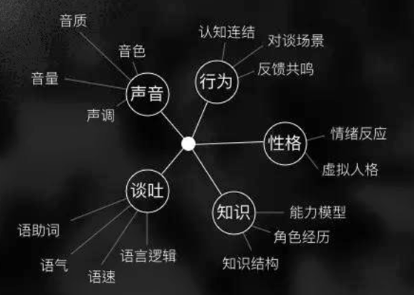

语音
====

技能(skill)，类似于APP，是指可以通过语音交互为用户提供一个或多个特定的功能和服务。

为什么开发语音对话技能？
------------------------

1. 语音对话技能可以解放双手，在一些双手被占用的场合，也能便捷获取服务。比如，在汽车驾驶、厨房等场景下，可以对着一台智能设备说“放首好听的歌”、“提醒我5分钟后把火调小点”，不干扰双手正在做的动作。
2. 服务体验更直接、更高效。比如，在一个有屏设备上想听蔡健雅的歌曲，通过触屏交互方式需要打开音乐软件、打字输入歌手名、搜索、返回结果后选择播放等几个步骤，但在对话交互方式下，只需对着有屏设备说“我想听首蔡健雅的歌”即可，一步直达。
3. 通过语音对话让视觉障碍者方便获取到更多的互联网服务。
4. 语音对话交互新形式，作为一种行业热门和趋势，值得很多创新企业进行一定的投入和探索，避免未来在市场中的被动。
   `2 <https://dingdang.qq.com/doc/page/32>`__

   设计语音对话系统的5个要点\ `3 <http://www.woshipm.com/ai/1695480.html>`__
