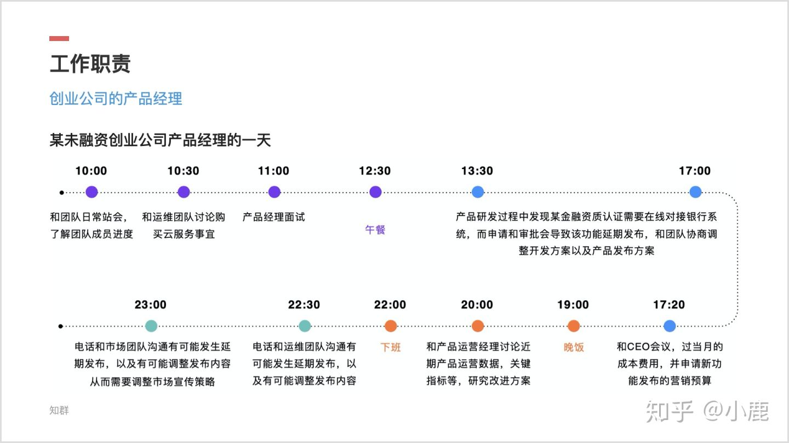

产品经理的一天
==============

结合产品经理基本工作流程来看这个问题，会更容易理解一些。虽然具体的产品开发工作不用产品经理做，但产品经理也绝对做不了甩手掌柜。在有产品开发时，他需要时刻关注产品的进度，进行问题确认，必要的时候协调资源；在没有产品开发时，他需要进行规划，同时还要关注市场及竞品的变化，以能够及时洞察产品的发展趋势。

把以上的这段文字转换成场景，基本上产品经理的一天就能呈现在我们面前。

高薪的真相 `3 <https://weread.qq.com/web/reader/46532b707210fc4f465d044kc9f326d018c9f0f895fb5e4>`__
---------------------------------------------------------------------------------------------------

互联网公司给出的产品经理的工资大多是20 000元以上。

产品经理的工作是非常辛苦的，他们经常要加班，甚至在很多竞争激烈的行业，产品经理的工作实行“996”工作制，这样的工作节奏你能接受吗？如果把工资按照每小时来计算

这些产品经理需要24小时开机，随传随到，每天有干不完的工作，回不完的微信消息，经常需要到凌晨才能睡觉，早上8点左右还要起床，如果工作在北京5环以内，住在通州，那么上班的通勤时间可能要一个半小时，这样的生活状态是你想要的吗？这样的高工资是你追求的吗？

场景
----

早上在上班通勤的路上，产品经理可能会打开新闻客户端，关注自己感兴趣或与工作相关的内容，必要的话会把重要信息或链接记在备忘录里。

到公司以后，规划自己一天的工作，打开电脑首先查看一下邮箱，邮箱里有四五封邮件，其中两封邮件是测试发的bug信息，需要沟通确认；有一封邮件是协同部门发来的，内容主要是得到了一些用户反馈，需要满足新的需求，需要进行评估；还有一封会议通知邮件，下午三点要开某产品需求沟通会议。

然后产品经理的一天也就围绕这几封邮件开始了。

开产品经理组内晨会：每天的产品经理组内晨会都是产品经理跟领导沟通的好机会，如果产品经理在工作中遇到了自己解决不了的问题，要学会寻求领导的帮助。

上午他可能会先去和测试沟通确认一下两个bug该如何修改，沟通的过程中又发现了新的问题，所以后来和测试的沟通就变成了和测试、开发、前端等同事的沟通。问题解决了，时间也过去了半个多小时。

解决了测试bug的问题，产品经理需要好好想想协同部门提的需求。对产品经理而言，需要很慎重地对待需求，有的需求不一定要满足，而有的则必须快速响应。经过初步分析，这个需求是需要满足的，但如何做还需要和领导沟通一下。因此，产品经理就去找领导沟通，沟通后最终形成了一个初步的方案，产品经理以此回复了邮件。而此时已经上班两个多小时了。

   项目邮件基本结构\ `5 <https://g.yuque.com/zhongguodianxinyanjiuyuan/bgso10/wbglgs>`__

产品经理刚发完邮件，着手开始准备下午开会资料时，电话响了。电话是客服同事打来的，说用户使用出现了问题，需要马上解决。产品经理只好先暂时放下手里的活，去解决用户问题。用户问题解决了，时间基本上也就到中午了。

下午的工作内容相对比较整，简单说就是准备开会、开会。不过，在这个过程中，还是时不时需要跟项目成员确认信息；收到其他同事的微信或电话。下午的会开得还算成功，不过有些需求的细节还是需要调整。会议开完，产品经理就开始着手修改工作了。等修改完了，差不多也就到了下班的时间。

其实上面说了那么多，总结起来讲产品经理的一天就是由\ **洞察趋势、内部沟通、整理信息、产品思考**\ 四大部分组成，其中沟通会占大部分时间，形式有面对面、电话、会议等等。所以沟通能力对产品经理来讲，尤为重要。

小结
~~~~

关于产品经理工作流程，我们可以归纳为想、写、说、做、改五个字。任何一个阶段，都由人、物、信息三种元素组成，产品经理的工作也都以此展开。

不同场景的产品经理的一天
~~~~~~~~~~~~~~~~~~~~~~~~

BAT 公司（腾讯商户）产品经理
^^^^^^^^^^^^^^^^^^^^^^^^^^^^

1. 负责设计及规划商户管理及运营管理的系统需求
2. 结合商户管理的实际情况，梳理平台管理规则并进行持续优化
3. 协助业务管理、风控管理等需求，制定合理产品及业务流程
4. 协调资源，规划产品解决方案并持续运营，推进产品方案落地
5. 制定合理产品路线图，对所负责的产品进行中长期规划

.. figure:: ../img/tencent_business_PM.jpg

   BAT 公司（腾讯商户）产品经理的一天

咨询公司产品经理
^^^^^^^^^^^^^^^^

1. 研究并理解客户的战略、商业模式，挖掘并揭示客户的痛点和诉求
2. 帮助客户识别商业机会并建议实施方案
3. 引导需求探寻和创新思考工作坊，产出客户认可的解决方案
4. 创建并清楚展示方案蓝图，确保客户和交付团队理解并达成共识
5. 定义关键目标、成功要素，识别风险、挑战、依赖和约束
6. 有效引导和促进 Product
   Owner、客户出资人、行业专家、技术团队、最终用户间的沟通
7. 和协作，保证产品从概念、到原型、到上线及运营的端到端交付

   咨询公司产品经理的一天

某未融资创业公司产品经理
^^^^^^^^^^^^^^^^^^^^^^^^

-  领导创新产品的构思、技术开发和发布
-  通过达成共识，在整个公司内建立共同的愿景和产品发展方向
-  通过与工程师和设计师团队合作，共同推动产品开发
-  将可用性研究和市场分析整合到产品需求中，以进一步加强用户粘性、
   用户参与度和用户满意度
-  定义、分析及监控产品各个成功的指标
-  了解公司的战略，竞争地位，帮助产品进一步发展并引领业界发展方向
-  在不断变化的环境中最大限度地提高产品效率，领导团队高效执行有创造性的解决方案

   某未融资创业公司产品经理的一天
