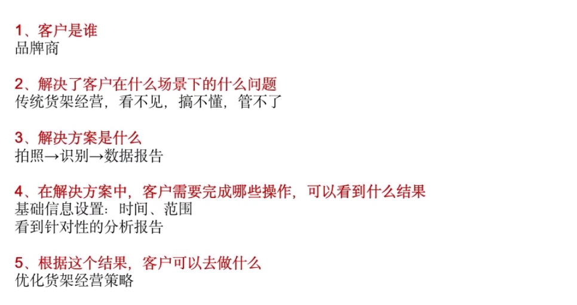
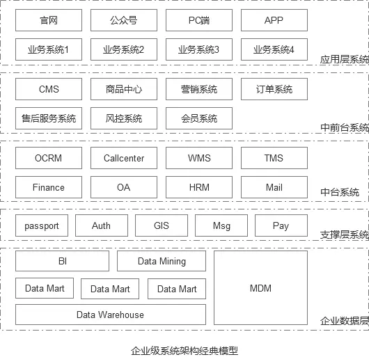

To Business
===========

如何定义B端或C端产品
--------------------

一个产品属于B端还是C端，取决于这个产品究竟在解决什么样的问题，而不在于产品究竟会有什么样的功能。例如，IM即时通信，通常被理解为C端产品的功能，然而这个功能在某些场景下也可以被认为是B端产品的功能，如微信是典型的C端产品，但并不妨碍它发展为B端产品，企业微信便应运而生，你不能简单地说企业微信还是C端产品
 [1]_、智能语音技术可以输出到智能客服和个人助手  [2]_

.. _用户-6:

定义
----

To
B产品主要是面向企业的软件系统产品，例如企业的ERP系统、OA系统以及线上型业务的用户系统、订单系统等。它是一个概称，既可以指单个系统，也可以指代某一个集合体系，例如一整套的解决方案。
 [3]_

B端从概念上既可以是to企业内部这个B，也可以是to企业外部（如其他企业或政府）这个B。 [4]_

核心着力点是：在功能\ **稳定**\ 的前提下提高企业生产、销售、组织等活动的效率。

通用性不高，难参考难复制每个企业以及企业内部的各需求部门业务都不同。

一般 To B
往往的产品往往是行业内技术或者测试出身转岗更为合适，业务的熟悉程度要求高一些。
 [5]_

针对2B产品，部门流程改变，组织架构调整，工作流程优化等  [6]_
产品经理站在 IT 专业上，有更多的话语权来建议业务部门产品应该如何搭建。
 [7]_ 收益难以量化

其产品设计的逻辑是“重流程规则和信息流、轻体验”  [8]_
要解决的主要是不同生产关系的协作沟通需求，在中心化的组织架构下，B端产品需要满足不同层级，组织内外的协作沟通。在这样的背景下，B端产品会考虑比如权限设计，角色分配，运营数据展示等功能。 [9]_围绕核心业务场景完善业务闭环。B端需求基本来自真实的业务场景，1个需求可能来自10个业务方的反馈，10个需求可能满足100个业务场景，因此B端的需求基本都有客户价值，也就无法像C端那样只需抓住核心功能将体验极致优化；B端需求从上到下，需要优先深入相关的业务操作场景，先满足业务场景的可用性需求，再满足业务场景下具体的操作体验
 [10]_

ToB端会用很多的表格去承载信息，在设计架构的时候需要充分理解这些信息表格的意义是什么，要对表格反应的数据保持足够的敏感度。更多的时候，信息表格所涉及到很多选项和必填项，这个时候要区分填写表格内容的核心是什么？什么是他们最关注的信息以及收集数据的目的。
 [11]_

其产品经理叫后端产品经理也叫后台产品经理。 [12]_

用户  [13]_
-----------

B端面向特定的群体，可以收集到明确的需求，是从1到无穷大的过程。  [14]_

B端产品的用户较为理性；决策者以及关键干系人，会从好用、性价比、提高效率、适配公司情况等多个维度来进行综合考虑和筛选，最后选择最为合适的产品来使用。

B端产品较为复杂，并且与日常生活相关不大，多数为垂直行业属性打造，市场上少见，所以一般需要用户花费一定时间来进行学习

角色分工：B端产品至少会分为决策者、管理者、普通员工。

G端(To
Goverment)产品，是比B端产品更B端的产品，产品经理其它能力的权重更低，找到关键決策人利益诉求的权重更高（可能是隐性的，需要高难度能力）。 [15]_

.. _客户成功-22:

客户采购的特点
~~~~~~~~~~~~~~

客户采购的特点主要有：

-  采购金额大，重复消费可能性大；
-  项目进展周期长，\ **对接过程复杂**\ ；
-  采购对象多，参与决策者复杂；
-  销售方式一对一，强化客户关系很重要；
-  要求服务专业化； [16]_

客户成功  [17]_
~~~~~~~~~~~~~~~

1. 服务的客户最终获得了成功，只有这样，他们才能够继续复购企业的业务；
2. 让客户实现了复购，这本质上体现了自身的贡献与价值。

.. _过程-9:

产品本质
--------

To
B产品的本质是效率（生产力）工具，不管是服务于企业的采购、行政、人事、成品/库存管理、销售，本质上都是服务于提高企业的效率。这点在产品的策划、打磨、生产等各阶段都是考虑的重点。

过程  [18]_
-----------

以B端产品为例，包含需求调研，竞品分析，产品规划，产品设计，跟进开发，测试上线，售前推广，客户部署，培训指导，售后跟踪，一次性项目/迭代优化等阶段。

.. _产品分类-16:

B端产品的定位要素是：
---------------------

-  产业链（价值链？资金链？信息链？）上的位置（在哪个环节）
-  发展方向（向上游还是下游） [19]_

产品分类  [20]_
---------------

1. 放大信息类产品
   信息类平台1688、hc360等大型B2B电商平台，通过互联网的流通和放大效应，降低信息获取者的获取成本，降低信息发声者的推广成本，从而放大信息的价值；

2. 提高工作协同效率产品
   钉钉。OA、jira、teambition、点餐系统等皆是促进信息传递，提升企业工作协作效率。通过交互设计的手段，将不同的企业信息、任务流聚集到有效的产品之中。

3. 降低固有成本类产品
   智能客服系统、智能售票、财务管理软件等系统，是降低企业固有成本类产品。

4. 数据挖掘类产品
   随着大数据的到来，企业也越来越注重大数据对企业运营的影响，大数据相关的产品，提供准确数据统计，更全、更准确，成为企业做出正确决策的参考依据；

.. _业务渠道-18:

其他
----

业务渠道  [21]_
~~~~~~~~~~~~~~~

2B业务渠道分为线下渠道和线上渠道，而线下渠道分为经销渠道、KA渠道、企业大客户渠道，线上

渠道分为1688、零售通、新通路、找钢网、找煤网、找塑料网、企业自建的B2B在线订货渠道等。

收费模式
~~~~~~~~

传统的to
B产品大多是本地部署，一次收费，后续的维护、更新等服务，按次收费。

企业外部的B端产品：平台型企业给卖家提供运营管理支持的系统

随着云计算的兴盛，Saas（Software as a
service）服务也随之兴起，云端部署+按年收费的模式开始逐渐成为主流。

经过国内外的众多实践，证明Saas云端服务+按年收费的模式有众多的优点，也是更可行有效，更能实现服务更优、利润最大化的方式。

部署方式
~~~~~~~~

-  私有化部署：软件部署在自己的IDC以及主机和存储设备中，与外网隔离
-  云部署：软件部署在第三方云服务商

技术架构
~~~~~~~~

-  B/S 更优
-  C/S

B/S架构的优势是针对C/S两层架构独有的。并且随着对两种架构的深入理解，发现人们将C/S、B/S架构对立起来是完全错误的！因为B/S架构本身就是C/S三层架构的一个子集

C/S
^^^

C/S软件体系架构，即Client/Server（客户机，服务器）架构，是基于资源不对等且为实现共享而提出来的。C/S架构将应用一分为二，服务器负责数据管理，客户机完成与用户的交互任务。在传统的数据库应用体系中，客户端与数据库完全分开，在客户端上处理大部分业务逻辑，如数据访问规则，业务规则，合法性校验等。每一个客户端都存在数据引擎，并且每个客户端与数据库服务器建立独立的数据库连接。

二层C/S
'''''''

传统的二层C/S架构的优势是开发周期较短，能够适应大部分中小型数据库应用系统的要求。但是该架构局限性也很明显：1.它是单一服务器且以局域网为中心的，所以难以扩展至大型企业广域网或Internet；2.受限于供应商；3.软、硬件的组合及集成能力有限；4.难以管理大量的客户机。

随着数据库的日渐发展，数据容量、客户端数量的不断增加，两层C/S架构已不能满足实际应用的需求，所以三层架构应运而生。

三层C/S
'''''''

所谓三层体系结构，是在客户端与数据库之间加入了一个中间层，也叫组件层。中间层是一个用API定义的软件层,具有强大通信能力和良好可扩展性的分布式软件管理框架。它的功能是在客户机和服务器或者服务器和服务器之间传送数据,实现客户机群和服务器群之间的通信。通常三层结构体系的应用程序将业务规则，数据访问，合法性校验等工作也放到了中间层进行处理。

三层C/S架构将应用功能分层为表示层、功能层和数据层三部分。将上述三层功能装载到硬件的方法基本上有三种，如下图所示。其中表示层配置在客户机汇总，而数据层部署在服务器上。通常情况下，客户端不与数据库进行交互，而是通过通讯协议与中间层建立联系，再经由中间层与数据库进行交互。 [22]_

业务方向：
~~~~~~~~~~

-  业务支持类：企业经营管理或核心业务开展（CRM、仓配系统）
-  办公协同类：企业内部协同办公（OA office automation、HRM）
-  商家端管理：商家前台/后台/商家管理

迭代模式：稳定 or 常变？
------------------------

**对企业**\ ：企业用户的业务在一定时间内具有连续性，因此需求也存在一定时间的延续性。在操作体验上，企业用户并不看重趣味性、更在乎便利性，因此在操作上也会形成惯性路径，即使用习惯。

因此，企业用户希望to B的产品具有一定稳定性。

但业务和需求始终都还是会有变化的，不可能始终不变，因此to
B的产品还是要保持一定的迭代节奏，只不过相比to
C产品，迭代的周期要更长，以及基于前述的原因，迭代要更多基于优化而非大改，不然就使自身丧失了当初的立身基础。

**对产品经理**\ ：为大企业做内部工具，或业务支持工具。这个需求永远存在，所有企业发展越好，所有业务规模越大，这方面的需求就越强烈。大企业也不会像to
C产品一样只有一两家幸存，仅互联网就有很多企业和很多业务足够大，所以岗位容量多，选择丰富。做这些工具产品的方法和原理也比较相似，经验价值有一定可迁移性，所以如果离开一个大企业，还能去另一个大企业。所以，做to
B产品是求稳的产品经理一个不错的选择方向。  [23]_

发展路径
--------

*第一阶段：内部效率工具*

该阶段是To
B产品的创生阶段，面向的用户主要是企业内部的使用者，产品的生产者是卖方，使用者是买方，产品的被使用就能直接或间接地为企业提高生产力，使产品有存续的价值和空间。

该阶段，因为面向的用户主要是企业内部的使用者，并且产品的生产者是卖方、使用者是买方的关系，因此，产品通常是免费的。

*第二阶段：内部商业化*

在很多大型企业，例如集团公司，或者是BU结构的公司，会实行内部成本核算。

内部的效率工具经由内部成本核算，实现的是内部商业化。

企业内部的中后台系统大多都属于前面的两个阶段。

这两个阶段的to B产品有两个关键词：有限内部竞争、行政+利益驱动 。

具体来说，大公司内部可能会有多个团队进行内部竞争，开发相同的产品，以及主要靠行政命令以及利益联合作为产品推广的驱动力。

*第三阶段：外部商业化*

该阶段的产品较少。

一是外部商业化的产品，因为面向外部市场，市场化对产品本身的要求会更高；

二是to
B产品的功能和架构和企业的组织结构及业务体系是适配的，因此从内部转变为外部产品的时候，在产品架构及功能体系方面，会有很大的不同；

三是因为是面向的企业增多，彼此需求并不一致，因此需要面对更高的复杂性。

.. _权限设计-7:

突破点
------

宏观上，要更多地依靠生态体系，或者联盟合作，来进行市场拓展。

例如，某销售型企业需要整套的企业在线化解决方案，公司A主打产品是销售Saas系统，并且是行业最佳，但该客户还有财务、行政Saas系统的需求。

客户担心如果选用了不同服务方的不同产品，体系割裂，数据及账号权限体系不统一，并且也不便于地实现多系统的集成，所以不愿意单独选用公司A的销售Saas产品。

如果有公司B刚好能提供该客户剩余需求的财务及行政系统，公司A和公司B合作，对各自产品进行集合，打通数据及账号权限体系，打包提供给该客户，就可以提升公司A和公司B彼此的交易成功率及市场空间。

.. _学习难-26:

权限设计  [24]_
~~~~~~~~~~~~~~~

权限设计可以保证管理有序 [25]_

权限表
^^^^^^

======== ======== ========== =====
一级导航 页面     页面元素   角色1
======== ======== ========== =====
客户管理 门店列表 “编辑”按钮 √
======== ======== ========== =====

RBAC（role based access control）权限模型
^^^^^^^^^^^^^^^^^^^^^^^^^^^^^^^^^^^^^^^^^

ER模型：用户、角色、用户组

数据权限：各个角色能看到的数据范围
^^^^^^^^^^^^^^^^^^^^^^^^^^^^^^^^^^

-  机构树
-  数据范围是当前节点及其子节点
-  客户地区

学习难  [26]_
-------------

1. 因为B端多数都是企业内部系统，其业务运作和产品设计涉及商业机密，很少对外公开，更难以像C端产品那样暴露在公众面前被大家研习。
2. 是因为B端产品专业性太强，比如搞供应链的，搞CRM的，搞ERP的，领域不同，业务背景不同，产品解决方案不同，除了软件设计方法论是共同的，其他部分都很难提炼出共性的方法论给B端人指导，这就不像C端产品有那么多共性的话题可以探讨。
3. 是因为B端产品复杂程度高，如果想把问题聊透，必须有很深的功底。虽然业界有大量的大拿和专家，但是愿意写文章分享的毕竟是少数，因此很遗憾的造成这个领域学习资料偏少。
4. 是因为很多B端产品知识被沉淀在传统软件公司，很多互联网B端从业者不理解传统软件，而传统IT人又不理解互联网，导致本该有深度融通的两者之间的割裂。
5. B端:我很难是用户

深耕细作
--------

在IT行业内，很多做TO
B产品的公司是可以发展很久的，比如IBM、微软等。 [27]_

To
B产品更重要的是对商业模式的经营和核心功能的打磨。一旦占据了市场领先地位，将比较难被替代，试想一个公司的CRM系统被替代需要付出多少的代价?先要把数据转移，然后还需要适配各个系统。

在前面产品核心竞争力的章节也提到过，ToB产品提供给用户的更多的是服务，服务包含售前、售后、文档、产品功能等多个方面，建立这一套完整的体系是需要经历很长时间打磨的，所以做ToB的产品经理要耐得住性子，积累与沉淀行业 [28]_，打磨产品才有可能得到市场的认可。

对于 To B
来说，潜在用户一共就那么多，这里舍弃点、那里舍弃点，你还有多少用户？你还做个毛线？所以必须深耕细作，争取把行业通吃，toB
里面赢家通吃是很常见的。

深耕细作依赖行业理解。如果你没有参与过销售管理，你就很难明白为什么 CRM
里需要那么复杂的销售线索分配机制。

然而现在的互联网产品人，大多一毕业就进入互联网圈，没有接触行业一线的机会，也不愿意去了解。互联网来钱太容易，PM
都干不了脏活。不信你问问身边的，有几个敢去主动给用户打电话？

而那些在行业里经验丰富的人呢？互联网公司嫌弃他们又土又穷、不懂互联网，很少给他们转业的机会。这些人因为专业、技能、经验和学历的原因，不太容易进入互联网行业；即便进入了，也不可能担任重要角色。可以说很大一部分想法和创新都被封闭和埋没在了领域内部。

这么说肯定有点太抬高领域人才而贬低 PM
们了。事实上你让一个行业大佬来做互联网，大概率难有起色。无讼的创始人是全国顶级律师，产品一坨屎；iCourt
创始人是搞律师培训的，产品年收入破亿。toB
产品人需要把互联网和行业知识相结合，打造完整的产品研发和服务团队。有这能力的人，凤毛麟角。

.. _产品路标规划干系人关键问题拆解法2b产品4:

建立产品服务体系
~~~~~~~~~~~~~~~~

建立产品服务体系是TOB产品与ToC产品的一大区别。在商业化服务场景下，光有孤零零的产品功能是无法跟客户需求匹配的，需要有一系列使用帮助教程。其中产品经理的主要工作是输出整个产品的功能说明文档，要细致到每个按钮。以作者参与的机器学习平台产品为例，单是功能介绍文档就有将近4万字。这些说明文档需要不断地随着产品功能的更新而更新，所以文档工作通常会占用产品经理大量的精力。另外，针对部分比较难以上手的产品，建议要录制使用视频，以视频解说的方式介绍产品的功能。视频教程也是目前人工智能ToB领域比较普遍的功能介绍方式。根据作者的工作经验，录制视频教程的效果会优于文档。

除了功能介绍文档等相关材料的开发工作，服务体系的建立依赖于许多支持团队的合作，产品经理在其中的角色是沟通和协调，将整个售前和售后链路打通。比如产品经理需要给售后团队明确的SLA准则(SLA指的是售后服务保障)，并且培训售后团队，使售后团队在遇到用户索赔和追责的时候可以快速处理问题。在售前方面，产品经理也要协调各个售前工程师和销售团队，给前方团队输出与产品售卖相关的商业指导书，扫清产品售卖工作的障碍。

在产品对外服务的过程中，产品经理是整个体系的接口人，任何售前售后、开发端出现问题都会与产品经理联系，所以在各个团队之间的沟通和协调工作会占据很大的一部分精力。

产品路标规划：干系人关键问题拆解法（2B产品） [29]_
--------------------------------------------------

针对2B产品时，产品规划的核心往往是解决各干系人的问题（优先级客户 > 竞品
>
用户），围绕着产品核心价值路径，不断汇总并提出问题。沿着客户路径，不断的去分解他们的问题，同时要寻找到解决方案。2B类产品的规划就是将各种问题和解决方案进行汇总，然后按照优先级进行罗列，最终形成产品路线图。（有点像需求优先级的判断）

首先要明确产品的核心目标，在该目标的基础上，我们自己要先拆解出几个子问题，比如涉及哪些业务部门？涉及哪些职位？怎样使用产品？使用场景是什么？等。

接下来，可以在以上问题的基础上，做各部门干系人的访谈，继续获得更细节的问题，比如部门的对接人是谁？部门需要得到什么服务支持？部门需要提供什么服务？哪个部门的需求最紧急等等。

实际工作中我们可能会分解出很多的问题，在此基础上，划分好优先级，形成一个在哪个阶段使用什么方式解决哪些干系人的什么问题的产品规划方案。

.. _原型设计要求-5:

MVP
---

基本原则  [30]_

-  突出优势:基于企业自身当前的能力优势
-  先易后难:从简单的功能开始
-  内外兼顾:有大局观，进行通盘考虑。

关键特征是： [31]_

-  体现核心价值主张
-  可以有效的传达给早期利益相关者并得到验证
-  可以不断循环以满足更大的愿景

原型设计要求  [32]_
-------------------

对原型能力要求没那么高，基本就是一个打辅助的作用，来解释需求文档（以前我都是画个demo后直接找UI小姐姐~）

项目管理
--------

项目管理保证软件开发按计划推进、落地，保障团队的产品研发效率与质量

工作重点
~~~~~~~~

-  设计并优化项目管理制度：合理的规范制度可以约束产品团队行为也可以保护产品团队的权益
   比如要求业务部门提交需求时提交BRD
-  负责大中型项目的立项实施

如何把控项目进度
~~~~~~~~~~~~~~~~

-  细化工作，明确交付 工作拆解，明确细化是想的负责人、交付物、时间点
-  通过机制把控进度

1. 开展定期会议：聚合项目各方人员，回顾上次会议以来的进展、遇到的苦难、下一次会议前的计划
2. 每日站会
3. 日报、周报：通报进展、警示风险

会议是生产力。讨论得越清楚，返工就越少。比如系统设计，几个组的人一起讨论清楚系统的边界，上下游系统的关系，你的问题边界和需求是很清晰的。 [33]_

-  编写内容清晰的日报或周报
   管理项目、通报进展；争取关注度和资源，解决项目中遇到的问题

1. 本周进度
2. 项目风险
3. 下周计划
4. 整体进度

-  保持责任心

运营管理
--------

产品运营岗
~~~~~~~~~~

-  SaaS：偏销售、BD职能
-  双边市场攻击端：商家、店铺运营，偏C端运营
-  内部业务系统（以下讨论方向）

工作内容
^^^^^^^^

工作目标：挖掘B端产品能力（现有功能推广、协助完成产品升级优化），帮助其余人解决业务问题（营收增长、风险控制）

-  产品功能推广培训：线上推广宣传（消息推送、公告通知）；现场培训（复杂升级改造）
-  问题解答处理：初上线的系统，组织试点用户群，搜集问题；解答迅速有效；总结共性问题，以便产品进行系统优化
-  需求采集过滤：收集一线业务人员的直接诉求，挖掘到真正会产生影响的需求，和PM持续优化产品
-  项目效果分析：对上线功能进行持续的数据分析和观察；作为中立方，考核项目效果和收益，给出客观分析
-  业务诊断分析：诊断业务，分析问题，提出解决方案

业务运营岗
~~~~~~~~~~

-  业务支持：审批、核对、检验
-  流程管理：保证分支机构管理的规范性和可靠性
-  策略制订：促销策略、定价策略、供应商返点策略、仓储排班策略
-  绩效考核制度制订：自顶向下
-  培训考核
-  项目管理
-  合规质检
-  数据分析

Buyer和User的区别
-----------------

产品经理在设计功能的时候一定要区分这个功能是提供给客户(Buyer)还是用户(User)的，
Buyer指的是实际为产品付费的人，User指的是产品的实际使用用户。

对于ToB产品来讲， Buyer和User往往在企业是不同的角色!且客户带来用户

Buyer是决策链路的核心
~~~~~~~~~~~~~~~~~~~~~

通常决定是否购买一款产品的人是公司的CTO或者CEO，决定购买的人是产品的客户，CTO和CEO更关注产品使用过程中的消耗以及是否能节约人力。也就是说无论是产品设计还是最终产品的营销策略，核心的问题是要提升Buyer的满意度，因为
Buyer是决定是否购买的最关键因素，User更多的是从使用层面去影响
Buyer如果想取得
Buyer的好感，首先要在售卖模式上做文章，产品的售卖是否能做到资源用量可控。比如大部分企业都是预算制，每年在某个部分的消费是提前规划好的，如果产品的售卖模式包含预付费(包年或包月)模式且包含按量付费模式，那么
Buyer在做资源预估的时候就会有更多余地。另外，CTO和CEO很关注产品在使用过程中的效果和消耗，也就是俗称的投入产出比。
很多ToB产品都会为客户设计一个看板用来观察产品的实时具体价值，这些产品的设计都是对
Buyer友好的。

User决定了产品的业务深度
~~~~~~~~~~~~~~~~~~~~~~~~

既然
Buyer是决定产品购买链路最核心的因素，那么User的体验是否就不重要了?显然不是。让User体验感好，是一个产品能否在一家客户做得更深入的关键。User是产品的实际长期使用者，也是产品后期付费的推动者。
如果User验证了产品功能确实能提升自己的效率，自然会给
Buyer提供一个针对产品的正向反馈，这种反馈是产品后期能否得到续费的关键。
其实产品绝大部分的功能是要针对User设计的，提升User好感的方式也有很多种，比如在User使用产品的整个链路上，ToB产品往往会增加很多文档类的引导，目的就是提升User的好感。很多ToB产品也会把User和Buyer的使用路径通过权限做隔离，
Buyer会看到更多与产品报表相关的内容，而User则更多地看到产品功能性的内容。

产品购买链路中User和Buyer之间的矛盾
~~~~~~~~~~~~~~~~~~~~~~~~~~~~~~~~~~~

User受雇于Buyer，那么在购买决策链路中，他们之间是否也会存在矛盾呢。在许多TB产品的场景下，User和
Buyer之间是有一定矛盾的，比如人工智能算法平台这样的产品，目标客户的
Buyer一般是互联网公司的CTO，User是算法工程师。算法工程师在公司中的使命一般是开发和使用算法去解决诸如智能推荐或智能风控这样的业务问题。如果
Buyer买了算法平台这样的产品，某种意义上会替代原先算法团队的工作，这是否意味着User的工作量小了，团队价值也就没有以前那么大了。所以为了同时满足User和
Buyer的需求，产品在设计和宣传时要注意不要一味地强调替代某些人的工作，而是要把产品功能的核心放到如何去提升他人工作的效率上，这一点对于PaS层的产品尤为重要。
以上是一些针对
Buyer和User不同的产品设计理念和营销方向的分析也是ToB产品和ToC产品的主要区别之一。

导致了转移成本高
~~~~~~~~~~~~~~~~

B端产品的转移成本相比之下要高很多。消费者和直接使用者不是一批人。对于直接使用者（用户）来说，他们的使用场景是工作环境中，哪怕产品再难用，为了完成自己的工作，用户还是会使用。很多时候没得选也不允许选。对于消费者（企业）来说，打造一个系统的成本较高，费钱费时，难以做到频繁地更新迭代，加上B端产品大都不直接产生利润，企业的动力也不高，所以要求也就是“凑合凑合，能用就行”。种种原因也就造成了B端产品较高的转移成本。 [34]_

学习成本大
~~~~~~~~~~

To
B产品确实很难，一般属于定制化开发，成本大、难迁移，避免不了功能的堆砌，比如阿里云，对于企业或专业用户尚且需要操作手册或说明，学习成本过高，任务流程多样化、分岔口较多，需要大量的人工客服导致成本过高，虽然已经配备了智能客服，但是客户的问题千变万化难以把控。

很多To B
产品需要进行人员培训与讲解、售前、售后、实施等等，一系列动作下来，客户才勉强可以使用。
 [35]_

思路
----

1. 客户是谁
2. 解决了客户在什么场景下的什么问题
3. 解决方案是什么,利用了哪些工具/中台能力
4. 在解决方案中,客户需要完成哪些操作,可以看到什么结果
5. 根据这个结果,客户可以去做什么

   2B思路示例

如何挑选垂直行业
----------------

1. 行业要发展空间巨大。
2. 存在刚需且高频的普遍需求没有得到很好满足。
3. 有从事过该行业的专家级用户伙伴。
4. 有能够让产品快速、大规模、低成本扩张的合伙人。
5. 做好吃苦3年的准备。 [36]_

经典模型
--------

.. _b2c化-23:

   经典模型 [37]_

.. _to-b-pm所需能力-33:

2B2C化  [38]_
-------------

原有的B端业务开始向C端进行营销，类似于阿里云、高通、蚂蚁金服等都开始打C端广告，想像当年的英特尔一样，挟消费者以令采购方。2B
VS 2C:ref:\ ``2B_VS_2C``

To B PM所需能力  [39]_
----------------------

行业理解能力
~~~~~~~~~~~~

在To
B产品领域，每个行业都有自己的规则甚至是“潜规则”，要想做好行业类产品，必须对行业知识具有深入的理解。行业知识的学习需要长时间的积累，一旦掌握这些行业知识与“潜规则”之后，就会形成自己的能力壁垒，这也就是为什么To
B产品经理被认为是少有的越老越吃香的职业。

商业化能力
~~~~~~~~~~

我们对To C产品的盈利模式已经比较清楚。比如一款To
C产品几乎可以在初期不考虑商业模式的情况下，便可以走出一条利用人口和流量红利进行广告获利或者增值服务获利的商业化路径。但这对于To
B产品而言是走不通的，一来各行各业的商业化路径各不相同，二来To
B产品的商业化之路要比To C产品艰难得多。因此，对于To
B产品而言，做好商业化是成功的关键。

客户导向
~~~~~~~~

客户导向作为To B产品经理的核心底层能力，在工作中尤为重要。To
B产品归根结底是面向企业客户的服务，无论从前期的客户需求调研、业务逻辑分析、产品功能建设，再到后期的产品试用、产品交付、客户关系建设、售后服务支持，都要求产品经理具备客户导向的核心能力。尤其在越来越多To
B企业建立客户成功团队后，更是需要以客户为核心，采取各种方法帮助客户取得成功。

基于To
B产品的特点，在流程设计时更注重逻辑完整、流程高效，在构建设计时，要做到胸有成竹，梳理完成后与用户做明确确认。 [40]_

业务知识
~~~~~~~~

对于To
B产品经理而言，业务流程和底层逻辑是整个产品的基石。对于产品经理而言，必须对业务流程足够熟悉，才能基于\ **清晰的底层逻辑搭建起上层业务系统**\ ，才能够真正解决客户的核心业务问题。同时，在运营过程中，与客户的交流内容也应该围绕核心的业务内容展开，这就要求产品经理对自己所负责的业务知识足够熟悉。具备一定的技术知识，对产品的底层逻辑有足够清晰的理解，就能够在产品设计与客户对接过程中更加从容。

销售与营销
~~~~~~~~~~

To
B的市场小，目标客户少，需要销售单点攻破，购买者是老板、领导或业务直接负责人，款项业务需要漫长的流程，营销难统一进行目标客户穿透，通常进行电话销售、登门拜访，需专业人员漫长的客户驱动，也就是地推。 [41]_

产品交付
~~~~~~~~

与To C产品做完之后就可以直接推给用户不同，To
B产品上线之后还需要与客户进行一系列的对接，才能成功让客户使用产品。To
B产品上线后，需要对销售和商务同事进行针对性的培训，需要制作宣传PPT把产品具备的功能介绍给客户，需要在客户感兴趣时引导客户试用，并在必要时上门进行产品部署。To
B产品的建设只是基础，后续的产品交付环节才是产品成功的关键。这就要求产品经理具备产品交付的能力。

运维、升级
~~~~~~~~~~

To
B产品面向专业人士，门槛高，入行难，执行流程漫长，客户更换成本高，但之后的运维、升级都是稳赚收益，功能设计严谨，包括：角色、权限、安全，部门协作，模块衔接。 [42]_

定价、成本和资源管理
~~~~~~~~~~~~~~~~~~~~

定价体系决定了一个To
B产品的收益走向。定价太低可能赚不到钱，定价太高客户就会选择其他竞品。如何结合自己的产品核心优势，采用灵活的计费方式，制定合适的定价策略，对产品的成败同样至关重要。

.. _常见ai产品-24:

新“技术产品”能力模型
~~~~~~~~~~~~~~~~~~~~

伴随着产业互联网领域的快速发展，To
B产品经理的能力模型并非一成不变（其他互联网职位也同样如此）。

例如，腾讯在2020年就对产品经理通道的职位及能力模型做了大幅度的调整。针对To
B产品经理，除了已有的“行业应用”职位外，新增了“技术产品”职位，两者的区别在于：“行业应用”更偏向于上文所述的To
B产品经理能力模型，“技术产品”在此基础上更深一层，要求产品经理具备在某个领域的专业技术能力，有能力策划供行业开发者使用的产品（例如：代码编译检测工具）。没有技术背景的产品经理很难承担“技术产品”的职责。

常见AI产品  [43]_
-----------------

1. 智能家居：智能家庭机器人、智能音箱、智能手表等等，成为智能家居控制中心（小米、360、京东）
2. 智能语音助手：Siri、Cortana、Google Assistant、度秘、Bixby
3. 其他：各类Bot、AR/VR、无人机

.. _语音2b产品的困境-25:

AI PM
-----

关注人工智能产品周期的第一和最后一英里。B2B公司为一小部分消费者解决非常复杂的问题。以安全为例:许多支持AI/
ml的安全公司只专注于应用威胁和异常检测。尽管它们服务的公司可能非常多样化，但提供这些人工智能产品的公司明确关注\ **一到两种产品类型**——这是消费者人工智能产品很少拥有的优势。

就商业模式而言，市面上传统toB的AI科技公司，大多倾向采用SaaS订阅模式提供AI服务，如书中所言，对甲方客户公司来说降低了采购门槛，同时也降低了乙方AI服务公司的签单难度，但增加了乙方的运营压力，服务标准化，继而规模化显得生死攸关。在国内市场环境下，服务标准化很理想，现实很骨感，每家甲方公司（尤其传统大公司）都有自己的管理特色和业务特色，若需要深入到甲方客户业务中，就做不到自己的产品标准化，更别说通过标品规模化降低单位成本。既要初心、又要资金，所以选择AI应用场景几乎决定了一家toB的AI科技公司的规模，也决定了个人未来职业发展的高度和宽度。

对企业而言，人工智能产品的目标就是提高企业生产力。人工智能技术通过替代企业中的劳动力提高劳动效率和延伸劳动资料这两种方式，提升企业的生产力。 [44]_

语音2B产品的困境  [45]_
~~~~~~~~~~~~~~~~~~~~~~~

**1. 项目周期长。**
迭代慢，一年以上是很正常的时间，非常不利于个人的成长，稍有不慎就有可能被后起之秀超越。

**2. 沟通事项多。**
对外，会花费大把的时间去了解甲方的需求，功能实现方案完成后，还会花很多时间和甲方们决定最终方案。对内，还要多和算法岗的伙伴们进行沟通，很多训练的语句都有可能自己花时间帮助清洗。Bug不仅来自功能逻辑，软件开发人员，还会来自nlp。同时，对于nlp中模型输入的语句泛化能力弱，语言、口音形式多样，完全覆盖所有输入可能性非常小；对于模型的输出，给与的是一个概率输出，识别错误是一定会存在的。所以bug次数增多，debug时间成本增加。

**3. 前人经验不足。**
一般一个行业的发展，有三个阶段：技术优先于产品，产品优先于技术，运营优先于产品。因为现在行业处于起步阶段，没有过多的过来人的指导，很多人都是摸着石头过河，试错过程漫长。

**4. 技术主导话语权。**
现阶段，技术不成熟，语音识别和理解准确率和反应时间都还有很大的优化空间，语音对于去噪的定位能力不完善，使得语音产品的应用场景大大受限，对于要实现何种功能，完成的结果能达到何种标准，算法工程师可能比产品经理更加明白。

**5. 甲方提供需求。**
甲方本身处于行业之中，有足够多的经验，他们知道自己要的需求是什么，用户是什么（随着时代发展，这些需求和用户可能会改变，不一定对），只会要求产品按照他的思路拆解和实现功能，提供实现方案，不会在乎你的新颖产品方案，只要听话就行。

**6. 语音边界不明确。**
对于一般有型产品，用户的操作路线和产品的执行路线是既定好的，但是对于语音产品，没有操作标准，用户能够想问什么就问什么，产品一旦回答不上来，就会降低用户的满意度。

**7. 人体本身的限制。**
用户用眼去获取信息，能够短时间内获取大量信息内容。对于语音，用户只能记住短时间内的信息，并且语音播报本身就是一个过程，需要一个延迟。

**注意**

**1. 明确产品边界。**
在一个或少数几个自己擅长的领域内深耕，能够不断满足用户的需求，并尽量让用户的表现在自己的可控范围之内。在不能实现的领域内，给与明确的边界，直接表明自己做不到，不要给与用户带来过高的不切实际的期望。对于时刻满足用户要求所耗费的精力非常大，实现的可能性也是非常小，所有需求也是不可能穷举完的。

**2. 明确产品定位。**
新品类和旧品类的判断标准是这个产品解决的主要需求是已有的需求还是新的需求（非智能手机解决的需求主要是沟通联系，不论是不是触屏。只有在苹果一代之后，手机解决的主要需求增加为娱乐才是新品类智能手机，包括之后的线上支付也是一个革新）。语音在技术没有成熟之前，只是一个伪新品类，并不能够满足新的需求，解决的只有提高交互效率，缩短完成任务的路径，更远一步就是给用户带来一些尝鲜感。所以不要改变核心需求，在保证现阶段旧产品的效率和准确率的情况下，提高实现核心需求的便携性，同时在非核心需求上增加用户的新鲜体验感，不断带来小惊喜。

**3. 提供个性化和情感联系。**
语音最终的优势就是社交和情感联系。可以提供个性化的语音播报，尽可能的识别用户的情感，语音回复和用户保持在一个情感频道。

AI To B
-------

To
B\ **生意获客和客户关系**\ 才是壁垒。AI企业在AI行业早期获取融资主要靠创始团队背景、囤积人才数量、获得各种比赛名次，因此在早期军备竞赛催生了AI行业获取人才的高溢价。但到了获客和项目实施阶段，才会发现AI行业人才实在太贵了，导致成本高企，在某些场景和客户群体中，无法与灵活的外包企业低成本抗衡，订单也就拿不下来，影响获客，其次人力成本居高不大也导致难以取得盈亏平衡。因此AI产品实际上是起到两方面价值：创造客户价值和降低实施成本。了解客户需求，不断将需求转化为标准产品方式，将产品经理的劳动凝结到产品中，降低实施成本，进而提升获客竞争力和企业利润。 [46]_

基于To
B产品的特点，在流程设计时更注重逻辑完整、流程高效，在构建设计时，要做到胸有成竹，梳理完成后与用户做明确确认。
 [47]_

盈利模式
~~~~~~~~

B业务盈利模式基本就两类：打包卖产品服务和服务分成。 [48]_

拿AI在安防行业举例，软硬件结合几乎成为标准做法，摄像头、识别系统、分析系统打包给客户，并帮客户实施部署同时做日常维护，最后收取客户的产品服务费。但对于某些行业来讲，打包售卖产品服务并非刚需也无金主，譬如某些AI医疗设备企业，也走软硬件一体化并将设备做到国外竞品的几分之一，但铺到基层医院甚至乡村诊所，这些客户无法拿出“巨额”资金购买设备，那么生意如何继续呢，与这些B端合作，AI企业提供产品服务，B端提供场地和人力，最后赚钱大家一起分。

AI产品服务定价不像传统制造业好计算，对于B端客户也难以理解。同样的AI产品服务可能是20w跟300w的区别，为什么定价会差这么多？主要是各公司固定成本和收益预期导致。但也可以发现某些客户就是财大气粗，譬如政府、银行、石油、运营商，身处垄断行业以及有巨额利润或财政拖底，不会那么精打细算，更加关注品牌和客户关系。

AI行业从出现那一刻，就在立足做To B方向，To
B方向不像做一个标准的搜索引擎或者微信就能服务以十亿计的用户，躺着获得巨额利润。

To B业务盈利模式基本就两类：打包卖产品服务和服务分成。

拿AI在安防行业举例，软硬件结合几乎成为标准做法，摄像头、识别系统、分析系统打包给客户，并帮客户实施部署同时做日常维护，最后收取客户的产品服务费。但对于某些行业来讲，打包售卖产品服务并非刚需也无金主，譬如某些AI医疗设备企业，也走软硬件一体化并将设备做到国外竞品的几分之一，但铺到基层医院甚至乡村诊所，这些客户无法拿出“巨额”资金购买设备，那么生意如何继续呢，与这些B端合作，AI企业提供产品服务，B端提供场地和人力，最后赚钱大家一起分。

AI产品服务定价不像传统制造业好计算，对于B端客户也难以理解。同样的AI产品服务可能是20w跟300w的区别，为什么定价会差这么多？主要是各公司固定成本和收益预期导致。但也可以发现某些客户就是财大气粗，譬如政府、银行、石油、运营商，身处垄断行业以及有巨额利润或财政拖底，不会那么精打细算，更加关注品牌和客户关系。

因此对于AI行业公司来讲，切入客户的领域和姿势极其重要。譬如AI行业数美这样的公司，文本发欺诈做的很好，但是行业需求不旺盛和客户付费能力有限，业务叫好不叫座，员工也只能大小周的勤奋加班。金融业务起步晚，虽然银行金主钱多人傻，但是属于追赶者角色，既不叫座也不叫好。这样下来，企业生存困难，就只能依靠勤奋加班来弥补了。 [49]_

更多
----

-  `B 类产品文案指南 <https://www.yuque.com/linyecx/abusg2/occ7pr>`__
-  `寻找最好的B2B的软件 <https://financesonline.com/>`__
-  `B端产品目录 <https://www.yuque.com/weis/tob>`__

.. [1]
   https://weread.qq.com/web/reader/40632860719ad5bb4060856k9a132c802349a1158154a83

.. [2]
   https://www.pianshen.com/article/2712685407

.. [3]
   https://tanxianlian.com/2020/03/07/%e6%88%91%e7%9a%84to-b%e4%ba%a7%e5%93%81%e6%96%b9%e6%b3%95%e8%ae%ba/

.. [4]
   https://mp.weixin.qq.com/s/RTEOekR8Z-0QK_p-y2yzbQs

.. [5]
   https://m.zhipin.com/mpa/html/get/share?type=4&contentId=8eaf00b18d9c5148tnVy2t-9GVI~&uid=5885ce18425348b00nR73NS6E1FX&identity=0

.. [6]
   http://www.woshipm.com/pmd/1792966.html

.. [7]
   https://www.yuque.com/weis/pm/wkixxq

.. [8]
   https://www.aiyingli.com/74015.html

.. [9]
   https://coffee.pmcaff.com/article/2447262389384320/pmcaff?utm_source=forum

.. [10]
   https://www.pianshen.com/article/39201625760/

.. [11]
   https://www.zhihu.com/question/32285554

.. [12]
   http://www.woshipm.com/zhichang/807191.html

.. [13]
   http://www.pmtalk.club/#/article/detail/6375

.. [14]
   https://www.yinxiang.com/everhub/note/f9ab87ee-73e6-4241-9428-9507cbfd007f

.. [15]
   https://zhuanlan.zhihu.com/p/127962653

.. [16]
   https://www.bobinsun.cn/works/2019/03/03/ToB-and-ToC/

.. [17]
   https://www.zhihu.com/pub/reader/119980992/chapter/1284104650384265216

.. [18]
   https://zhiya360.com/50903.html

.. [19]
   https://zhuanlan.zhihu.com/p/30423299

.. [20]
   https://www.jianshu.com/p/b159b89df3f8

.. [21]
   http://reader.epubee.com/books/mobile/12/1240b863fa87878a6e1899147685e374/text00000.html

.. [22]
   https://ihpm.cn/138/.html

.. [23]
   https://www.yinxiang.com/everhub/note/b60b7f01-4a91-473d-82a1-40fc5aa25734

.. [24]
   https://github.com/JoJoDU/Book_Notes/issues/2

.. [25]
   https://wen.woshipm.com/answer/detail/7f3nbr.html

.. [26]
   https://www.36kr.com/p/1723904065537

.. [27]
   https://www.epubit.com/onlineEbookReader?id=0dc0f81254b5455c892a7896d0f7d0ac&pid=9821123a37484750b6317c8c1c217500&isFalls=true

.. [28]
   http://www.woshipm.com/zhichang/4308504.html

.. [29]
   http://www.woshipm.com/pmd/1792966.html

.. [30]
   https://www.niaogebiji.com/article-31885-1.html

.. [31]
   https://www.zhihu.com/question/417983831/answer/1777334295

.. [32]
   http://www.woshipm.com/pmd/3755958.html

.. [33]
   https://xw.qq.com/cmsid/20181217A09KCJ00

.. [34]
   https://coffee.pmcaff.com/article/2447262389384320/pmcaff?utm_source=forum

.. [35]
   https://www.bobinsun.cn/works/2019/03/03/ToB-and-ToC/

.. [36]
   https://www.jianshu.com/p/9c3466ec5957

.. [37]
   http://www.woshipm.com/pmd/3545074.html

.. [38]
   http://www.changgpm.com/thread-153-1-1.html

.. [39]
   https://mp.weixin.qq.com/s/AVxGdQ0UPj11bMDdF8dPJw

.. [40]
   https://www.bobinsun.cn/works/2019/03/03/ToB-and-ToC/

.. [41]
   https://www.bobinsun.cn/works/2019/03/03/ToB-and-ToC/

.. [42]
   https://www.bobinsun.cn/works/2019/03/03/ToB-and-ToC/

.. [43]
   https://www.pianshen.com/article/2712685407

.. [44]
   https://weread.qq.com/web/reader/0c032c9071dbddbc0c06459k70e32fb021170efdf2eca12

.. [45]
   https://zhuanlan.zhihu.com/p/80824253

.. [46]
   https://zhuanlan.zhihu.com/p/55315606

.. [47]
   https://www.bobinsun.cn/works/2019/03/03/ToB-and-ToC/

.. [48]
   https://zhuanlan.zhihu.com/p/55315606

.. [49]
   https://zhuanlan.zhihu.com/p/55315606
