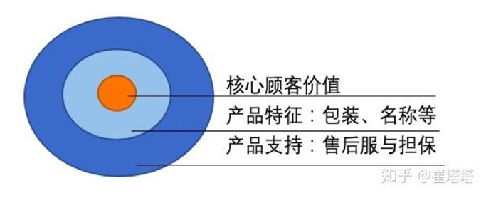
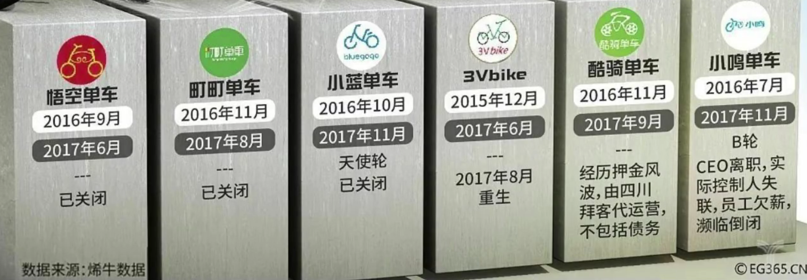

产品
====

什么是产品？
------------

任何事情都可以是产品，任何满足人们实际需求的有形商品或无形服务都是产品。\ `26 <https://www.zhihu.com/question/19563363/answer/1592063177>`__

任何让用户挑不出 Bug 并有高留存高活跃度的行为举措都是产品思维。

你的公众号是产品，你写的文章也是产品，甚至，你今天要穿一套怎样的衣服去一家怎样的公司，说怎样的话去面试，都是产品思维。

产品本质——三个同心圆
--------------------

   产品本质

第一个圆是顾客价值，产品本质的核心层，记住这个公式：顾客价值=内在价值+外在价值+保障价值+彰显价值。根据产品的特性和品牌的优势，有的产品能体现出多项价值有的指能体现单一价值。

第二个圆，产品特征，包括实体产品、包装、名称、质量、风格、品牌名称。产品的包装设计就是在这一层圆发生，设计基石是第一圈的顾客核心价值。

第三个圆，产品支持，是消费产品时提供担保、交付和信用条件、扩展产品、售后服务。\ `32 <https://www.zhihu.com/question/19561774/answer/2007412865>`__

灵感
----

要把自己当成一个傻子，用一种特别挑剔、不满意的方法去试用自己的产品，绝对能够发现很多问题。我们很多产品的改进，都是来自用户看起来不理性的投诉、粗暴的回应，但是认真想一想，用户的不满背后其实都代表了一种需求。
`5 <https://www.jianshu.com/p/ef308c923f06>`__

什么算作成功的产品？
--------------------

常见错误视角：
~~~~~~~~~~~~~~

-  用户：用户人数多（留存、活跃、新增这个优先度递减）
-  社会：可以利用信息打破阶层跨越的
-  运营：人气很旺但是并不要赚钱，只是用来市场卡位的
-  美工：长得好看的产品
-  UI/UE：易学易用、层次感

.. figure:: ../img/good_product.png

   好产品

核心：要、能、赚！
~~~~~~~~~~~~~~~~~~

-  要！–需求/用户：有用、好用、爱用
-  能！–技术/开发：能做、好做、做好
-  赚！–商业/企业：活命、赚钱、持续

用户的维度
~~~~~~~~~~

1. 有用（理性 IQ）：要解决用户的需求
2. 好用（感性 AQ）：要拥有不错的体验（快速、有效、简洁地交互）
3. 爱用（人性
   EQ）：要有黏性（持续不断地迭代，以满足用户不断产生的新需求；产品对用户的吸引力沉淀为对公司极具价值的品牌忠诚度，产品和用户有了情感链接，形成黑话“亚文化现象”）、且能打动人，去调动人原始的感觉和情绪，带来美好的感觉。\ `17 <https://t.qidianla.com/1173713.html>`__

需求
^^^^

这是一个产品之所以被称为产品的前提，产品的本质就是用来解决需求的，黏性和体验是之后的事。需求可用技术满足。

优秀的用户体验
^^^^^^^^^^^^^^

在这个产品同质化竞争比较严重的时代，好的用户体验就是商机，尤其是你弯道超车的策略之一。例如电商三只松鼠的用户体验：在你收到包裹的时候你就会发现每个包装坚果的箱子上都会贴着一段手写体的给快递的话：“快递叔叔我要到我主人那了，你一定要轻拿轻放哦，如果你需要的话也可以直接购买哦。”打开包裹后会发现，每一包坚果都送了一个果壳袋，方便把果壳放在里面;打开坚果的包装袋后，每一个袋子里还有一个封口夹，可以把吃了一半但吃不完的坚果袋儿封住。令你想不到的还有，袋子里备好的擦手湿巾，方便吃之前不用洗手。这些小小的变化使他们的销售额不断增长。所以说好的用户体验就是商机。

**五个层次：**\ `15 <https://www.bilibili.com/video/BV1wt411Y7zh>`__

购买体验–>功能体验–>易用体验–>品牌体验–>情感体验

-  购买体验：ofo（考虑到校园用户对价格敏感，所以身份免押金）VS
   摩拜单车（299的押金）
-  功能体验：摩拜单车（针对公共空间恶劣做了预案的产品，以四年免维护为目标，以质量为重，价格昂贵且笨重的实心轮胎，轴传动骑两公里就很累，符合最后一公里的定位\ `28 <https://www.bilibili.com/video/BV1CB4y1c7WQ?spm_id_from=333.851.b_7265636f6d6d656e64.3>`__\ ，街上少有损坏的）VS
   ofo（虽然投放多，普通的气胎，容易损坏，周破损率达20%，机械锁容易被撬回家，丢失率达80%\ `28 <https://www.bilibili.com/video/BV1CB4y1c7WQ?spm_id_from=333.851.b_7265636f6d6d656e64.3>`__\ ）
-  易用体验：摩拜单车（后续优化单车，推出轻骑版；智能化系统、GPS定位寻找单车）
   VS
   之前的摩拜单车（笨重的实心轮胎）、ofo（开始时采取机械锁\ `21 <https://vickydyy.github.io/2019/06/20/6-20%EF%BC%9A%E4%BA%A7%E5%93%81%E6%80%9D%E8%80%83%EF%BC%88%E4%B8%80%EF%BC%89/>`__\ ）
-  品牌体验：哈罗单车（借助蚂蚁金服的资金、流量互补，实现饿了吗、骑车运动的互补）
   摩拜单车（接入美团App、更名为美团单车、流量互补，实现美团外卖、骑车运动的互补\ `22 <https://finance.sina.com.cn/tech/2020-12-15/doc-iiznezxs7048324.shtml>`__\ ）
   VS ofo（滴滴要求绝对控制力，不考虑合并和收购，最后。。） VS
   滴滴青桔\ `29 <https://live.bilibili.com/22326281?hotRank=0&spm_id_from=333.851.b_62696c695f7265706f72745f6c697665.4>`__
-  情感体验：？

   其他共享单车死亡\ `30 <https://www.bilibili.com/video/BV1dT4y1g7Pk>`__

**功能体验的更多维度**\ `13 <https://coffee.pmcaff.com/article/1329730610781312/pmcaff?utm_source=forum>`__

-  丰富度如何？
-  反应速度如何？
-  扩展性如何？
-  精致度如何？
-  Bug多不多？

黏性
^^^^

一个成功的产品，一定是\ **不断被用户想起的产品**\ ，一旦用户产生了某种需求，就能想起你，这就是一个好的产品。有黏性的产品一定是很好的解决了某种需求，而且做到了竞品没有的高度。用户用了一次就不再使用，说明你的产品并不好，或者说干脆就是定位有了问题。

动态演化：

-  个体价值—>个体黏性—>群体黏性一>生态黏性
-  活靶子 —>护城河 —>增压器 一> 培养皿

技术实现的维度
~~~~~~~~~~~~~~

成功的产品，其产品方案利用当前的技术就可以实现，并且可以长期维护、持续完善。

技术需考虑自己的团队开发能力（新团队否、能否解决技术难点），需求考虑项目周期（是否需要简化、砍），来如期完成项目。\ `12 <https://zhuanlan.zhihu.com/p/24855458>`__

商业的维度
~~~~~~~~~~

成功的产品可以持续为公司创造长期的商业价值，包括但不限于用户规模、产品利润等。

示例
~~~~

为什么幼年淘宝是个好产品
`9 <https://weread.qq.com/web/reader/8d632bc07208ed1c8d697c4k37632cd021737693cfc7149>`__

从 0 到 1 做产品 `14 <https://www.zhihu.com/market/paid_column/1312360599620358144/section/1312363033470443520>`__
------------------------------------------------------------------------------------------------------------------

如果一定要高度概括腾讯产品经理从 0 到 1
做产品的方法，我们可以简化为三步：

找——比——试。

1. 找，多方挖掘，找到需求；
2. 比，对比环境和自身，确定产品策略；
3. 试，快速尝试，实践才出真知。

产品思维
--------

1. 定位、差异点
2. 动力引擎
3. 核心输出
4. 外围价值
5. 商业模式
6. 价值放大

定位、差异点
~~~~~~~~~~~~

陌陌：陌生交友 知群：企业资源

动力引擎
~~~~~~~~

直播带货：流量、价格（新形式的团购）。 知群：以招聘内推作为底层驱动力

核心输出
~~~~~~~~

知群：入行

外围价值
~~~~~~~~

知乎：交流空间、外部性

商业模式
~~~~~~~~

知群：TOP班提供可靠学习保障。

价值放大
~~~~~~~~

产品层次
--------

1. 核心产品：真正所要求——购买唇膏，不只是买嘴唇的颜色而是销售希望
2. 有形产品：质量水准、功能特色、式样、品牌以及包装。
3. 附加产品：提供购买零件保证书、技术、免费操作课程、快速维修服务，和询问任何问题及疑难的免费电话专线。

做出来和推出去的效率
--------------------

-  出来的效率，在管理学里专业的说法是“生产制造的可扩展性”。打比方说，一款产品如果给
   10
   倍的用户使用，那么这款产品在生产制造上的成本提升是多少？如果成本提升得少，就是可扩展性高。
-  推出去的效率，它的专业说法叫“销售传播的可扩展性”。同样的比方，一款产品给
   10
   倍的用户使用，它在销售传播上的成本提升是多少？如果成本提升得少，就是可扩展性高。

提升做出来效率的常见方法：

-  降低复制成本，比如标准化、数字化、智能化；
-  提供基础设施，然后众包 / 外包生产过程。

提升推出去效率的常见方法：

-  消除时间、地点等销售传播的限制因素；
-  产品数字化，减少，甚至消除物流环节；
-  提供基础设施，然后众包/外包分销过程。

关于做出来和推出去效率的提升，我们能看到一些大的趋势：

-  首先，产品交付从实到虚，再到虚实结合，这是因为人们不能只活在数字世界里；
-  其次，效率高的产品供给方，都会渐渐的演变成平台，让更多的玩家、更多的用户参与到做和推的过程中。

如何起步？ `3 <https://www.jianshu.com/p/266cd3df64d5>`__
---------------------------------------------------------

一款产品的起步是有个逻辑顺序的，《产品游戏化》一书里归纳出的逻辑顺序是：习惯打造、启程、发现、精通。以下，我们把“习惯打造”模块，简称为“习惯”模块。

需要注意的是，这和一个新用户使用产品的逻辑顺序并不相同，因为用户是按照“发现、启程、习惯、精通”来使用产品的。

产品起步思维是有实用场景的，更适用于正在从小量用户逐步扩展到大量用户的产品。如果你服务的是少数大客户，第一次交付的产品就需要已经相对完整才行。

习惯
~~~~

先回到“做产品”的逻辑上来，它的第一个模块是习惯。

这要求你先打造出某个
对用户有价值的闭环，用户来了，获得价值了，下一次还愿意来。这个最小的产品模块，已经可以用来做“留存假设”的验证，所以这也算是第三轮的
MVP 了，这里的 P 代表 Product。

启程
~~~~

第二个要做的模块是启程，即用户的第一次体验。

启程模块是产品的验证对象扩展开以后，做给相对的“新手用户”的，最常见的就是各种产品里的“新手上路”模块。

之所以不用最先做启程，是因为产品的早期使用者，往往是高手行家，我们也常把这群人称作种子用户、天使用户，即便没人手把手指导，他们也能用得很溜。

发现
~~~~

然后是发现模块。有了一批新人用户之后，我们算是验证完了启程与习惯模块，这时候产品应该进入推广阶段，开始做“发现”模块。

我们要发掘出用户在何时、何地会对产品产生第一印象，会通过什么渠道第一次接触产品。如果是手机
App
的话，用户在应用商店里看到的广告、搜索产品名称、下载安装，直到第一次点击打开
App 都算是发现模块。

精通
~~~~

最后要做的是精通模块。当产品运营了一段时间之后，就会有相当数量的用户对产品了如指掌，这时候才有必要给他们打造“精通”系统，让他们不断地收到新的刺激。这是高级功能，可以考虑让高级用户参与贡献，充分利用你最热情用户的深层次需求和驱动力。

比如，服务产品里，让高级用户做志愿者，论坛里让高级用户做版主，游戏里让高级玩家做分区的督导者等等，都算是产品的精通模块。

这时候，你已经在打造上一讲里提到的个体粘性、群体粘性了，这些特性的成功，会使产品拥有自己的正反馈闭环，也常常被叫做增长飞轮。

当然也有例外，有些产品，所有用户很快就精通了，基本上，这个产品也就没啥想象力了，比如手电筒
App。

产品服务系统 `4 <https://www.jianshu.com/p/75de15c9d6b3>`__
-----------------------------------------------------------

“产品服务系统”能以一种集成的、有针对性的方式进行产品分类，精准地满足用户需求，有助于产品的创新。

产品服务系统的核心要点是，任何广义的产品都包含有实体部分和服务部分，三大导向，从实体到服务，实体部分越来越少，服务部分越来越多，逐渐过渡。

分三大类导向的产品服务系统，即“实体导向”“使用导向”“结果导向”。

实体导向
~~~~~~~~

第一种，实体导向的产品服务系统。这种类型是以实体为主，包含有少量服务。它的服务目的是让用户可以顺利地使用产品实体，是与实体紧密相关的。比如空调和它的上门安装、保修服务。

使用导向
~~~~~~~~

使用导向的产品服务系统，它和实体导向型产品的区别在于，供给方给你的不是所有权，而是长期独占的使用权（Lease），或者是某种条件下，一段时间的使用权（Renting/Sharing），甚至是共享的使用权（Pooling）。比如摩拜单车
1 小时使用权。

因为使用导向的情况下，用户买的并不是实体，所以相关的配套服务会多一些，以确保用户使用顺利。

结果导向
~~~~~~~~

结果导向就以服务为主了，你要买的不是一个实体，而是一种“结果”，使用实体只是为了达成结果需要用的一个过程或者一个媒介而已。比如网络广告，按点击量、按成交量付费等模式。

有时在消费完结果导向的产品后，你可能甚至感知不到实体的存在，比如付费聊天、轻咨询，甚至是寺庙里求签拜佛。

三种导向间的演变趋势
--------------------

用户模式
~~~~~~~~

从实体到服务的变化意味着从“成交终止”到“成交开始”。

从实体到服务，供应者与用户的关系有越来越紧密的趋势，触点越来越多，用户尝试的成本越来越低。

在这个时代，因为社会供给越来越丰富，所以各种产品的市场会越来越供过于求，这会导致需求驱动而不是生产驱动，用户变得越来越重要。所以，我们要好好思考如何更多地接触用户，给用户创造价值，从而为公司创造更多的商业价值。

比如一个做人工智能客服机器人的生意，这是一种典型的 2B
企业服务。对小客户的交付中，实体比例更多，更偏实体导向，大多数功能让客户自助完成使用。但对
VIP
大客户的交付中，就是服务比例更多，更偏结果导向，甚至会提供外包的客服人员。

因为相对来说，小客户比较容易批量获得，而大客户需要一个个地”啃“，更需要建立长期的关系。这一点，也会体现在下面的增长模式上。

所以，从这个角度来看，越是重要的用户，就越要用服务比例高的产品服务系统来完成交付。

增长模式
~~~~~~~~

增长模式下的实体到服务，是从“数量复制”到“人尽其用”。

不同的卖法，增长的方式不同。实体更容易标准化，从而可以批量地卖给更多的用户，我把这个叫作数量复制。而服务的极致体验是个性化，所以增长的模式挖掘每个用户的更多需求，这叫作人尽其用。

这个角度给我们的启发就是，随着产品供给的极大丰富，没有被开发的用户已经越来越少了，所以我们更要思考\ **如何在已有用户身上做文章**\ ，精细化运营。

比如一个软件，是使用导向的产品，如果它卖的是软件 1
年的使用权，就没法向数据量大的用户收更多的钱。这时候如果改为结果导向，根据数据量收费，那么既可以让数据量少的用户几乎免费使用，降低他们尝试的门槛，也可以充分赚取大客户的费用，对方也更愿意为好的结果付费。

财务模式
~~~~~~~~

在财务模式下，实体到服务的变化是从“当期收入”变为“预期收入”。

从用户模式到增长模式，再到财务模式，实体比例越来越低，会造成的必然结果是短期收入减少，资产投入增加，利润减少，但预期利润增加。

比如房企不卖房，改做长租生意了，那就没有了卖房时那一大笔的即时收入，在一段时间内的资金压力就很大。

所以，偏服务的产品服务系统，不确定性更高，更需要我们掌握新的产品创新方法，更需要有长远的眼光。

从单一产品到产品矩阵 `2 <https://www.jianshu.com/p/ed738dac00e5>`__
-------------------------------------------------------------------

-  PSF，是
   Problem-Solution-Fit，问题与解决方案的匹配，这是价值假设，相当于从 0
   到 1；
-  PMF，是 Product-Market-Fit，产品与市场的匹配，这是增长假设，是从 1 到
   N；
-  PRF，是
   Positioning-Resource-Fit，定位与资源的匹配，这是长青假设，是从 N
   到正无穷。

价值假设：问题与解决方案的匹配
~~~~~~~~~~~~~~~~~~~~~~~~~~~~~~

PSF 要验证的是价值，即问题对不对，解决方案对不对，对应着前两轮
MVP，也就是 Paperwork 和 Prototype 阶段。

这一阶段中常见的错误有三点：

1. 问题不存在，是臆想出来的。（点子过滤器来避免）
2. 解决方案不存在。根本无解的事，多思无益。（询问领域专家来避免）
3. 问题也有，解决方案也有，但是问题（P）和解决方案（S）不匹配。（用户测试来避免）

增长假设：产品与市场的匹配
~~~~~~~~~~~~~~~~~~~~~~~~~~

如果问题（P）和解决方案（S）匹配了，达到了
PSF，我们才算有了一个产品，也就是 PMF 的
P——Product。这时候重点就变成了后两轮 MVP，Product 和 Promotion
相关的内容了。

PMF 讲的是产品与市场的匹配，要验证的是增长，也就是产品的生产 /
分销可扩展性好不好，市场是不是足够好。

产品与市场的匹配中常见的几种错误：

1. 产品有了，但本身无法规模化。（寻求模式突破来解决）
2. 没有一个相对大、不断增长的市场，导致这事儿只是个小生意，不是个大事业。（当然，“做大”是一种选择，“小而美”也是一种选择，只不过你想选哪种得先想清楚。）
3. 产品和市场不匹配。比如在行，产品与市场的供需关系上出现了一个逻辑问题，即“一群有时间没钱的人，花钱买一群有钱没时间的人的时间”，这是不可能有很大增长的。（需要对行业做深入的分析研究）
4. 做一件事，问题与解决方案是必须匹配上的。但是如果你觉得小而美也挺好的话，追求产品与市场的匹配（PMF
   和增长）就并不是必须的。

长青假设：定位与资源的匹配
~~~~~~~~~~~~~~~~~~~~~~~~~~

如果你做到了产品与市场的匹配（PMF
达到），那就算找到了一个自己公司团队的定位，也就是 PRF 的
P，Positioning，下一步就是达成 PRF，完成定位与资源的匹配来扩大战果。

这一部分，就超出了单一产品的范畴，不在四轮 MVP
框架里了。这里面也有几种常犯的错误：

1. 定位不可持续。定位是公司立身之本，即“使命、愿景、价值观”，是公司早期靠着创始团队、产品、用户之间的反复互动，逐渐打磨清晰的，它给我们的后续产品指明了大方向。如果你的定位是“最好的马车公司”，那汽车时代来临时，你该怎么办？
2. 资源没能积累。随着公司、产品、用户的协同发展，应该要有某种资源像雪球一样越滚越大，形成自己的增长飞轮。比如用户越来越多，成交就越来越多，对商家的议价能力就越来越强，商品价格越来越便宜，用户就越来越多，完成闭环。这就是一个典型的增长飞轮。而有不少公司，除了不断赚点钱，没能积累下什么。
3. 定位和资源不匹配。这一点阿里做得不错，使命是“让天下没有难做的生意”，重要资源是不断积累的数据，数据可以帮助生意做得更好。
4. 如果成功达成了定位和资源的匹配，那我们就可以说，公司有了一个很好的产品矩阵。

单一产品在矩阵中的评价
~~~~~~~~~~~~~~~~~~~~~~

矩阵中的任何一个产品，做得好的话，都要考虑和其他众多产品的关系，都要求该产品满足三个条件：可复用、能积累、善生死。

1. 可复用：就是说可以复用公司的积累，比如供应链、比如数据沉淀、比如已有用户。如果不能复用的话，你推出的第二个产品和众多竞争对手相比，就没有任何优势。
2. 能积累：意味着后续产品可以为公司积累将来可复用的资源，好产品应该让整体更优，而不是单纯地消耗公司的积累。
3. 善生死：说的是要有合理的生命周期管理。每一个产品，都要在该进入的时候进入，该退出的时候退出。一个公司和一个生态系统一样，资源都是有限的，有时候死亡（即释放资源）可以创造巨大的价值。

产品成功 `6 <https://www.jianshu.com/p/111d9fcc005e?utm_campaign=maleskine&utm_content=note&utm_medium=seo_notes&utm_source=recommendation>`__
----------------------------------------------------------------------------------------------------------------------------------------------

产品设计、竞争策略、全局商战

底层思维：整体式设计是指不能单点极致，需要整体开花；用户决策思维意味着产品设计要关注用户决策，而不是一味追求用户体验；价值本位模型是指产品设计要围绕核心价值展开，流量圈养的互联网思维并不适用。

产品创新（微观层）：探索——发展——成熟的三个阶段，AI+硬件的模式：硬件赋能模式和互联网管道模式（智能音箱背后的语音平台、内容服务等）。

竞争态势（中观层，竞争产品阵营当下的格局和未来的势头）：对抗（巨头争霸）、割据（多品牌分散）、创新（率先进入新领域）、延伸（大生态中延伸小生态）

商战全局（宏观层）：以产品为根基，表现为价值驱动（追求先进性，如大疆，激进）、认知驱动（追求差异性，如oppo，后发制人）、购买驱动（追求经济性，如小米）三种类型。

产品模型 `7 <https://weread.qq.com/web/reader/46532b707210fc4f465d044k3c5327902153c59dc0488e1>`__
-------------------------------------------------------------------------------------------------

了解各类产品的模型,比如社交产品的基本形态、电商产品的基本形态等

目的 `8 <https://weread.qq.com/web/reader/8d632bc07208ed1c8d697c4kecc32f3013eccbc87e4b62e>`__
---------------------------------------------------------------------------------------------

产品思维是方法，而产品创新是目的。只有完成从想到做、从思维方式具体到做事方法的转变，才能使产品创新落地。

早期产品的三个核心问题
----------------------

-  需求：解决什么人的什么需求 :ref:`need`
-  具体形态：如何解决的 :ref:`chap_skill`
-  推广：人们怎么知道它 :ref:`yunying`

首先是需求，产品所解决的需求是一个多大的市场规模，是大部分人都需要的，还是仅局限在一个垂直的人群，规模多大？这个需求出现的频率如何，是每天都需要的，还是每周几次，还是隔上至少个把月甚至更长时间才能想到的？这个道理很简单，那些绝大部分人都需要的而且每天都需要的，是S级的需求，比如微信解决的是沟通这样的SSS级需求，又比如搜索、支付、影音，都是大部分人经常用到的；而那些尽管小众、但经常使用，又或者虽然使用频度不高，但也是大部分人都需要的，是次一级需求，比如教育、办公，比如购物、旅游；遇到那些不知道做给谁的、不知道多久才能想起来一次的产品，基本就算了吧。

推广：销售人员把和客户接触的宝贵时间当成产品宣讲会，只把重点放在产品特性上，大讲特讲产品的技术规格和其他属性，这样的产品和服务宣传只会让客户更加迷惑，实质就是没有从客户功能需求的角度考虑问题，其实要问的问题应该是客户买电钻要在砖墙上打孔，还是要在木板上打孔，是为了挂一台电视、一幅画打孔还是为了挂衣服打孔。正是这些用户需求才让客户有了购买电钻的需求。

产品模型
--------

产品模型=商业模式+产品架构+运营体系\ `24 <https://www.jianshu.com/p/39472c3f993c>`__

-  商业模式指产品的市场潜力，综合了用户与营收价值。
-  产品架构指产品设计上的框架与核心系统。
-  运营体系与产品架构类似，指运营上的组织流程与重点难点。

产品定位 `11 <https://zhuanlan.zhihu.com/p/24855458>`__
-------------------------------------------------------

用户需求 + 产品定义 = 产品定位

产品定位就是关于产品的目标、范围、特征等约束条件，包括产品定义和用户需求。

产品定义：\ `27 <https://mp.weixin.qq.com/s/tFiqERFrHy_1l5pgayR_jA>`__

-  定义每一个产品，它的核心功能是什么？
-  它的杀手锏是什么？
-  以及每一个小功能在整个APP中的定位？
-  每个产品和服务间能否产生增益效果、互相增长？

举例：\ `31 <https://zhuanlan.zhihu.com/p/390835483>`__

-  今日头条是“为用户提供丰富、个性化的资讯”；
-  网易蜗牛读书是“致力于为热爱阅读的用户提供沉浸、简洁的电子阅读体验服务”；
-  摩拜单车是“为用户提供不用办卡、无桩借还和随时随地租用自行车的O2O服务”。

分类
~~~~

要做钉子型产品！

-  钉子型产品：产品有一个主打的核心功能，就像一根钉子一样，做的很锐利、穿透力很强和小而美;产品定位一句好就可以说清楚，一听就感兴趣，具体，有利益点、有画面感；
-  棒槌型产品：产品主打多个功能，每一块做都很一般，就像棒槌一样，砸到墙上穿透力弱，裂缝多而粗糙。产品定位比较模糊，没有侧重点，抽象、宽泛，无具体利益点；

举个例子，假如摩拜单车一开始的产品定位是“为广大用户提供全面无死角的骑行服务”，除了单车租赁还有资讯、交友、保险、直播等模块，这些模块在界面上罗列多个Tab，Tab下又有多个子功能，让用户第一眼根本看不出这个产品主要是干嘛的，这就是成为了棒槌型产品。

why 钉子？
~~~~~~~~~~

那为什么要做钉子型产品而不做棒槌型产品呢？

（1）单点突破是普遍原理

类似于物理学中的压强原理，当力保持不变时，受力面越大，压力作用的效果就越小，反之，则压力作用的效果越大。很多原理都是相通的，产品也是同理。

（2）从企业的角度看

如果一个产品的定位都稿不清楚，说明需求没有把握好，进而后续的产品规划、运营等都会受到很大影响，这也是为什么很多企业在产品的引入阶段会选择投放MVP产品去验证产品核心功能的价值。

（3）从用户的角度看

在用户的脑海里记录了很多产品，不管你的产品广告打的多么火热（什么三大功能，五大亮点），如果没有一个主打的、契合用户利益点的核心功能，那么想让用户记住和常常使用你的产品很难。

所以一个好的产品定位是有一个主打的核心功能，且该功能往往可以较好的解决目标用户的某些问题，体现了用户的利益，这样当用户有某需求时，就会马上想到你的产品。

产品层次 `19 <https://zhuanlan.zhihu.com/p/25772426>`__
-------------------------------------------------------

-  核心产品：向顾客提供的产品的基本效用或利益
-  形式产品：实现形式，品质、式样、特征、商标及包装
-  期望产品：购买产品时渴望得到与产品密切相关的一整套属性和条件
-  延伸产品：购买形式产品和期望产品时附带获得的各种利益的总和
-  潜在产品：可能发展成为未来最终产品的潜在状态的产品

产品计划 `16 <https://blog.csdn.net/liwei16611/article/details/82630078>`__
---------------------------------------------------------------------------

产品遵循1-3-6-9原则：一个月时间完成项目的可行性研究和市场定位、市场细化；3个月内制订出产品开发的二三级计划和产品包计划；6个月系统试运行，做市场发布准备，产品命名和定价；9个月系统商业运行，市场发布、推广和销售。

产品计划是解决开发周期过长问题的重要手段，对于开发周期短于9个月的产品，也应按照1-3-6-9的时间分配比例来对项目进行控制，从而达到按照暨定目标快速有效推出产品的目的。

性价比
------

性价比 = 价值 / 成本

产品价值
--------

-  广度：潜在用户数*单用户价值
-  频度：需求频次*单词价值
-  强度：可替代性、紧急程度、持续时间

价值的类型：
~~~~~~~~~~~~

社会价值、效用价值、情感价值。

1. 微信谣言识别小程序，它代表的就是一种社会价值。它以官方权威的方式告知用户信息的真假，避免用户被欺骗，帮助社会向更正向的发展。
2. 滴滴出行：它为用户提供了高效的打车服务，代表的是效用价值。
3. 美图APP：通过美化用户的照片为用户带去愉悦的心情，它代表的就是情感价值。\ `27 <https://mp.weixin.qq.com/s/tFiqERFrHy_1l5pgayR_jA>`__

产品观念 `20 <http://www.crazypm.com/zixun/167422.html>`__
----------------------------------------------------------

1. 产品的功能多还是少，不应该是开发者自己决定的，而是下游的客户和上游的组件供货商共同决定的，成熟稳定的功能可以越多越好，但不成熟或者没有把握的功能一定要尽量砍掉。这一方面是用户体验的考虑，另一方面是要节约有限的成本与宝贵的时间。
2. 产品的开发应该尽可能敏捷，这种敏捷体现在软件产品上，就是从第一版成型的应用或者系统开始，都应该是可发布的。在发布之后的每个后续阶段，都保持有随时可以交付的产品，交付的产品可以做加法或者减法，但是千万不能出现说因为几个功能还未实现导致不能交付的拖延情况。
3. 不要制定遥远漫长的工作计划，如果做不到高瞻远瞩，那就尽可能把最重要的功能实现，保证系统可运行，其他的，寄希望于天才的援手和用户的体谅。

“牙刷测试”：它们得是必需品，而不是细节上的小创新。\ `25 <https://tech.sina.cn/csj/2019-09-04/doc-iicezueu3276088.d.html?from=wap>`__

更多
----

产品思维：https://www.itsiwei.com/category/rest
