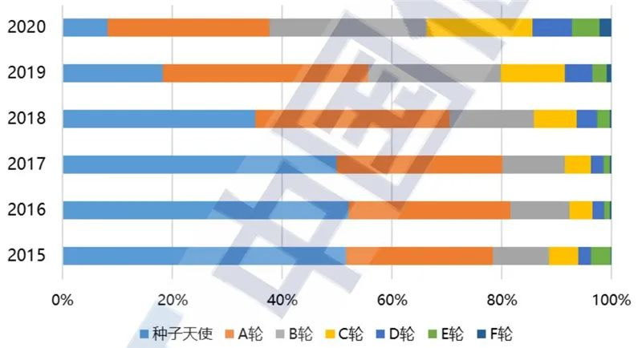
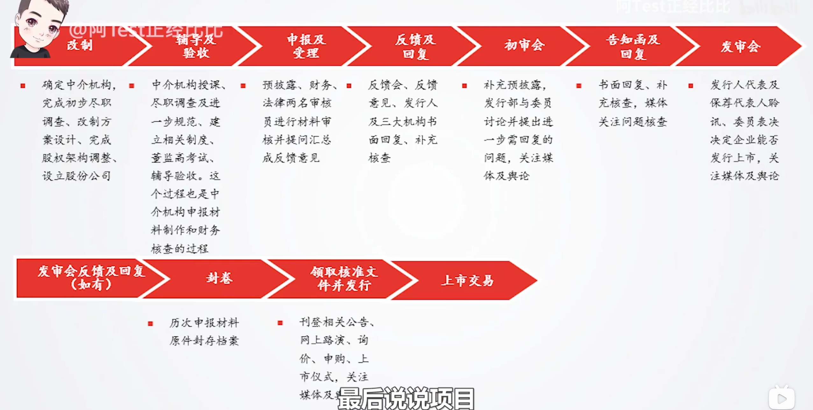
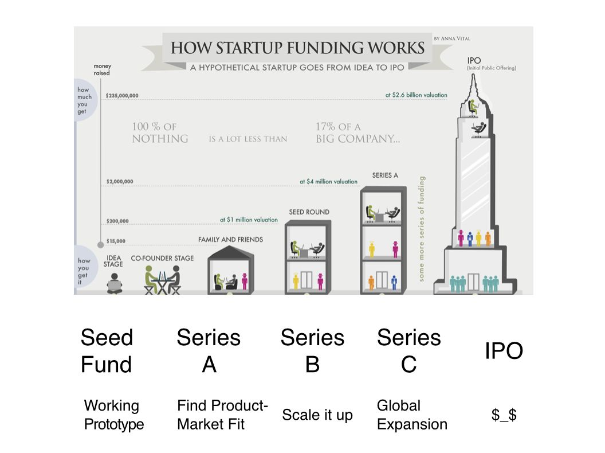

财务规划
========

产品财务规划 `5 <http://www.woshipm.com/pmd/1792966.html>`__
------------------------------------------------------------

产品财务规划是产品规划和商业模式的进一步落地，在进行产品的财务规划时，我们可以请求公司财务部门的协助，做好产品财务规划落地。

在财务规划阶段，我们要回答好如下问题，产品投入多大？成本如何？后续盈利模式如何？需要多久能够开始盈利？是否有进一步的可持续的盈利模式等。

在成本方面，要将资源分阶段投入，产品也要分迭代版本逐步退出，以降低企业的现金流压力。在产品规划中，加入产品各版本以及涉及到的资源投入，能够更好的说明产品成本信息。

在收益方面，除上述盈利模式等问题的考虑外，如果要将产品推出市场，还要考虑产品的定价策略。产品定价策略需要考虑市场本身的成熟度，客户关系积累程度以及产品本身的发展等多方面信息。

赚钱
----

所谓“赚钱”，本质上即是：抓住他人欲望，满足他人需求，使之心甘情愿的为这份渴望而支出。

特斯联副总裁谢超告诉极客公园，在他看来，一旦研发开始投入，再想要掉转船头就很难了，「你一定要想好，未来的产出是什么」。\ `1 <https://tech.sina.com.cn/roll/2020-07-12/doc-iivhuipn2598506.shtml>`__

摆在特斯联面前的有两层选择，是做单品还是场景化解决方案，是做消费市场还是政府主导的公共事业市场。二乘二，一共有四条路可以走。做单品，可以做智能门锁等智能硬件；做场景化解决方案，则需要有对场景的深刻理解及部署能力。消费级市场和政府级市场的需求不同，企业的组织构建也就不同。

「我的原则是要用产品证明价值，让别人买单，而不是免费给别人用，这也是做为一个企业的本分」，服务金融客户的科技公司氪信的
CEO 朱明杰这样说。

金融机构一面服务广大 C
端用户，一面服务投资机构，一旦出错，是真金白银的损失，试错成本非常高。因此在金融行业，金融机构与科技公司正式签合同之前，一般双方要在实际业务场景中磨合一段时间。这段时间非常长，有的甚至长达一年，目的是为了充分验证竞标公司的技术实力，减少出错的可能。

赚钱几种人\ `2 <https://www.sohu.com/a/409718794_312708>`__
-----------------------------------------------------------

为什么2020年底还在神化AI的主力军基本上只剩培训机构和自媒体了呢？因为多数还在搞AI产品的公司都意识到了一个问题：靠AI本身是赚不到钱，只有把产品/服务卖出去才能赚到钱。

真正由 AI
驱动的产品并不多，理性认识你负责的那个模型对项目到底有多重要，可以更合理的调配工作时间与精力，也能在和外部对接时省去很多不必要的口舌。

AI赚了钱或得了利的主要是三种人：第一种是赚了风投的钱，吐血的是大大小小的孙正义。第二种是搭了巨无霸的顺风车，那些IT大厂不惜巨资做AI，不是因为AI给他们做出了赚钱的产品，而是想靠炒作AI提升股价，最终是让股民买单。大厂无一例外不敢不上，不能不鼓吹AI，无论其创始人对AI是真了解还是门外汉。他输不起，泡沫起处，你不冲浪冒险，你连游戏都玩不了，入不了局。第三种才是真正找到了市场切入点，把AI落地做成了规模化产品，占住了某个领域市场，也彰显了
AI
的威力。可惜，这第三类跟大熊猫似的，非常珍稀，而且多是九死一生侥幸生存下来的。包括特斯拉的自动驾驶，也是大难不死，现在才见到了曙光。

分析师\ `3 <https://blogs.nvidia.cn/2017/09/30/ai-how-to-speed-up-the-analysis-of-financial-markets/>`__
--------------------------------------------------------------------------------------------------------

Triumph
的数据科学家将专用数据库中的新闻传输到深度学习系统中。机器经过训练，每三毫秒即可分析一篇文章，一天能处理数十万篇，这个原来我们认为无法实现的结果，近期得以突破。

系统可以识别文章中数百个关键字。称为 GloVe
的无指导性学习算法可为每个关键字赋予一个数值，然后系统的其他模型可以理解并使用该数值。

深度学习系统最终会产生三个结果：它将文章关联至适当的股票和公司；它为每篇文章得出一个影响力得分（正面、中立和负面）；它可以评估新闻影响市场的可能性。

在一段时期内，“虚假新闻”充斥着传统新闻领域，公司的数据科学家使用特定关键字和声誉好的新闻来源来提高可靠性。

外包
~~~~

-  https://www.fiverr.com/?source=top_nav
-  https://www.duiyou360.com/
-  https://www.xmf.com/

成本 `13 <https://www.zhihu.com/people/zhu-guan-jin-ming/answers/by_votes>`__
-----------------------------------------------------------------------------

1. 数据，每年需要花大量的钱买标注数据，这个价钱是很贵的，楼主可以去搜索标注公司的价钱，比如语音标注好点的大概200元/小时，买个1万小时就是200万人命币了，而且这种都是需要持续去买，持续给模型喂数据的，不然模型的效果会退化。

2. 算力，训练模型和推理都需要用到硬件，其中最贵的还是CPU和GPU，尤其是GPU，差一点的1、2千一张卡，好一点的1、2万一张卡，租的话便宜的也要1、2千一个月了，一般做SaaS的采用租的模式，数量根据业务规模来，做私有化的都要采购服务器，成本更高。

3. 算法，这块除了训练模型需要采购或者租用的服务器硬件以外，最大的开支还是人力开支，现在的算法人员的薪资水平在互联网绝对也算是拔尖的。去年我曾当面听着一个互联网公司的算法负责人吐槽招聘成本太高，招不起。

盈利模式 `4 <https://www.zhihu.com/question/20781934>`__
--------------------------------------------------------

强调如何获取利润

每个企业能长期活下去，早期可以靠融资，可以烧钱，但一个企业不可能永远都烧钱，最终都还是要靠自己赚钱活下去，以及老股东投资了也要获得回报。

工具类：坐拥数十甚至上千万用户，却不知如何有效的将流量转化为收入——这是典型的“商业模式没想明白后遗症”!

想清楚：

-  预计多久后，产品可以带来第一笔收入？
-  一年以后，你的产品盈利模式是怎样的？
-  在后面发展的每个阶段，项目的\ **支出预算、人员规模是多少？**\ 要实现长远的发展目标，估计需要多久的时间和多少资金？

互联网的盈利模式
----------------

`6 <https://www.zhihu.com/question/20304614/answer/1608253955>`__

1. 提供一个公平的、纯粹的平台，把卖家和买家，或者把创作者（creator）和用户（viewer）双方联系起来，抽取佣金或者赚点广告费。
2. 提供一个平台，但是把平台本身当作商品。这种公司出售的“商品”就是在这个平台“作弊”的机会。
3. “杀猪盘”。就是既提供平台，也下场和卖家/创作者竞争。把卖家/创作者当作猪，吸引他们入场，养肥了之后再杀。

形式：广告、平台佣金、实物/虚拟商品售卖、增值服务及金融服务

重要数据指标：例如，电商产品单位时间内的订单量、媒体产品的广告点击率、金融产品的利息和服务费等指标都是可以反映出一款产品的盈利及变现能力。\ `29 <https://zhuanlan.zhihu.com/p/390835483>`__

流量变现：广告费、抽取佣金or利润/利息差
~~~~~~~~~~~~~~~~~~~~~~~~~~~~~~~~~~~~~~~

贩卖流量较多使用kill time产品

以创作、社交为主的平台来说，流量就是一切。所以最重要的就是吸引优秀创作者。为此，很多公司还会和创作者分享利润（revenue
sharing）。比如在播放YouTube优秀创作者视频的时候投放的广告收入，YouTube都会分一部分给创作者本身。YouTube顶流李子柒，每年光YouTube广告收费分成就有七百万元左右。而在直播平台Twitch，如果你有几万粉丝，同时在线人数保持在100以上，就可以申请成为Twitch伙伴（partner）。除了打赏、广告、带货收入之外，只要你签约不去其他平台直播，Twitch每年还会另外给你40万元左右的收入。打赏自由知识分享的

电商直播：通过品类垄断的强议价能力，获取渠道利润；通过高效的仓储物流体系压缩流通成本，进一步拓展利润空间；通过龙头效应带来的厂家营销资源投入（代理、广告、商品运营等与厂家的营销合作）；明星营销，给商品的大量曝光渠道。

广告 `7 <https://weread.qq.com/web/reader/8d232b60721a488e8d21e54kc20321001cc20ad4d76f5ae>`__
^^^^^^^^^^^^^^^^^^^^^^^^^^^^^^^^^^^^^^^^^^^^^^^^^^^^^^^^^^^^^^^^^^^^^^^^^^^^^^^^^^^^^^^^^^^^^

广告售卖形式主要有两种：品牌广告和效果广告。

其中品牌广告单价高，品质好。获得品牌类广告投放需要满足：内容和媒体平台为主，内容品质较高，用户质量较好，有媒体影响力；用户数量超过百万，才值得大型广告商青睐。

效果广告是整个互联网广告的主体。没有投放条件，只要有用户量即可，不过利润较低，没有大量用户无法产生规模收入。\ `14 <https://www.jianshu.com/p/60a253d06e03>`__

形式：

-  搜索广告典型的搜索广告是百度的竞价广告，展示在搜索结果列表中。商家竞价购买关键词，当用户搜索的内容触发关键词时，出价最高的广告就会被优先展示。
-  展示类广告展示类广告一般出现在信息类网站中的Banner、竖边、通栏等位置，而且展示类广告以品牌广告居多，即它更注重品牌曝光。
-  开屏广告部分App
   的启动过程中会显示一副全屏广告，形式可能是图片，也可能是视频，展示时间为3～5秒不等，这就是开屏广告。知乎、豆瓣、小红书上等都会有这种类型的广告。
-  信息流广告信息流广告是指以文章、图片、视频等形式插入信息列表的广告，常见于内容类的产品，如百度、知乎、今日头条等App
   中经常出现标记了“广告”字眼的信息。
-  视频广告在爱奇艺、优酷、腾讯视频等视频网站，如果用户没有购买会员，就会在视频播放前、播放过程中及暂停过程中看到广告，这些广告就是视频广告。

计费模式：

1. CPM（Cost per
   Mile，按千次展示收费）：只要曝光就收费，不管点击、下载或注册等后续流程。这种模式适合想扩大知名度做品牌广告的广告主。早期门户网站的展示类广告基本都采用这种模式，少数开屏广告也采用这种模式。

2. CPC（Cost per
   Click，按点击收费）：在这种模式下，不管展示了多少次，只要用户不点击，广告主都不需要付费，只有用户点击了，广告主才需要付费。这种模式对广告主比较友好，因为首先它加大了平台作弊的难度；其次，它可以检测每个平台的流量质量，点击率高的就意味着质量高、用户精准，广告主以后可以多在这个平台投放广告。目前，这种模式常见于信息流广告和开屏广告。

3. CPA（Cost per Action，按用户行动收费）：A
   代表Action（行动），具体的用户行动是多种多样的，可以是下载、安装、购买等，具体是指哪种行动，需要在广告洽谈的时候，广告主和平台协商好，只有用户产生了协商好的行动，广告主才付费。

可以看到，CPD（Cost per Download，按下载量收费）、CPI（Cost per
Install，按安装量收费）、CPS（Cost per
Sales，\ **按销售量收费**\ ）适合App
下载、增加新用户等需要明确转化行动的广告主。相对来说，CPM
适合以宣传品牌为主的广告主，而CPC 和CPA 倾向于保护广告主的利益。

平台佣金
^^^^^^^^

-  平台模式：只提供交易平台（佣金、管理费用），卖家处理商品管理、仓储、配送、售后服务、开具发票
-  自营模式：买断货物，企业提供商品管理、仓储、配送、售后服务、开具发票服务；优势：服务体验优，利润率高；缺点：运营成本高

大部分平台型产品本身不拥有资产，但是通过整合资源提升服务效率获利。比较重要的盈利模式是收取平台佣金，但是收取对象不同。例如，淘宝平台和美团平台佣金的收取对象是商家，滴滴出行平台佣金的收取对象是司机，腾讯课堂平台佣金的收取对象是教师、教育机构，同花顺平台佣金的收取对象是股票投资者，映客直播平台佣金的收取对象是主播，直卖网平台佣金的收取对象是生产厂家等，这些平台的主要盈利模式就是平台佣金。平台上内容的所有权不归平台，所以这种盈利模式与实物/虚拟商品售卖的盈利模式有本质的区别。

赚取中间利润
^^^^^^^^^^^^

1. 实物商品。例如，京东的自营商品。京东采销人员向供应商采购商品在京东上售卖，商品的所有权属于京东，京东通过售卖商品赚取中间利润。又如，网易严选在代工厂贴牌之后直接售卖商品，这也是自营实物商品的模式。还有众筹/团购/电商/O2O\ `17 <https://t.qidianla.com/1156537.html>`__
2. 虚拟商品。例如，内容付费之一猿辅导的K12
   网课，所有课程都是猿辅导的在职教师录制的，属于自营模式，而且课程属于虚拟商品。又如，粉笔网的网课等也属于虚拟商品。还有分答，值乎等。之后还可以用过IP延伸，周边产品\ `17 <https://t.qidianla.com/1156537.html>`__\ 来进一步内容变现。
3. 虚拟服务虚拟服务与虚拟商品不同，它不是商品，而是一种服务，如阿里云服务（宽带、云存储等服务）、百度地图（WebAPI
   服务）等。

赚取利息差
^^^^^^^^^^

金融借贷根据服务对象的不同，金融借贷可分为消费金融和供应链金融。消费金融是指2C
业务，如京东的白条及线下婚庆公司、教育公司的分期服务等；供应链金融是指2B
业务，如京东的京小贷、京保贝等业务都是为京东商家提供贷款的业务。

沉淀资金沉淀资金的金融服务模式是指利用沉淀在平台上的资金投资或者开展其他业务而产生收益。例如，用户在京东平台购物需要实时支付，但是京东平台跟第三方商家的结算是有一定的账期的，如30
天。那么，在账期内，这些资金就会沉淀在京东平台上，京东平台就可以利用这些资金投资或开展其他业务。

“作弊”的机会——增值服务
~~~~~~~~~~~~~~~~~~~~~~

直接收费较多使用在save time产品

Facebook的“商品”，便是在Facebook的平台上“作弊”。也就是交钱让Facebook推广你的广告帖、广告视频。Facebook对优秀创作者并不支持，反而是打压。如果你不给Facebook交推广费，即使你一直在Facebook创作优秀的内容，很多人关注，很多人转发你的内容，Facebook也会故意通过算法打压你的内容，让别人无法看到。所以在Facebook能不出推广费用而获得流量是非常非常困难的。

虽然这种盈利方式来钱快，但是也有弊端，也就是因为失去优质内容，容易丢失用户。Facebook的应对方式就是通过主打和真实世界认识的亲朋好友的联系，推广和Facebook账号绑定的聊天软件Messenger来锁住用户。很多人为了了解亲朋好友的动态，不得不捏着鼻子看着Facebook上面充斥的广告贴。即使这样，最近Facebook的北美月活跃用户（monthly
active users）也一直在下降，有成为北美人人网的趋势。

基础功能免费吸引用户，增值服务收费实现盈利，这就是增值服务这种盈利模式的拆解。例如，百度网盘基础版的上传、下载等功能都可以免费使用，百度网盘也会免费为用户提供一部分存储空间，但是用户想获得更大的存储空间、更快的下载速度等，就要购买产品会员，这就是增值服务。又如，QQ
超级会员，很多年轻人喜欢的装扮特权（如挂件头像、气泡等），以及一些热门功能特权（如消息记录漫游、3000
人超大群）都属于增值服务。再如，CCtalk
的基础营销工具及授课是可以免费使用的，但是用户想要获取短信通知、多群直播、高清授课、录制下载等高级功能，就要付费购买。基于用户场景（QQ空间）去挖掘付费模式，07年6月QQ音乐推出“绿钻贵族”，购买服务的用户享有10多项服务权限，包括QQ免费点歌、演唱会门票打折以及将自己喜欢的歌曲设置为QQ空间的背景音乐。\ `30 <https://zhuanlan.zhihu.com/p/39930758>`__

形式：

1. 按需付费。如购买付费电影
2. 按时间付费。如购买一段时间的服务

“杀猪盘”
~~~~~~~~

亚马逊这个网站，既提供一个平台给小商家在上面卖东西，但是他们自己也有自营的网店业务。他们先让第三方卖家入场卖东西，让他们赚点小钱。但是这些第三方卖家的价格、浏览量、销售额全部被亚马逊平台所掌握。之后亚马逊便会通过这些数据进行“严选”，找出一些比较好赚钱的商品，直接下场与第三方卖家竞争，通过价格战消灭第三方卖家。有时候甚至会随意封禁第三方卖家。

但是如果一个公司市场占有率还很低，公司官方提供的商品/内容质量远远低于第三方卖家/创作者，还学亚马逊搞杀猪盘，竭泽而渔的话，很难说是一种明智的行为。

数据的盈利模式 `12 <https://www.pmcaff.com/discuss/1224707763133504?newwindow=1s>`__
------------------------------------------------------------------------------------

卖数据
~~~~~~

简单粗暴，一手交钱，一手给数据，行走于法律边缘，来钱最快。但是，买数据的人也不傻，他们只会挑业界标杆来合作，用有限的资金，换取高质量的数据。这就导致了只有行业标杆的几个企业能够通过这个方式挣得一定的资金。当然啦，这个资金不少的，毕竟数据很贵的。

卖产品
~~~~~~

这方面的产品有：

-  人群画像产品
-  爬虫舆论产品
-  APP分析产品
-  营销分析产品
-  等等。。。

但是，看到这些产品，不知大家是否发现？他们都是一些辅助性产品，并不直接产生价值——这就直接决定了其市场规模的高度，总不会高于创造价值的产品的。

卖咨询服务
~~~~~~~~~~

这个就比较显然来，虽然各种咨询服务都十分昂贵，但是，客户少啊，所以你去看看世界500强，除了埃森哲一家，没有任何一家咨询公司入选了；而且埃森哲的纯咨询业务也是囊中羞涩的。

基于数据的解决方案
~~~~~~~~~~~~~~~~~~

例如，一个独角兽的新能源车企，最大的卖点肯定就是车内的个性化的智能服务。但作为一个初创企业来说，它必定没有数据积累，哪怕能够拿到顾客的手机号码，但肯定不可能立刻拿到这个用户的过往数据的（经常出入的商圈，触媒习惯，兴趣爱好等），这时候数据服务商就可以通过其自身数据积累和技术能力，为初创企业提供这种基于具体业务需求的解决方案了，这也是很多大型数据服务商开始涉足的变现方式。

人工智能的盈利模式 `9 <https://weread.qq.com/web/reader/0c032c9071dbddbc0c06459k65132ca01b6512bd43d90e3>`__
-----------------------------------------------------------------------------------------------------------

未来的人工智能有哪些商业模式？：https://www.zhihu.com/question/41848628

通过专利技术的授权、转让或置换实现盈利
~~~~~~~~~~~~~~~~~~~~~~~~~~~~~~~~~~~~~~

随着经济的发展，中国已成为全球消费品生产、消费和贸易大国，中国的人工智能产品也越来越多，而支撑人工智能产品的基础是中国在人工智能技术方面的不断创新。全球人工智能领域的专利数量自2011年开始逐渐呈现爆发式增长，每年的复合增长率达到30%以上。中国在AI方面的专利技术布局程度已经位居世界第一。正因为专利技术在人工智能产品中的重要性，在人工智能市场上，通过技术创新申请专利，并将专利技术转让已经成了一种非常重要的盈利模式。

对比一下中国和美国在人工智能领域的六个企业——腾讯、百度、阿里巴巴、IBM、微软、谷歌可知，这些企业都非常注重整体的专利布局。而且，通过比较这些企业申请的专利可知，美国企业热衷于机器学习、语音识别、语言合成处理等领域，中国企业则倾向于支付、交互技术、视频图像信息处理、智能搜索等领域。另外，六家企业都比较感兴趣的领域有无人驾驶、数据文本聚类、指纹识别等。

IBM专利布局比较全面，其中算法优化、自然语言处理、自主驾驶领域布局优势明显；微软的专利布局主要在机器学习、神经网络、音视频识别等领域；谷歌主要是在无人驾驶、语音识别、自然语言处理领域有较多专利；腾讯主要在即时通信、数据处理、支付平台、数据交易等人工智能领域展开布局；百度比较热衷在搜索业务、无人驾驶、语音识别、图像识别等领域布局；阿里巴巴则在支付平台、信息交互、广告投放等领域布局明显。

企业在申请人工智能相关专利技术时，应充分体现出理论层次性、技术创新性、工程复杂性。在撰写时应注意以下几个方面：

1. 建议突出其成果专利的创新能力；
2. 建议突出技术细节，并描述技术深度；
3. 建议合理运用应用场景结合技术创新。

通过输出人工智能技术实现盈利
~~~~~~~~~~~~~~~~~~~~~~~~~~~~

除通过专利技术的授权、转让或置换实现盈利外，拥有人工智能技术的公司也可以通过对外提供技术服务实现盈利。目前人工智能的技术服务体系包括了基础级技术服务、技术级技术服务和行业级技术服务三个层面。

基础级技术服务是指企业通过提供框架平台或算法平台来提供的技术服务。例如，百度AI开放平台，阿里云ET大脑、腾讯AI平台、讯飞开放平台等。提供基础级技术的公司通过推出这些平台接口，吸引更多的用户，从而进一步活跃其产品的应用，并逐渐打造起一个开发者生态，并通过生态的活跃，提供其产品在行业中的应用阿里云ET大脑提供了多项人工智能技术服务，包括ET行业大脑、人工智能解决方案、人工智能接口、算法平台、ET大脑生态等内容。

上述公司在人工智能基础技术领域内有一定的优势，因此这类公司会在具体的技术领域进行拓展延伸。当然，如果这类公司仅仅提供技术，则会有竞争力弱的困扰，所以这些仅提供技术的公司往往通过“人工智能+行业”的模式形成具体的解决方案从而实现持续的盈利。

如果人工智能类的公司既拥有技术，同时又拥有大量的数据积累，则可以通过提供人工智能产品应用实现盈利。例如，格灵深瞳将人工智能和视频监控进行结合，开发了威目视图，实现了图像识别、人车定位识别；旷视科技的Face++平台，已经是我国领先的人脸识别的服务平台。

通过销售产品实现盈利
~~~~~~~~~~~~~~~~~~~~

人工智能专利技术的转让及人工智能技术服务的输出，一般都是面向企业的，而人工智能产品则是面向大众的，易形成影响力。随着人工智能的发展，人工智能的产品类型也越来越多，如人工智能机器人、智能音箱、实时翻译工具、电子商务推荐助手、医疗影像检查、智能手环、游戏等。

人工智能产品销售方向有两个：一是面向企业，即2B；二是面向个人，即2C。2B方向的产品主要以提高生产力为目标，为企业降本增效，如智能分拣机器人、智能服务员、智能客服等。2C方向的产品主要是作为人体的延伸进行辅助判断及辅助操作，如智能音箱、智能推荐系统等。天猫精灵是阿里巴巴人工智能实验室于2017年7月5日发布的人工智能产品。天猫精灵内置智能语音助手AliGenie，能听懂普通话语音指令，并实现智能家居控制、语音购物、手机充值、音乐播放等功能。2018年5月27日，阿里巴巴公布了天猫精灵的销量，销售总量超过了300万台，业绩非常优秀。

为何免费
--------

免费商业模式的本质，即交叉补贴。

前提：

1. 能不能找到补贴方？
2. 从补贴方获得的收益能否覆盖免费的成本？
3. 在找到能覆盖免费陈本的补贴方之前，这个时间成本是否可承受？你总不能死在找到补贴方之前吧。

◆ 直接交叉补贴：产品之间的交叉补贴，用免费吸引你掏腰包买其他的产品。

腾讯公司马化腾就是利用免费核心产品QQ，绑架近几亿用户，从而向这些用户销售一些增值产品来赚取利润，比如QQ秀，钻等。电信运营商依靠赠送手机或话费来吸引用户，赚取流量和话费等等。

◆ 三方市场：利益主体之间的交叉补贴

媒体行业是三方市场模式的典型，广播、报纸、电视和杂志等等，用户不用付费可以免费的到信息、内容或软件。由广告商买单。即媒体将用户卖给广告商。内容消费者得到了免费，但有广告主来买单。

◆ 现在和未来之间的交叉补贴

用好的产品免费让用户使用，用户为了得到更好，就愿意付费享受更好的服务，让被动掏钱变为主动付费，只要这样用户的付费意愿就会更强烈，免费也能赚钱，就是这个逻辑。\ `15 <https://www.zhihu.com/question/38281398>`__

比如滴滴打车，在推广的时候，很多人享受过免费打车的。但这个钱最终会在习惯被养成之后赚回来。

◆ 货币市场和非货币市场的交叉补贴：

任何人都可以免费得到其他人赠送的产品或服务，且不需要得到金钱回报，获得的是关注度和声誉。撰写博客，发布微博、微信等，并非出于谋取利益，而是与人分享喜怒哀乐，期待结识朋友；公益捐助，获得慈善相关的名声等等。

ROI
---

Open source models, data and transfer learning are also enabling
businesses to more easily move models into production and to achieve an
ROI.

融资
----

企业融资，说白了就是企业如何获得正向的现金流。因为有了钱，你就可以当个土豪“买买买”，买装备、买土地、买资源、买人才、买用户甚至买竞争对手。但是，市场上真正缺钱的都是中小企业/民营企业/初创企业这样的企业，出身差、没钱、没人才、没资源，在债权融资要不来钱的情况下，这些企业就选择股权融资。

一般来说，融资轮次的划分为种子轮、天使轮、A轮、B轮、C轮、D轮、E轮等，但根据实际情况，有些项目也会进行preA轮、A+轮、C+轮融资，不管是什么轮，其核心无非是投资人投的多少钱的问题，

-  种子轮：种子阶段的融资人，通常只有idea和团队，但没具体产品的初始形态，投资人一般多是亲朋好友、或者创业者自掏腰包，当然现在也涌现不少种子时期投资人；倘若你的融资项目团队，有idea，马上进入最终的落地，那么就可以进行种子轮融资，一般项目融资都在100万左右，根据不同的赛道，可能从几十万到200万不等。
-  天使轮：天使阶段的项目通常是团队ready，有产品雏形，有产品初步的商业规划，却也陷入找人——做产品——没人了——找人——做产品的循环之中，如果融资项目已经起步，产品初具模样，有种子数据显示出增长趋势、留存、复购等证明。同时积累了一些核心用户，商业处于待验证的阶段，那么找天使投资人或机构，开始天使轮融资便是最为合适的，融资金额大概在300万到500万左右；
-  PreA轮：是一个夹层轮，融资人根据自身项目的成熟度，再决定是否要融资，倘若项目前期整体数据已经具有一定规模，只是未占据市场前列，那么可以进行PreA轮融资；
-  A轮：对于拥有成熟产品，完整详细的商业及盈利模式，同时在行业内拥有一定地位与口碑的项目，哪怕现阶段处于亏损状态，也可以选择专业的风险投资机构进行A轮融资，这一阶段融资人已经不可能只凭借idea融资，而是要有用户，包括月活、日活、要有自己的商业模式，有能与竞品抗衡的成熟产品，有一定的市场位置；
-  B轮：经过一轮的烧钱后，项目有较大的发展，商业模式与盈利模式均已得到很好的验证，有的已经开始盈利。此时，融资人可能需要资金支持推出新的业务、拓展新领域，那么就适合说服上一轮风险投资跟投，或寻找新的风投机构的加入，又或是吸引私募股权投资机构加入的形式，开始新的一轮的B轮融资。
-  C轮：如果此时融资人的项目十分成熟，在行业内基本可以稳坐前三把交椅，正在为上市做准备，那么就适合进行C轮融资，此时除了可以进一步拓展新业务，也可以补全商业闭环，准备上市打好基础。

当公司逐渐成为行业要角，进入Pre-IPO阶段，这时投资银行（Investment
Bank）便会出现，来协助公司顺利「上市柜」（IPO）。直到成功上市，熬过了股票「闭锁期」后，先前的投资人才有机会出脱持股，顺利出场。\ `16 <https://dahetalk.com/2018/12/02/%E3%80%90%E6%96%B0%E5%89%B5%E8%9E%8D%E8%B3%87%E3%80%91%E7%A8%AE%E5%AD%90%E8%BC%AA%E3%80%81%E5%A4%A9%E4%BD%BF%E8%BC%AA%E3%80%81a%E8%BC%AA%E3%80%81b%E8%BC%AA%E3%80%81c%E8%BC%AA%EF%BC%8C%E4%BD%A0/>`__

首次公开募股（Initial Public
Offering）是指一家企业第一次将它的股份向公众出售。

“IPO本质是为了实现更大规模的目标，需要更大规模的资本。”二级市场的资金量远超一级市场，可以真正帮助公司实现商业化。\ `20 <https://www.cyzone.cn/article/628604.html>`__
例如：云从科技IPO招股书\ `28 <https://zhuanlan.zhihu.com/p/389780937>`__

|融资过程\ |\ `16 <https://dahetalk.com/2018/12/02/%E3%80%90%E6%96%B0%E5%89%B5%E8%9E%8D%E8%B3%87%E3%80%91%E7%A8%AE%E5%AD%90%E8%BC%AA%E3%80%81%E5%A4%A9%E4%BD%BF%E8%BC%AA%E3%80%81a%E8%BC%AA%E3%80%81b%E8%BC%AA%E3%80%81c%E8%BC%AA%EF%BC%8C%E4%BD%A0/>`__
|IPO 投行过程\ |\ `26 <https://www.bilibili.com/video/BV1fJ411a7MT>`__
|AI创业基金工作\ |\ `19 <https://www.zhihu.com/question/19658921/answer/52438369>`__

.. figure:: ../img/toutiao_ask_money.png

   头条融资\ `21 <https://www.inneed.club/articles/detail/4l50o6w079>`__

Pre-A轮、B+轮、B++轮、D轮、E轮，又是什麽？
~~~~~~~~~~~~~~~~~~~~~~~~~~~~~~~~~~~~~~~~~~

一般来说，融资募到C轮就差不多了。D轮指的是你把C轮的钱烧完了，但还没进入上市柜阶段；同理，E轮指的是你把D轮的钱烧完，但依旧还是没上市柜。

而大家常听到的Pre-A轮，指的是天使轮的钱花完了，但产品还不够成熟，尚未到A轮阶段，进退两难下，只好又募一个round，我们就称它为Pre-A轮。至于B+轮、B++轮都是相同意思，因为还没到下一round的水准，所以只好一直无限+++++。

在规划里，B轮融资需要证明技术实力，因而团队专攻技术竞赛成绩；C轮投资人会比较业务优势，团队需要在此之前让原型车落地；D轮公司已经开始试运营，商业化推进自然会成为投资人眼中的亮点。\ `20 <https://www.cyzone.cn/article/628604.html>`__

在创投界内，素有“天使投资看人、A轮投资看产品、B轮看数据、C轮看模式”的说法。据统计，从A轮到B轮融资，约有60%的公司会死掉;而从B轮到C轮，又将淘汰近70%，也就是说，从A轮到C轮间，大概存活下来的项目不足12%。\ `27 <https://www.iyiou.com/news/2017082152801>`__

AI 创业
~~~~~~~

.. figure:: ../img/AI_entrepreneur.png

   AI 创业

所有AI企业，作为前沿、高端的研发与技术密集型行业，收入规模在相当长一段时间内，有可能无法支撑巨额的、持续的、大规模研发投入、场景探索及市场开拓等，持续亏损的风险与压力，会长期存在。\ `18 <https://www.weiyangx.com/382066.html>`__

https://venturebeat.com/

AI 免费化
---------

内在商业逻辑：免费化定价策略的内在商业逻辑可分为以下三点：

1. 免费或低价策略将有效吸引企业用户使用平台，并成为合作伙伴，帮助AI开放平台积累客户资源、技术资源与不同产业资源等，加速构建起AI生态，通过云服务器、云计算等其他生态内的服务实现盈利；
2. 免费不代表一定会减少营业收入。AI开放平台免费开放的功能主要为通用AI功能，如人脸识别、语音识别等，通常需要二次开发，根据需求实现定制化，而定制化服务存在较高溢价。低价策略带来庞大用户基数，AI开放平台将通过定制化服务从中获利；
3. 数据是AI算法训练的关键，企业接入平台并调用AI能力将有效帮助平台实现数据积累并针对性对AI能力进行算法升级。

-  免费化的积极影响：对行业整体而言，企业免费试调用平台AI功能将有效降低企业部署AI时的准入门槛与试错成本，带动AI在垂直领域创业潮的兴起，同时显著加速AI在社会由点到面的应用落地，并推动AI赋能产业从而实现产业升级。
-  免费化的消极影响：头部厂商的免费定价策略将造成市场头部效应加剧，企业客户向头部厂商靠拢，而中小型平台由于缺乏资金沉淀，难以做到与大型厂商相同的定价策略，在价格对比上处于劣势，最终行业形成寡头垄断局面。\ `25 <https://pdf.dfcfw.com/pdf/H3_AP202101141450490555_1.pdf?1610622618000.pdf>`__

AI 融资
~~~~~~~

人工智能基金创业工作室从零开始创建新的人工智能公司。这些公司将AI技术和应用连接起来，专注于推动世界前进的行业和问题。https://aifund.ai/

`2020「年度最佳人工智能领域投资机构TOP10」 <https://www.lieyunwang.com/archives/472130>`__

-  投研信息简报：http://www.ciifund.cn/zwt/
-  红杉中国AI布局：https://www.sequoiacap.com/china/article/about-ai/
-  烯牛数据查询 `24 <https://www.youtube.com/watch?v=lSpJQOZTN_4>`__
-  一线VC
-  天眼查、企查查、启信宝

AI资本寒冬 `22 <https://www.jiemian.com/article/6005288.html>`__
~~~~~~~~~~~~~~~~~~~~~~~~~~~~~~~~~~~~~~~~~~~~~~~~~~~~~~~~~~~~~~~~

资本寒冬已经出现。其中，预期过高是主要原因。人工智能企业增速明显放缓，
2019、 2020 年全球每年新增人工智能企业数量已不足 100 家，
且投融资的轮次后移趋势不断扩大。2020 年 B 轮及以上融资笔数占总笔数的
62.3%，较上一年增长
40%以上。同时，曾获大笔融资的知名创新企业由于预期过高、虚假宣传等原因退出产业舞台。曾对标英特尔的芯片企业
Wave Computing，是人工智能计算领域最受关注的独角兽之一， 2020 年 4
月由于数据流处理器性能不达预期而宣告破产；智能会计工具 ScaleFactor
宣称利用人工智能技术自动化生成财务报表，
但实际却部分采用人工外包方式处理， 在融资1 亿美元后于 2020 年 3
月宣告倒闭。

此外，
资本早期对人工智能产业回报周期过于乐观是资本寒冬的另一原因。移动互联网在偏向工程属性的前提下，资本预期取得成效的时间为二到四年；与之相较，人工智能与传统行业核心业务深度融合，需更高的技术准确率和更深刻的行业理解力。因此，人工智能产业孕育时间更长，资本市场的期望和现实出现较大偏差。

   AI公司融资轮次\ `22 <https://www.jiemian.com/article/6005288.html>`__

中后期为主
----------

中国AI开放平台行业股权投资市场已逐渐形成中后期为主、集中度高的市场态势，2019年共发生6起AI开放平台投资事件，均为B轮及B轮以后的中后期投资，平均每笔投资金额约5亿元，而回溯2015年，共发生15起投资事件，平均每笔投资金额仅2,400万元，与2019年平均投资金额相差约20倍。
`25 <https://pdf.dfcfw.com/pdf/H3_AP202101141450490555_1.pdf?1610622618000.pdf>`__

-  直接原因：AI开放平台市场生命周期已从引入期发展为成长期后期。在引入期，AI开放平台属于蓝海市场，投资机构更关注早期项目且投资较为分散，而随着行业发展，市场进入成长期甚至成熟期，头部效应出现，优秀企业逐渐占领多数市场份额甚至形成垄断，导致初创企业的市场空间缩小。因此股权投资开始向头部成熟企业集中，同时早期投资开始减少。-
   间接原因：AI开放平台的股权投资市场受整体股权投资市场大环境影响。2019年中国股权投资机构出现募资难问题，整体股权投资市场下行。根据清科数据，中国2019年前11月股权投资市场募资总额约为1.08万亿元，同比下降约为10%。投资机构资金短缺导致整体大环境趋冷，2019年整体股权投资金额下降46%，投资次数下降42%。投资机构“弹药”减少导致其更偏向于选择风险较小、有稳定营收或已实现盈利的中后期项目。

