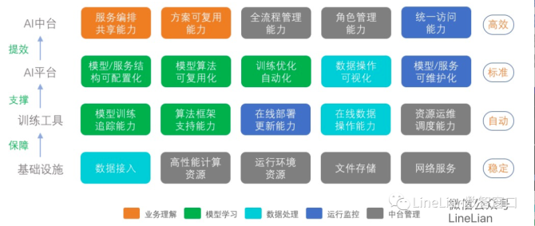

平台型
======

PM的职能 `1 <https://www.iamxiarui.com/?p=1369>`__
--------------------------------------------------

-  收集需求确定方向，联想真实业务场景
-  定义并验证产品中各个业务或非业务逻辑
-  抽象产品的业务场景，不仅满足当下需求，更要预见未来
-  规划并验证具体方案，保证产品的实际落地

抽象
~~~~

定期复盘，复盘的一个很重要的事情就是把自己做的事情、做的业务向上抽象一个层次。你要看一看能否总结出某种规律、能否看清楚自己到底在干一件什么事、到底满足的是人类的哪一个非常基本的需求、现在提供的方案是不是最好的、要想满足这个需求还能找到哪些方案、是不是该对曾经的好方案进行迭代。

滴滴要解决的是用户出行的问题，所以才会有不同层次的解决方案，有顺风车、专车、出租车。对于出差或旅游的人来说，“住酒店”并不是一个本质的需求，而“在外面的时候有地方住”才是。所以，爱彼迎（Airbnb）就去做了共享房间的生意，更好地解决了外出人的“住”的痛点，所以成功了。

再举个例子，美国网飞公司（Netflix）的创始人哈斯廷斯的思路非常清楚，在原来出租录像带的时候他就知道用户的需求不是要租录像带，真正的需求是看电影，其实不在意是出租录像带、DVD，还是使用在线视频的模式，所以网飞公司马上就转型做了视频内容点播业务。

互联网上半场的平台
------------------

互联网上半场的商业模式，主要是以满足C端用户需求为核心的平台产品，包括：社交平台、电商平台、团购平台、出行平台、内容平台。平台通过链接人与人，内容与人，商家与人，聚合大规模的流量。

   平台产品示例

平台经济——资本与金融视角：

https://www.bilibili.com/video/BV19t4y1S78T/?spm_id_from=333.788.recommend_more_video.-1

平台型产品经理
--------------

对于需要产出平台化解决方案的平台型产品经理而言,通常需要从C端用户型产品经理及B端商业化产品经理处得到已经经过初步加工的用户或客户需求,明确平台设计的目的和意义。当然,部分公司中也存在平台型产品经理兼任用户型或商业型产品经理角色的情况,由平台型产品经理亲自分析用户需求或调研客户需求,并最终给出问题的平台化解决方案。平台型产品经理需要根据平台设计的的与意义,将得到的用户或客户需求进一步对需求目标进行拆解,明确这套平台化解决方案中需要求解哪些问题,并最终将具体问题提交给各个模块相应的技术人员

不全面的需求
~~~~~~~~~~~~

不全面的需求在交付技术人员开发时通常不存在问题,具体而明确。但当开发完成准备上线,甚至上线之后,才发现有些业务场景\ **根本未考虑,出现逻辑覆盖不全、缺少逻辑甚至缺少模块**\ 的情况。对于平台型产品经理来说,平台部分有更多的极端情况和隐藏逻辑需要处理,且平台的设计需要有足够的预见性,需要在具体产品需求还不存在的情况下,提前做出适应性设计。如果出现一个产品需求就要对平台做一次修改,那么平台就失去了其解决通用性问题的功能,没有为业务发展提供长期支撑的意义于平台竞品相较于2C产品的竞品要少得多,且很多公司的后台并不开放,因此更需要平台型产品经理在信息有限的情况下做出正确的决策,要比普通用户想得更多,更全面地思考问题。举例子,机器学习模型的优秀表现离不开大量高质量的训练数据,与之相对的,离线标注模块也是任何一个基于机器学习的业务平台所不可或缺的重要组成部分,但对终端用户而言,薮据标注这个过程并不可见。如果平台型产品经理只具备从普通用户角度看问题的能力,停留在问题的表面,那么势必无法给出合格的平台设计方案。
`6 <https://cread.jd.com/read/startRead.action?bookId=30457741&readType=1>`__

AI平台
~~~~~~

AI平台=AI SAAS+（PAAS）+（IAAS）

AI和数据可同为一个中台、AI平台可视为业务中台一部分、AI平台整合进技术中台或后台等。规模较小、资源有限的企业通常会选择使用第三方AI平台对业务进行服务，而非自建AI平台。

.. figure:: ../img/AI_train_platform.png

   AI商品模型训练平台

常见问题：\ `13 <http://www.cet.com.cn/wzsy/cyzx/2741907.shtml>`__

1. 模型环境构建难，从模型到服务转化慢。
2. 多个模型共用一套环境，但模型需要独立更新，对环境的维护需格外谨慎，变更风险巨大。
3. 模型服务交付周期长，工程环节耗时长，人力投入大。
4. 模型服务回退慢，模型发布后，如发现有问题尝试退回到上一个版本需要数分钟，乃至数小时。
5. 模型服务扩容慢，面对突发流量时，响应延迟。

人工智能平台公司
----------------

国内外人工智能开放平台有哪些？ - 唐辑科德的回答 - 知乎
https://www.zhihu.com/question/288871995/answer/1950537637

AI平台型产品经理 `3 <https://www.zhihu.com/question/57815929>`__
~~~~~~~~~~~~~~~~~~~~~~~~~~~~~~~~~~~~~~~~~~~~~~~~~~~~~~~~~~~~~~~~

单独将AI平台产品经理列出来，是因为AI平台产品经理不局限于某一个AI研究领域，更专注于打造一个通用的机器学习平台，这里也可以细分为深度学习平台、强化学习平台等。这个平台可以用来各种AI应用场景的建模，提升科学家们建模的效率以及一定程度上降低建模的门槛，使得普通的产品&运营等都可以在平台上进行简单地建模。国内以百度的Paddle-Paddle，第四范式的先知，阿里的PAI平台为主流的机器学习平台。AI平台产品经理可以说是AI产品经理中对技术能力要求最高的职位了

需要对整个机器学习建模流程十分熟悉，比如数据处理、模型构建、特征工程、效果评估等。同时还要对工程化、大数据处理、算力资源管理等有一定了解。如果没有一定的机器学习背景是很难成为一名合格的AI平台产品经理。

   AI平台的进化

AI中台
------

对AI能力重视的公司会独立建设AI中台部门，做好对公司级的AI能力打磨建设好平台型的产品，梳理好对应的算法运营/数据运营，能快速承接业务。但是最担心的是中台部门不中台，急于出成绩，会独立外探业务，与业务部门形成竞争关系，最终其实还是烟囱式的发展模式，“形实不一致”，基础建设与业务发展会逐渐脱节。\ `4 <https://www.zhihu.com/question/346379206>`__

https://medium.com/@unbug/how-to-build-an-ai-platform-2493d57c9e8

要做一个AI中台，当我们的产品经理过AI中台的需求，上面的4行我们产品AI产品经理需要定义哪一行？需要说明哪一行？需要撰写的PRD文档又是哪一行？需要跨团队沟通的又是哪一行？\ `8 <https://www.shangyexinzhi.com/article/2251387.html>`__

http://www.woshipm.com/pmd/4146522.html

用例
----

.. figure:: ../img/platform_flow_chart.jpg

   几个核心平台系统之间的用例图\ `5 <https://zhuanlan.zhihu.com/p/269732570>`__

.. figure:: ../img/platform_function.jpg

   几个核心平台系统之间的产品功能架构

**必需的功能点：**

产品服务中心、解决方案中心、系统配置管理、管理控制台、账户管理、权限管理、计量计费管理、离线数据集成、脚本清洗、数据质量管理、运维信息统计、元数据管理、数据检索、任务运维管理、数据预标注、Web
IDE、自定义算法、模型评估管理、资源管理、算法模板管理、代码构建、CPU
容器部署、部署环境管理、模型部署、发布流程管理、GPU 容器服务、CPU
容器服务、数据卷管理、对外资源管理服务、资源配额管理、资源调度策略管理。

**附加功能点：**

人工智能服务市场、文档支撑中心、工单中心、消息中心、内容发布管理、实时数据集成、SDK
清洗、数据血缘管理、计费策略管理、结算管理、数据类目管理、模型压缩优先、公共模型库、训练任务管理、私有模型库、模型评估管理、数据接入管理、系统配置管理、模型版本管理、GPU
容器部署、服务灰度发布、服务效果跟踪。

**较有难度的功能点：**

图像标注、任务管理、数据集管理、文本标注、质检管理、源数据管理、语音标注、团队管理、视频标注、实验管理、机器学习算法、数据接入管理、画布管理、私有镜像仓库、组件管理、运维管理、服务上下线。

平台设计通用工作流程
--------------------

从更具体的角度描述一个结合了平台设计的业务需求从最初想法到最终落地的通用化流程。
`7 <http://reader.epubee.com/books/mobile/41/41f170eb06525e985bbddd6eae13589d/text00006.html>`__

这个过程通常包含8个阶段，分别为：方向阶段、联想阶段、定义阶段、推演阶段、抽象阶段、规划阶段、验证阶段和落地阶段。

其中，方向阶段和联想阶段通常由用户型产品经理及商业型产品经理完成。在方向阶段，用户型产品经理及商业型产品经理分别通过对用户行为数据和与客户商谈结果的分析，初步抽象得到用户需求与客户需求，然后将原始的用户需求、客户需求转换为具体的平台设计目标并交付给平台型产品经理。联想阶段一般与方向阶段同步进行，指用户型产品经理及商业型产品经理不仅需要交付平台设计目标，还需要将与该设计目标相对应的典型业务场景一并提供给平台型产品经理，联想出的真实业务场景越多，提供的信息越充分，后续阶段就越不容易出现解决方案与原设计目标不符的情况。这些真实业务场景将成为后续推演阶段进行系统基本可行性验证的素材。

在定义阶段、推演阶段通常需要平台型产品经理与技术人员通力合作。定义阶段的主要任务是结合前两个阶段所得到的平台设计目标与具体业务场景，明确一个怎样的系统能够承担这样的任务。另外，需要回答前文提到的一些系统设计中的基本问题，比如系统的模块构成、各个功能模块的职责、每个模块的输入和输出、模块间的上下位关系及系统调用顺序。同时，为了保证通用性，还需要对业务逻辑和非业务逻辑进行划分，对业务逻辑做可配置化设计，并将非业务逻辑固化在平台内部，对平台使用者不可见，降低其理解成本。推演阶段紧跟在定义阶段之后，其主要任务是利用联想阶段所得到的具体业务场景，结合定义阶段产出的系统设计方案进行推演，假定系统开发已经完成，应当如何对业务逻辑进行配置，及其与固化的非业务逻辑相结合之后，是否能够满足业务场景的需求。另外，还需要对整个系统的信息通路完整、各模块职责履行的一致性等进行检查。推演阶段完成后，意味着系统框架已经确定。

抽象阶段大多需要平台型产品经理独立完成。系统框架的确定只是平台设计方案确定的第一步，虽然业务逻辑与非业务逻辑的划分已经完成，但业务逻辑究竟如何以平台产品的形式呈现出来是平台型产品经理必须解决的关键问题。结合了平台设计的业务需求要解决的通常不是一个问题，而是一类问题，甚至是多类问题相互交织。平台型产品经理需要对这些相互交织的问题抽丝剥茧，抽象出一类或多类问题中的基本影响因素。2.1节提到，产品经理需要从业务发展的角度协助技术人员保证系统的可拓展性，以避免未来业务需求发生变化时，或者随业务发展出现了需要解决的新问题时，不得不对已有的系统设计进行修改，从而带来大量不必要的工作。利用基本影响因素的排列组合来列举业务场景所有可能的方式能够有效避免遗漏，使得产品经理能够更好地协助技术人员设计出拓展性较好的系统设计方案。同时，平台型产品经理也需要以业务需求的基本影响因素为基础完成平台原型设计，这个平台原型不仅需要解决当下的业务需求，还需要为未来可预见的业务需求提前做好准备。

规划阶段需要平台型产品经理与用户型产品经理或商业型产品经理协作完成。抽象阶段完成后，得到的实际上并不是一个可以马上执行的实施方案，而是一个长期发展方向。规划阶段要求平台型产品经理与用户型产品经理及商业型产品经理沟通，根据各类业务需求的优先级，确定平台的一期落地方案，并根据业务发展趋势对后续平台的迭代方案进行初步规划。规划阶段实际上就是在做需求的整理与细化，平衡技术实现与业务需求，结合业务未来的发展趋势，形成一套长期的迭代优化计划。

验证阶段与落地阶段是平台化解决方案实施的最后两个阶段，主要需要平台型产品经理与技术人员参与。在验证阶段，平台型产品经理需要就规划阶段产出的一期落地方案及后续的平台迭代优化计划向技术人员核对，保证方案的可行性。落地阶段与传统的产品需求落地的过程类似，需要进行任务拆解、任务分配、时间评估、确定上线计划等。

结合了平台设计的业务需求解决方案设计，其核心在于定义与抽象，这两个阶段是其他类型的需求解决方案中相对较少涉及的。定义阶段明确了系统框架，决定了系统未来发展的可能性；而抽象阶段是决定系统能否如预期般发挥价值的最重要的阶段，也是将平台设计目标这个抽象实体转换为可行方案过程中的重要转折点。

国内外相关的AI平台有：
~~~~~~~~~~~~~~~~~~~~~~

国内：

1. 华为ModelArts
2. 阿里云 PAI
3. 百度 Paddle Paddle
4. 腾讯 DI-X深度学习平台
5. 金山云 人工智能平台
6. qingcloud 人工智能平台
7. 京东 JDAINeuFoundry
8. 小米Cloud-ml平台

国外：

1. Microsoft Azure Machine Learning
2. AWS Machine Learning
3. Google Cloud Platform

.. figure:: ../img/AI_platform_k8s.png

   机器学习平台架构-K8S\ `10 <https://segmentfault.com/a/1190000019215007>`__

Gartner 最新发布了两份 AI 魔力象限《Magic Quadrant for Data Science and
Machine Learning Platforms（数据科学与机器学习平台）》（下称 「DSML
报告」）和《Magic Quadrant for Cloud AI Developer Services（云 AI
开发者服务）》（下称「CAIDS」
报告），对全球厂商进行了年度评估。这两份报告可以看作是 AI
工程化领域的盘点，给予希望选择正确的 DSML 和 CAIDS 解决方案，并提升 AI
生产力的企业以权威的参考。

AIaaS
-----

人工智能即服务（AIaaS）之定义为由第三方提供人工智能（AI）外包服务，其可使个人和公司基于各种目的进行AI相关实验，同时毋须于初期即大规模投资或承受高度风险。著名之四大AIaaS供应商为Amazon
AWS云端运算服务、Microsoft Azure
云端运算平台与服务、Google云服务、以及IBM云服务。
`14 <https://stli.iii.org.tw/article-detail.aspx?no=67&tp=5&d=8269>`__

AIaaS之优点主要有：

1. 降低成本：一般公司无须投资软体、硬体、人员、维护成本以及不同任务之修改成本，AIaaS供应商可供应不同之硬体或机器学习供公司尝试运用。
2. 即用性：AIaaS供应商提供之AI服务为即用性，无须太多专家介入修改即可使用。（3）可扩展性：可由较小之项目开始试验，逐步扩张调整服务，因此具有战略灵活性。

然而，AIaaS亦有以下潜在缺点：

1. 降低安全性：公司必须交付大量资料给AIaaS供应商，因此资料之机密保护与预防窜改即为重要。
2. 增加依赖度：若发生问题时，必须等待AIaaS供应商进行处理。
3. 降低透明度：由于是即用性之AI服务，对于内部演算法之运作则属于未知之黑盒子领域。
4. 限制创新：因AIaaS供应商所供应之AI服务需一定程度之标准化，因此限制公司创新发展之可能。

平台云原生化
------------

AI 工程化落地的首个基础能力就是平台云原生化。其实 AI
平台的构建有很多实现方法，但云原生是目前最普适的方法。因为云原生门槛不高，没有具体限制技术选型，尤其是它所倡导的开放、弹性和生态等原则可以迅速拉低
AI 平台的实现门槛。

开放意味着需要把 OpenAPI
放到产品的第一优先级来考虑，支持用户和其他云产品通过 OpenAPI
访问产品所有功能，可以被第二方和第三方厂商工具自由集成；同时能够擅于调用其他云上产品来构建自己的服务，比如云上数据库
RDS、云日志服务 SLS 等。

弹性是在设计之初就要设想产品的规模大小，物理资源尽量不要自建，充分利用云的弹性。

生态有两层含义，一是与业界开源社区保持合作，尽量不要重复造轮子和发明新规范，二是开放的内容生态，能够吸引个人开发者和企业共同建设
AI 平台，繁荣生态。

用户分类
--------

建模人群大致可以分为两类：

1.数据科学家。计算机或人工智能专业的科班生，他们的特点是算法和工程能力较强，业务能力较弱；这类同学更喜欢编程式建模，因为编程式建模的自由度可以让他们的专业能力充分发挥出来。

2.行业建模人员。其他领域的同学，如金融领域的同学，他们的特点是对数据和业务的理解深，但对算法和工程的理解浅，这类用户比较排斥编程，更喜欢页面化建模产品，希望产品可以给予他们更多的AI能力的帮助，让其发挥出\ **自身的业务能力**\ 。\ `12 <https://tech.antfin.com/community/articles/98>`__
