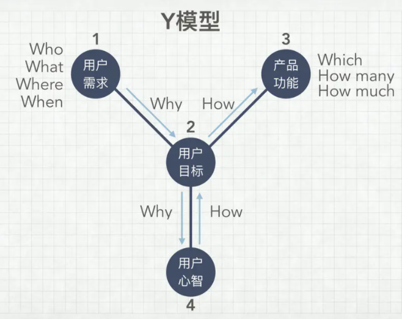

需求分析
========

如何将用户需求转换为产品需求？
------------------------------

首先保持二八原则，只有普遍用户的需求，才能内化为产品的需求。比如某个需求就一个用户需要，其他大多数用户都不需要，你就不需要做。

通过现象看本质，收集用户需求以后，多为自己几个为什么，找到用户的动机。

例如：用户在沙漠中需要水，你就要问自己用户为什么需要水？用户有可能口渴了，那这时候你给他水就好，如果用户是因为太热，你能不能给他防晒服，甚至考虑一下用户体验，觉得防晒服太麻烦，提供防晒霜。有时候一个人并不能完全洞察用户的动机，需要团队的其他人员一起头脑风暴，甚至多问提这个需求的原始用户几个为什么，直到找到真正动机为止，然后结合产品本身衡量需求的性价比，最后综合团队实力，需求急切度确定最终产品需求。

需求提取 `5 <https://blog.csdn.net/eickandy/article/details/80294224>`__
~~~~~~~~~~~~~~~~~~~~~~~~~~~~~~~~~~~~~~~~~~~~~~~~~~~~~~~~~~~~~~~~~~~~~~~~

“如果我最初问消费者他们想要什么，他们应该是会告诉我，‘要一匹更快的马！’”

——这是亨利·福特的一句经典名言，如今我们在《乔布斯传》里又见到了它。

客户需求有显性需求和隐性需求两大类。我们通过市场调查得知的往往都是一些诸如“我要一匹更快的马”这类显性需求。客户的显性需求并不是客户真正的需求。企业需要根据所收集的显性需求信息进行深度挖掘和捕获，以了解客户的隐性需求是什么，进而分析出客户的真正需求是什么（例如：用更短的时间、更快地到达目的地）。这就是一个需求分析的过程。

Y 模型 `6 <https://www.jianshu.com/p/2af332aaa017>`__
~~~~~~~~~~~~~~~~~~~~~~~~~~~~~~~~~~~~~~~~~~~~~~~~~~~~~

   Y 模型

配图中你可以看到一个大写的字母 Y，有三个线段、四个节点。

-  “节点
   1”代表的是用户需求场景，经常被简称为用户需求。这是起点，是表象，是表面的需求，是用户的观点和行为。
-  “节点
   2”是用户需求背后的目标和动机，是用户言行的原因。不过产品经理在思考用户目标时也要综合考虑公司、产品的目标。
-  “节点 3”是产品功能，是解决方案，是技术人员能看懂的描述。
-  “节点
   4”是人性与价值观，或者说是用户心智，是需求的最深层体现，是需求的本质。

Y 模型的不同阶段，各自需要回答一些问题，可以总结为 6 个 W 和 3 个 H。

“节点 1”这个阶段的问题主要是
Who（目标用户是谁）、What（需求表现为什么）和
Where/When（何时何地，什么情况下）。

“节点 1”到“节点 2”和“节点 2”到“节点
4”这个阶段，对应的是对用户需求的层层深入。这个阶段要回答 Why
这个问题——要不停地往下深入挖掘需求，了解用户为什么会有这样的言行、为什么会有这样的目标和动机。

“节点 4”到“节点 2”再到“节点 3”的过程中，你要想清楚
How——也就是要想清楚问题应该怎么解决。这个叫浅出，先深入后浅出。

“节点 3”中，要回答 Which、How many、How much 三个问题。

Which
是指选哪一个方案，做哪一个功能，这背后其实是对价值的判断，比如怎么评估性价比和优先级。How
many 是指这一次做多少个功能，考验的是对迭代周期，产品包大小的把控。How
much
原意是多少钱，这里引申为多少资源，是对时间、金钱、团队等资源的评估。

   在一个不成熟的领域或全新的市场，只做“节点
   1、2、3”是玩得转的。但表层需求很快就会被相似的跟进产品满足，随着市场的成熟，产品很快会陷入同质化竞争和价格战，最终整个市场变成红海。而破局的方法就在“节点
   4”（用户心智）。

作为初创团队，你要做的重要事情只有两件，一是和用户交流，二是开发产品。
———保罗·格雷厄姆

创新会面临两大风险，一是市场风险，就是说你做的产品有没有人需要，二是技术风险，就是说你能不能把东西做出来。

和用户交流，就是 Y
模型的前半段，是解决市场风险，对应的心法就是用心听；而开发产品，就是 Y
模型的后半段，是解决技术风险，对应的心法是不要照着做。

痛点剖析 `7 <https://blog.csdn.net/kepengs/article/details/92955349?utm_medium=distribute.pc_relevant.none-task-blog-BlogCommendFromMachineLearnPai2-9.baidujs&dist_request_id=1328740.12762.16168265945036403&depth_1-utm_source=distribute.pc_relevant.none-task-blog-BlogCommendFromMachineLearnPai2-9.baidujs>`__
---------------------------------------------------------------------------------------------------------------------------------------------------------------------------------------------------------------------------------------------------------------------------------------------------------------------

1. 痛点是个体合适普遍？
2. 痛点的需求是否符合政策导向，是否合规？
3. 痛点的需求是否高频应用？
4. 用户是否愿意为痛点买单？愿意付出多大代价？
5. 感受到痛点的用户是不是具有采购决策权？

优先级安排 `1 <https://www.bilibili.com/video/BV1254y1D7Ht?from=search&seid=14167562900175777805>`__
----------------------------------------------------------------------------------------------------

why? `2 <https://zhuanlan.zhihu.com/p/22067195>`__
~~~~~~~~~~~~~~~~~~~~~~~~~~~~~~~~~~~~~~~~~~~~~~~~~~

人类拥有无穷的欲望，却只拥有有限的资源。熊掌与鱼，不可兼得！

对「优先级」的定义关系产品成败
~~~~~~~~~~~~~~~~~~~~~~~~~~~~~~

苹果早期 iPhone
的设计是优先级控制的典范。手机正面只有一个按键的设计，尽管现在看来似乎是理所当然的，但在当时却是非常勇敢和有争议的决定。我曾深入研究过
iOS
系统早期的设计，在很多地方的取舍做的非常到位，能够大胆砍掉之前手机系统常见的功能和界面元素，让重点变得更重点，让需要突出的内容变得更突出。

而相比之下，同一时期诺基亚的系统尽管拥有大量功能，在呈现给用户时并没有处理好优先级，对于用户相对要更复杂，如果读者还有印象，可以想象一下打开一个联系人，看看与之对应的常常的功能菜单。而那个时候微软的
Windows Mobile 系统，则是大量将 PC
上的体验搬到手机上，用户的认知资源和系统有限的显示和交互资源之间并不匹配。

结构化优先级
~~~~~~~~~~~~

1. 信息优先级要关注内容的组织关系和轻重缓急
2. 视觉优先级重在引导用户视线和行为轨迹
3. 交互优先级要区分主线和支线任务
4. 需求优先级要平衡用户目标和商业目标
5. 用户优先级要界定核心用户是谁

信息优先级
^^^^^^^^^^

余额宝：收益、总金额。字号大，想让你看！麦肯兹金字塔。

视觉优先级
^^^^^^^^^^

-  报纸上的文字大小、颜色、区块
-  海报朝着商品上看。

交互优先级
^^^^^^^^^^

区分主线和支线，\ **突出主线任务**

-  读书app，点一下会设置，再点一下只能前后。读书！
-  支付宝，收付钱。
-  滴滴，预约用车、现在用车。感觉车很多。

建立故事，记忆更深刻。

豌豆荚几亿钱分十几个人！

需求优先级
^^^^^^^^^^

需求优先级要平衡用户目标和商业目标。

-  用户目标：炫耀。读取型号、找对应图片、程序合成
-  商业目标：更多用户。使用豌豆荚截图+\ **网址**\ 。留个空间给裁。

项目范围优先级制定一沟通计划
~~~~~~~~~~~~~~~~~~~~~~~~~~~~

By who、Who、How、Why、When、What。

制定沟通计划的目的是为项目交付周期的交流和相互支持提供指导。在敏捷项目里,面对面交流比文档要好,但是依然会有一些共享文件,比如报告和项目计划,需要留下档案。

四象限 `3 <https://www.bilibili.com/video/BV1254y1D7Ht?from=search&seid=14167562900175777805>`__
~~~~~~~~~~~~~~~~~~~~~~~~~~~~~~~~~~~~~~~~~~~~~~~~~~~~~~~~~~~~~~~~~~~~~~~~~~~~~~~~~~~~~~~~~~~~~~~~

优先级顺序:重要、紧急（立即做）>重要、不紧急（时间表）>不重要、紧急（委派）>不重要、不紧急（排除）

重要程度大致的排序如下：
`4 <https://weread.qq.com/web/reader/40632860719ad5bb4060856ke3632bd0222e369853df322>`__

-  不做会造成严重问题和恶劣影响的；
-  做了会产生巨大好处和极佳效果的；
-  同重要合作对象或投资人有关的；
-  同核心用户利益有关的；
-  同大部分用户权益有关的；
-  同效率或成本有关的；
-  同用户体验有关的。

紧急程度大致的排序如下：

-  不做错误会持续发生，然后造成严重影响；
-  在一定时间内可控，但长期会有糟糕的影响；
-  做了立刻能解决很多问题、产生正面的影响；
-  做了在一段时间后可以有良好的效果。
