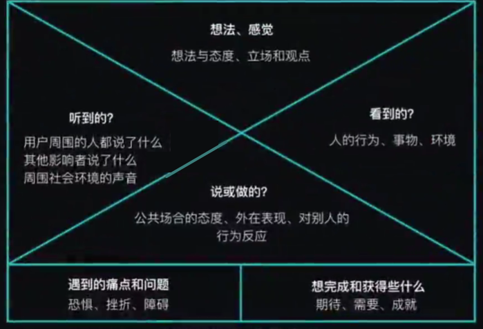
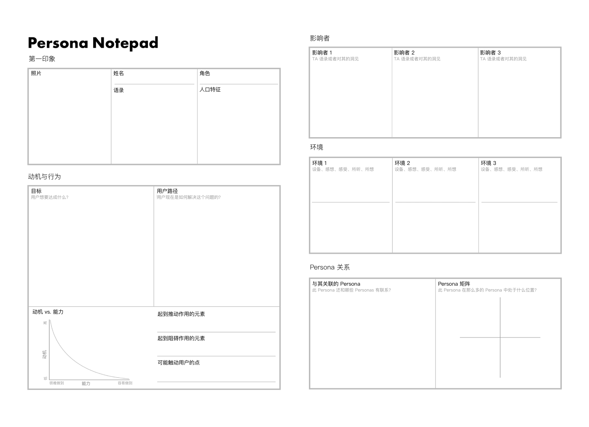
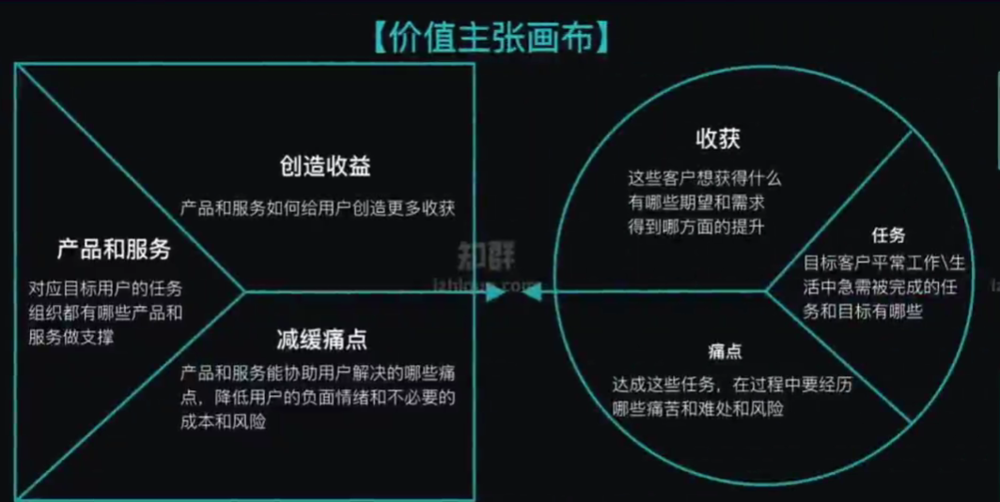

.. _users_analysis:

用户需求研究 `1 <http://www.woshipm.com/operate/3627874.html>`__
================================================================

用户
----

什么是用户？
~~~~~~~~~~~~

用户不是人，而是\ **多个需求的集合**\ 。某个产品完全满足了某个人在某个场景下的某类需求，那么就可以说该场景下的这个人就是产品的一个用户

用户的五个属性 [11]
~~~~~~~~~~~~~~~~~~~

-  异质性：每一个用户的偏好、认知、拥有的资源是不一样的，
-  情境性：没有情境就没有用户，同一用户在不同的情境下会有不容的反应和行为
-  可塑性：用户的偏好和认知会随着外界不同的信息刺激发生变化和演化
-  自利性：追求个人总效用最大化
-  有限理性：虽然追求理性，但是能力有限、判断经常出错，所以只能做到有限的程度

场景例子 [15]
~~~~~~~~~~~~~

-  场景A：有个朋友喜欢夜跑，跑步时一定要听音乐，而且要听特别动感的。
-  场景B：喜欢在上下班的路上听音乐，地铁上或者公交车上。
-  场景C：很怀念中学时代，想找以前耳熟能详的歌曲，却无从下手。

UCD VS BCD [4]
--------------

-  UCD(User Centered Design): 以用户为中心的产品设计
-  BCD(Boss Centered Design): 以老板为中心的产品设计

无论产品的使用流程、产品的信息架构、人机交互方式等，以UCD为核心的设计都时刻高度关注并\ **考虑用户的使用习惯、预期的交互方式、视觉感受**\ 等方面。

腾讯手机充值业务曾经收到老板提出的一个需求：将单次充值的最大额度，从之前的
500 元增加到 2000
元。因为老板自己有这个需求，容易认为其他用户可能也会有类似情况，也就是说这个需求在决策过程中犯了「以点带面、以偏概全」的毛病，放大了单一用户的小众个性化需求，取代了普适大众的真实需求。

谁最了解用户，谁最有发言权！

用户导向不容易 [17]
~~~~~~~~~~~~~~~~~~~

Perspective
taking的心理学理论，人考虑问题习惯性先从自己出发，而不是对方出发。

了解用户
--------

产品经理最基础最重要的工作是理解用户，理解用户之后，你做功能和做权衡取舍的有效性就更高。但理解用户特别难，而如果有超过平常人的同理心，就会事半功倍，比别人轻松得多。[32]

为什么了解
~~~~~~~~~~

涉及到方向性问题的时候，在混沌的信息中，在开放的无边界的信息中，找到适合的方向，这本身不是A/B测试能搞定的事情。

基于对用户的深刻洞察，才能谈价值发现，产品规划，产品设计，上线运营等。

用户模型
~~~~~~~~

用户模型是产品经理头脑中对用户的主观理解，就是「你以为」用户是什么样的。这是每个人头脑中的隐性知识，没法清晰地文字化数据化，只有通过迭代验证才能知道你有没有掌握。

我认为，理解用户的的唯一路径就是：滚动大量地分析
case（用户行为\ **真实案例**\ ，如果能亲自体验的就多体验，推断每个 case
的用户决策逻辑）、并用数据分析其分布和趋势、并在迭代中验证和校准「你以为」。[31]

**方法：**

-  用户故事：关注以用户的视角描述其通过使用软件产品想要实现的\ **任务**\ 和获得的价值。
-  同理心地图：关注描述\ **设身处地**\ 以用户的视角在某个\ **情景**\ 时遇到的问题，来挖掘目标与解决方案。
-  用户生态：关注用户\ **多样性**\ ，是否可以继续细分。
-  用户画像：关注用\ **关键特征**\ 来描述的用户。
-  用户旅程：关注用户在情景的整个前中后的\ **过程**\ 的行为、心理。

用户故事 [6]
------------

用户故事的用途是以用户的视角描述其通过使用软件产品想要实现的任务和获得的价值。故事不同于传统需求规格说明书,以简化的形式促进团队交流,降低修改成本、灵活调整接受变化,同时故事以验收驱动的定义形式让所有干系人入对最终的目标建立共识。

以用户的语言来描述用户故事，以识别真正的用户故事而不是解决方案

即：用户故事——谁，在什么情况下，碰到了什么问题，有什么感受和情绪，现在又是怎么做的，现在的做法中又有哪些痛点，等等。
[9]

用户故事可分为三个层次：

1. “主题”用户故事
2. “大”用户故事
3. “可开发”的用户故事

用户故事的INVEST原则
~~~~~~~~~~~~~~~~~~~~

1. 独立性（Independent）— 要尽可能的让一个用户故事独立于其他的用户故事。
2. 可协商性（Negotiable）—
   一个用户故事的内容要是可以协商的，用户故事不是合同。
3. 有价值（Valuable）—
   每个故事必须对客户具有价值（无论是用户还是购买方）。
4. 可以估算性（Estimable）—开发团队需要去估计一个用户故事以便确定优先级，工作量，安排计划。
5. 短小（Small）—
   一个好的故事在工作量上要尽量短小，最好不要超过10个理想人/天的工作量,至少要确保的是在一个迭代或Sprint中能够完成。
6. 可测试性（Testable）—一个用户故事要是可以测试的，以便于确认它是可以完成的。

同理心地图
----------

同理心地图给设计团队提供了一个思考框架,是帮助团队整理对用户的认识的一项工具。它帮助团队整合所观察和调研到的人和事物,并协助挖掘提出对用户深层次的理解目标、需求、观点、关注[20]、痛处、态度、行为）同时,同理心地图也是一个团队协同设计的工具,确保每位团队成员对使用者的理解都是相同的。

   empathy_map

简例：[15]

-  目标用户可以细分：情怀型白领 / 运行型白领
-  使用场景：睡觉前 / 跑步时
-  用户目标：需要情怀式的曲目 / 不经常操作，连续播放动感音乐

设身处地的方法 [16]
^^^^^^^^^^^^^^^^^^^

如果想真正融入其中，对其有更深的了解，就一定要去\ **做对方所做的事情**\ 。比如，产品经理要想了解某个产业的情况，最快的办法是自己做销售，真正地和销售走到一起，做销售要做的事情，接受销售要接受的考核。只有这样，产品经理才能真正了解中间的利益流转到底是怎样的、在销售过程中应该怎样做和产品的价值点到底在哪儿。

用户生态
--------

在任何一个产品领域，用户都是多种多样的。所以，第二步我们要梳理用户生态。你需要了解，在产品所涉及的领域中，有哪几种用户，他们之间的关系是什么。

还要注意三点：

1. 颗粒度：某种用户可以继续细分，但分到什么程度，还没有定论，需要根据实际情况进行分析。比如家长要不要细分为爸爸和妈妈。
2. 考虑边界：不同的用户和产品发生的关系有强有弱，最广义的用户，是指所有和产品有关系的人。那么，用户是否都要纳入我们日常的用户生态图，就是你需要考虑的“边界”。
3. 优先级：已经被画在用户生态图中的用户，也是有重要、有次要，我们肯定是先照顾最重要的。

用户画像
--------

用户画像是根据用户社会属性、生活习惯和消费行为等信息而抽象出的一个标签化的用户模型。构建用户画像的核心工作即是给用户贴“标签”，而标签是通过对用户信息分析而来的高度精炼的特征标识。可以帮助整个产品创新团队时刻牢记我们的产品是为谁服务的。

用户画像包含：

1. 基本信息，给这类用户的代表起个看起来真实的名字，选一个照片，设定性别、年龄、职业、日常的兴趣爱好。
2. 描述用户的特定信息，也就是与产品领域相关的信息，比如生活方式、价值取向、心理预期等。
3. 选几句在收集用户故事的时候，听到的用户说的有代表性的话，增强真实感。

   QQ早期用户画像数据

.. figure:: ../img/user_persona.png

   用户画像[22]

其他：硬件属性、社群属性、软件属性[30]

TODO:https://zhuanlan.zhihu.com/p/28485415
https://github.com/zhangjunhd/reading-notes/blob/5c542b066ec731cf97debe41d5932298cc84d670/pm/product/product-mind.md

人的五个层次 [10]
~~~~~~~~~~~~~~~~~

1. 感知层
2. 角色框架层
3. 资源结构层
4. 人的能力圈
5. 一个人对存在感的定义（这是一个人的内核，就是他对他自己为什么而存在，到底是怎么感知的。）

存在感对于人就像生存对于动物一样，是触发情绪和推动行动的开关。最内核是存在感，它的外面一层是能力圈。如果一个人的存在感满足了，其实他的能力圈就不会再扩充了。

如果你明确知道自己想成为一个什么样的存在，你就会不断地改变自己的能力圈，改变自己的资源，甚至改变自己的样子。

找到核心用户
------------

.. figure:: ../img/RFM.jpg

   RFM

当我们寻找到RFM都高的群体，就是我们目标的核心用户。找到核心用户的下一步，其实是做核心用户的分群和拆解。核心用户仍然需要进一步的拆分，我们会从三个维度：特征维度，行为维度，需求维度来进行拆分，比如从性别，年龄，消费行为，使用行为还有潜在需求进行划分，这样能够精准的抓住我们的核心用户是谁。
[19]

找到核心用户的需求
~~~~~~~~~~~~~~~~~~

TGI : Target Group Index ( 目标群体指数)

TGI指数
:math:`=\frac{\text { 目标群体中具有某一特征的群体所占比例 }}{\text { 总体中具有相同特征的群体所占比例 }}`
\*标准数100

如何去计算产品的上限
~~~~~~~~~~~~~~~~~~~~

我们同样可以使用DAU来预测。在自然增长的情形下，第n天的日活理论上等于当天的新增用户，加上此前每一天的新增用户在当天的一个留存。

DAU(n)=A(n)+A(n-1)R(1)+A(n-2)R(2)+… …+A(1)R(n-1)

假设每日新增用户A相同，

DAU(n)=A(1+R(1)+… …+ R(n-1))

DAU(t)为第t天的日活，A(t)为第t天的新增用户，R(t)为新增用户在第t天后的留存。

用户旅程
--------

如果说用户画像是静态的，那我们最后做的用户旅程，就是让用户“动起来”。

选一个重要的用户，思考他在解决相应问题的时候，都会碰到什么状况，做什么事，有什么感受和情绪。这时候，“有没有产品”依然不是重点，重点还是关注用户的言行举止。

用户旅程分为三段：

1. 做某事前的准备；
2. 做某事的过程；
3. 做完某事之后。

用户旅程地图
~~~~~~~~~~~~

用户旅程地图(User Journey Map是和用户画像
persona)相辅相成的工具,用户画像代表的是具体的族群,而体验地图是分析这个族群为了实现某个目标而经历的过程的可视化呈现工具。它用于了解和解决客户需求和痛点,在这个过程中用户可能会使用多个设备和渠道(例如网站,手机app,社交媒体,电话,线下客等)

1. 阶段:用户实现某个目标所经历的具体步骤
2. 行动:每一个步骤下用户所产生的具体行为习惯
3. 想法:用户在这个过程中的想法和体会
4. 情感曲线:用户在这个过程中不同阶段的情感波动
5. 机会点:我们洞察到的能够改进的机会
6. 改进点:将每个改进点对应的相应的责任人身上

Persona 文档指导
----------------

   Persona 文档

可参考《About Face：交互设计精髓》[24]

价值主张画布
------------

   价值主张画布

故事板 [7]
----------

故事板可以帮助用户预测并探索产品的用户体验，透过故事板的情境模拟以利设计师在设计过程中能去推测出使用者在使用过程中可能会遇上的问题，且帮助了解用户目前与问题相关的动机和经验，便于设计师能更进一步确立设计目标

同期群分析（Cohort Analysis）
-----------------------------

主要目的是分析相似群体随时间的变化(比如用户的回访)随看开发迭代的演进,产品上线第一个月使用你的产品的用户与第五个月使用你产品的用户感受到的体验是很不一样的。
我们把在同一个时间段(产品阶段)使用产品的用户划为同一期,针对他们的分析叫做同期群分析

需要了解到什么度
----------------

至少在你们公司，你应该是你们公司用户的专家，即其他人想要了解用户对某些场景或问题的看法时，如果想到咨询一个人的话，第一个想到的是你，那么你就是你们公司的用户专家。可以不断的问自己一个问题“自己是否可以称为用户专家，是否足够的洞察用户”，这需要时间的积累，在实践中回答这个问题，并不断的通过实践给出一个肯定的答案。

怎么衡量了解的度
~~~~~~~~~~~~~~~~

最简单直接的方法是假设验证法，即给定一个场景，给出你对用户的判断，然后以实际结果验证你的判断。不断的实践来提高对用户判断的准确度。

当给出任何场景，你对用户的判断八九不离十，知道用户是否存在这个问题？多少用户存在这个问题？用户当前是怎么解决这个问题的？是否值得做？做了之后用户是否能从原来的习惯中迁移过来？

指标 [4]
--------

需求量、强度、频次、痛点、Arpu、期望、现有解决方案

-  需求量：大众、小众
-  强度：刚需(必须需要)；、弱需
   越刚越容易付费；后验看“功能渗透率”（指当前使用该功能的人数占整体使用产品的人数比例。），渗透率越高，越说明这是用户的核心功能。[29]
-  频次：高、低频

.. figure:: ../img/need_analysis.png

   need_analysis

-  痛点：解决某个需求时，遇到的最大障碍。
-  Arpu：用户价值。烧饼一两块、化妆品百来块、增高药上万
-  期望：超预期。才能拉新。

.. figure:: ../img/lawyer_analysis.png

   lawyer_analysis

为了需求找技术。

研究内容 [4]
------------

-  用户特征：性别、年龄、职业、地域、学历、消费能力。TOFA（传统/时尚、节俭/花钱）
-  需求情景：在什么时候用，用的时候会发生什么？饿了么，来不及停止接单、在意配送时间准时保。
-  需求动机：聊天、结婚、约炮？微信熟人、陌陌陌生人不需加好友。
-  显性/隐性需求：隐性又是更重要
-  关注因素：在意什么？菜品口味、价格、送餐速度、干净卫生。大众用综合排序
-  认知过程：不知道》知道》了解》产生兴趣》学习
-  行为习惯：用户通常怎么做？由于认知决定。SICAS(Sense、Interest、Communication、Action、Share)
   FOGG(motivation、ability、trigger)
-  行为心理：为何这么做？货比三家、怕吃亏上当。
-  使用过程：用户使用你产品或服务的过程。
-  决定因素：重大行为的决策。陌陌上找你喝酒，怕是酒托、仙人跳..

需求情景–情节
~~~~~~~~~~~~~

主线：筛选饭店、点餐、支付、等餐、就餐。

分支：

1. 筛选饭店的方式：搜索、好评、默认推荐
2. 查看送餐小哥什么时候能送到?要不要催促下?
3. 饭到了很难吃,要不要给个差评?

异常：退餐流程,这个流程中,又可以细分出N个情景

用户体验、满意度、需求满足程度

1. 产品不同,研究的内容和方法也会有差异,需要活学活用。
2. 这条线上的每一个点,都会关联到你的（UML统一建模语言，推荐书籍《UML大战需求分析》）,产品功能设计,运营策略,付费转化策略,营销推广的策略和\ **N个细节**\ 。
3. 产品的每一个细节,都跟用户需求有着千丝万缕的联系。大到产品定位规划,商业模式,竞争策略,小到每一句营销的文案编写,UI设计图那个字需要加大加粗,某个位置需要一个小图标。

用户吐槽的小故事 [18]
---------------------

腾讯内部有时候会举办各种产品投票，在一次票选【员工心中最需要改进的产品】活动中，QQ
浏览器排在了第一位。

几天后，腾讯内部 BBS 上出现了这样一条帖子：QQ
浏览器重金邀请同事们内测，团队郑重承诺：请大家尽情吐槽浏览器的所有问题，保证
100% 及时回复，每 48 小时公开处理结果。

就这样，产品经理们收到了 1130 条反馈，归整为 606
类建议，团队马不停蹄开展了 10 轮讨论，在 15 天内完成了 72
项体验优化，推出了 CE 优化版。部门总经理逐字逐句修改内部 CE
的邮件，最后还在 200 多张致谢卡上一一签名。

3 年后，作为业界有口皆碑的浏览器，QQ
浏览器获得了「名品堂」奖项，这是腾讯奖励给优秀产品的最高荣誉。

洞察用户时常犯错误
------------------

1）以偏概全，因自己或周边人经常遇到某些场景，就以为绝大多数人会遇到类似场景，很感性的认知。举例：你朋友圈的热点可能真的只是你朋友圈的热点，在你父母那，在你高中同学那，在别的行业的大学同学那，甚至同行业同事那里，大家的热点都是有差异的。

2）常识性错误，比如我们知道一般老板会查看下属工作情况，老板也更关心公司的业绩统计数据，然后我们就可能认为下属资料和业绩统计分析会有较高的用户重合度，其实不一定，因为查看下属资料这个大概率是管理员做，但统计分析这种业务员也可以查看，甚至是老板指派专人管理。

3）过于相信数据，比如AI技术可以实现一些功能的自动化，我们通过自动化的开关来判定用户有没有使用，也通过用户对自动化数据的修改来判断用户是否真的将自动化使用起来。但数据表现都很好，不代表用户满意，用户可能只是不知道你给他自动做来那么多事情，甚至知道了，也觉得数据是错的，但选择忽略而已，需要更多的从用户真实的反馈中得到。

4）静态的看待用户的行为，无论我们做用户访谈，还是用户调研，得出的数据和内容是基于当时用户状态及对产品的了解，而用户在产品或服务使用的过程中，是会随时间的变化而变化的。比如对于C端用户勋章挑战类的功能，刚开始可能用户比较喜欢，参与度较高，但随着参与次数的提升，部分用户会有疲劳感，这在产品的设计中，就要考虑随时间周期变化的用户的反馈。

研究方法 [5]
------------

-  用户访谈：主要是定性研究，是围绕一个特定的目的，通过不同的形式了解用户，从而获取受访用户对产品或者服务的感受、意见、建议，以及期望的过程。[14]
-  问卷调查：问卷设计一般都需要产品经理完成，然后可以找专业调研公司去实施。可参考
   [24] 定量研究；工具：问卷星、腾讯问卷、金数据[25]
-  体验与观察
-  焦点小组：通常需要第三方专业公司提供服务，这种方式是一个主持人面对一组用户，按照访谈提纲进行半结构式的交谈，每次可访谈6～12个用户，是效率非常高的研究方法，但也是对主持人控场能力要求非常高的方法。
-  成为用户
-  参与式设计
-  卡片分类
-  亲和图法
-  可用性测试
-  数据分析
-  满意度调查

用户访谈
~~~~~~~~

发现需求背后的动机。

如：网易云音乐的跑步FM功能。得出结论。

-  在跑步时听歌,除了简单的背景音乐外,还有更深层次的需求。
-  跑步很考验体能、耐力和毅力,心里如果一直想着自己跑得好累、跑了多少米、还有多少米,会感觉更累。听音乐能让人的注意力从疲劳的长跑中解放出来,专心聆听音乐,暂时\ **忘记疲劳**,突破体力极限。
-  更重要的是,节奏感强的音乐非常利于控制跑步节奏,抵抗肌肉疲劳。让耳朵和思维专心跟随音乐节奏,身体就可以一直保持速度。这时音乐实际起到了引导跑步的作用,在跑步步频放慢时,刺激身体保持节奏;在跑步步频稳定时,让人尝试提高步频、跑得更快。[28]

问卷调查
~~~~~~~~

问卷设计方法：收集资料-研究问卷形式-列出标题和提纲-确定问卷-修改试测-重新修订-发放问卷

研究问卷问题以封闭式为主，题目10道左右，尽量让用户能在1分钟内完成一道题。不能有任何诱导用户的奖励，以免影响客观性。[27]

同样，问卷调查除了前面介绍、问卷目标的明确、问卷设计的考究。一定要注意：[26]

-  目标不要过于多，这样的问卷会迷失方向；
-  要加上测试题方便剔除无效问卷；
-  目标用户投放渠道的选择不要偷懒，否则不真实：根据目标人群选择投放渠道，我的目标用户是大学生，所以我选择了学生群体做用户访谈。
-  结论很重要：因为它是你做问卷调查的目的，要为你的验证和猜想提供现实依据。

   问卷调查

用户调研
~~~~~~~~

意义：它是作为验证的手段。但它不能作为需求的来源。[23]

相关书籍《用户体验与可用性测试》《用户体验度量》

.. _用户访谈-1:

结果产出 [5]
------------

-  用户画像
-  用户应用情景
-  主线情景
-  分支情景
-  异常情景
-  认知过程
-  关注因素
-  行为心理
-  决策心理
-  任务流程分析
-  逻辑与权重

用户访谈
--------

.. figure:: ../img/user_research.jpg

   用户访谈示例：直播中后部

在求职和工作中会有什么作用呢？
~~~~~~~~~~~~~~~~~~~~~~~~~~~~~~

1. 在求职中，用户访谈是说服面试官的武器。

在面试中，面试官可能会质疑你需求的合理性。例如，面试官可能会说：“我觉得你这个约别人骑行的需求是个伪需求。”如果你没有做用户访谈，那么你只能说：“我觉着这个需求肯定是存在的，因为我就有这个需求。”这样是不是显得底气不足？但是，如果你做过用户访谈，你就可以自信地说：“这个需求确实存在，因为我访谈了20
个目标用户，其中85%的用户提到自己有这个需求，主要场景有两个，一个是当自己不会修车时可以找人帮忙，另一个是他们觉得一个人骑行很无聊。”这样的回答是不是更有说服力？

2. 在工作中，用户访谈是验证需求合理性的方法之一。

作为产品经理，我们要“发现需求”，而不是“创造需求”。这就要求我们通过科学、严谨的方法去挖掘需求，而不是用拍脑袋的方式决定有什么需求。比较严谨的方式有两种，一种是数据分析，另一种是用户访谈。因此，在掌握了用户访谈的方法后，我们就可以在以后的工作中设计出更符合用户预期的产品。

消费心理 [8]
------------

-  比附大腕以成就品牌：蒙牛一开始绑定伊利、借助内蒙古的优秀品牌。
-  通过情感联系来打造品牌：“钻石恒久远，一颗永留传”–“钻石有价，爱情无价”；贝尔电话–“女儿说她爱我们。”
-  掌握消费者的需求和心理：静的让你日日夜夜都感觉不到–伊莱克斯冰箱；“谁杀了兔子乔丹”–我穿耐克鞋，我是英雄
-  通过事件营销推广品牌：“水仙花”实验，向观众展示了水仙花在农夫山泉天然水和纯净水中的生长状况；刘翔与可口可乐，销量一度上升了30％。
-  珍惜消费群体：“飘柔”产品曾领先于洗发行业，为了低档市场的销售量，研发了“飘柔”系列的淋浴液及香皂，降低了品牌的市场价值。

《赢在用户》
------------

《赢在用户》则更侧重于对用户角色的细分和需求的调研分析的入门书，非常详细的解析了创建人物角色的每一个步骤。

1、人物角色的定义。目标—用户想做什么；行为—他们怎么做；观点—他们是如何看待这些经历以及如何看待他们自己的。
2、用户研究。定性分析，偏向了解，调查手段包括一对一访谈，现场调查，可用性测试；定量分析，偏向论证，调查手段包括调查问卷，网站数据分析，CRM数据。在实际工作过程中，往往两者会结合使用。
3、生成人物角色分类。对目标用户群体进行细分，可以按照用户来网站或应用想要完成的目标来细分；使用周期来细分，用户的使用频率；用行为和观点的组合来细分
4、使人物角色真实可信。人物形象信息应该包括姓名、照片、个人信息、行业信息、计算机和互联网使用情况、附加属性、语录等等。注意通过一个完整的生动形象的故事来展现用户的使用场景。[33]

AI 产品
-------

用户需求来自大数据分析，用户行为关联传感器等新型的交互方式，用户心理依靠深度学习。

[3]: [4]: https://www.bilibili.com/video/BV1wz4y1y7sg?p=2 [5]:
https://www.bilibili.com/video/BV1wz4y1y7sg?p=3 [6]:
https://www.bilibili.com/video/BV1254y1D7Ht?from=search&seid=14167562900175777805
[7]: http://acadeck.com/?p=411 [8]:
https://wiki.mbalib.com/wiki/%E6%B6%88%E8%B4%B9%E8%80%85%E5%BF%83%E7%90%86
[9]: https://www.jianshu.com/p/60e79d46dde5 [10]:
https://www.jianshu.com/p/85ec807c56d3 [11]:
https://www.jianshu.com/p/02df7160b7b0 [12]: [13]:
http://www.woshipm.com/pd/841065.html [14]:
https://weread.qq.com/web/reader/46532b707210fc4f465d044k6ea321b021d6ea9ab1ba605
[15]: https://zhuanlan.zhihu.com/p/24855458 [16]:
https://www.zhihu.com/pub/reader/119980992/chapter/1284104632479215616
[17]: https://www.zhihu.com/question/31154592/answer/51489241 [18]:
https://www.zhihu.com/market/paid_column/1312360599620358144/section/1312363033470443520
[19]: https://mp.weixin.qq.com/s/jK5vQWcUnKdro1kwqT8L8g [20]:
https://tangjie.me/blog/230.html [21]: https://36kr.com/p/1721300926465
[22]:
https://coffee.pmcaff.com/article/1103103818721408/pmcaff?utm_source=forum
[23]: https://www.zhihu.com/question/29342383/answer/46616997 [24]:
http://www.woshipm.com/pmd/3024508.html [25]:
https://www.zhihu.com/question/20791021/answer/1525593995 [26]:
https://t.qidianla.com/1149667.html [27]:
https://t.qidianla.com/1156537.html [28]:
https://www.zhihu.com/question/323588594/answer/890413615 [29]:
http://www.woshipm.com/pmd/3113347.html#:~:text=%E8%80%8C%E5%AF%B9%E4%BA%8E%E6%9F%90%E4%B8%AAAPP,%E7%9A%84%E5%A4%A7%E9%83%A8%E5%88%86%E7%94%A8%E6%88%B7%E5%88%9A%E9%9C%80%E3%80%82
[30]: https://mp.weixin.qq.com/s/tFiqERFrHy_1l5pgayR_jA [31]:
https://mp.weixin.qq.com/s?__biz=MzU4NDc3NzUyMw==&mid=2247488467&idx=1&sn=903aca398e63184251180e655265cc4a&scene=21#wechat_redirect
[32]:
https://mp.weixin.qq.com/s?__biz=MzU4NDc3NzUyMw==&mid=2247488467&idx=1&sn=903aca398e63184251180e655265cc4a&scene=21#wechat_redirect
[33]: https://www.zhihu.com/question/282907231/answer/429287399
