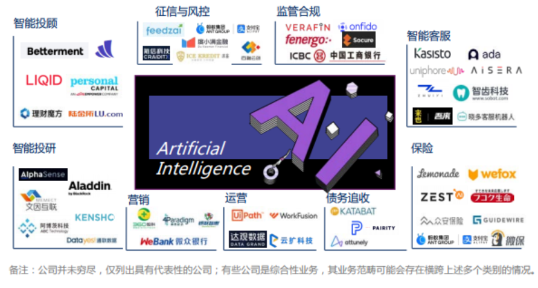
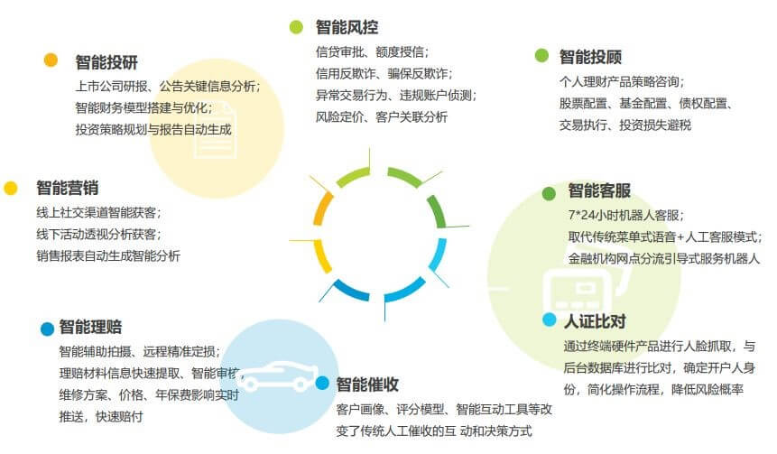
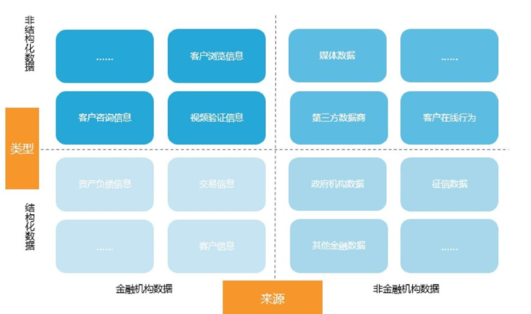
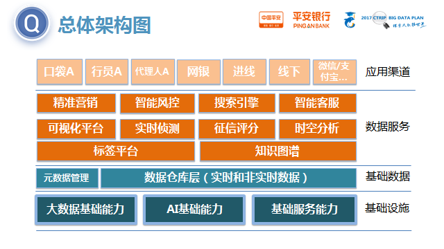
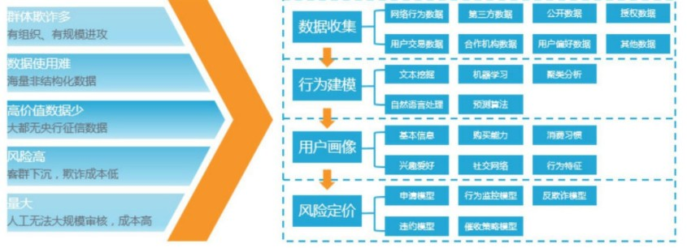
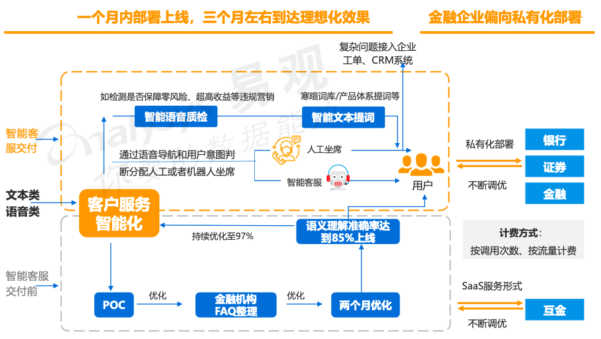
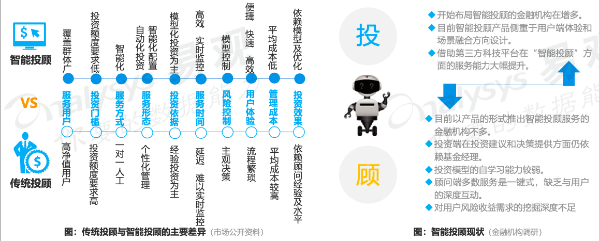

AI 金融
=======

是金融科技 :ref:`FinTech` 的其中一种AI应用，建议有时间先阅读金融科技
:ref:`FinTech`\ 。

金融业结合AI最积极 [13]
-----------------------

IDC《中国AI落地白皮书》中也提到，金融产业对于AI的应用最为积极，不论项目落地数量还是成熟度也相对更高。

机器之心500强：https://www.jiqizhixin.com/articles/2019-10-22-12

   AI 金融公司[23]

为何？
~~~~~~

1. 金融产业凭借自己高度数字化、信息化的良好基础，相比其他产业更容易打通技术入口。
2. 尤其金融产业的前台环节，业务接待、产品销售等流程，同样也属于劳动力高度密集的产业，应用AI所带来的降本增效效应也会更加显著。
3. 加上金融行业在技术方面的尝试更加积极，大量金融机构都拥有自己的技术研发部门，使得整个行业在接纳AI赋能上拥有更好的基础，不需要长时间的市场教育。

结合难点
~~~~~~~~

不在于技术，而是对于数据安全和隐私问题的要求天然要比其他行业更高。

上云风潮后部署不是简单对接API就可以的。

2019年趋势：

-  技术服务者调整自己的云化方案，通过私有云、混合云等多种部署
-  金融机构选择自己研发或采购技术，对自身云平台的能力进行AI更新。

应用点
~~~~~~

   人工智能行业落地主要场景领域[23]

-  智能客服催收
-  监管：Regtech
-  智能保顾：太保阿尔法发布时曾轰动一时，蚂蚁慧小保现在已经淡出，微信只做风险评估
-  投顾（投资教育、投资建议、风险匹配等） [14]
-  投研（舆情分析、投资决策、决策模型等）
-  智能风控（多维信用体系、全面风险管理） VS 普通风控[15]
-  金融产品运营（智能营销、用户/产品运营等）
-  征信： 个人征信未来在中国的发展和应用 - King James的文章 - 知乎
   https://zhuanlan.zhihu.com/p/22280599
   阿里和腾讯这样的互联网公司做第三方征信是不是本身就是不合理的？ - King
   James的回答 - 知乎
   https://www.zhihu.com/question/33731819/answer/120081634

端侧
~~~~

腾讯、京东等企业都推出了类似于“金融无人舱”的概念，将人脸识别、语音交互等技术通过麦克风阵列、智能摄像头等方式部署在端侧。

通过端侧部署，可以通过统一的硬件配置，让技术模型不再需要面对因移动端设备多样化而提升鲁棒性的麻烦。像是因为不同设备前置摄像头配置不同，用户所处环境也会影响光线。因此人脸核验、证件核验的识别算法都要提升鲁棒性。但整体化的硬件配置，就不再需要担心这些问题。

同时类似“无人舱”概念的出现，绕过银行App这一入口，把AI的接触点直接搬到了线下，让很多不习惯使用App的用户，在线下也能与\ **AI能力相遇**\ ，不仅减轻了人工负担，也让业务管理更加统一化。

“AI+金融”产业链
---------------

.. figure:: ../img/financial_AI.png

   “AI+金融”产业链[6]

2020年中国AI+金融行业发展分析报告 [8]

金融类产品的上、下游关系一般是这样的：银行类机构—金融科技公司—第三方服务公司—渠道—员工。银行类机构掌控着最大化的资金和对应的牌照，金融科技公司借助自身的技术手段向银行类机构提供优质的客户，同时金融科技公司又在一定程度上借助第三方服务公司获取所需，然后通过渠道进行产品分销，最终又借助员工落地。
[10]

明确上、下游的利益 [11]
~~~~~~~~~~~~~~~~~~~~~~~

虽然银行类机构不同时期有不同的要求，但是本质上还是倾向于通过新增开户量提升自身的余额（存款），同时也借助自身资金的优势获取一定的利益。当然，银行类机构比较看重合规和风控。也就是说，银行类机构对获取利益的需求并不像一般企业那么急迫，更多的还是在合规和风控的前提下完成行内的任务。

金融科技公司更多的是提供科技层面上的解决方案，利用自身的技能优势帮助银行解决流程、合规、风控和效率等问题，从而获取利益。也可以说，金融科技公司本质上是中间的服务商，将上、下游打通，然后收取一定的服务费。

第三方服务公司的涉及面比较广，它着重强调的是垂直于某一领域的技能，而不是综合的服务提供商，如专门输出实名认证方案的服务公司、专门查询企业注册信息的公司，以及征信服务机构等一系列专门的机构。其核心是拓展更多的场景和接口，这样不仅可以通过服务来赚钱，还能够在与上游的交互中进一步完善自己的数据，提高服务效率，让自身变得更有价值。

渠道本质上就是一个分销商，它借助自身渠道侧的资源，承担销售的角色，通过收取服务费或利差来获利。一般来说，渠道是交叉服务于多家公司的，因此中间有许多竞争对手，甚至有不同行业的竞争对手。这样做可以丰富自身业务，赚取更多的复合型收益；还能够在与上游谈判的过程中保持一定的竞争力；同时也分散了风险，不会因某款产品出现问题而无事可做。

员工就是实际的执行者，对某款产品进行实际销售，员工的利益一般分为基本工资和销售提成两部分。

为什么是金融+AI而非AI+金融呢\ `4 <https://tanxianlian.com/2020/05/15/%e9%87%91%e8%9e%8dai%e7%9a%84%e6%9c%aa%e6%9d%a5%e7%95%85%e6%83%b3/>`__
-------------------------------------------------------------------------------------------------------------------------------------------

这两者的前后连接顺序体现的是主动和被动，引导和被引导的关系。之所以是金融+AI，体现的是这是金融行业对AI技术\ **主动性的利用需求**\ ，而非被动型的推动。

为什么金融可以+AI呢？
---------------------

因为金融业务开展的基础本质上是基于信息（数据）进行，AI可以对数据进行更好的利用，从而提升金融业务的效率。

具体来说，有这么几个主要的业务范围：

-  KYC（客户了解）：具体包括客户背景信息调查、客户核身、用户画像、客户偏好等；
-  交易决策：例如信贷领域的风控，理财领域的风险等级评估、产品推荐，保险领域的保险方案设计、理赔验证，以及所有细分领域都包含的反欺诈等；
-  客户服务：例如售前营销、售后服务等。

金融数据
--------

   金融机构数据生态系统

自2000年以来，以Hadoop为代表的分布式存储和计算技术迅猛发展，极大地提升了互联网数据管理能力，引发全社会开始重新审视数据的价值，数据也被作为一种重要的战略资源对待。而大数据作为一种新资源、新技术、新理念，为数据赋予了新的意义。从资源视角看，大数据是一种新的资源；从技术视角看，大数据代表了新一代数据管理和分析技术；从理念视角看，大数据打开了一种全新的数据驱动思维角度。

平安
----

   平安的数据应用的架构

金融新基建 `2 <https://www.leiphone.com/news/202012/7ovvkzByXnPQjnlD.html>`__
-----------------------------------------------------------------------------

在金融新基建榜中，乐信、水滴、弘玑Cyclone、洞见、同盾五家公司凭借各自优势在众多优秀竞争者中脱颖而出。

他们分别荣获“最佳新消费AI平台奖”、“最佳保险科技数据中台奖”、“最佳智能自动化平台方案奖”、“最佳隐私计算平台奖”和“最佳智能分析决策奖”。

特有的知识体系
--------------

很多行业都有特有的知识体系，不深入工作5年以上，很难做到融会贯通。比如，互联网金融行业的风险控制产品经理如果原来没有在金融体系、银行体系工作过，那么很难做出优秀的风险控制产品。这种风险控制产品可不是随随便便在办公室里想想，或者打开某个竞争对手的产品看看就能够想清楚的。
[7]

智能风控主要依托高维度的大数据和人工智能技术对风险进行及时有效的识别、预警、防范。智能风控整个流程主要分为四个阶段：第一阶段，数据采集，数据是智能风控的基础，主要数据来源为网络行为数据、授权数据、交易时产生的数据、第三方数据等；第二阶段，行为建模，在这个过程中，需要对大量数据进行结构化处理，形成最有效的信用评估组合；第三阶段，用户画像，通过前期的数据采集和行为建模，形成对每个用户的画像；第四阶段，风险定价，主要包括行为监控、反欺诈违约和催收。金融业务风控新挑战和智能风控基本流程见图。

   智能风控

现有的智能风控公司主要分为三类：第一类是研发自用型，所研发的智能风控系统主要用于自身业务的发展。例如拍拍贷的“魔镜”大数据风控系统、鑫合汇的“鑫盾”风控系统、爱钱进的“云图”动态风控系统等。第二类是纯技术输出型，为商业银行、互联网金融公司、消费金融公司、P2P公司等提供信用评估审核、智能风控、反欺诈等金融解决方案。例如百融金服的“风险罗盘”、明略数据的明智系统“金融风控大脑”等。第三类是混合型，既支持自身业务的发展，也对外输出技术能力。这一类型的企业一般以建立生态为目的，希望以技术输出来丰富自身的数据。比如蚂蚁金服对中小企业开放的风控产品“蚁牛”和个人征信产品“芝麻信用”、京东金融的供应链金融产品“京保贝”、网易金融的“北斗”风控系统等。

智能风控一定程度上确实突破了传统风控的局限，在利用更高维度、更充分的数据时降低了人为的偏差，减少了风控的成本。然而，智能风控的核心数据还不够完善，优秀的风控人才也供不应求，征信的建设也处于初步阶段。智能风控的运用和完善，任重而道远。
[18]

为什么AI或者大数据技术在金融风控领域用的最成熟？[21]
~~~~~~~~~~~~~~~~~~~~~~~~~~~~~~~~~~~~~~~~~~~~~~~~~~~~

第一，数据量方面。金融领域的交易数量和用户数量巨大，很容易支持大规模的数据应用。

第二，大部分情况下，我们的模型在金融和反欺诈领域是不需要很严格的解释，避免了可解释性差的问题。另外，从零搭建一个新的引擎、新的算法时，更多时候也会看重业务规则和人类的经验专家体系，再结合机器学习等技术。

AI 驱动的金融风控解决方案 [22]
~~~~~~~~~~~~~~~~~~~~~~~~~~~~~~

-  大数据管理挑战 -> 知识图谱解决数据治理难题
-  特征提取挑战 -> 深度学习挖掘弱数据的金融价值
-  数据建模挑战 -> 集成学习框架有效整合各类风险因子

智能投顾 `1 <https://zhuiyi.ai/solution/securities>`__
------------------------------------------------------

金融似乎是人工智能乐于“入侵”的领域，仅智能投顾就涌现了近百家平台。顾名思义，智能投顾就是人工智能＋投资顾问的结合体，借助大数据识别用户的风险喜好，再通过通过算法和模型定制风险资产组合。优势在于费用低、服务效率高、覆盖人群广，且在一定程度上满足了“千人千面”的理财需求。国外有Wealthfront、Betterment、Future
Advisor等知名智能投顾平台，国内也出现了钱景、拿铁财经、理财魔方等模仿者，就连记账软件网易有钱也开始向智能投顾转型。不过在政策和牌照的压力下，智能投顾能走多远仍不得而知。[20]

智能投顾，用服务新模式，打造差异化品牌

业务同质化让券商竞争激烈，企业希望通过服务的创新打造出差异化，吸引更多用户。追一AIForce的智能投顾助手YIFA提供了实时个股诊断、多条件筛选的能力，再结合快速交易能力，让投资者随时掌握个股动态，抓住转瞬即逝的交易机会。

智能投顾助手积累了行业头部的3000+常用知识点，让客户能在自营券商APP中闭环完成查询、交易和学习。创新的服务模式在不断增加客户信任度和粘性，提升品牌价值。

低成本高质量的智能外呼有效覆盖更多场景证券行业的高频度服务，让每个用户触点上的服务质量，成为决定券商运营效率和客户满意度的关键。

外呼可以提供各类电话沟通服务，包括开户的回访、对离职员工名下的客户进行回访、风险抽查、满意度调查、新股中签缴费提醒等等。他还能提供自动的业务咨询等经纪服务，既降低人力成本，又提升服务能力，提升覆盖度。

客户画像师， 挖掘数字金矿价值
大量的客户数据和运营数据在碎片化的场景中，难以获得有效沉淀与分析利用。

追一AIForce的客户画像师Feature，基于强大的语义理解能力，可以分析每一通外呼电话和各个渠道的客户交互内容。打破数据黑盒，将信息整理为结构化的数据，构建出消费者画像，从而辅助决策或主动服务，实现精细化运营与精准营销。

步骤
~~~~

   客户服务智能化

智能客服虽然在一定程度上能够，提高服务水平，但对于投资顾问所能提供的专业投资服务还有待智能化落地。智能投顾相对传统投顾的优势如下图所示：

智能投顾 VS 传统投顾 [14]
~~~~~~~~~~~~~~~~~~~~~~~~~

   智能投顾 VS 传统投顾

2013年以来，金融机构用户规模大幅增加，传统的投顾手段难以服务大体量用户群体，在数字化发展的智
能化时代，与用户深度互动、不断优化用户投资体验才能赢得用户，智能投顾产品在优化用户体验、实现深度互动、提高服务效率、降低服务成本方面具有天然发展优势。头部金融机构在智能投顾方面的探索、实践也在推动着智能投顾在行业内推广开来。

“投”与“顾”
不平衡，用户深度互动缺失:目前，金融的智能投顾产品处于探索初级阶段，投资端智能化程度显著不足，顾问端仅仅优
化了操作的便捷性，缺乏与用户的深度互动，智能投顾探索不应局限于金融机构，而应引入更多外部科技力量推动真正智能投顾的实现。

金融保险（Finance and insurance）
---------------------------------

-  4Paradigm
-  BioCatch
-  DataVisor
-  HyperScience
-  Behavox
-  AppZen [16]

人工智能平台中的 AI——实现规模应用的“哆啦 A 梦”
----------------------------------------------

在人工智能平台前，金融行业特别是银行中的建模大都还是 SAS、SPSS
等统计建模软件的天下，虽然它们在评分卡等领域曾经辉煌过，但在大数据时代的长河里，它们渐渐失去了往日的光芒。这时，具有大数据基因，且整合了大数据机器学习框架以及多种计算机语言的人工智能平台应运而生。其不仅利用分布式计算部署能力和容器技术让计算能力和速度进一步提升，而且还降低了建模计算的使用门槛，让前线的业务人员也能体验小白上手大数据建模的快感，同时也能让建模与业务场景结合地更紧密，让建模结果更好地赋能业务。[19]

AI 在金融领域落地面临困难和挑战 `3 <http://www.ramywu.com/work/2018/05/18/AI-in-Finance-Survey/>`__
---------------------------------------------------------------------------------------------------

1. 深度学习模型的构建比较困难
   目前并没有成熟的理论对深度学习模型的构造提供指导，主要还是依靠研究学者不断实验、不断探索
2. 深度学习模型的稳健性和适用性有待商榷
   深度学习模型能否适用于特定领域的分析和预测，需要大量实验进行验证。目前相关理论研究还处于对单一模型的优化处理，并没有提炼出通用的规律性方法和框架，从而限制了最终模型的稳健性和广泛适用性。
3. 深度学习模型较难正确地阐述金融数据分析结果背后的经济学原理
   深度学习模型在分析金融数据时，削弱了利用经济学解释最终结果的因果关系、以及隐藏于数据背后的经济学原理。

2020 金融AI
-----------

金融科技进入“强监管”时代，行业合规有序发展◆金融科技行业正式进入“强监管”时代，市场的喧嚣与浮躁开始隐退，各类机构在探索创新与合规的平衡中不断前行。首份金融科技发展顶层文件出台，明确金融科技创新与服务的边界，整个行业进入合规有序发展阶段。金融机构积极拥抱金融科技，通过调整内部信息技术架构、成立科技子公司，推动技术从后台走向前台和中台，赋能业务发展。金融科技出海热潮持续进化，一批以提供获客、风控、运营等金融技术服务的企业开始扬帆远航，寻求新的发展机遇。整体来看，监管规范、新技术与金融业的融合应用、技术驱动下的经营模式与业务合作模式创新都是行业普遍关注和积极实践的焦点。

亿欧智库认为金融科技2020年十大关键词为：金融开放、金融科技监管、监管科技、消费金融、小微金融、开放银行、第三方支付、财富管理、保险科技。

开放银行概念兴起，联邦学习技术将成为行业新的生产力
--------------------------------------------------

“开放银行”概念起源于英国，2013年由英国“竞争和市场管理局”（CMA）推出，并在2016年3月正式发布了《开放银行标准》。开放银行的本质是为各类小型金融机构提供共享信息的安全通道，来帮助各类金融机构提供多元化的金融服务，并创新银行产品。那么如何建立安全的信息共享通道就成了开放银行发展的关键。此外，鉴于国内对于用户金融信息的“防泄密”要求逐步严格，对于直接开放金融数据进行交互的模式是不合规的。由此，如何合规的进行金融机构间的数据交互成了中国银行业探索“开放银行”业务的关键。
[8]

联邦学习的诞生就是为了解决这个难题，其技术本质是分布式加密机器学习，在保护原始数据隐私安全的情况下进行联合建模，共同分享计算结果。而在银行数字化的进程中，商业银行机构逐步将对数据的需求发展至“捕捉基于场景下的动态数据“从而实现高效获客和低成本风控。基于银行需求和合规要求，联邦学习技术的发展也将对开放银行模式起到决定性作用。该项技术的积累与突破，也将成为AI金融各赛道企业探索新AI+金融落地场景和商业模式的战略蓝海。

联邦学习
~~~~~~~~

-  调用部署在第三方模型的时候，输入的就不是具体的业务数据而是模型参数
-  解决了数据泄露问题
-  目前，蚂蚁、腾讯、京东、微众银行，它们各自都有很成熟的联邦学习解决方案了

核心创始人与产品要匹配 [12]
---------------------------

某互联网金融平台的定位是从事金融服务的公司，创始团队中 70%
的人员都来自金融行业，主要以银行为主。在这种情况下，团队就与产品形成了有效的融合，因此很容易就看出这个行业现阶段存在的一些问题，也清楚这些问题可以通过哪些路径去解决。团队人员大多来自银行，他们对合规风控极其敏感。因此，他们不仅能够系统化地输出解决方案，还能有效地控制风险，从而达到平衡。

风险 [19]
---------

微观金融风险
~~~~~~~~~~~~

金融市场风险
^^^^^^^^^^^^

大量金融市场参与者同时应用人工智能技术时可能会出现金融市场稳定性风险。例如，如果以机器学习为基础的交易者胜过其他交易者，可能导致更多的交易者采用类似的机器学习策略，放大金融震荡。此外，机器学习交易策略中的可预测模式可能存在被犯罪分子用来操纵市场价格的风险。

金融机构风险
^^^^^^^^^^^^

对大部分人而言，人工智能的决策过程如同一个“黑箱子”，透明度的缺乏可能导致监管机构和市场投资者难以判断决策过程

市场集中化风险
^^^^^^^^^^^^^^

如果未来人工智能技术集中于少数领先第三方技术提供商，可能会导致金融系统中某些功能的集中度变高。此外，若某些金融机构拥有海量自有大数据，或最前沿的技术可能因研发成本高昂而只有大公司负担得起，也可能会导致其市场地位上升，加剧市场集中化。

市场漏洞风险
^^^^^^^^^^^^

机器学习的交易算法存在一定不可预测性，若出现金融市场冲击，可能较难解释其成因。此外，如果人工智能在高频交易中被广泛使用，大量买入卖出可能会同时进行，导致市场波动性增加。人工智能的应用还可能允许更少流动性缓冲、更高杠杆，从而导致潜在的流动性或高杠杆风险。

关联性风险
^^^^^^^^^^

金融体系存在互相联动的特点，如果众多金融机构在某一关键部分依赖于相同数据或算法，那么当这些数据或算法出现问题时，问题可能会从单个节点向整个市场扩散。因此，集体采用人工智能工具可能会带来关联性风险。

技术限制风险
^^^^^^^^^^^^

如果人工智能模型没有经过适当的培训或反馈，例如不充足的压力测试，则使用者可能无法及时发现潜在的技术风险，特别是在使用者未能充分理解人工智能本质及限制的情况下。

就业岗位
--------

人工智能技术将在金融行业内创造三类就业岗位：技术型、运营型和业务型。技术型岗位包括数据科学家、系统架构师、开发工程师、算法及系统测试师等；运营型岗位负责大数据与人工智能产品相关系统的运行与维护，确保相关产品的质量稳定、法律和业务合规性；业务型是介于技术和业务之间的复合型岗位，包括能够在技术部门、业务部门以及服务部门之间充当业务需求及技术算法解释角色的算法解释分析师，同时也需要能够快速了解、学习前沿技术并与现有业务进行结合的商务拓展专家。
[19]

专利
----

-  2020年金融科技专利报告：https://www.01caijing.com/article/273000.htm
-  2020年中国金融科技发明专利排行榜：https://www.maigoo.com/news/554316.html

示例
----

金融行业怎么用AI？蚂蚁金服是这么做的：https://tech.antfin.com/community/articles/625

AI + 金融：10家头部人工智能厂商金融产品盘点:
http://www.rpa-cn.com/zuixinzixun/AIshijiao/2020-07-20/2638.html

智能投顾
--------

http://www.pbcsf.tsinghua.edu.cn/portal/article/index/id/5130.html

更多
----

https://istock.ssetech.com.cn/wiki/doku.php?id=start

人工智能与金融AI研究报告精选（286份）：https://www.jrwenku.com/22053.html

AI金融联合实验室：http://sz.shenkexin.com/news/info-news-3786.html

[5]: [6]:
https://www2.deloitte.com/content/dam/Deloitte/cn/Documents/innovation/deloitte-cn-innovation-ai-whitepaper-zh-181126.pdf
[7]:
https://weread.qq.com/web/reader/46532b707210fc4f465d044ke4d32d5015e4da3b7fbb1fa
[8]: https://mp.weixin.qq.com/s/1jOCiQMMYIqDFWOLv-6n-A [9]:
https://www.yinxiang.com/everhub/note/e7f0c50e-dc27-488f-a9f9-35c121e20bb1
[10]:
https://www.zhihu.com/pub/reader/119980992/chapter/1284104631833292800
[11]:
https://www.zhihu.com/pub/reader/119980992/chapter/1284104632080130048
[12]:
https://www.zhihu.com/pub/reader/119980992/chapter/1284104622652002304
[13]: http://www.woshipm.com/ai/3263320.html [14]:
http://www.changgpm.com/thread-202-1-1.html [15]:
http://www.woshipm.com/pmd/2356222.html [16]:
https://easyai.tech/blog/best-ai-company-2019/ [17]: [18]:
https://weread.qq.com/web/reader/e77325105e4e55e77af47dbkd3d322001ad3d9446802347
[19]: https://www.infoq.cn/article/1obcmwjkaqyux5xjmy7j [20]:
http://www.woshipm.com/it/508568.html [21]:
http://www.woshipm.com/pmd/859851.html [22]:
https://www.modb.pro/doc/23865 [23]:
http://www.199it.com/wp-content/uploads/2021/03/Image28-126.png
https://www.yanxishe.com/TextTranslation/3162
