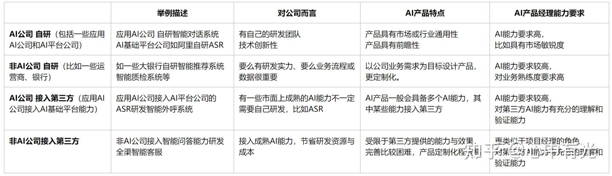
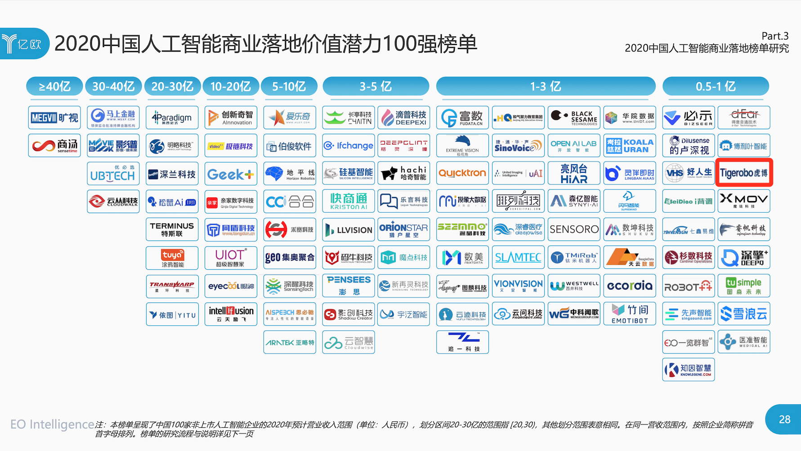
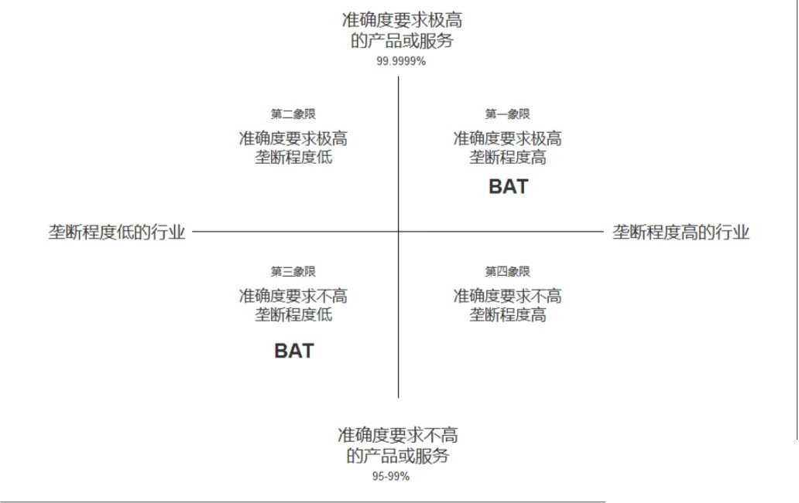
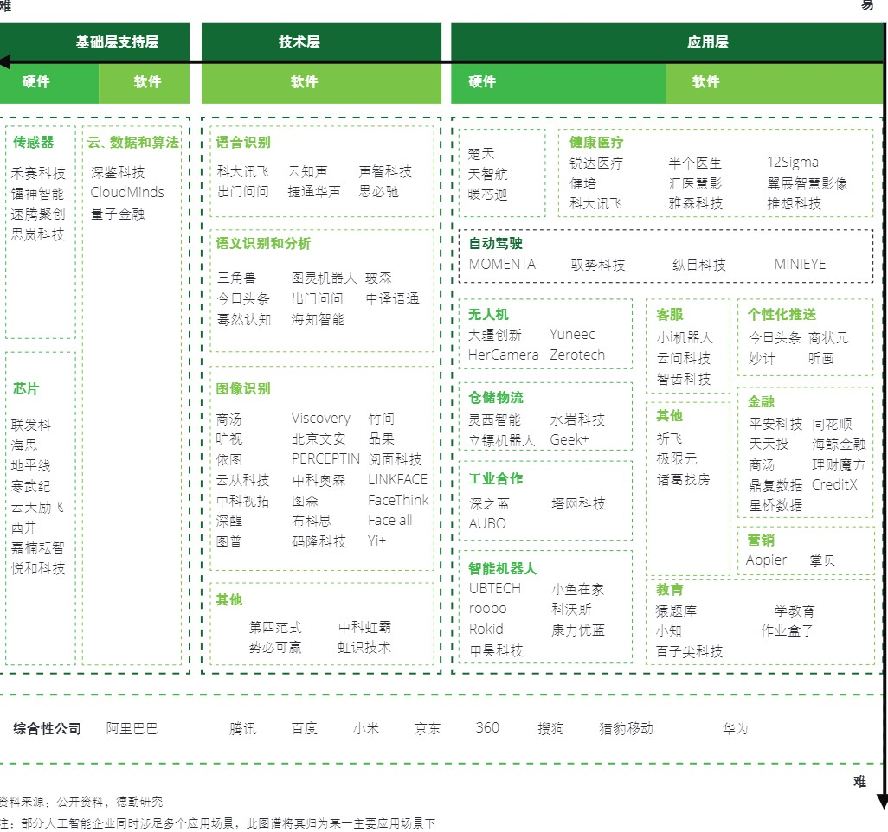
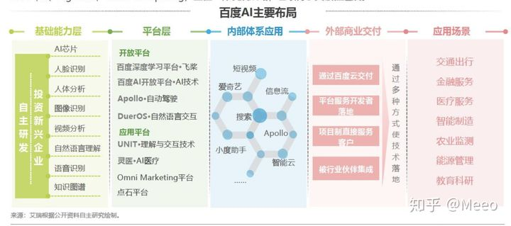
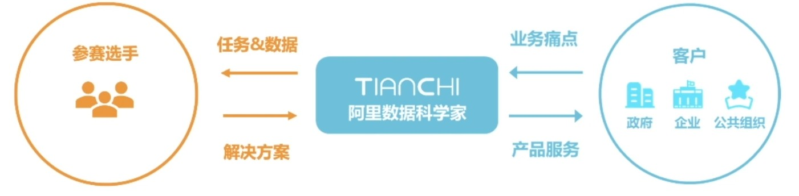

AI公司
======

理解企业
--------

https://www.zhihu.com/market/paid_column/1251475507390050304/section/1251475513652604928

“那些口号喊得响、低估场景挑战、高估技术能力的公司大多会在泡沫中死掉。”GMIS全球机器智能峰会后，刘维在接受网易智能专访时这样评价AI创业现状。
`9 <https://mp.weixin.qq.com/s?__biz=MzI3NTU3ODk1MQ==&mid=2247484933&idx=1&sn=e7b99f0686f5f4c6f9d41bc22a012881&chksm=eb03ef2ddc74663bc8f0ccca0f64c71a72e9e5583986806f81d86a799beca3d56ac970f461f9&scene=21#wechat_redirect>`__

类型
----

.. figure:: ../img/AI_vs_traditional.png

   AI公司与非AI公司

   公司分类\ `22 <https://www.zhihu.com/question/57815929/answer/1822975111>`__

阵营
----

1. 互联网巨头，包括“超第一梯队”的跨国公司Google和微软亚洲研究院，以及第一梯队的巨头
   — — 大家熟悉的百度、阿里和腾讯；以及第二梯队的今日头条和滴滴等公司。
2. 人工智能创业公司，以某种人工智能技术为主营业务的创业公司，典型的如自动驾驶领域的Momenta、地平线、驭势科技；视觉识别领域的格灵深瞳、商汤科技和旷视科技等。
3. 将人工智能融入到自身业务中的其它创业公司，如学霸君、泼辣熊和智齿科技等。
   `4 <https://zhuanlan.zhihu.com/p/33524676>`__

人工智能公司（主要针对创业公司）主要分为三个阵营：\ `5 <https://www.sohu.com/a/364264851_114819>`__

1. 研究核心技术的AI公司（Core AI
   Companies）核心人工智能，主要针对人工智能基础设施的搭建。产品经理侧重于对底层技术框架的理解。

2. 应用人工智能公司（Application AI
   Companies）：通常的表现形式是提供一种基础功能，客户可以通过调用封装好的API进行对自身产品的武装或填充，而无需自己研究基础功能。因为往往对于一些中小公司而言，拥有的数据量有限，无法通过机器学习技术完成对每一个基础功能的建模和应用部署，因此需要借助这样公司提供的开放API能力，然后自身做垂直应用。产品对行业的理解力和对行业趋势（参考《跨越鸿沟》《创新者的窘境》\ `21 <http://www.woshipm.com/pmd/3024508.html>`__\ ）的洞察力是核心；应用AI技术公司的商业模式以TO
   B为主，产品经理的KPI是项目回款，因此产品经理需要有一定的商务技能（售前、销售）；同时因为需要定制化开发，产品经理要明确区分标准化产品和定制化产品；

3. 行业人工智能公司（Industry AI
   Companies）：三个阵营中最接近终端用户的公司，提供垂直领域的AI服务，帮助用户解决具体场景中的具体问题。产品对行业的理解力和对行业趋势的洞察力是核心

核心人工智能公司往往对产品经理在技术层面要求最高，应用人工智能其次，行业垂直应用人工智能公司是对产品经理的业务深度或行业理解深度要求最高。

国际互联网
----------

.. figure:: ../img/international_AI.png

   国际互联网企业产业布局图谱\ `10 <https://weread.qq.com/web/reader/40632860719ad5bb4060856kc9f326d018c9f0f895fb5e4>`__

中国公司总览
------------

|AI公司\ |\ `7 <https://daxueconsulting.com/ai-landscape-china/>`__
|中国人工智能产业链图谱\ |\ `11 <https://www2.deloitte.com/content/dam/Deloitte/cn/Documents/innovation/deloitte-cn-innovation-ai-whitepaper-zh-181126.pdfs>`__
新基建IT产业图谱: https://www.analysys.cn/article/detail/20019748

   潜力100强\ `17 <http://finance.eastmoney.com/a/202007141554661012.html>`__

报告
----

《中国人工智能软件及应用市场半年度研究报告》：https://www.idc.com/getdoc.jsp?containerId=prCHC46625720
《中国AI云服务市场（2020上半年）跟踪》：https://www.idc.com/getdoc.jsp?containerId=prCHC47212020
预测：https://www.idc.com/getdoc.jsp?containerId=prCHC47222921

初步判断是不是真AI公司
----------------------

-  公司大小：大公司才有大数据。小公司很可能调了API。
-  融资： 融资有多少轮，目前融了多少资
-  知名度

排行榜
------

2018年中国企业人工智能技术发明专利排行榜（TOP100）：https://www.douban.com/note/709381421/?from=author

BAT的机会
---------

个人感觉BAT做AI有机会，在第一象限有技术和数据优势。在第三象限有数据和品牌优势，如果做垂直领域，可以通过招聘获取垂直领域的认知，垂直领域的市场拓展是最困难的，下面将从企业属性来分析这个问题。第四项象限，BAT有数据优势，可以通过合作方式互通互联。
`19 <https://medium.com/@liwdai/%E8%BD%AC%E5%9E%8Bai%E4%BA%A7%E5%93%81%E7%BB%8F%E7%90%86%E9%9C%80%E8%A6%81%E6%8E%8C%E6%8F%A1%E7%9A%84%E7%A1%AC%E7%9F%A5%E8%AF%86-%E4%B8%80-ai%E4%BA%A7%E5%93%81%E7%BB%8F%E7%90%86%E8%83%BD%E5%8A%9B%E6%A8%A1%E5%9E%8B%E5%92%8C%E5%B8%B8%E8%A7%81ai%E6%A6%82%E5%BF%B5%E6%A2%B3%E7%90%86-99ccd4a7c214>`__

   BAT

Baidu
-----

2016 ACL Fellow 百度 CTO
王海峰。\ `1 <https://www.jiqizhixin.com/articles/2019-11-28-4>`__

作为百度集团首席技术官，王海峰负责百度搜索、语音搜索、图像搜索、信息流、手机百度、小度机器人、自然语言处理、知识图谱、互联网数据挖掘等业务，并曾创始了百度语音、图像、推荐及个性化、深度学习、度秘等多个技术方向。由王海峰领导研发的百度翻译产品目前支持
28 种语言、756 个方向的自动翻译，并于 2015 年 5
月上线了全球首个融合神经网络机器翻译和统计机器翻译模型的大规模在线翻译系统。其领导的「基于大数据的互联网机器翻译核心技术及产业化」还荣获了
2015 年国家科技进步奖，这也是我国互联网企业首次获得该奖项。

2016 年，王海峰当选 ACL
Fellow，成为了首位获此荣誉的中国大陆科学家。会士评选委员会在对王海峰的评语中写道：王海峰在机器翻译、自然语言处理和搜索引擎技术领域，在学术界和工业界都取得了杰出成就，对于
ACL 在亚洲的发展也做出了卓越贡献。

在前沿技术领域，拥有七大实验室、聚集数十位世界顶级AI科学家的百度研究院，正在聚焦前瞻基础研究，探索技术前沿方向。比如，在量子领域，除“量桨”之外，百度还研发出了国际领先、国内第一的云上量子脉冲系统“量脉”。在区块链领域，百度超级链XuperChain实现了核心技术自主可控，专利申请量200多件。在工业物联网安全领域，百度AIoT安全能力覆盖六大场景，覆盖终端设备超过1.5亿。

在芯片方面，百度自主研发的百度昆仑AI芯片、百度鸿鹄AI芯片，正在为新基建提供可靠的动力。百度昆仑芯片是业界实际性能最高的AI芯片，也是首次在工业领域大规模应用的中国自研AI芯片。百度鸿鹄芯片作为远场语音芯片，适配于车载、智能家具等场景，一颗芯片就能解决所有语音交互问题，是一个足以改变行业的技术革新。

百度智能云已经取得了一系列傲人的成果：智慧金融已服务近200家金融客户，涉及营销、风控等十几个金融场景；智慧医疗的产品已经服务300多家医院和超过1500家基层医疗机构，服务人次超过了2500万；智慧城市则已经逐渐落地北京海淀、重庆、苏州等城市，成为新一代城市智能基础设施，让城市变得更智慧；智慧能源领域中，企业级AI中台、知识中台在国家电网、南方电网等头部客户落地应用，支撑20多个业务场景，覆盖两条特高压智能化线路、150多个智慧变电站、4万多条输电线路的监拍智能化，每天代替人工巡视能源路线超过7万公里；智能制造领域中，已覆盖14大行业，30余家企业，16个合作伙伴，触达32类垂直场景，在3C、汽车、钢铁、能源等行业已规模落地。

智能交通方面，百度Apollo依托百度领先的AI能力，接连中标重庆、合肥、阳泉等地车路协同新基建项目，Apollo
Robotaxi自动驾驶出租车服务也已在长沙全面开放试运营。第一季度，知名研究公司Navigant
Research将百度Apollo列为全球四大自动驾驶领域领导者之一。
`6 <http://www.mysecretrainbow.com/ai/17083.html>`__

在工业互联网领域，百度智能云在四季度分别与贵州省贵阳市政府、山东省济南市工信局签署战略合作，打造地方级AI工业互联网平台，全面推动企业数字化、智能化转型，助力当地经济形成新的经济增长点。
`8 <http://finance.eastmoney.com/a/202102181812494141.html>`__

在2020年的百度世界大会上，百度大脑6.0发布，核心技术已经具备“知识增强的跨模态深度语义理解”能力，基于掌握的5500亿海量知识，百度大脑综合语音、语言、视觉等不同信息，实现跨模态语义理解，获得对世界的统一认知。有了这一能力，机器就能听懂语音，看懂图像视频，理解语言，进而理解真实世界。

而在应用层面，百度的自然语言处理能力已经在百度搜索、小度音箱、信息流推荐等一系列产品应用中发挥重要作用，对外输送到金融、通信、教育、互联网等行业，助力各行各业产业智能化升级。

除此之外，百度还在量子计算、生命科学等前沿技术领域积极布局，探索人工智能技术的持续突破。2018年百度就成立了量子计算研究所，2020年9月，百度发布国内首个云原生量子计算平台——量易伏，量易伏实现了量子计算和云计算的深度融合，可以实现对量子硬件的操控。2020年12月20日，百度发布了基于飞桨的生物计算平台-螺旋桨
Pad
dleHelix，可以重点满足生物医药、疫苗设计和精准医疗方面的AI需求。\ `20 <http://news.moore.ren/industry/269550.htm>`__

|Baidu AI| |Baidu AI2|

成果展示：https://ai.baidu.com/forum/topic/list/187

Alibaba
-------

.. figure:: ../img/ali_AI.jpg

   阿里AI\ `16 <https://www.zhihu.com/question/278914587/answer/1246774889>`__

Aliyun
~~~~~~

机器学习PAI Studio
`2 <https://www.aliyun.com/product/bigdata/product/learn>`__ |tianchi|
|tianchi发展历程|

taobao
~~~~~~

AI虚拟主播
`15 <https://developer.aliyun.com/article/778214?spm=a2c6h.13262185.0.0.1d0a4ee6o0ncC3>`__

腾讯
----

微信AI `12 <http://www.changgpm.com/thread-214-1-1.html>`__
~~~~~~~~~~~~~~~~~~~~~~~~~~~~~~~~~~~~~~~~~~~~~~~~~~~~~~~~~~~

-  微信对话开放平台：自定义你的AI客服机器人
-  腾讯小微硬件开放平台：用一个小程序指挥智能硬件

实验室
~~~~~~

-  AI Lab `13 <https://www.jiqizhixin.com/articles/2019-05-24-14>`__
-  优图实验室AI手语识别
   `14 <https://www.jiqizhixin.com/articles/2019-05-16-16>`__

创业公司
--------

创业公司有很多方法可以并且确实成功地与大公司竞争。即使在一个相对较小的数据集上，你也可以在很多领域取得巨大的成就。

https://36kr.com/topics/819223314433

More
----

https://www.tusimple.com/ https://github.com/amusi/CV-Company-List
开源：https://www.oschina.net/company http://www.birdbot.cn/

AI 证券：

http://search.stcn.com/was5/web/search?token=0.1584090199903.75&channelid=252914&searchword=AI&catid=&order=rel&before=&after=;

--------------

阿波罗的官网地址是： http://apollo.auto/

源代码，文档与数据下载地址为： https://github.com/apolloauto

.. |AI公司\ | image:: ../img/AI_company.jpg

.. |Baidu AI| image:: ../img/baidu_AI.png

.. |tianchi发展历程| image:: ../img/tianchi_develop.jpg
