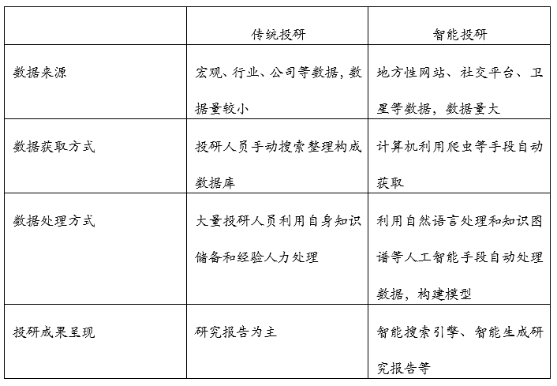

# 智能投研

## 定义

在基础的金融数据基础上，通过深度学习、自然语音处理等等人工智能算法，对数据、时间和结论信息进行**自动分析处理**，为金融机构从业人员提供辅助，以提高行业工作效率。[1]

## 需求

随着互联网的普及，我们已身处信息爆炸时代，投研业务面临数据量过大、数据渠道过多、数据结构多样、数据真假难辨等突出问题，这些问题单靠传统的投研处理方法和手段已很难胜任或很难长期胜任，急需利器。

投研作为投资业务链条的一环，交易、风控等都在快速智能化发展，投研同样需要变革；保持分析的客观性是投研工作的基本要求，借助现代科技手段，既可以提高各类投研工作的效率，又可以**弥补人类主观情绪**的干扰。

## 传统投研 VS 智能投研

## 基本流程

1. 数据获取（金融数据、另类数据）
1. 数据处理（结构化、模块化、建立联系）--模式化、标准化的工作
1. 数据分析（建立公司、关键股东等动态知识图谱[3]）
1. 观点输出（**输出观点**、分析结果）--**核心价值**

## 智能投研 VS 智能投顾

- 智能投顾主要是将人工智能辅助引入投顾业务。智能投顾更加偏向于站在客户立场上为客户提供资产配置建议，对客户资金配置到股票、债券、基金等品种上的份额提供合理建议，收取咨询服务费，主要面向C端客户
- 智能投研则是将人工智能引入投研业务中。智能投研更加偏向于辅助资产管理，服务于金融机构的投研人员，主要面向B端。

## 智能投研产业链

上游数据源与数据采集、中游数据处理、下游为各类用户。

TODO:[1]

## 不是替代，而是辅助

智能投研不是替代投研人员，更无法替代资深的投研人员。毕竟很多信息还需要现场调研获取和确认，分析模型、逻辑也需要逐步完善，服务于基金经理、交易员的有灵魂的报告还离不开人去加工润色。如果非要说替代，那替代的首先是价值含量低的工作，比如当前很多公司临时聘用实习生来做的数据收集、处理、分析等工作；其次是那些没有掌握智能投研利器的从业人员。

智能投研在可预见的将来仍将以做辅助工作为主，投研的核心是**优秀的投研人员输出观点**，根据有效市场理论，正是因为不同投研人员的预期不同，所以才能为客户赚取超额收益，从而跑赢市场。

## 更多

http://gb.oversea.cnki.net/KCMS/detail/detail.aspx?filename=1020099658.nh&dbcode=CMFD&dbname=CMFDREF

[1]: https://www.weiyangx.com/362573.html
[2]: http://www.tr-ai.net/
[3]: https://zhuanlan.zhihu.com/p/46750171
[4]:
