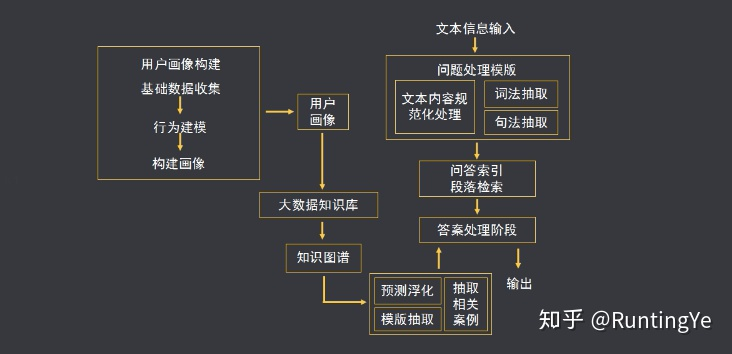

# 智能客服

智能客户服务解决方案使用我们获奖的人工智能技术，帮助金融机构提高客户服务功能的质量和便利性，同时利用该技术提高效率和减少人员需求。能够7*24机器人客服全天候实时响应客户咨询，并在与客户交互的过程中，通过收集客户反馈，不断训练优化算法，为客户提供更高效的解决方案，降低企业运营成本。[3]AI技术应用程序使金融机构客户能够取代纸张和人力密集型的流程和传统基础设施。所有垂直行业的金融机构均可在其客户服务职能中使用该解决方案的模块。

客服机器人依据媒体类型分为两种，基于电话语音，基于文本信息。前者如10086的自助语音服务；后者一般是置于应用中，能解决简单而又大量重复问题，以节约成本，如淘宝的小蜜、万象，直播APP里的客服助手等。

从输入方式来看有：语音输入和文字输入，技术上的区别是语音输入要做语音识别，将语音信号转换成文字。目前客服机器人主要是两者都支持。

从输出方式来看有：文字输出、图像输出、语音输出。这个类型视业务需求、产品场景所决定。目前客服机器人主要是文字输出，一般基于用户画像预测问题、热门问题前置等。[2]

智能客服、聊天机器人的应用和架构、算法分享和介绍[1]

优点：成本低，服务时间长，服务质量高，服务质量稳定

## 如何实现：构建知识图谱

常用的问题 + 优秀的客服如何进行回答——> 构建行业知识词典——>设计成为一问一答的形式

及时进行错误反馈：

1. 有问题没有进行回答——>构建新的行业词典
1. 算法专家进行：文本相似的进行提高

基础数据手机——> 建立模型——>建立用户画像[5]

现在AI客服越来越多，人工客服未来会失业吗？
https://www.zhihu.com/question/386541719/answer/1144143846

浦发和百度、中国移动启动“数字人”计划，希望为每个用户和客户 提供一对一的、个人的数字虚拟金融助理，不仅管理个人的金融资产、账户，更 重要的是还能够主动对资金活动、资产配置、消费行为提供建议。

[1]: https://github.com/chatopera/chatbot.catalog.customer-service
[2]: https://mp.weixin.qq.com/s/hdmV5bHbMqyIB7E3A0Igrw
[3]: https://www.sohu.com/a/393727642_676545
[4]: https://zhuanlan.zhihu.com/p/250482456
[5]: https://zhuanlan.zhihu.com/p/250482456
