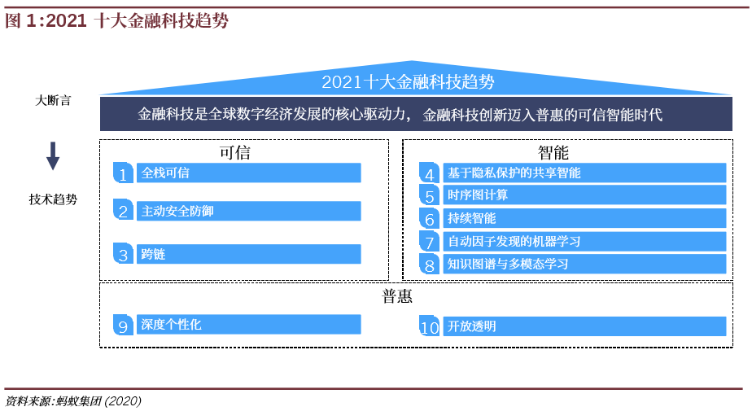

# 金融科技（FinTech）
:label:`FinTech`

## 定义

金融科技是指一群企业运用科技手段使得金融服务变得更有效率，因而形成的一种经济产业。[1]

即金融科技本质上是一种金融创新，由技术驱动，却不等于技术。既然是金融创新，必然要受金融监管。

这些年，随着互金巨头转型金融科技公司，策略重点从金融产品转向科技输出。银行业成立金融科技子公司，把科技输出职能独立出来；大的互金巨头，也在刻意区分业务板块和科技板块。科技赋能于金融，也隐隐有了科技独立于金融之意。

央行对金融科技定义的选择和强调，等于向市场重申：金融科技，本质上是一种金融创新，**在监管射程之内。**[9]

## 背景

1. 金融科技的生态是三个相互牵制的部分：

公司/银行——监管——资本

2. 金融科技发展：

- 20世纪70年代 业务电子化
- 20世纪80年代 前台电子化（ATM机等）
- 20世纪90年代 金融业务互联网化（实现了高效连接）
- 21世纪 金融科技

3. 中国金融科技发展

IT系统——支付——信贷——大金融——生活

![应用场景[2]](../img/AI_finance.png)
行业领域：金融支付、借贷、众筹、零售银行、财富管理、征信、保险

![智能金融[3]](../img/finance_AI.jpg)

传统金融vs科技金融：在业务和渠道上传统金融无法同时解决成本和效率问题；科技金融有效匹配普惠金融的需求，脱媒、去中心化和定制化个性化，草根金融。

## 企业
## PEST

### 政策

2019年8月份，我国金融科技领域第一份科学、全面的规划《金融科技（FinTech）发展规划（2019-2021年）》由人民银行正式发布，规划中明确提出了未来三年金融科技工作的指导思想、基本原则、发展目标、重点任务和保障措施。尤其是建立健全我国金融科技的“四梁八柱”，确定未来三年六方面的重点任务，为金融科技发展指明了方向和路径。[4]

### 技术

《金融科技2020技术应用及趋势报告》：http://www.cbdio.com/BigData/2021-03/29/content_6163778.htm

### FinTech1.0时代

《2018亚太金融科技概览》中所指出金融科技的早期阶段(例如网贷、移动支付和智能投顾)对金融服务业的补充性大于颠覆性。

#### 互联网和移动互联网技术

互联网和移动互联网技术使产品在**用户体验**上取得了革命性的提升，金融产品更是如此。利用互联网和移动设备为客户提供线上服务，简化业务流程，优化产品界面，改善用户体验，这一策略在所有的金融科技行业都是适用的。简单来说，互联网和移动互联网技术使得产品不仅仅是界面变得好看，而是产品更加好用。除此之外，互联网及移动互联网技术使金融服务可以低成本便利的抵达用户，为更多创新性服务提供基础，使其得以实现。

#### 大数据技术

在FinTech1.0阶段，大数据技术的主要应用是集中于第一和第二层次，即数据架构和信息整合；初步进入第三层次，进行简单的初步分析和决策。

- 大数据架构+信息整合。建立一个收集和存储的大数据系统，加之信息整合和数据计算；
- 人工建模+大数据。该阶段的大数据分析通常依靠人工建模分析，加之由于传统数据分析模型对于多维度、多形态的数据存在不适用的情况，因此该类技术应用仅仅是大数据分析的初级阶段。

### FinTech 2.0 时代

金融科技的ABCD”技术,即人工智能(AI)、区块链(Blockchain)、云计算(Cloud Computing)和大数据(Big Data)等新技术可能会令金融服务行业发生重大转变。[11]

#### 人工智能(AI)要点

- 概念：对人的意识、思维的信息过程的模拟
- 技术：基础层（大数据、云计算、智能芯片、传感器及智能硬件）、技术层（语音识别、图像识别、生物特征识别、机器学习、知识图谱、自然语言处理）和应用层（计算智能、感知智能和认知智能）
- 商业模式：生态构建者、技术算法驱动者、应用聚焦者、垂直领域先行者和基础设施提供者
- 应用场景：有智能投顾（理财魔方）、征信、风控（启信宝）、金融搜索引擎（融360）、身份验证（Face++、商汤科技）和智能客服（智齿客服）

#### 区块链(Blockchain)要点：

- 概念（分布式记账原理，去中心化，共识机制，完整分布式不可篡改的账本数据库）
- 技术（P2P、密码学、共识机制）
- 核心技术：共识机制（POW，POS，DPOS）
- POW：非对称加密，花费很大算力完成数学难题，获得记账权限，其他节点轻松验证（难求解、易验证），篡改需51%算力
- POS：出问题时，持币越多损失越大作弊动机越小，给予更多记账权限，但每一次记账后减小下一次记账概率，没有记账则增加记账概率
- DPOS：先选出代表性节点，再从中选一个记录，其他负责核对
- 基础架构：区块、区块头、创始区块、区块分叉
- 网络架构：公有链、联盟链、私有链
- 主要特点：去中心化（P2P传输，密码学，单节点出现问题无影响），不可篡改（篡改会出现分支，且需要51%算力），加密安全性（非对称密钥，公钥加密私钥解密）
- 商业模式：加密电子货币（电子钱包）、传统金融网络（零售银行）、金融服务区块链（金融基础设施&API）、分布式总账（智能合约）
- 智能合约：数据层，网络层，共识层，应用层
- 应用场景：数字货币（法定/非法定），支付与清算（跨境支付与清算/银行间清算/OTC清算），金融资产发行与交易（区域股权市场股票发行/金融资产交易/票据交易）
- 应用标准（深交所）：有无中心点？存在互联互通需要？存在增信需要？（一级市场证券发行）存在代码化可能？（金融衍生品），区域股权市场（4个标准全满足）[5]

#### 云计算(Cloud Computing)要点：

- 概念（按需访问和付费，可配置的计算资源共享池）
- 三种模式（IaaS网络/硬件/存储/管理程序+PaaS虚拟机操作系统+SaaS中间件/应用程序）
- 四种部署（公有云/私有云/社区云/混合云）
- 六种技术（IaaS硬件Amazon EC2、编程模型MapReduce、海量数据分布式存储HDFS/Hive、海量数据管理HBase、虚拟化技术VMWare、云平台管理OpenStack）
- 商业模式：大公司提供云支持构建云生态，小公司弹性快速的云端业务部署
- 商业模式：前端（销售，交易前事务，交易中事务），中端（交易服务，交易进程处理），后端（清算/结算，结算后事务）
- 应用场景：数据管理、合规&控制

#### 大数据(Big Data)要点：

- 概念（规模、速度、种类）
- 技术（数据采集、数据存储、数据清洗、数据挖掘、数据可视化）
- 商业模式（TAAS模式、分成模式、内部生态模式）
- 应用场景（个人和企业用户画像，征信/授信评级/风控：围绕借贷环节的贷前评估、贷中监控和贷后反馈、保险定价：车险及运费险）

## 知名企业

包括兴业银行、招商银行、光大银行、民生银行、华夏银行、北京银行、建行、工行、中行等都先后成立了金融科技子公司，围绕金融科技的各相关前瞻技术，开始了各种落地探索研究。[4]

[中国领先金融科技企业50](https://assets.kpmg/content/dam/kpmg/cn/pdf/zh/2021/01/china-fintech-50.pdf)

## 行业上下游

下游有TO C厂商、上游有数据提供商、中间还有平台解决方案提供商。[13]

## 2021十大趋势 [6]

## 基本原则

- 守正创新。正确把握金融科技的核心和本质，忠实履行金融的天职和使命，以服务实体经济为宗旨，在遵照法律法规和监管政策前提下，借助现代科技手段提升金融服务效能和管理水平，将科技应用能力内化为金融竞争力，确保金融科技应用不偏离正确方向，使创新成果更具生命力。
- 安全可控。牢固树立安全发展理念，把安全作为金融科技创新不可逾越的红线，以创新促发展，以安全保发展，借助现代科技成果提升金融风险防控和金融监管效能，完善金融安全防线和风险应急处置机制，提高金融体系抵御风险能力，守住不发生系统性金融风险的底线。
- 普惠民生。立足广大人民群众美好生活需要，聚焦优化金融服务模式和丰富金融产品供给，充分发挥科技成果在拓展服务渠道、扩大服务覆盖面等方面的作用，推动金融服务“无处不在、无微不至”，为市场主体和人民群众提供更便捷、更普惠、更优质的金融产品与服务。
- 开放共赢。以促进金融开放为基调，深化金融科技对外合作，加强跨地区、跨部门、跨层级数据资源融合应用，推动金融与民生服务系统互联互通，将金融服务无缝融入实体经济各领域，打破服务门槛和壁垒，拓宽生态边界，形成特色鲜明、布局合理、包容开放、互利共赢的发展格局。

## 中美对比 [10]

**美国传统金融体系成熟，FinTech更多扮演“补充”角色**

由于美国成熟的金融服务体系，相比“颠覆”银行等传统机构，FinTech公司更多的是寻求与之合作。未被传统金融服务覆盖的客户或市场缝隙，由FinTech企业来补充，其角色更多的是“提高某已有业务的效率”。

反观中国，金融服务供给的不足，部分监管环境的模糊地带给金融科技类公司制造了发展条件。模式创新、普惠金融等在中国的发展十分之迅速。近年来P2P的迅猛发展正说明该问题：大量未被传统借贷服务覆盖的中小企业和个人，通过P2P平台可以获得融资，解决短期的资金缺口。

### 征 信

在征信领域，美国起步早, 征信体系自1920年起伴随消费企业的扩张而推进，征信公司数量曾从2000多家减少到500家，行业经历了充分竞争，机构征信和个人征信体系趋于完善成熟。中国起步晚，线下数据被银行与保险公司垄断割据，线上数据随着互联网的普及而完善，目前数据量庞大但发展历程短暂，征信模型仍待完善。从大数据征信模型算法的成熟度来看，我国虽与美国存在一定的差距，但数据的快速迭代为算法的优化提供了很好的环境。伴随大数据时代的到来，征信数据的应用场景更加丰富，不仅仅用于信贷，更可以满足社交、消费等方面的需求。而这方面的探索尚在起步阶段，国外企业也尚未经历大数据征信的迭代验证。因而从这个角度来讲，美国和我国几乎是站在同一起跑线上的。

### 借 贷

在美国，真正意义上的P2P借贷（即个人对个人的借贷）公司只有Lending Club和Prosper。其他平台需要投资者不仅仅是高净值个人，而是需要其为具备投资资质的个人，即机构投资者、专业投资者等。而国内的P2P平台则是面向大众的理财工具。

#### 借贷领域  个人理财

如上所述，美国传统金融服务完备，因此大多数中产阶级的理财服务是由传统银行和资产管理公司、投资顾问公司提供的。近年来，智能投顾平台（自动化投资平台）的兴起，如Betterment、Wealthfront，其主要服务对象是年轻人群，是未来的中产阶级。相比而言，国内投资者对于智能投顾公司的接受度仍不高。其背后原因是中美投资者不同的投资理念和不同的金融市场环境。智能投顾平台提供的服务是一种消极投资，是长期投资。投资目标是长期（10年以上）,使得投资收益与市场持平，这需要投资者具有比较成熟的长期投资理念。国内资本市场有效性不高，投资者散户化程度高，更偏好主动投资和短期投资。

### 保 险

在美国，保险行业的发展是极为发达的。个人保险（如健康险、寿险），财产险（如房产保险、车险）以及企业保险已经成为美国人民生活中的一部分。同时，保险行业的进入门槛非常高，因此保险行业的金融创新也并不火热。相比之下，我国对保险行业的监管也同样严格，牌照被少量国有控股公司垄断。在既有利润丰厚的情况下，公司的创新意识和信息化动力均较低；同时，我国居民保险意识弱，对保险产品很少主动询问或投保。可见，我国保险行业在与科技融合的过程中仍处于非常早期的阶段，目前重点发力在用户体验优化。

### 第三方支付

最早出现的第三方支付平台早在1999年已创立，为美国的Paypal，5年之后阿里巴巴的支付宝业务才推出。在美国，由于美国的信用卡体系已经相对完善，用户体验的提升难度较高，第三方支付作为信用卡支付的替代品，渗透率的增长并不高。另一方面，第三方支付高度依赖互联网平台，即支付的应用场景，而美国电子商务的普及率与中国相比较低，第三方支付应用场景受限。截止目前，中国已成为世界上第三方支付市场份额最重的国家，而支付宝的交易金额也远超第三方支付鼻祖Paypal。

第三方支付高度依赖互联网平台，影响该行业发展的主要因素有：其他支付方式的便利性与安全性、电商的发展。

## 监管

北京威诺律师事务所合伙人、清华大学研究生导师杨兆全在接受雷达财经采访时表示：“蚂蚁集团上市被叫停，紧随其后，监管部门出台了若干监管规定。以此为标志，我国对金融科技公司的监管进入新的时代。从放任发展转变到到规范发展，从普通行业监管转变到金融行业监管。金融科技企业必须依法、合规、持牌经营。限制野蛮生长，反对垄断，打击不正当竞争，服务实体经济等，会成为金融监管的主导思想。”

## 职业转型

成为懂AI的PM或商业人才。商业和产品的sense以及人脉是需要在行业中浸淫多年才能得到的，同时还需要懂得技术的边界，并且技术的壁垒，其实远没有想象得那么高。

辅修有关科技、编程语言的第二专业，对于科技大环境有所了解，至少当一个IT出身的同事和你交流时，能顺畅地使用专业术语。[14]
## 更多

- 未央网：https://www.weiyangx.com/
- 雷锋网：https://www.leiphone.com/category/fintech
- 招聘信息[7]
- 2021-2026年中国科技金融服务深度调研与投资战略规划分析报告：https://bg.qianzhan.com/report/detail/ef46bc12e785401b.html
- 中国科技金融促进会简报：http://www.cstf.org.cn/news.asp?types=36
- 颖投信息科技有限公司：https://www.miotech.com/zh-CN
- 金融科技2020年回顾与2021年展望：https://www.jrwenku.com/41159.html
- 金融科技硏究报告精选：https://www.jrwenku.com/21331.html
- 中国信通院发布《中国金融科技生态白皮书（2020年）》：http://www.caict.ac.cn/kxyj/qwfb/bps/202009/t20200918_347039.htm
- 《CF40中国智能金融发展报告2020》发布，首次以指数勾勒中国智能金融发展图谱 - 金融四十人论坛的文章 - 知乎
https://zhuanlan.zhihu.com/p/406133417
- 魏然：“非主流”金融科技探索者 | 开学季 · 2021级新生故事：http://fmba.pbcsf.tsinghua.edu.cn/index.php?m=content&c=index&a=lists&catid=42
- 艾瑞咨询：2020年中国金融科技行业发展研究报告（附下载）:http://www.199it.com/archives/1156070.html
- 扒一扒「清华系」的金融科技大佬们丨110 周年校庆 - 雷锋网的文章 - 知乎
https://zhuanlan.zhihu.com/p/368105496

[1]: https://zh.wikipedia.org/wiki/%E9%87%91%E8%9E%8D%E7%A7%91%E6%8A%80
[2]: https://www.donews.com/news/detail/4/3084506.html
[3]: https://weread.qq.com/web/reader/e77325105e4e55e77af47dbk45c322601945c48cce2e120
[4]: https://www.weiyangx.com/378231.html
[5]: https://www.jianshu.com/p/6c76d2aad3f3
[6]: https://gw.alipayobjects.com/os/bmw-prod/6f1e0b5c-e068-49a6-bc0a-90d5e9131a72.pdf
[7]: https://youwuqiong.com/jinrong-caijing/%E5%BF%83%E5%8A%A8%E7%9A%84offer%E9%87%91%E8%9E%8D%E4%B8%8E%E7%A7%91%E6%8A%80%E6%8B%9B%E8%81%98%E4%BF%A1%E6%81%AF%E5%8F%8C%E5%91%A8%E6%8A%A5%EF%BC%88%E7%AC%AC6%E6%9C%9F%EF%BC%89/
[8]: https://zhuanlan.zhihu.com/p/95973677
[9]: http://www.woshipm.com/it/2781155.html
[10]: http://www.cstf.org.cn/newsdetail.asp?types=36&num=1165
[11]: https://www.cfainstitute.org/-/media/documents/survey/cfa-institute-ai-pioneer-report-zh-cn.ashx
[12]: https://posts.careerengine.us/p/6071aa582b8d107d7964c3cc?from=latest-posts-panel&type=title
[13]: http://www.marsaspect.com/mars/XGJcXF8%3D
[14]: https://www.zhihu.com/question/41187047/answer/168114502
