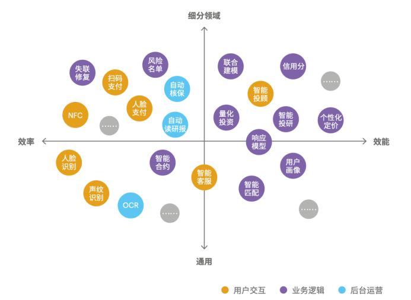

# AI金融
:label:`chap_dive`
​
![AI金融[^1]](../img/AI+Finance.png)
![AI金融[^2]](../img/AI+Finance2.png)



推动智能金融应用示范。围绕“互联网+”战略在金融领域实施过程中的新问题和新需求，基于全息金融大数据，构建符合我国国情的宏观金融决策模型，突破金融内在的发展规律与外在社会环境之间的约束；基于银行、证券、网络等金融数据，利用深度学习等核心智能技术进行挖掘与分析，构建基于行业与领域的复杂金融指令模型；基于金融大数据的空间属性、时间属性及个体行为属性，利用知识图谱、推理计算等模型，准确实现金融风险防控、信用评估、态势演化等。[^3]

```toc
:maxdepth: 2

Finance
FinTech
AI_Finance
Invest
Robo-Advisor
AI_Investment_Research
AI_Risk_Management
AI_customer_service
RPA
MarTech
Full_stack
AI_safety
quant
Company
```

[^1]: https://www.iimedia.cn/c1020/77214.html
[^2]: https://www.donews.com/news/detail/4/3084506.html
[^3]: http://www.moe.gov.cn/srcsite/A16/s7062/201804/t20180410_332722.html
