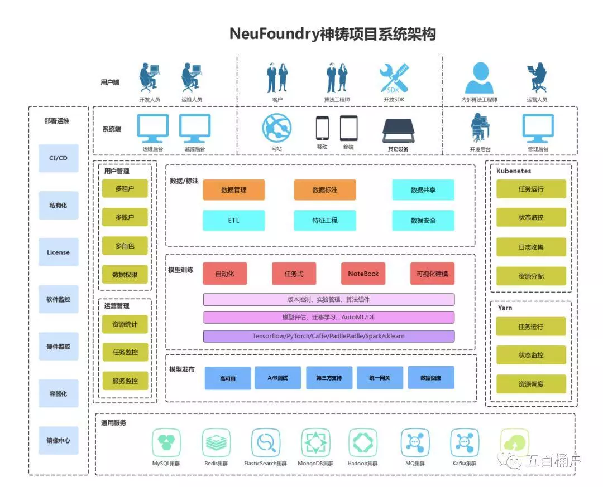

# 京东

## 京东物流

因为刘强东不惜重金打造的自建仓储物流，现在周围的人都在说京东今天买的，明天就能到。如果说马云爸爸开启了网购时代，刘强东则是优化了用户体验。也许正是刘强东一直坚信用户体验决定一切，才有了京东的今天。[6]

## 京东商城

在京东商城之前，我们所知的主要商城就只是国美和苏宁，而京东商城推出之后，我们购买3C电子产品可能主要都只会在京东上面购买了。似乎，一夜之间，国美苏宁的线下门店都变成了体验店，我们会去线下摸摸手感确定型号，然后跑到线上的京东商城去下单。

为什么？因为京东的价格比其他零售商都便宜。因此，2013年起，苏宁开始大量关掉价值不大的一些门店，另外也开始了线上线下价格一体化的策略，但是它的利润率也开始下跌。然后，传统零售行业的头部企业开始被互联网巨头陆续收购或投资，“新零售”的概念被炒作了起来。关于“新零售”，后续我会专门聊聊，这里就不再赘述。

## 京东与支付宝

与阿里更早确立竞争关系的京东，早在2011年就取消了支付宝支付。当时刘强东也表示，支付宝手续费太高。 [2]

在当时，这个理由其实是不成立的：

尽管70%的用户在京东购物是选择货到付款，但采用货到付款方式成本要更高。

目前京东采用的是交通银行的移动POS收款，其费率是千分之三，但由于京东采用的自建物流与收款人员，每笔收款的成本要再加上3-5元(包括人力成本及其他费用)，这还不包括系统建设费用。如果按照最高估计即京东的客单价1000元来计算，货到付款的单笔成本至少为千分之六到八，几乎是使用支付宝的费用的一倍。[4]

那既然使用支付宝还能“省钱”，为什么京东还是依然决然的放弃支付宝呢？

- 数据层面：商业数据，尤其是财务数据，是一家公司最为核心的数据，谁都不愿意有很大一部分数据暴露给别人，比如品类数据，支付率，客单价，退款率等重点等交易数据，再加上这个别人还是个竞争对手。
- 战略层面：为了打造自己的金融体系，京东拒绝支付宝后，京东钱包，京东白条这些业务也冒了出来。[5]

而近日恒大研究院在《中国独角兽报告：2020》中指出，蚂蚁金服以1500亿美元估值位居全球第一。京东数科估值也已过千亿。[3]

## 京东金融

http://jr.jd.com/

## 京东科技

京东集团已整合原京东数字科技、原京东云与AI事业部为京东科技子集团。即日起，原京东数科、京东智联云品牌不再适用，统一品牌为京东科技，京东科技现已成为整个京东集团对外提供技术服务的核心输出平台。

产品简介

机器学习平台AI基于海量的数据及强劲的计算资源，搭载Sklearn、XGBoost等主流机器学习框架；支持Python、PySpark等多种语言，提供从模型开发到部署的一站式服务；高效的资源利用率，内核级的虚拟化，秒级启停；容器对资源需求少，单台物理机可以同时运行数千个容器；利用k8s对docker进行编排调度，实现对服务器资源管理、调度、动态扩/缩容。

https://www.jddglobal.com/products/machine-learn

京东科技开发者：https://developer.jdcloud.com/article/1636

## 人工智能事业部

2018年财富世界500强，京东位列181位，互联网公司排名第三。2014年5月，京东集团在美国纳斯达克证券交易所正式挂牌上市，是中国第一个成功赴美上市的大型综合型电商平台。“人工智能引领美好生活”，京东人工智能持续探索前沿科技，聚焦商业应用落地，加速释放科技的商业价值。在语音与声学、计算机视觉、机器学习、知识图谱、语义、对话6个技术领域不断深耕，拓展AI技术的边界，并通过京东人工智能开放平台（http://neuhub.jd.com）全面开放给行业合作伙伴，共赢生态。在市政、零售、客服、医疗等领域持续打造规模化应用落地，京东人工智能持续探索AI商业创新模式和价值，与实体经济相融合，释放AI真正的产业和社会价值。

NeuFoundry基础设施层采用Docker容器进行算力资源的池化，通过Kubernetes进行整体的资源管理、资源分配、任务运行、状态监控等，平台集成了MySQL、Redis、MQ等多种中间件服务，通过数据标注、模型训练、模型发布，生成自定义的AI能力，为各行各业的业务服务提供有力的支撑。[7]

## 京东人工智能开放平台

https://neuhub.jd.com/ai/api/image/render_image

## 京东数科

1月11日，京东集团就宣布将云与AI业务与京东数科整合后，正式成立京东科技子集团，原京东数科CEO李娅云出任京东科技子集团CEO。

对于这个整合的意义，京东在公告中表示，通过此次交易，京东将继续专注于其核心竞争力和协同业务，京东数科将更有利于为业务合作伙伴提供一系列尖端技术服务。

2017年-2020年上半年，京东数科从白条产品获取的收入分别为14.73亿元、27.34亿元、32.10亿元和17.94亿元。

京东金条则是一款数字化无抵押的短期消费信贷产品。2017年-2020年上半年，京东金条的贷款规模分别为1036.85亿元、2554.92亿元、4589.15亿元和2612.17亿元，近三年复合增长率为110.38％。

除此之外，京东数科还有小微信贷产品包括京保贝、京小贷、京采等，但未透露具体业务规模。如果加上帮助金融机构发放信用卡和保险业务，围绕金融相关的业务已经超过总营收的50％。[9]

https://www.zhihu.com/org/jing-dong-jin-rong-27

请问京东数科算大厂吗？ - 京东科技的回答 - 知乎
https://www.zhihu.com/question/397630446/answer/1519858670

## 近况

2021年1月，京东金融平台宣布已经下架了所有银行存款产品，2020年12月，支付宝、京东金融、滴滴金融等互联网金融平台先后下架对新用户的互联网存款产品。2021年1月，应监管要求，老客户也无法购买互联网平台的存款产品了，产品做了下架处理。[8]

## 投资

京东投资的公司：https://www.itjuzi.com/jingdong

## github
https://air.jd.com/
https://github.com/JDAI-CV

[1]: https://www.cnblogs.com/edisonchou/p/why_jiang_wei_da_ji_from_internet_industry.html
[2]: https://www.linkedin.com/news/story/%E7%BE%8E%E5%9B%A2%E4%B8%8E%E6%94%AF%E4%BB%98%E5%AE%9D%E5%88%86%E9%81%93%E6%89%AC%E9%95%B3-4900980/?originalSubdomain=cn
[3]: https://finance.sina.com.cn/money/bank/bank_hydt/2020-06-16/doc-iircuyvi8701006.shtml
[4]: http://tech.sina.com.cn/i/2011-08-25/23375981397.shtml
[5]: https://www.zhihu.com/question/410767563/answer/1373298846
[6]: http://www.woshipm.com/zhichang/807191.html
[7]: http://www.woshipm.com/ai/3320134.html
[8]: https://www.baike.com/wikiid/5026927798799303826?prd=mobile&view_id=whwnnpeel3400
[9]: https://posts.careerengine.us/p/6071aa582b8d107d7964c3cc?from=latest-posts-panel&type=title
