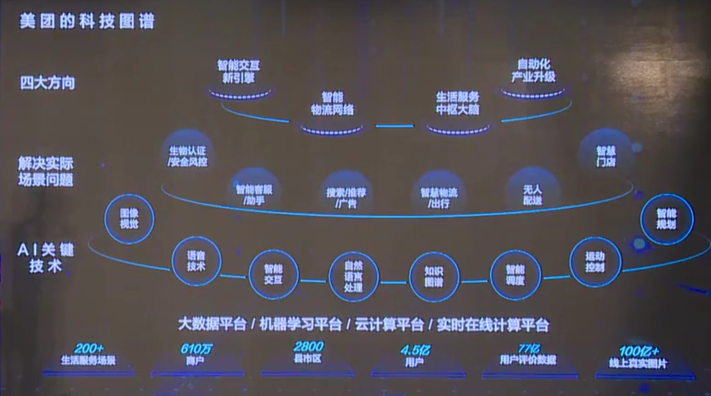
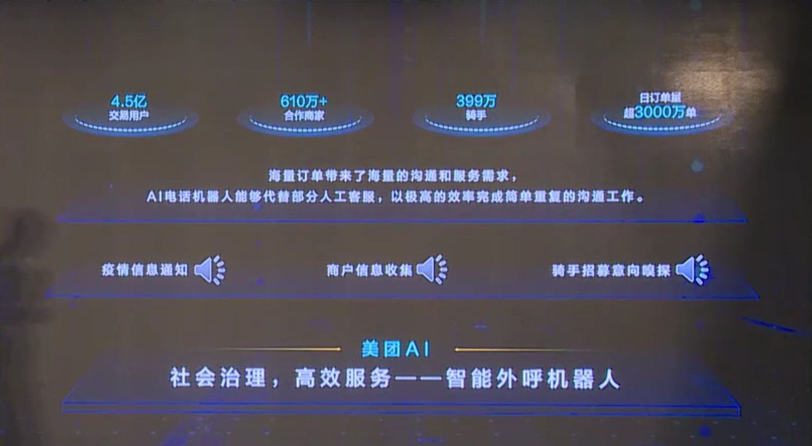
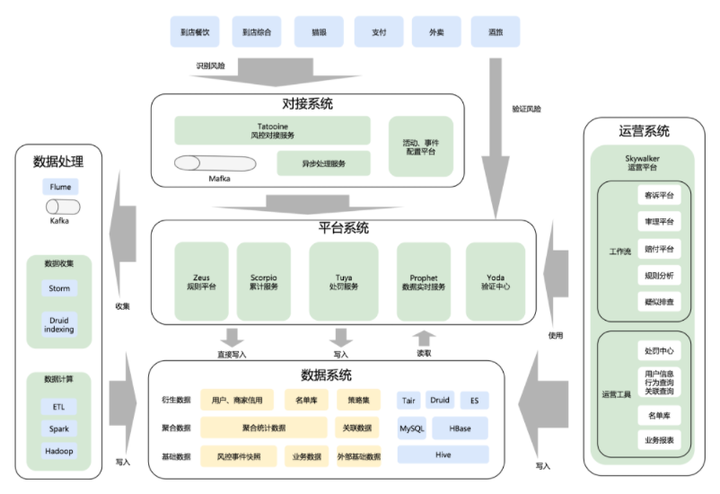

# 美团

## 存在问题

购买的时候发现抵用券界面没可用红包，不能直接购买，还要退去美团会员的界面。。应该在抵用券界面增加购买加量包的方式。

## 定位

最好的服务业电商。口号：「吃喝玩乐，尽在美团」

价值观的排序是：“消费者第一，商家第二，员工第三，股东第四，王兴第五”。

这个事情注定是一个高品质、低价格、低毛利的事情，我们需要在各个环节通过每个人的努力，通过整个结构的调整，通过管理的提升，通过产品技术的革新，不断地去提高效率、降低成本，给消费者提供更高品质、更低价格的服务。

人是美团最重要的产品，也是美团最大的资产。因为我们并不拥有厂房、仓储物流中心或大规模的固定资产，我们所有的资产就是人。

靠两条腿跑出来的市场，通常是最牢靠的。“细分深挖”能够释放的力量超乎想象。钱要用在刀刃上。面向商家的品牌广告是无效的，在商家端再多的广告投放都不如有执行力的线下队伍。而面向消费者端，线上广告性价比远大于线下广告。

那是一个未知的领域，我们有很多前辈的经验和教训，我们应该充分利用这些经验教训，达到我们的目标，也去开拓一片没有人开拓过的领域，那就是本地电子商务。

我们相信商品的电子商务和服务的电子商务最终规模是差不多的，因为都非常非常大，大家每个人，全国那么多人花的钱，一部分花在实体商品上，一部分花在服务上，它的最后规模都是上万亿。现在我们只做了14.5亿，所以大概是千分之一，这还是非常非常初级的，前面还有无尽的空间等待我们去开拓，我们同样面临一个目标，要去做本地电子商务。

我想大的目标大家也知道，就是我们专注于本地电子商务，利用互联网去帮本地的商业或者帮本地的商家上网，让消费者能够放心地吃喝玩乐。这是一个很容易理解的事情，但是很大，要去细分很多。

美团市值稳坐万亿，从早期的团购网站已经发展成一个集外卖、酒店、旅游、出行、新零售一体的庞然大物，再造一个商城业务，十分顺其自然。[13]

## 竞品

现在美团渐渐开始做电商了，全国几百万的配送骑手，如果买衣服，买鞋子等可以像外卖一样短时间送货上门，那就不是单单饿了么的事了，等于是动摇了阿里的根基。[19]

今年3月，蚂蚁集团CEO胡晓明宣布支付宝升级为数字生活开放平台，这和美团的定位“本地服务电商平台”有着一定程度上的正面冲突。[20]

业务碰撞却屡屡出现：

- 2015年6月阿里与蚂蚁集团联合出资成立了一家本地生活服务平台公司 ——“口碑”，这直接与美团业务产生冲突；
- 10月，美团和大众点评合并，美团点评在2016年1月中旬向媒体透露称，已完成33亿美元融资，其中腾讯出资了近10亿美元；
- 2016年1月底，阿里执行副主席蔡崇信表示，将增加对口碑的资源投入，“退出美团也就是时间上的问题”；
- 2018年，阿里联合蚂蚁集团斥资95亿美元全资收购饿了么，后者不仅是美团在外面领域的最大对手，还在不断和美团进行新的竞争；
- 7月份，饿了么宣布升级，从送外卖到送万物、送服务，饿了么CEO王磊表示，“送万物”的内涵正在被不断拓展，商品和服务都可以外卖到家。这与美团2018年7月上线的美团闪购业务有一定重合，采用快零售的业务模式，为用户搭建一个30分钟到货的生活卖场，该品牌即是整合了除餐饮之外的品类。

两者在生鲜电商、酒旅、出行、金融等多个行业，多面碰撞：[20]

- 阿里大力发展盒马鲜生，美团推出小象生鲜、上线买菜业务；
- 阿里用飞猪布局旅游业，而美团也在发展到店、酒店及旅游业务；
- 美团点评此前收购摩拜单车，阿里重金投资哈啰出行，目前，共享单车市场，滴滴青桔单车、美团单车、哈啰出行三足鼎立；
- 网约车市场，美团打车与高德打车均为聚合模式；
- 今年5月份，美团信用支付产品“美团月付”正式上线，而在这背后，美团旗下已有“银行+第三方支付+小贷+保险”四块牌照，且已向用户提供小额贷款、信用支付等服务。

## 历史

美团网又帮KTV设计生日套餐，吸引过生日的人呼朋唤友过来，带来人流，也有很多消费者感到满意，进行再次消费。他们也抓紧对电影院的进攻，而当时拉手网忽视了这一块。为什么呢？因为拉手网花了很多钱做推广，对毛利的要求高，而做电影院毛利低，一张电影票带来的毛利也就5角、1元的。

在电影院、KTV、烘焙店这三个领域做起来之后，美团网在东莞打开了局面，2011年3月，美团网东莞站反超拉手网，之后也没有被拉手网夺回优势。

## 财报

根据财报来看，2020年第四季度美团新业务的亏损也从去年同期的11亿元扩大至60亿元，直接导致四季度净亏损22.4亿元。而其新业务之一便是当下最火的社区团购，自美团第三季度大力投入社区团购后，其烧钱速度就不断在加快。[27]

## 夏华夏报告

尊敬的吴院士，各位嘉宾，各位现场的朋友和云端的朋友们，大家中午好。今天我为大家带来美团AI未来城市生活的基础设施。我是在美团负责**人工智能平台服务**，我们坚信人工智能不应该仅仅是在电脑里的数据或者是在云端的一些算法，它更应该跟我们现实生活中的每一个人产生一些真实的温暖连接，帮助我们在真实的物理世界变的更加美好，这是为什么我们讲未来城市生活的原因。 [1]

我引用德勤在报告当中的一句话，它说城市其实是人工智能技术创新的一个综合性载体，也是人类与AI技术产生全面感知的一个集中体验地。如果做智慧城市的话，对一个生活服务的闭环是有特别高的要求，因为用户在真实的物理生活中要**吃、穿、住、行，包括购物、旅游、娱乐**，整个服务如果形成闭环，那整个的数据，用户生活的很多数据就会构成一个全面的示图，帮助我们更好理解这个用户，更好为用户服务。幸运的是，美团点评刚好有这个闭环的服务，我们**把4.5亿的消费者和600多万商家集中在一个超级平台上**，一边为用户提供吃、穿、住、行、乐的各种服务，一边为商家提供很多支撑他们发展的经营、决策的服务。在这个闭环形成之后，我们认为我们可以用人工智能技术去帮助我们更好的做线下经济的数字化。

我们做人工智能技术的优势是什么呢？因为我们有特别丰富的场景，刚才说我们有大概200多种不同的服务，cover线下生活的各种方面，有这么多场景之后会产生大量的数据，我们用这些大量数据反过来可以帮助我们人工智能算法不断迭代、优化。这些算法再闭环过来帮助我们用户在场景中更好得到一些服务。所以美团做人工智能是由场景来驱动我们不断迭代的。

这也是我们第一次对外公开发布我们一个全景美团人工智能的科技图谱。因为美团刚才说我们有特别多的服务场景，有大量的商家，大量的用户，会产生很多各种各样的数据，基于这些数据我们会结合很多种人工智能的技术，包括图像、语音、智能交换自然语言处理、知识图谱包括运动决策规划等等，这些技术结合在一起可以有很多应用，比如说我们做生物安全认证、智能客服、无人配送等等，这些在几个方向，包括智慧交互、物流网络、生活服务大脑和产业的自动化升级方面都可以帮助我们更好的做这个智慧城市。

我们的目标是希望让美团的人工智能成为我们未来生活的一种基础设施，今天着重从四个方面给大家分享一下我们正在做的一些工作，分别是比如说我们怎么给用户做比较好的服务引擎，怎么做产业的升级，社会的治理，以及更远的未来生活的一些可能的产品。先看服务引擎，因为美团的app里面有两百多种不同服务，但是大家打开手机就是一个小小的6寸屏，我们怎么让用户更好的更便捷在6寸屏幕上找到用户所需要的服务，我们背后就有很多人工智能的技术帮助用户去搜索推荐，以及用一些更便捷的方式去找到。

这里给大家一个例子，可以用智能语音交互比较方便的用美团的服务。因为美团有这种非常闭合的，从服务的展示到支付，到最后履约的服务，我们可以为很多，哪怕不会用手机，不会输入文字，比如说一些老人、小孩也可以非常方便智能交互的方式使用美团的服务。当然在服务的背后是一系列我们美团丰富的业态结合起来，并且我们把它兼容到各种不同的硬件载体上，包括手机、车载设备、家具智能音响等等，再结合我们的履约、支付等等一些功能，综合起来可以给用户提供一个非常好的服务体验。

第二个方面，我们给商家也希望给他们非常好的提供服务，因为商户在美团看来也是我们的客户，我们希望用人工智能的技术去帮助商家提高效率，做整个产业的效率升级。怎么升级呢？当我们去深入了解每一个产业的时候，我们发现真正在线下做一个商铺，哪怕只是一个简单的餐馆，它其实涉及的经营决策，涉及的行业知识是非常多的。比如说一开始要选址，在什么地方选，建店之后怎么比较好的经营管理、营销，包括做物流等等。这些专业的知识我们希望用美团AI的各种技术，结合我们大数据，去给商家提供很多各种不同的服务。这里面包括比如说给商家智能的收银系统，它的智慧选址，告诉它周围的商圈都是一种什么样的消费价位，已经有什么样的商家，不同品类的竞争情况是怎样的，让商家可以更好的做经营的决策。

这里面时间关系没有办法一一展开，给大家看一个例子。这是美团大脑，本质上是基于美团海量的数据，经过大数据挖掘之后形成的巨大知识图谱。在这个知识图谱里面，大家看到有很多点，这些实体有可能是商家，有可能是一些关键标签，我们把它连接起来之后，可以形成一个巨大的海量知识。我们现在有千亿量级的知识连接，在这个例子里面展示的是浦江宴，就是会场旁边的一家店它的一些特点，我们可以看到用户对这家店的情感变化曲线，可以看到这家店的口味，它的用户评价，包括周围商家竞争的情况，它的相似商家是什么。通过这样一些数据，可以让商家在经营决策的时候，可以得到很多的反馈，可以帮助商家做更好的经营决策。

刚才讲的是给商家做赋能，我们同时也希望用人工智能的技术去帮助我们整个社会的治理，让整个社会运转的更加高效。我举两个例子，一个是因为今年疫情期间，我们发现很多商户会受疫情的影响，包括我们就业会受到疫情的很多影响。这一页我们会给大家展现我们怎么使用我们智能语音交互的方式，帮助我们去做疫情的通知，做商户的信息收集，做招聘。我们先听第一个例子。

大家听到这个女声，听起来是非常真实的声音，但其实是我们完全用人工智能，是我们的客服机器人合成的。在这个过程中有几个技术挑战，第一个是我要非常准确理解用户说了什么，包括他的背景噪音、方言都要适应。第二，基于用户说的内容，基于我背后的知识库产生我要说什么。第三，我要用尽量接近真实人的声音去把这个声音说出来。因为很多用户一接到电话一听到是机器人的声音，马上挂掉电话，我们还要尽量逼近人的声音。

大家会听到，当我们要收集很多商户信息的时候，因为每个商户根据它的品类不同，我们要收集指定的很多字段的信息，这个其实对于人来打电话是非常繁杂的，现在我们有机器人每天打一百万通的电话，为了收集各种信息，让网上商户的信息更加准确。

第三个例子是我们去招募一些骑手，尤其在疫情期间对就业是非常大的帮助。我们的机器人会根据用户的很多反馈，尤其是当听不清的时候，会再反问确认，这样一种非常接近真人的客服方式，去提供给用户、商户、骑手很多服务。我们也希望未来，比如说明年人工智能大会的时候，这种智能机器人的技术可以帮助我们比如说去通知参会嘉宾，可以有很多的对接。

第二个社会治理的例子，我们也会跟各地政府去合作，因为政府其实对本地生活的很多产业是希望有更精确的了解。比如说每个参与商家卫生情况怎么样，之前食药监、卫生局他们其实并没有管理上的抓手，但是跟美团合作之后，我们会给各地政府提供类似这样的一个政府政务数据大屏，大家可以看到很多疫情期间的复工率是怎样的，各地每个不同的产业现在的发展是什么样子，它各个地区不同的产业热点是什么，包括看某些比如餐饮商家，我们会看到有问题的商家的top10，卫生问题或者是客诉问题的商家是什么，这样就可以给政府治理有更好的抓手。

我们看一下未来生活，我们希望未来还会有更多产品帮助大家体会更好的生活。这是一个示意图，我们相信在未来我们在物理生活的很多设施都会是一个联网的，是一个万物互联。这里面可能有一些是比如说仓库是无人仓，我们通过无人机或者无人车的方式，把无人仓里的货物更多送到用户手上。这已经不是未来，我们已经做了很长时间的技术研发准备，已经在一些地方小规模测试。给大家看三个不同的视频，第一个是无人微仓，当商户想开一个零售店的时候，我们可以用无人微仓的技术把很多货架，很多的智能货架，包括仓内的机器人，用户下单之后，这个订单信息会发到无人微仓，无人微仓会自动做分拣、打包，最后把打包的包裹交给骑手，或者交给我们的无人车和无人机，最后完成配送。

除了让骑手交付之外，我们希望未来可以让美团的无人车来配送，这段视频是展示我们在北京市顺义区，在今年疫情期间部署的几辆无人车，可以把用户在美团买菜下的单用无人车从我们的仓库送到用户所在的小区楼下，用户可以直接下来取。装车之后，车辆会根据自己规划出来的路线，在路上自动行驶，可以识别红绿灯，可以躲避车辆，可以躲避行人。最后到达目的地，用户取餐之后，无人车会自动开回我们的仓库。

我们现在除了无人车也在研发更快速的配送的无人机，因为无人机不受限于交通路上拥堵的情况，可以非常快的在十分钟的量级把餐送到用户手上。这个例子是我们在一些地方测试的无人机的真实视频。当我们骑手取餐之后，可以把餐以某种形式交给我们的无人机，这个视频里面是手工交过去，未来会有更智能的设施。无人机到达目的地之后，不管是货柜或者是地面、楼上，会有一个用二维码标出来的目标，我们的无人机会基于视觉技术自动寻找这个目标，最后把外卖的包裹释放，然后无人机再返回。

这是今天给大家分享的美团在做的人工智能方向的一些工作。总结一下就是美团有非常丰富的场景和数据，而这些场景和数据在驱动着我们人工智能的发展，今天给大家展示了，包括给用户的生活服务的引擎，给商家这边产业的升级，给政府和社会治理方面的一些工作，以及未来的各种智能无人设备的情况。我们相信当这些东西都做完之后，AI会成为我们美团做线下数字化的重要工具。美团AI会是未来生活的基础设施，它无处不在，也不需要用户感知到，就像基础设施那样，会给我们的日常生活的点点滴滴提供很多帮助。也欢迎大家关注美团AI官网，欢迎不同产业合作伙伴，学术界的合作伙伴跟我们联系，大家可以一起把AI做的更好，谢谢大家。

## 无人机送外卖的分析

[2]

目前在北京公开行驶的商用级自动驾驶电动车，只有2家。一家是百度开发的阿波龙，它行驶在海淀公园的封闭道路上，路况相对简单；另外一家就是美团，美团这个无人配送看起来憨憨的，一点也不科幻，但它已经能拉活送货了。自动驾驶在能跑起来和实现规模化应用之间，还差着好几个量级呢。

一，骑手尚且不够呢，无人车上路了也不够，无人车取代最危险、最辛苦的中间道路的配送，两端的100米还需要小哥跟无人车协同；第二，未来无人车本身就会创造更多新的岗位提供给骑手，比如车辆的维修、保养、充电、后台监控等。

例如车辆的维修、保养、充电、后台监控等。

美团把无人配送定位成补充运力，未来将跟骑手形成协同，而增加了无人车的变量，配送调度难度会更大，技术进步真是一个无限螺旋啊。[3]

如何看待无人机快递？ - 千亚国际物流的回答 - 知乎
https://www.zhihu.com/question/304753761/answer/1610819210

## VS 饿了吗

https://search.bilibili.com/all?keyword=%E7%BE%8E%E5%9B%A2vs%E9%A5%BF%E4%BA%86%E5%90%97&from_source=nav_search_new

## AI

https://tech.meituan.com/tags/%E6%B7%B1%E5%BA%A6%E5%AD%A6%E4%B9%A0.html

GAN：https://tech.meituan.com/2018/12/27/ai-in-banner-design.html

NLP: 如果你打开美团APP，就能在搜索框边上看到一个话筒按钮，通过“动动嘴”的方式，可以方便的调用美团平台的所有生活服务，美团现在已经打通了包括外卖、餐饮、酒店、旅行在内的200多个生活服务场景。这些场景也给AI技术的落地提供了基础。美团语音就能一站式满足所有生活服务需求，因为语音交互和服务都是美团的，体验可以衔接的更紧密。[3]

## 盈利模式

比如美团外卖收取商家20%—25%的菜品价格提成，也就是说一份19.9元的外卖，商家要给美团4块钱，还要扣商家每一份2元的快递费，到商家手里不到14块。除去成本赚不到3元，商家累死累活还没有美团抽成赚的多。[22]

- 促成交易的佣金。至于比例与城市，行业，商家、竞对状况有关。简单的是占比，复杂一点可以阶梯分账，甚至有参股之类。
- 平台增值服务。美团网内部的广告如banner、推荐位、专题；用户画像、竞争情报等等也是商家愿意花钱购买的。当然这种方式，淘宝玩的更6。用户方面，付费会员特权一直想搞，其余什么抽奖单啥的也是稳赚不赔
- 自营。有了海量用户、商家、消费记录。这部分数据很大的作用。恩，北京莞式服务很受欢迎，特别是望京。XX的技师最受欢迎。波推项目卖的最好。so，你懂。自己开，还是投资都可以哇。猫眼是最好的例子，最近猫眼影业投资发行的《驴得水》《情圣》都不错，春节大闹天竺要是能超西游，也就算是能够真正立足了。
- 资金池。佣金一般和商家是月结，月流水有N亿，这笔钱虽然法律上属于代收款不能随意用，咱是守法公民对吧。但是金融咱也是可以做的嘛。搞点投资，借贷啥的支援困难群众也是可以的嘛。
- 另外，用户商家数据啊，各种信息也是一笔宝贵的财富。当然，我相信咱新美大这么逼格的公司，肯定不会做啥缺德事儿的。[23]

## 海外业务？

美团网的B2B餐饮采购平台快驴订货已覆盖21个省，38个城市。据了解，今年4、5月间，美团快驴在上海大肆地推，通过粮油标品减价、烧钱补贴等手段，到6月底，累计交易额破亿，目前月销售额已超过4亿。

　目前这一领域由于中餐的sku种类繁多、餐饮店分布分散、食材尤其是蔬菜损耗率高、对物流要求高且涉及冷链物流等因素，准入门槛高，而且目前绝大多数玩家都处于不赚钱的状态。

## 美团 VS 阿里

过去美团和饿了么之战，是饿了么的存亡之战，今天美团和阿里在生活服务领域全面开战，是美团的存亡之战；

新竞争者出现，比如在今年最热的买菜市场，美团面临盒马、叮咚买菜等竞争，在快驴进货业务上，面临与新兴独角兽美菜的正面竞争。

## 美团研究院

https://about.meituan.com/research/home

## 美团金服

美团副总裁彭千在论坛现场表示，2017年是金融科技上下半场重要分水岭，金融科技的下半场比互联网的所有下半场更加猛烈，涉及到资金、资本、杠杆、风险、安全等方面。下半场已经进入金融本质深水区，**传统金融机构和新兴金融科技公司会从顶层制度设计以及人才引进等各个方面深度融合**, 双方合作一定是多向且双赢的。

“美团作为后加入者，跑步进入金融科技下半场，通过拓展交易场景、构建多元生态和创新数字技术，构建场景丰富、主体多样、技术创新的‘场景+金融’生态体系，更好的服务实体经济、促进金融普惠发展，‘帮大家吃得更好，生活更好’。”彭千说。

在金融业上，美团布局了支付与借贷这两方面业务，支付包括月付、联名信用卡等业务，借贷包括生意贷、美团生活费-借钱为主的小额借贷业务。

这两方面又都覆盖了B端与C端用户，在"场景+金融"生态搭建顺利下，就会形成由对消费者、商家服务扩展至对二者供应链上的闭环，以此源源不断地反哺平台自身。

五年前，王兴就已经流露出了对于金融的野心，表示“美团有信心打造一个千亿资产规模的金融事业”。

美团支付时发现，支付宝支付的选项被取消，美团月付和银行卡支付占据优先位置，而微信支付和Apple pay还在支付选择列表上。[13]

### 美团月付

“月付服务，这月买、下月付、笔笔减。这也是继蚂蚁花呗、京东白条、微信分付之后，又一个加入信用支付市场的巨头。[7]

美团月付是美团今年刚推出的类似“花呗”的信用支付产品，最长享38天免息期，最长可分12期还款，支持延期和分期还款。

此前新流财经曾分析过，越来越多的互联网巨头以及互金机构都在上线信用支付产品，解决平台流量增长之困，并能使得金融机构、场景平台、用户三者共赢。

据美团官方披露，美团月付可有效提升美团的支付订单转化率，试运营期间，月付用户的美团订单量平均提升超20%，交易金额平均提升超15%；用户对月付的使用意愿也在不断增强。

追踪数据显示，在下沉市场，三四五线城市用户的月付开通意愿和还款表现甚至比一二线城市用户还要好。[13]

2016年11月份，美团获得小贷牌照，即成立重庆美团三快小额贷款有限公司，美团财富有限公司对其全资控股，主要向美团生态圈的产业链用户发放小微商户经营性贷款。[14]

美团月付产品负责人曾表示，"我们希望为美团用户带来更流畅的支付方式，一个吃喝玩乐也可以先享后付的新体验；一个在支付之余还能时不时领个小红包、用张立减券的小确幸；一个哪怕一时遇上困难也可以先用月付把肚子填饱、打起精神扛过去的备用金、零钱包。"

据美团官方资料显示，美团月付初始额度通常为300元到几千元，每月固定1号出账，8号还款，免息期最长为38天，逾期按同业标准0.05%收费，支持支付少量费用延期还款，分期还款，具体可以在包括外卖、大众点评、打车、出行、住宿等在内的多个场景使用。[15]

根据美团官方数据，美团月付作为一款消费金融工具，对本地生活消费的带动效应明显：用户在开通美团月付后，餐饮、休闲娱乐等本地生活类消费订单量平均提升超 20% ，交易金额平均提升超 15% 。[18]

有业内分析人士表示，美团在互联网新秀中体量已经算庞大，但要撑起一个能与蚂蚁集团相提并论的金融帝国还是太不现实。“光靠餐饮酒旅这些场景，和阿里相比显得太小；它新入局的社区团购本身又要通过微信来进行，很难为美团金融拉到流量。”[16]

最可怕的是，开通美团月付既不需要输入支付密码，也不需要绑定银行卡，可能只是付款时手速快了一点就被开通了，这种做法无异于不告而取。

　　据美团官方资料显示，美团月付初始额度通常为300元到几千元，每月固定1号出账，8号还款，免息期最长为38天，逾期按同业标准0.05%收费，支持支付少量费用延期还款，分期还款，具体可以在包括外卖、大众点评、打车、出行、住宿等在内的多个场景使用。[26]

### 信用卡

2018年起，美团与青岛银行、桂林银行、江苏银行等12个地方银行相继推出美团联名信用卡，银行向美团赋能品牌、线下机构资源、金融风险识别，美团向金融机构赋能场景、流量、客户多维度画像，双方优势互补深度融合，助力金融服务进一步下沉，覆盖到更广泛的人群。

对于是否存在未填个人信息便开卡的问题，《消费者报道》向美团公司发送了采访函件，函中也询问美团采取了何种措施以保障用户的个人信息安全等权益，但在截稿前仍未收到对方任何形式的答复。[17]

### 生意贷

2016年11月，为了解决餐饮商户融资难，美团金服推出了**小微贷款产品“生意贷”**，为平台上的小微商户提供特色化的定制金融服务，随后这一服务从餐饮进一步覆盖到包括酒店等在内的更多品类商户。截至目前，美团已经服务了150万小微商户。[5]

美团月交易额已超过84亿直逼百亿，巨大的现金流和双向的信贷需求、如此大的资金流水不可能白白让其流失…现今社会的资本回报率远超实业[6]

### 金融数据

用户的消费习惯、消费偏好、支付金额等个人信息就会被采集到，甚至会接触到各层级的供货商，资金业务动向等[21]

## 美团技术团队

https://www.zhihu.com/org/mei-tuan-dian-ping-ji-shu-tuan-dui/posts

## 风控

- 控制风险是否现实
- 团队人才质量和数量是否足够
- 团队价值观是否统一
- 对风险是否足够了解
- 是否得到上层支持

## 财报

而美团给出的数据是，2019年美团外卖八成以上商户佣金在10%-20%，真实的数字远低于各种传言和想象，而且这些收入的绝大部分需要投入在帮助商户提供专业配送、获取订单和数字化建设中。美团表示，美团外卖从诞生以来，持续亏损5年，即便在刚刚盈亏平衡的2019年，第四季度外卖平均每单利润也不到2毛钱。

受新冠肺炎冲击，美团传统业务一季度剧烈下滑。2020年Q1财报显示，公司总收入由2019年同期的人民币192亿元减至人民币168亿元，同比下降12.6%。2020年Q1经营亏损由人民币13亿元同比扩大至人民币17亿元，经营利润率由负6.8%减至负10.2%。

从收入构成来看，2020年Q1美团点评实现佣金收入108亿元、在线营销服务28.64亿元、利息收入2.12亿元、其他服务及销售28.77亿元。

其中，来自小贷业务的一季度利息收入贡献较去年第四季度微增7.27%，为美团业务版块主要的业绩增长点。[14]

## 外包

对于美团很多人的感觉是又爱又恨！爱是因为确实给大家带来了很多方便，给商户带来了人流和客流；给用户节省了时间，让用户变得更懒了；恨是因为在给商户带了人流和客流的同时，也收取了高额的手续费，4月10日疫情期间，广东省餐饮服务行业协会联合33个广东各地协(商)会向美团外卖发出联名交涉函为没有议价权的商户发声。另外美团通过外包的形式间接打造的近300万的骑手团队在马路横冲直撞，边接打电话边骑车是家常便饭。这种行为不仅个人安全得不到保障，也危害公共安全，据悉，一个小小的外包站点每天都骑手有擦伤、摔倒的情况发生。因为这些服务都是外包的，所以美团对这些不用负责。[24]

## 自动派单

美团是第一个实现“春节不打烊”的外卖平台。

美团配送创新推出“专送、快送、跑腿”等业务形态。

疫情前线，美团在很多医疗队都安排了专门对接人，协调各方做好一线人员生活保障。

美团第一个推出“无接触配送”服务，随后迅速推广全国。随后在“无接触配送”基础上升级推出“无接触安心送”，做到食品安全信息全程可视化、可追溯。

美团自动派单系统上线，根据团购时积累下的数据和经验，结合城市的消费水平、人均GDP、餐馆数量等维度，美团外卖将全国的城市分为S、A、B、C、D、E1、E2等十几级。

再将各个城市细分商圈。基于数据和算法，平台每一笔订单经能精确地分配到最适合它的配送员，并优化配送路线。[25]

## More

- 美团外卖App产品体验报告[11]
- 美团外卖产品分析报告[10]

美团系投资版图：https://www.itjuzi.com/meituan

## 求职

热求岗位：AI金融产品经理；点击下方简历直达简历，期待你的观看！
▸ 简历官网：https://stevenjokess.github.io/2bPM/get_started.html
▸ 邮箱直达：llgg8679@qq.com
▸ 美团公司研究：https://stevenjokess.github.io/2bPM/chapter_AI_company/meituan.html

## 相关

- 美团[28]
- 美团招聘[29]
- 美团外卖[30]

[1]: https://www.yicai.com/news/100695161.html
[2]: https://www.zhihu.com/question/30170250
[3]: https://www.jianshu.com/p/d24b4851a2a4
[4]: http://www.nbd.com.cn/articles/2019-04-13/1320801.html
[5]: https://about.meituan.com/detail/98
[6]: https://www.zhihu.com/question/29449022
[7]: http://finance.eastmoney.com/a/202006041510423790.htmls
[8]: https://zhuanlan.zhihu.com/p/24936694
[9]: https://www.jiemian.com/article/5407870.html
[10]: https://coffee.pmcaff.com/article/2609193953129600/pmcaff?utm_source=forum
[11]: http://www.shuahuangpu.com/articles/127214.html
[12]: https://www.20dcr.com/book/jiubaiyisheng/1552544.html
[13]: https://www.zhihu.com/question/398269869
[14]: https://finance.sina.com.cn/money/bank/bank_hydt/2020-06-16/doc-iircuyvi8701006.shtml
[15]: https://www.163.com/dy/article/G02LNO4E0511CTRI.html
[16]: https://www.36kr.com/p/1050886949911812
[17]: http://www.time-weekly.com/post/271569
[18]: https://www.zhihu.com/question/410767563
[19]: https://www.zhihu.com/question/410767563/answer/1373080287
[20]: https://www.zhihu.com/question/410767563/answer/1374193976
[21]: https://www.zhihu.com/question/410767563/answer/1373080287
[22]: https://www.zhihu.com/question/28578492/answer/130821555
[23]: https://www.zhihu.com/question/28578492/answer/142246934
[24]: https://www.zhihu.com/question/410799796/answer/1370622680
[25]: https://www.zhihu.com/question/350591821/answer/1765343581
[26]: https://www.163.com/dy/article/G02LNO4E0511CTRI.html
[27]: https://www.weiyangx.com/382825.html
[28]: https://space.bilibili.com/495726120?from=search&seid=16644401303737405538
[29]: https://space.bilibili.com/527094538?from=search&seid=14481927673187710373
[30]: https://space.bilibili.com/538361195
