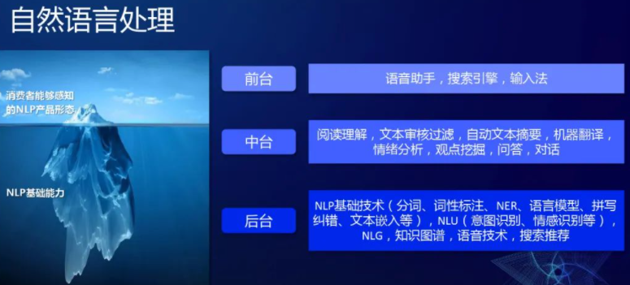
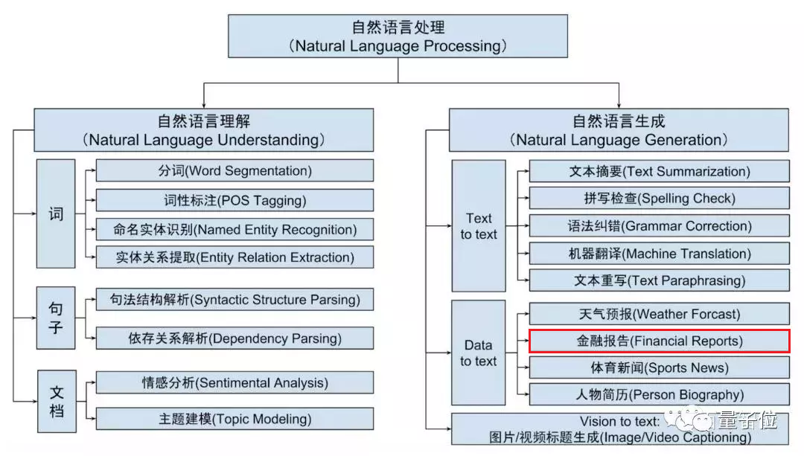

# NLP

## 语言的定义

语言是指生物同类之间由于沟通需要而制定的指令系统，语言与逻辑相关，目前只有人类才能使用体系完整的语言进行沟通和思想交流。

## 自然语言的定义

自然语言通常会自然地随文化发生演化，英语、汉语、日语都是具体种类的自然语言，这些自然语言履行着语言最原始的作用：人们进行交互和思想交流的媒介性工具。

- 语音：与发音有关的学问，主要在语音技术中发挥作用。
- 音韵：由语音组合起来的读音，即汉语拼音和四声调。
- 词态：封装了可用于自然语言理解的有用信息，其中信息量的大小取决于具体的语言种类。中文没有太多的词态变换，仅存在不同的偏旁，导致出现词的性别转换的情况。
- 句法：主要研究词语如何组成合乎语法的句子，句法提供单词组成句子的约束条件，为语义的合成提供框架。
- 语义和语用：自然语言所包含和表达的意思。

## 自然语言处理（NLP）的定义

自然语言处理（Natural Language Processing，NLP）：是计算机科学，人工智能和语言学的交叉领域。目标是让计算机处理或“理解”自然语言，以执行语言翻译和问题回答等任务。

NLP底层技术包含自然语言理解(Natural Language Understanding，NLU) 和自然语言生成（Natural Language Generation, NLG）两个重要方向，如下图所示。

- 自然语言理解NLU旨在将人的语言形式转化为机器可理解的、结构化的、完整的语义表示，通俗来讲就是让计算机能够理解人类语言。
- 自然语言生成NLG旨在让机器根据确定的结构化数据、文本、音视频等生成人类可以理解的自然语言形式的文本。

- CS224N - Natural Language Processing with Deep Learning
- CS224S - Spoken Language Processing
- CS224U - Natural Language Understanding[16]

## 自然语言处理的难度

- 自然语言千变万化，没有固定格式。同样的意思可以使用多种句式来表达，同样的句子调整一个字、调整语调或者调整语序，表达的意思可能相差很多。
- 不断有新的词汇出现，计算机需要不断学习新的词汇。
- 受语音识别准确率的影响。
- 自然语言所表达的语义本身存在一定的不确定性，同一句话在不同场景／语境下的语义可能完全不同。
- 人类讲话时往往出现不流畅、错误、重复等现象，而对机器来说，在它理解一句话时，这句话整体所表达的意思比其中每个词的确切含义更加重要。

## NLU

### 背景

无论你说“我要出差”还是“帮我看看去北京的航班”，只要这些字里面没有包含提前设定好的关键词“订机票”，系统都无法处理。而且，只要出现了关键词，比如“我要退订机票”里也有这三个字，也会被处理成用户想要订机票。

自然语言理解这个技能出现后，可以让机器从各种自然语言的表达中，区分出来，哪些话归属于这个意图；而那些表达不是归于这一类的，而**不再依赖那么死板的关键词**。比如经过训练后，机器能够识别“帮我推荐一家附近的餐厅”，就不属于“订机票”这个意图的表达。[8]

NLU的出现为机器处理意图方面带来了飞跃的提升。通过训练可以让机器从多重表达语法中精准识别到用户的意图。[10]

### 定义

自然语言理解（NLU）模块主要是通过意图识别和槽识别（信息抽取）来理解对话中用户语句的语义。

### 意图识别

意图识别（Intent Prediction）：目的是**理解用户所表达的意图**，核心其实是处理一个**分类**问题，将用户的话分类到**事先预定义好的意图类别**中去。目前主要基于深度学习的方法，使用CNN（卷积神经网络）对query进行特征提取和意图分类，类似的方法同样适用于领域的分类。

其难点：

- 输入不规范：错别字、堆砌关键词、非标准自然语言；
- 多意图：输入的语句信息量太少造成意图不明确，且有歧义。比如输入仙剑奇侠传，那么是想获得游戏下载、电视剧、电影、音乐还是小说下载呢；
- 意图强度：输入的语句好像即属于A意图，又属于B意图，每个意图的的得分都不高；
- 时效性：用户的意图是有较强时效性的，用户在不同时间节点的相同的query可能是属于不同意图的，比如query为“战狼”，在当前时间节点可能是想在线观看战狼1或者战狼2，而如果是在战狼3开拍的时间节点搜的话，可能很大概率是想了解战狼3的一些相关新闻了。[12]

如何做：

1. 规则模板:`.*?[地名]{到|去|飞|飞往}[地名].*?{机票|飞机票|航班}.*?`
2. 使用统计机器学习算法做文本分类，需要人工提取文本特征，比如ngram、词性特征、实体类型特征；提完特征后进行tf-idf向量化表示，然后使用支持向量机、逻辑回归、随机森林等算法进行训练
3. 使用神经网络来建模做文本分类，它省略了人工设计特征、提取特征的过程，还能借助预训练好的具有语义知识的词向量进行训练；但是该方法需要很多训练数据，所谓大力出奇迹，这就需要依赖很多人工标注数据了，相比之下规则模板方法则不需要标注数据。

### 槽识别

什么是槽？（Slot） 槽是多轮对话过程中将初步用户意图转化为明确用户指令（将模糊或缺失的意图补全[11]）所需要补全的**关键信息**。一个槽与一件事情的处理中所需要获取的一种信息相对应。[7]

槽位填充（Slot Filling）：提取对话中关键信息，本质是将句子中的词打上语义标签（如上图Slots日期、地点），具体方法有CRF（条件随机场）、Deep Brief Network（深度信念网络）以及RNN（循环神经网络）等。[3]槽位值就是用户表达的具体关键信息。

- 词槽是关键信息，也是筛选条件，例如查天气中的日期和城市
- 实体是词槽词典，比如城市词槽，对应的实体有北京、上海等[6]

![命名实体识别标注 VS 槽位填充标注[13]](../img/slot_vs_entity.png)

多轮对话中的所有的槽位都需要被填充完整吗？[14]

不一定，以如下对话为例：

> 我：『去萧山机场多少钱』
> 出租车司机：『70』

对话中的『70』，应当被理解为70元人民币，而不必再去追问：『你说的是人民币、美元、日元还是港币？』。这类信息应当以默认值的形式存在，也即槽有必填与非必填之分，与上文所说的『信息未必需要通过与用户的对话获取』相对应。

槽位预测的概念，也就是当用户的query中识别不到某些槽位值时，我们首先需要去做一个较为靠谱的预测，而不是凡事都去跟用户瞎互动问东问西来获取这些槽位值。那么槽位预测该如何做呢？从上文的订电影票例子中我们可以看到针对不同槽位，张三调用了用户的地理位置、当前时间的数据来辅助预测（这就是某些APP要获取你手机的地理位置权限的原因）[13] 怎么确定还要不要问询？根据犯错的代价，大的需要再确认。买错票要的代价大。

而是主动的话题切换会涉及到一个新问题：槽继承。

举个例子：

> 我：『我明天要坐高铁从杭州到北京』
> 我：『算了，还是坐飞机吧』

这种情况下，机器人不应当重复询问『出发地』、『出发时间』和『目的地』。

更多[15]:

- 智能音箱语义理解——MDIS三合一模型:https://developer.jdcloud.com/article/1947?mid=11

## NLG

自然语言生成作为**人工智能和计算语言学**的分支，其对应的语言生成系统可以被看作基于语言信息处理的计算机模型，该模型从抽象的概念层次开始，通过选择并执行一定的语法和语义规则生成自然语言文本。

### 生成式对话生成技术

代表性技术是从已有的“人-人”对话中学习语言的组合模式，是在一种类似机器翻译中常用的“编码-解码”的过程中逐字或逐词地生成回复，生成的回复有可能是从未在语料库中出现的、由聊天机器人自己“创造”的句子。

#### 三种自然语言生成方式

文本生成-Text Generation:https://wqw547243068.github.io/2020/04/28/text-generation/#comments

##### 基于检索的自然语言生成

基于检索的自然语言生成并不是如字面意思一样生成自然语言，更多是在已有的对话语料中检索出合适的回复。

- 优点：实现相对简单、容易部署美因茨在实际工程中得到了大量的应用。
- 缺点：依赖于对话库、回复不够灵活等

##### 基于模板的自然语言生成

自然语言生成模板由句子sentence模板，词汇word模版组成。句子模版包含若干个含有变量的句子，词汇模板则是句子模块中的变量对应的所有可能的值。

##### 基于深度学习的自然语言生成

- 大概：https://tobiaslee.top/2018/06/09/Brief-overview-of-text-generation/
- 框架：https://tobiaslee.top/2019/08/31/TG-framework-notes/
- 论文：https://github.com/THUNLP-MT/TG-Reading-List

## 文本处理流程

### 语料定义

语料。为了表达清楚意图，用户会说一些常用的问法，比如，用户说“今天天气咋样”、“明天深圳温度多少”、“今天雾霾多大”，这些句子的背后都是想表达某个意图。而这些句子，我们称为语料。

语料的作用是用来让机器去学习和理解意图的。好比一个刚出生的小孩，需要不断的教他很多句子的意思，慢慢的就会理解大家的说话（意图）。[9]

### 语料获取

- 业务积累——通过脚本直接从数据库中提取/OCR或人工录入纸质文件
- 网络收集—下载网络开放的数据集（回答闲聊问题）或通过爬虫抓取
- 外部采购—采购（确保合规）专业语料数据集（行业评论、专业文献等）来用于回答客户的问题咨询

### 预处理

#### 语料清洗

语料清洗,顾名思义就是将无用的噪音内容去掉,只保留对我们有用的主体内容。常见的是通过编写脚本,采用正则表达式匹配的方式去清洗数据,具体包括全半角转换、大小写转换、繁简体转换、无意义乂符号移除等等。如果是通过爬虫抓取的网页内容,我们还要去除广告标签或注释、JavaScript、CSS代码。

- 全半角转换：将在输入法全角模式下输入的內容转换为半角模式的,主要对英文、数字、标点符号有影响。
- 大小写转换：统一将大写形式的字母转成小写形式的。
- 繁简体转换：将繁体输入转成简体的式,当然考虑到用户群体的差异以及可能存在繁体形式的资源,有些情况还需要保留转换前的繁体输入用于召回
- 无意义符号移除：移除诸如火星文符号、emoj表情符号、URL地址等特殊符号内容。

清洗完语料之后,接下来要做的就是分词。因为中文语料数据都是短文本或长文本组成的句子,所以我们在进行文本挖掘分析时,需要将这些句子处理成最小单位粒度的字符或者词语。

#### 文本分词

- 基于规则匹配的分词方法
- 基于统计的分词方法
- 基于语义理解的分词方法

技术难点在于“歧义识别”和“新词识别”。比如说:“武汉市长江大桥”,这个句子可以切分成“武汉市/长江大桥”,也可切分成“武汉/市长/江大桥”,如果不依赖上下文其他的句子,恐怕我们很难知道怎么去理解。

#### 词性标注

- 普通词性标注：将句子中的词标记为名词、动词或者形容词等等
- 专业词性标注：针对特定行业领域的词性标注,如医疗行业、教育行业等等

### 文本表示

定义——把已分词的字符转化成向量矩阵形式

常见方式：词袋模型

### 文本计算

定义一计算四个文本之间的相似度

常见方式：余弦距离、欧氏距离、皮尔逊相关度

## 文本处理场景

- 信息提取：从指定文本中提取出重要信息,如时间、地点、人物、事件等。具体场景如从新闻咨询中提取能够完整准确反映中心内容的摘取信息
- 智能问答：对客户问题进行语义理解,然后在知识库中查找可能的候选答案通过排序找出最佳的答案进行回复
- 机器翻译：通过把输入的源语言文本通过自动翻译获得另一种语言的文本,是自然语言处理中最为人所熟知的场景,如百度翻译、 Google翻译
- 文本挖掘：包括文本聚类、分类、情感分析以及对挖掘的信息和知识通过可视化、交互式界面进行表达
- 舆论分析：通过收集和处理海量信息对网络舆情进行自动化的分析,帮助分析网络话题热点,然后对热点的传播路径及发展趋势进行分析判断,以实现及时应对网络舆情
- 知识图谱：根据参数和限定词的输入,进行词语到文本或文本到文本的生成[5]

### 金融应用

为了解决由数据推测模型的局限性，通过自然语言处理技术，引入新闻、政策以及社交媒体中的文本，将非结构化数据进行结构化处理，并从中寻找**影响市场变动的因素**。除了可以丰富模型变量外，自然语言处理技术可以实现“智能投融资顾问助手”。集合自然语言搜索、用户界面图形化及云计算，智能助手可以将问题与实践关联市场动态，提供研究辅助、智能回答复杂金融投融资问题。[2]

#### 中文金融领域

中文分词是中文NLP的难点之一。如“结婚的和尚未结婚的”，应该分词为“结婚/的/和/尚未/结婚/的”，还是“结婚/的/和尚/未/结婚/的”，不同的分词方法会产生一定的歧义。再比如，“美国会通过对台售武法案”，我们既可以切分为“美国/会/通过对台售武法案”，又可以切分成“美/国会/通过对台售武法案”。

随着深度学习的普遍使用，中文与英文在语言上的差异也逐渐变成训练数据量上的差异，以往在NLP领域，可供使用的中文数据量比英文数据要少的多，这是目前中文NLP的难点之一。但是随着有越来越多的人投入到中文人工智能以及NLP领域的研究中来，中文数据集不足的问题正在逐年改善。

在金融领域，针对基础性问题，中英文所处的阶段其实大体相同，但是针对如情感分析、市场预测等复杂问题，由于要结合具体的语境以及相应的应用场景，同时要考虑训练的数量级问题，无论是中文还是英文的NLP要走的路都还有很多。[4]

AI 自动写作 · 产品调研：
http://www.ramywu.com/work/2018/03/02/AI-Machine-Writing-Survey/

https://www.bilibili.com/video/BV1AW411z7dh
https://www.bilibili.com/video/BV1cW411q7LK

## Awesome

https://www.52nlp.cn/

Speech and Language Processing: https://www.52nlp.cn/%e3%80%8a%e8%87%aa%e7%84%b6%e8%af%ad%e8%a8%80%e5%a4%84%e7%90%86%e7%bb%bc%e8%ae%ba%ef%bc%88speech-and-language-processing%ef%bc%89%e3%80%8b%e7%ac%ac%e4%b8%89%e7%89%88%e7%bb%88%e4%ba%8e%e5%9c%a82020

求职：http://www.nlpjob.com/

## NLP 常见任务及当下经典算法

- 文本分类[19]/意图识别：CNN / Bert / LSTM+Attention
- 实体识别：LSTM+CRF
- 中文分词：N-Gram / CRF / HMM
- 文本相似度：TF-IDF / BM25+Bert
- 文本摘要：Bert+Textrank
- 问答系统/机器翻译：Transformer+Bert / Seq2seq+Attention
- 情感分析：Word2vec+LSTM / CNN
- 文本挖掘
- 语义理解

## 提供相关方案的企业

- 讯飞开放平台（提供自然语言处理）：https://www.xfyun.cn/
- 图灵机器人（提供多场景的聊天机器人解决方案）：http://www.tuling123.com/
- 腾讯AI开放平台（提供基础文本解析、语义分析等技术）：https://open.youtu.qq.com/#/open
- 百度AI开放平台（提供语言处理基础技术、文本审核、机器翻译等）：http://ai.baidu.com/tech/nlp
- 阿里云（提供情感分析、实体识别、机器翻译等）：https://ai.aliyun.com/?spm=a2c4g.11174283.1146454.294.167d1039G3kvVD
- 追一科技（提供智能外呼、及智能机器人在多行业的解决方案）：https://zhuiyi.ai/
- MSRAI

## 更多

自然语言处理中的深度学习：方法及应用 ：http://www.juestc.uestc.edu.cn/cn/article/doi/10.3969/j.issn.1001-0548.2017.06.021

[1]: http://www.woshipm.com/pmd/2937210.html
[2]: http://www.cstf.org.cn/newsdetail.asp?types=36&num=1165
[3]: http://www.woshipm.com/pd/4133505.html
[4]: https://www.miotech.com/zh-CN/article/5cda76428b224f0044833a13
[5]: https://time.geekbang.org/column/article/348027
[6]: https://ai.baidu.com/forum/topic/show/865200
[7]: https://mp.weixin.qq.com/s?__biz=MjM5NzA5OTAwMA==&mid=2650005853&idx=1&sn=2c6bb9e9c3751fdc3fd95e89b8b6377d&chksm=bed865ca89afecdcdf0ecde9ed2385fb613cb2a40ad0c491582c7faf91841d17efdfe59718e1&mpshare=1&scene=1&srcid=0304keVTiRXgpPHVGxGFL6mI#rd
[8]: https://mp.weixin.qq.com/s?__biz=Mzg5NDIwODgzMA==&mid=2247484375&idx=1&sn=ef1c302d24f4b30651b5dfcaaf0390cc&source=41#wechat_redirect
[9]: https://dingdang.qq.com/doc/page/32
[10]: https://iuu.me/ai/
[11]: http://www.woshipm.com/ai/1821385.html
[12]: https://zhuanlan.zhihu.com/p/165963264
[13]: https://zhuanlan.zhihu.com/p/165963264
[14]: https://www.jianshu.com/p/b0aa00f7095e
[15]: https://mp.weixin.qq.com/s?__biz=MjM5NzA5OTAwMA==&mid=2650005853&idx=1&sn=2c6bb9e9c3751fdc3fd95e89b8b6377d&chksm=bed865ca89afecdcdf0ecde9ed2385fb613cb2a40ad0c491582c7faf91841d17efdfe59718e1&mpshare=1&scene=1&srcid=0304keVTiRXgpPHVGxGFL6mI#rd
[16]: https://github.com/wangwh0204/blog/blob/7a3db02bcebf0c42880516daa49980fec919622b/source/_posts/2015-12-15-my-think-about-career-specialization-rwc.md
[17]: https://zhuanlan.zhihu.com/p/133459130
[18]: https://zhuanlan.zhihu.com/p/384020411
[19]: https://zhuanlan.zhihu.com/p/274718006
