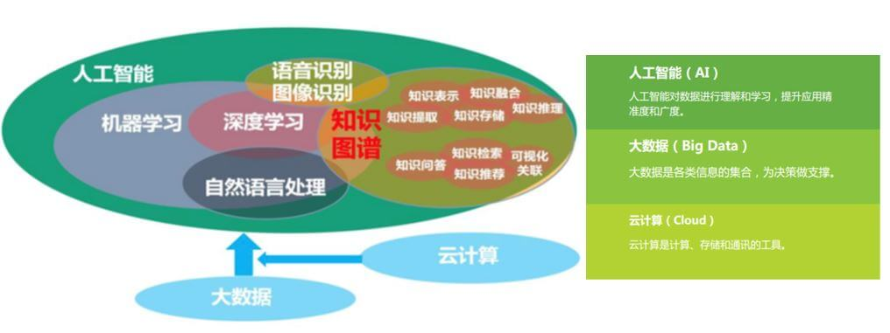

# 知识图谱

从数据的挖掘效率层面来说，人工智能的发展离不开技术的不断创新，传统机器学习、深度学习、自然语言处理、语音图像识别、知识图谱是现阶段人工智能的五大核心技术，很多场景落地并产生价值，需要数据+多种技术的结合，也包括与传统专家规则的结合。其中，知识图谱与自然语言处理，是2019到2020年的热点落地技术，这两项技术也是相互交融的关系，构建从感知智能向认知智能的必要条件，两者最终目的都是往让机器能够更好的认知这个世界，朝着更加智能化的方向去发展。[2]

## 应用

### 智能投研

如果说金融数据、另类数据是智能投研的原料，那么知识图谱就是智能投研的大脑。所谓“知识图谱”是将实体、属性、关系等非结构化数据固联起来，进而为投资决策提供逻辑支持。体现在投资行业，就是研究员可以将相关的行业、产品和公司等多方因素联系在一起，当观察到某个因素发生变化时，即可以根据关系链推理出观点和预测，为投资决策提供支撑。

完善的知识图谱是AI在投资研究中应用的必要条件，金融行业最不缺的就是海量的高质量研究资料，通过对研报、公告等文本信息的深入挖掘，形成能够自我生长、自我学习的知识图谱体系，这是智能投研的重中之重。[1]

[1]: https://www.jianshu.com/p/d15703c14cd5
[2]: https://www.weiyangx.com/351456.html
