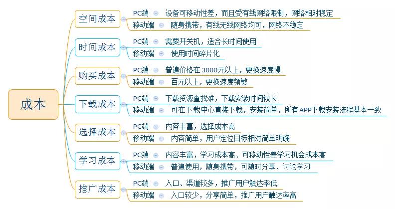
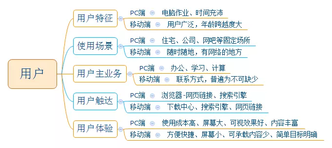
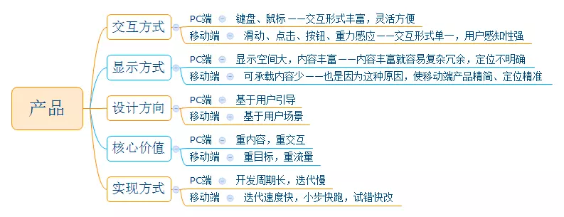

# 移动端

## PC vs 移动端 [4]

## 小程序 [1]

1、用户角度：1）不占内存：直接依附于微信存在，直接打开就可以使用，也不需要下载。2）即用即走：小程序现在有9个入口，无论从哪个入口进入，使用完毕以后都可以直接退出来，非常方便。

2、企业角度：1）搭建简单：微信小程序开发，最开始只能由企业开发，后来的个人也可以开发，到现在直接可以通过微信公众号搭建，如果对功能要求不高，搭建一个微信小程序非常简单。2）节约成本：比起开发APP，微信小程序的成本更低，而且周期短；微信公众号需要专门的人员运营，微信小程序则不需要，也可以节约人力成本。3）流量红利大、入口场景丰富：一般来说小程序都是依赖于微信/支付宝的，对于任何一个企业而言，流量都是需要投入很大财力物力的地方。线上线下广告成本都特别大，而微信/支付宝小程序则不一样，它本身所依附的对象就是一个巨大的流量入口。微信小程序的9个入口，更是可以为企业带来无法预估的流量。

3、平台角度：弥补人口红利的消失：当人口红利论难以维持时，能够节约用户时间、提升商业效率的产品与服务，或许将迎来增长机会。互联网要进入产业纵深，帮助产业实现数字化，提升效率，改造从供应链到销售的全流程，就需要调用各种能力，不再是一个App打天下，一种能力吃八方，而需要集成多种能力，在一个可以自由跳转又能便捷开发的生态之内。

## Andriod

Baidu SDK:https://ai.baidu.com/sdk

### 为什么需要签名 MD5？[2]

安卓的应用是以包名做为唯一ID的。百度的人脸服务也是以包名做为单位进行 授权的。因为包名是开发者填写的，所以别的开发者也可以写个应用来冒充其他人的应用。百度人脸服务会涉及到用户的信息，使用过程中也有费用产生。所以为了保护APP不会他人冒充，我们对应用的签名进行校验。刚才也提到了，因为MD5算法的不可逆性，可以当做公钥使用。用户在申请时在后台填写签名的MD5值，发布/测试时，使用该签名文件。人脸服务在运行时会对当前应用的签名MD5 进行校验，如果信息不一致会拒绝服务。

### Mobile 部署模型

在mobile上部署模型会遇到计算资源受限的问题，一般解决方法：减小模型大小（类似MobileNet），quantizing weights，知识蒸馏（例如DistillBERT）等。

一些工具框架介绍：TensorFlow Lite，PyTorch Mobile，CoreML，MLKit，FritzAI等。ONNX可以作为中间层，再部署到各种硬件平台上。对于嵌入式系统，最好的解决方案是NVIDIA for Embeded。

MindSpore Lite :https://juejin.cn/post/6939167928822530078

[1]: https://www.zhihu.com/question/346774796/answer/1686950897s
[2]: https://ai.baidu.com/forum/topic/show/492251
[3]: https://zhuanlan.zhihu.com/p/218468169
[4]: http://www.woshipm.com/pd/289607.html
