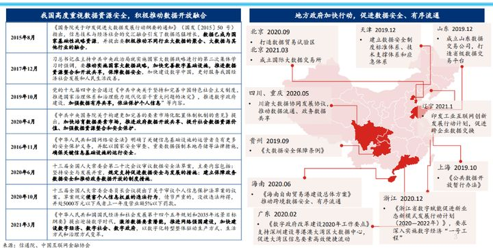

# 数据

## 数据定义

数据(data)，被视为“科学的度量、知识的来源”，在物理上存储以字节(byte)为计量单位，是关于事件之一组“离散且客观”的事实描述③，是数据原子(data atomic)、数据项(data item)、数据对象(data object)、数据集(data set)的统称[1]，分为模拟数据和数字数据两种。

描述数据的数据称为元数据(mata data)；处理数据的数据，如程序或软件，称为数据工具(data tool)。

## 数据的衡量

人工智能产品对数据除了有量的要求，还有质的要求，衡量数据质量的标准包括四个R：关联度relevancy（首要因素）、可信性reliability（关键因素）、范围range、时效性recency。

### 可行度

2018年4月，易观数据发布《中国共享单车行业数据报告》，报告中称，2018年2月，ofo小黄车、摩拜单车和哈罗单车的市场覆盖率分别为50.89%、49.14%和5.64%。哈罗单车CEO杨磊在朋友圈中转发相关消息吐槽：这种机构，给出来的数据就是个笑话。[3]

## 数据的价值

2020年4月，《中共中央、国务院关于构建更加完善的要素市场化配置体制机制的意见》（以下简称“《意见》”）发布，数据作为一种新型生产要素被写入国家文件中，与土地、劳动力、资本、技术等传统要素并列为要素之一。

《意见》明确，加快培育数据要素市场，推进政府数据开放共享、提升社会数据资源价值、加强数据资源整合和安全保护。[5]

数据由于具备可复制和可传播性，其本质上是不能被安全共享的，但在数据要素时代，我们虽然不共享数据本身，但**数据价值**应该被共享。[6]

### 数据获取地址：

- ICPSR：www.icpsr.umich.edu
- 美国政府开放数据：www.data.gov
- 加州大学欧文分校：archive.ics.uci.edu/ml
- 数据堂：www.datatang.com

公开数据集：[4]

- Google数据集搜索：https://toolbox.google.com/datasetsearch
- Datahub，分享高质量数据集平台：https://datahub.io/
- 用于上传和查找数据集的机器学习数据集存储库：https://www.webdoctx.com/www.mldata.org
- datafountain收集数据集：https://www.datafountain.cn/dataSets
- tinymind收集数据集：https://www.tinymind.cn/sites#group_22 看到的一篇文章,里面有介绍很多数据集的：世界上最有价值的不是石油而是数据(附数据资源下载链接)

## 全球数据鸿沟仍在加大，开放共享机制与数据服务能力加速构建

数据鸿沟问题愈加凸显，开放共享仍在探索阶段。全球数字化加速数据生成和积累， 数据资产对全球经济利益的分配已开始产生影响。“大规模数据→更准确模型→更好产品→更多用户→更多数据”的循环逻辑将导致数据定向收拢聚集，人工智能数据资产已开始出现寡头垄断的态势；互联网产生的数据资产半数集中在仅 100 家左右的少数头部企业中，影响全球人工智能经济利益的分配。据统计，人工智能产生的经济价值中约有 70％会累积到中美两个国家， 而若推动数据资产的全球化，大多数国家有望将 GDP 提升 1%至 2.5%。

当前，各国政府、头部企业持续推动数据的开放共享，数据原则、数据合作、数据规范与数据共享平台成为重点。政府积极推动数据开放共享原则， 注重在保护隐私和公开透明原则下进行数据开放。欧盟率先出台《通用数据保护条例》对涉及隐私的敏感数据做出严格要求；英国、法国、瑞典等国纷纷跟进修订或新增；美国以原则倡议为主，政府先行数据开放，通用数据法案仍在制定中。

头部科技企业出于商业利益考量，对数据开放持谨慎态度；目前，微软试图打破这一局面，发起开放数据运动（ Open Data Campaign），提出开放、可用、授权、安全、隐私五大原则，鼓励数据互联互通，承诺围绕健康、环境和各种社会公益项目等问题共享数据，但尚未开放其产生利润专有数据集。

跨领域数据合作也成为这一时期的热点， 其中垂直行业企业最为积极，数据合作已从点状互惠向有组织的开放共享方向发展。微软、Adobe 和 SAP 联手构建数据共享联盟，通过通用数据模型将数据存储在统一的数据湖中实现共享，吸引安永、 飞思创（ Finastra）等多行业企业共同加入。

同时， 数据规范与开放协议尤为重要， 国家标准化组织密切关注数据隐私问题，企业也在自发建立数据开放协议或规范，如 IEEE P7002 数据隐私处理标准、 ISO 27701 隐私信息管理体系、微软 AI 模型数据使用协议（ DUA-OAI） 等。此外，谷歌、微软等科技头部企业推出 Dataset search、 Research Open Data 等自动化数据搜索平台，进一步降低数据获取难度，打造更加开发便捷的数据生态。

数据集建设需求更为专业。监督学习仍是产业界人工智能算法训练的主要方式，因此大规模、高质量的人工标注数据集是产业发展刚需。目前，数据标注从简单、重复的拉框标注向精细化方向发展，呈现三类发展特点：

一是数据标注流程趋于智能化， 通过预标注技术和半自动化校验的方式辅助人工标注已成为当前发展重点，业内涌现出一批标注工具，可对未标记图像直接生成分割轮廓，并借助人工进行微调；

二是标注数据质量要求不断提升， 自动驾驶、工业制造等智能任务场景愈之复杂，高质量、精细化的标注数据直接影响算法鲁棒性和准确性，标注准确率需求从 90%提升至 99%；

三是医疗、工业等差异化垂直应用驱动数据标注服务进一步贴合个性化、多元化的场景需求， 如数据服务企业 Scale AI 为自动驾驶场景提供标注服务，对车道、烟尘、尾气、雨水等更为个性化的目标物体进行标注。

具有智能标注能力的数据服务企业受到资本热捧。以数据标注为代表的基础数据服务市场规模快速增长，资本市场进一步推高专业数据标注企业的估值。2020 年，专业数据标注企业 Labelbox 完成 2500万美元 B 轮融资；龙猫数据获得 3300 万元 Pre-B 轮融资。目前， 数据的智能化标注能力成为这一时期数据服务企业的发展重点；

一方面，传统数据众包平台企业向专业数据标注企业发展，快速布局智能标注工具，数据服务企业澳鹏（ APPEN） 花费 3 亿美元收购数据标注公司 Figure Eight， 大幅提升企业数据服务竞争力；

另一方面，智能标注工具企业不断涌现，如 Scale AI、 Supervisely、马达智数等。[7]

## 数据不止看数量也看质量

虽然机器学习需要大量的数据，但你使用的数据必须是非常具体的，只有这样才能解决特定的问题。GE有很多燃气轮机的遥测数据，Google有很多搜索数据，Amex有很多信用卡欺诈数据。你不能用涡轮机的数据作为例子来发现欺诈性交易，也不能用网络搜索的数据来发现即将出现故障的燃气轮机。也就是说，机器学习是一种通用的技术，你既能用它来欺诈监测也能进行人脸识别，但是用它构建的具体应用互相之间是不通用的。每一个特定的模型或应用只能做一件事。 [8]

## 数据市场

但是，我国在高度重视数据资源安全同时，也在积极推动数据开放融合， 鼓励促进数据安全、有序流通。各个地方政府也在积极推动数据交易，建立数据交易市场。

所以，对于数据市场的发展和管理，应该不只是通过牌照在流程上合规，让大量看不见的风险置于监管下。同时在数据授权、采集、和传输的链路上都要进行优化。[9]

[1]: https://scholar.harvard.edu/files/ctang/files/data_industry_draft_in_chinese.pdf
[2]: http://www.woshipm.com/pmd/2942899.html
[3]: http://tech.sina.com.cn/i/2018-06-02/doc-ihcikcew4309938.shtml
[4]: https://github.com/HuangCongQing/AI_competitions
[5]: https://www.ofweek.com/security/2020-09/ART-510006-8900-30458012.html
[6]: https://www.ofweek.com/security/2020-09/ART-510006-8900-30458012.html
[7]: https://www.jiemian.com/article/6005288.html
[8]: https://www.36kr.com/p/765469670576259
[9]: https://zhuanlan.zhihu.com/p/389703042
