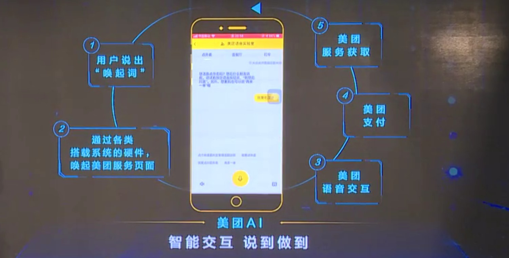

# 美团

## 夏华夏报告

尊敬的吴院士，各位嘉宾，各位现场的朋友和云端的朋友们，大家中午好。今天我为大家带来美团AI未来城市生活的基础设施。我是在美团负责**人工智能平台服务**，我们坚信人工智能不应该仅仅是在电脑里的数据或者是在云端的一些算法，它更应该跟我们现实生活中的每一个人产生一些真实的温暖连接，帮助我们在真实的物理世界变的更加美好，这是为什么我们讲未来城市生活的原因。 [1]

我引用德勤在报告当中的一句话，它说城市其实是人工智能技术创新的一个综合性载体，也是人类与AI技术产生全面感知的一个集中体验地。如果做智慧城市的话，对一个生活服务的闭环是有特别高的要求，因为用户在真实的物理生活中要**吃、穿、住、行，包括购物、旅游、娱乐**，整个服务如果形成闭环，那整个的数据，用户生活的很多数据就会构成一个全面的示图，帮助我们更好理解这个用户，更好为用户服务。幸运的是，美团点评刚好有这个闭环的服务，我们**把4.5亿的消费者和600多万商家集中在一个超级平台上**，一边为用户提供吃、穿、住、行、乐的各种服务，一边为商家提供很多支撑他们发展的经营、决策的服务。在这个闭环形成之后，我们认为我们可以用人工智能技术去帮助我们更好的做线下经济的数字化。

我们做人工智能技术的优势是什么呢？因为我们有特别丰富的场景，刚才说我们有大概200多种不同的服务，cover线下生活的各种方面，有这么多场景之后会产生大量的数据，我们用这些大量数据反过来可以帮助我们人工智能算法不断迭代、优化。这些算法再闭环过来帮助我们用户在场景中更好得到一些服务。所以美团做人工智能是由场景来驱动我们不断迭代的。

这也是我们第一次对外公开发布我们一个全景美团人工智能的科技图谱。因为美团刚才说我们有特别多的服务场景，有大量的商家，大量的用户，会产生很多各种各样的数据，基于这些数据我们会结合很多种人工智能的技术，包括图像、语音、智能交换自然语言处理、知识图谱包括运动决策规划等等，这些技术结合在一起可以有很多应用，比如说我们做生物安全认证、智能客服、无人配送等等，这些在几个方向，包括智慧交互、物流网络、生活服务大脑和产业的自动化升级方面都可以帮助我们更好的做这个智慧城市。

我们的目标是希望让美团的人工智能成为我们未来生活的一种基础设施，今天着重从四个方面给大家分享一下我们正在做的一些工作，分别是比如说我们怎么给用户做比较好的服务引擎，怎么做产业的升级，社会的治理，以及更远的未来生活的一些可能的产品。先看服务引擎，因为美团的app里面有两百多种不同服务，但是大家打开手机就是一个小小的6寸屏，我们怎么让用户更好的更便捷在6寸屏幕上找到用户所需要的服务，我们背后就有很多人工智能的技术帮助用户去搜索推荐，以及用一些更便捷的方式去找到。

这里给大家一个例子，可以用智能语音交互比较方便的用美团的服务。因为美团有这种非常闭合的，从服务的展示到支付，到最后履约的服务，我们可以为很多，哪怕不会用手机，不会输入文字，比如说一些老人、小孩也可以非常方便智能交互的方式使用美团的服务。当然在服务的背后是一系列我们美团丰富的业态结合起来，并且我们把它兼容到各种不同的硬件载体上，包括手机、车载设备、家具智能音响等等，再结合我们的履约、支付等等一些功能，综合起来可以给用户提供一个非常好的服务体验。

第二个方面，我们给商家也希望给他们非常好的提供服务，因为商户在美团看来也是我们的客户，我们希望用人工智能的技术去帮助商家提高效率，做整个产业的效率升级。怎么升级呢？当我们去深入了解每一个产业的时候，我们发现真正在线下做一个商铺，哪怕只是一个简单的餐馆，它其实涉及的经营决策，涉及的行业知识是非常多的。比如说一开始要选址，在什么地方选，建店之后怎么比较好的经营管理、营销，包括做物流等等。这些专业的知识我们希望用美团AI的各种技术，结合我们大数据，去给商家提供很多各种不同的服务。这里面包括比如说给商家智能的收银系统，它的智慧选址，告诉它周围的商圈都是一种什么样的消费价位，已经有什么样的商家，不同品类的竞争情况是怎样的，让商家可以更好的做经营的决策。

这里面时间关系没有办法一一展开，给大家看一个例子。这是美团大脑，本质上是基于美团海量的数据，经过大数据挖掘之后形成的巨大知识图谱。在这个知识图谱里面，大家看到有很多点，这些实体有可能是商家，有可能是一些关键标签，我们把它连接起来之后，可以形成一个巨大的海量知识。我们现在有千亿量级的知识连接，在这个例子里面展示的是浦江宴，就是会场旁边的一家店它的一些特点，我们可以看到用户对这家店的情感变化曲线，可以看到这家店的口味，它的用户评价，包括周围商家竞争的情况，它的相似商家是什么。通过这样一些数据，可以让商家在经营决策的时候，可以得到很多的反馈，可以帮助商家做更好的经营决策。

刚才讲的是给商家做赋能，我们同时也希望用人工智能的技术去帮助我们整个社会的治理，让整个社会运转的更加高效。我举两个例子，一个是因为今年疫情期间，我们发现很多商户会受疫情的影响，包括我们就业会受到疫情的很多影响。这一页我们会给大家展现我们怎么使用我们智能语音交互的方式，帮助我们去做疫情的通知，做商户的信息收集，做招聘。我们先听第一个例子。

大家听到这个女声，听起来是非常真实的声音，但其实是我们完全用人工智能，是我们的客服机器人合成的。在这个过程中有几个技术挑战，第一个是我要非常准确理解用户说了什么，包括他的背景噪音、方言都要适应。第二，基于用户说的内容，基于我背后的知识库产生我要说什么。第三，我要用尽量接近真实人的声音去把这个声音说出来。因为很多用户一接到电话一听到是机器人的声音，马上挂掉电话，我们还要尽量逼近人的声音。

大家会听到，当我们要收集很多商户信息的时候，因为每个商户根据它的品类不同，我们要收集指定的很多字段的信息，这个其实对于人来打电话是非常繁杂的，现在我们有机器人每天打一百万通的电话，为了收集各种信息，让网上商户的信息更加准确。

第三个例子是我们去招募一些骑手，尤其在疫情期间对就业是非常大的帮助。我们的机器人会根据用户的很多反馈，尤其是当听不清的时候，会再反问确认，这样一种非常接近真人的客服方式，去提供给用户、商户、骑手很多服务。我们也希望未来，比如说明年人工智能大会的时候，这种智能机器人的技术可以帮助我们比如说去通知参会嘉宾，可以有很多的对接。

第二个社会治理的例子，我们也会跟各地政府去合作，因为政府其实对本地生活的很多产业是希望有更精确的了解。比如说每个参与商家卫生情况怎么样，之前食药监、卫生局他们其实并没有管理上的抓手，但是跟美团合作之后，我们会给各地政府提供类似这样的一个政府政务数据大屏，大家可以看到很多疫情期间的复工率是怎样的，各地每个不同的产业现在的发展是什么样子，它各个地区不同的产业热点是什么，包括看某些比如餐饮商家，我们会看到有问题的商家的top10，卫生问题或者是客诉问题的商家是什么，这样就可以给政府治理有更好的抓手。

我们看一下未来生活，我们希望未来还会有更多产品帮助大家体会更好的生活。这是一个示意图，我们相信在未来我们在物理生活的很多设施都会是一个联网的，是一个万物互联。这里面可能有一些是比如说仓库是无人仓，我们通过无人机或者无人车的方式，把无人仓里的货物更多送到用户手上。这已经不是未来，我们已经做了很长时间的技术研发准备，已经在一些地方小规模测试。给大家看三个不同的视频，第一个是无人微仓，当商户想开一个零售店的时候，我们可以用无人微仓的技术把很多货架，很多的智能货架，包括仓内的机器人，用户下单之后，这个订单信息会发到无人微仓，无人微仓会自动做分拣、打包，最后把打包的包裹交给骑手，或者交给我们的无人车和无人机，最后完成配送。

除了让骑手交付之外，我们希望未来可以让美团的无人车来配送，这段视频是展示我们在北京市顺义区，在今年疫情期间部署的几辆无人车，可以把用户在美团买菜下的单用无人车从我们的仓库送到用户所在的小区楼下，用户可以直接下来取。装车之后，车辆会根据自己规划出来的路线，在路上自动行驶，可以识别红绿灯，可以躲避车辆，可以躲避行人。最后到达目的地，用户取餐之后，无人车会自动开回我们的仓库。

我们现在除了无人车也在研发更快速的配送的无人机，因为无人机不受限于交通路上拥堵的情况，可以非常快的在十分钟的量级把餐送到用户手上。这个例子是我们在一些地方测试的无人机的真实视频。当我们骑手取餐之后，可以把餐以某种形式交给我们的无人机，这个视频里面是手工交过去，未来会有更智能的设施。无人机到达目的地之后，不管是货柜或者是地面、楼上，会有一个用二维码标出来的目标，我们的无人机会基于视觉技术自动寻找这个目标，最后把外卖的包裹释放，然后无人机再返回。

这是今天给大家分享的美团在做的人工智能方向的一些工作。总结一下就是美团有非常丰富的场景和数据，而这些场景和数据在驱动着我们人工智能的发展，今天给大家展示了，包括给用户的生活服务的引擎，给商家这边产业的升级，给政府和社会治理方面的一些工作，以及未来的各种智能无人设备的情况。我们相信当这些东西都做完之后，AI会成为我们美团做线下数字化的重要工具。美团AI会是未来生活的基础设施，它无处不在，也不需要用户感知到，就像基础设施那样，会给我们的日常生活的点点滴滴提供很多帮助。也欢迎大家关注美团AI官网，欢迎不同产业合作伙伴，学术界的合作伙伴跟我们联系，大家可以一起把AI做的更好，谢谢大家。

## 无人机送外卖

[1]: https://www.yicai.com/news/100695161.html
[2]: https://www.zhihu.com/question/30170250
