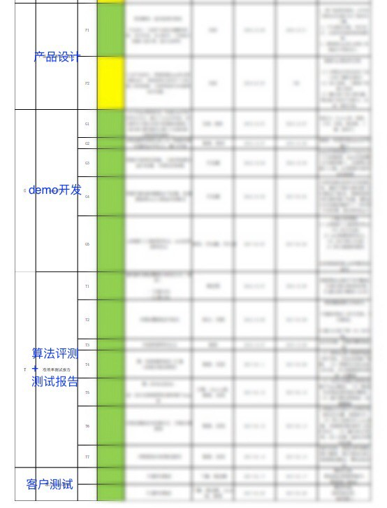

# AI PM的隐性工作 [1]

## 清晰界定 [2]

面试官希望你有“能力”，可能很多人就理解为要有优势；再比如，面试官希望你懂做直播，可能就被理解为做“网红”带货。同样，还有很多人认为对电商运营很懂，因为平时自己也帮朋友出主意，帮朋友做一些淘宝店铺的运营，但是真正的工作远比这些要复杂。

## 隐性部分

「产品经理的工作包括显性部分和隐性部分。为外界所知的显性部分，通常其实只占这个工作的十分之一左右；不为外人道的隐性部分，则占了这个工作的十分之九甚至更多。」

要掌握 AI PM 的软技能，要先关注工作本身和产品的细节。

## 隐性工作 – AI

一般来说，偏 AI 的隐性部分的工作主要包括以下几个方面：

1. 制定产品策略和算法能力的边界；
1. 梳理算法研发前的准备阶段的工作流程；
1. 理解数据标注和算法原理的基本常识。

## 隐性工作 — PM

一般来说，偏 PM 的隐形部分的工作主要包括以下几个方面：

1. 控制项目进度，按时交付产品；
1. 团队协作与沟通；
1. 产品开发周期中的问题处理。

### 控制项目进度，按时交付

首先 AI PM 要根据需求背后的用户目标排需求优先级，制定相应的解决方案。在解决方案落地的过程中，梳理不同部门和产品结构的关系，向各部门提出需求，控制整体的项目进度，提前预测产品在开发周期中可能面临的风险。

以我之前在商汤做的大型 AI 项目为例：当时的情况是，客户要求的时间很紧，客户的测试通过指标是关键字段的识别准确率不低于98%。根据这个目标，我梳理了工作流程后，将各个部门的工作流程和完成进度都严格控制在下图的这张进度表上，并且每日跟进具体问题，及时应对风险。

一般来说，toB 的 AI PM 要非常**严格地控制项目进度**，按时交付产品；同时需要在项目管理中的对风险做出预判，因为从设计到开发的过程中会遇到各种问题，就需要AI PM全程跟踪和参与，甚至身体力行地去做一些事推进整个项目进展。

~ 额外提一下，有时 AI PM 要**同时处理多个问题，注意控制自己的时间分配**；还需要清楚在什么阶段要做什么事，哪些必须提前做，哪些可以后置；项目管理的目的是保证产品的进展，确定按时交付。

##

[1]: https://medium.com/@liwdai/ai-pm-%E4%B9%8B%E9%9A%90%E6%80%A7%E9%83%A8%E5%88%86%E7%9A%84%E5%B7%A5%E4%BD%9C-be6de08d1c05
[2]: https://weread.qq.com/web/reader/46532b707210fc4f465d044kb6d32b90216b6d767d2f0dc
