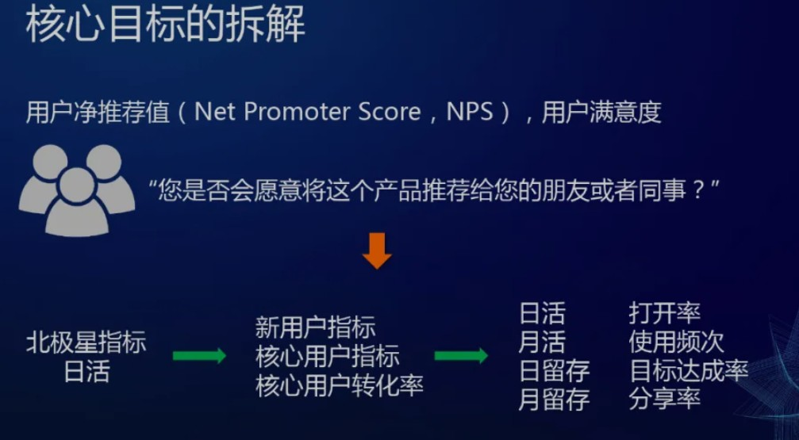

# GTM（go to marketing）

市场推广、培训、成本核算。

## 产品运营 [1]
:label:`yunying`

### 了解运营的目的 [3]

为了让产品经理除了单纯地进行产品功能优化，还要思考如何让更多的用户来使用产品，只有让更多的用户使用了产品，产品才能实现更好的自我优化

### 产品与运营的关系

产品经理主要是负责产品设计阶段的工作，运营是负责产品推广的工作，把产品当成一个孩子来看，产品设计阶段就是“生孩子”，产品推广阶段就是“把孩子养大，而且还必须养好”。

产品设计阶段主要是界定并为用户提供长期价值，在运营阶段主要是完善产品长期价值，并提供给用户短期价值。

很多产品的长期价值往往用户一时半会儿感知不到，需要运营创造一些短期价值去刺激用户使用和体验，并根据用户的持续反馈调整、迭代、优化来完善长期价值。

三驾马车:内容、用户、活动

### 作用

运营相当于一个保姆，是一项从内容建设，用户维护，活动策划三个层面来管理产品内容和用户的职业。

1. 内容建设：建立标准，挽留、裂变：防止劣质的内容驱逐优质的用户
2. 用户维护：挽留：建立完善Q&A机制，解决用户投诉和困难；拉新：主动邀请有价值的用户来使用产品。
3. 活动策划：煽动用户互动，加强产品品牌。产品运营最接近用户，需求质量高。

### 工作内容 [2]

从内容编辑、SEO 优化、产品推广、SEM、活动运营、社群运营、BD 合作等基本版块到整体统筹独立负责 APP 社区体系搭建

### 种子期:关注留存率

关注自然留存率:

- 留存率好——核心功能被认可用户群体是否有偏差
- 留存率不好——产品核心功能不明确

#### 种子用户特点

- 强需求
- 核心功能敏感
- 愿意尝试使用并传播

#### 启动法

- 事件法:试用为内容型产品地推法:
- 020产品:坚持坚决的执行地推
- 马甲法:社交产品,运营横仿用户发
- 传染法:基于特定的用户群兴趣点进行关系链传播

### 爆发期:提高来源量

产品:完善产品核心功能,暂时不要新功能

外延做深种子群体扩大范围推广传播

运营目标:拉来更多的用户,来源量

- 做深种子群体扩大范围推广传插
- 做广跨领域或行业展开推广

- 买\培养流量:培养网络红人
- 傍大款:与大平台合作,例如从酷6看网络运营度贴吧合作[9]
- 靠关系:通过关系链网络化传播
- 装有钱:运营资金雄厚(补贴,激励方式),目标是拉来更多的用户
- 共同富裕:与上传视频者共享广告利益

#### 平台期活跃度

平台期是为了下个爆发期而做的运营准备

产品:提高用户体验,考虑系统架构是否能够继续支持下一轮爆发性增长

- 举办活动
- 用户等级
- 新功能拉动 [8]

### 好文案

终极文案不是突出产品优势和品牌,而是唤起消费者的消费冲动

更多：

- https://zhuanlan.zhihu.com/p/93474666

### NEXT方法 [5]

- N(NEW)：做出了 （New）新的产品价值（WHY）
- E(Expolsive)：无法脱颖而出的产品，其实是因为做得还不够极致。
- X(XENOGENEIC)：必须走出MRD，多做田野调查，多与用户面对面交流。
- T(TALENT)：越用这些产品用户越觉得这些产品懂自己。

### 体系的建立

比如天猫京东等电商平台为了让商家在618和双11中更好的准备打折促销活动，会在大促之前发布商家作战地图，商家作战地图纵向涵盖了商家所有的活动，比如推广、视觉、商品、社交、内容、用户等，时间跨度包含了筹备期、蓄水期、预热期 、售卖期 、爆发期、返场期、总结复盘等。

运营模型的整理的关键来自于用户的关键行为，比如上图中我们思考的用户从哪里来（线上和线下），用户如何认知我们（认知），如何让用户进店（进店），用户进店之后怎么转化（购买），用户怎么沉淀下来（社群），以及最后如何让用户给我们的产品做自传播（传播）。

#### 指标确认

在互联网中，运营指标指的是需要成功完成活动的数据指标，如电商运营中关于流量性的指标独立访客数（UV）、页面访问数（PV）、成交金额（GMV）、销售金额等。

而工具类产品的核心指标是用户体验。算法工程师其实存在一个比较大的困惑，如何用数据去度量用户体验这个比较虚的目标。最常用的一个度量指标就是用户净推荐值，具体来讲就是去问用户“你是否愿意将这个产品推荐给你的朋友或者同事”。

更进一步，我们可以设置一个北极星指标，例如产品日活，然后结合每个模块进行细致拆分。我们可能需要关注每日新增用户，核心用户在今天的贡献数值，打开率，使用频次，目标达成率，分享率等等。当我们把这些核心目标真正拆解清楚的时候，我们就有了主要指标，就是我们应该怎么样去把这个产品做好。

#### 模块划分

为了达到运营活动的运营效果需要把整个运营活动按职能进行拆分。比如常见的运营职能有内容运营、数据运营、活动运营、用户运营、渠道运营、市场运营、会员运营、社群运营、商家运营等。

### ASO

应用商店优化(ASO)是指提高应用或游戏在应用商店中的曝光度，以提高应用的自然下载量为目标的过程。当应用在各种搜索条件中排名靠前，在排行榜中保持较高的位置，或在应用商店中获得推荐时，它们就更容易被发现。

### AI产品的运营 [6]

上线、包装、宣传，产品经理尽量评估产品的商业化和产品化效果，动态调整算法模型的研发投入量。

## 营销

### 营销很好，没有盈利

1. 提高用户量；
1. 客单价（用户价值）；
1. 成本管理；
1. 增加资产的周转率；
1. 寻找“增长杠杆”。

### 饥饿营销

真正目的不是为了利润，而是为了品牌附加值。

前提：

1. 产品具备不可替代性
1. 消费者心智不成熟
1. 市场竞争不激烈。

副作用：

1. 客户流失。过度饥饿营销，就是将客户“送”给竞争对手。
2. 顾客反感。过度饥饿营销，会让消费者饿到冷静，觉得被愚弄，对品牌产生厌恶。

### 互动营销MIND方法论

1. M（Measurability）：用可衡量的效果体现在线营销的有效性、可持续性以及科学性。
1. I（Interactive Experience）：用互动式的体验提供高质量的创新体验和妙趣横生的网络生活感受。
1. N（Navigation）：用精确化的导航保障目标用户的精准选择和在线营销体验的效果。
1. D（Differentiation）：用差异化的定位创造在线营销的不同，满足客户独特性的需求。

### More

https://www.niaogebiji.com/

## 销售

永远把客户的利益放在第一位，尽全力帮助客户成功。

如果你是客户，你想要什么样的方案

[1]: https://baike.baidu.com/item/%E4%BA%A7%E5%93%81%E8%BF%90%E8%90%A5/1978562
[2]: https://www.zhihu.com/pub/reader/119911878/chapter/1283841129226715136
[3]: https://www.zhihu.com/pub/reader/119980992/chapter/1284104607329615872
[4]: https://www.zhihu.com/question/33474046/answer/549712759
[5]: http://www.changgpm.com/
[6]: http://www.xmamiga.com/3573/
[7]: https://zhuanlan.zhihu.com/p/350981809
[8]: https://pic4.zhimg.com/v2-670698cb727b90e20895360b2fe85ea8_r.jpg?source=1940ef5c
[9]: https://www.jianshu.com/p/b62409f10470
