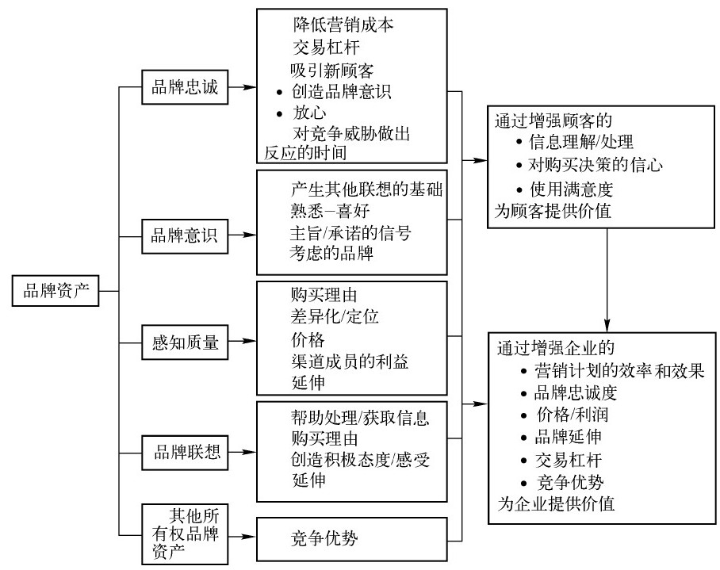

# 品牌

## 品牌管理

随着生产力的丰富，产品的竞争焦点已经从功能、价格等基础要素，发展到产品的品牌、文化、价值观认同等高级要素了。

### 定义

针对企业产品和服务的品牌，综合地运用企业资源，通过计划、组织、实施、控制来实现企业品牌战略目标的经营管理过程。

品牌是一种错综复杂的象征。它是品牌属性、名称、包装、价格、历史、信誉，广告方式的无形总称。品牌同时也是消费者对其使用者的印象，以其自身的经验而有所界定。产品是工厂生产的东西；品牌是消费者所购买的东西。产品可以被竞争者模仿，但**品牌则是独一无二**的，产品极易迅速过时落伍，但成功的品牌却能持久不坠，品牌的价值将长期影响企业。

### 金三角

金三角=领导能力+分析能力+沟通与协调能力

1. 领导能力：品牌经理必须是一个能驱动事情发生的领导者，虽然他领导的对象可能根本就不是他的下属，他需要驱动多个部门、甚至老板一起完成品牌目标。
2. 分析能力：品牌经理必须是个发现机会的高手，分析中找到品牌的成长机会。
3. 沟通与协调能力：品牌经理必须在口头和书面沟通上都具备突出的资质，以支持其行动。

### 银三角

银三角=执行能力+创新能力+掌握专业技能的能力

1. 执行能力：想到还要做到，品牌经理要在关键时刻推动事情发生，自己动手+请别人动手，关键是看到结果。
2. 创新能力：品牌经理不能因循守旧，要能够突破过去，不断创新。
3. 掌握专业技能的能力：这个不用多说，品牌经理必须是专家+杂家的组合，专业范畴的市场研究、广告管理、促销管理、产品管理、品牌战略规划都是基本功，还需要汲取其它专业部门的经验和专业知识，才能全面发展。

## 品牌资产 [1]

品牌意识越强，消费者在选购产品时越会想到该品牌，最终购买该品牌的可能性也越大。 同时，品牌意识也会影响品牌联想与品牌形象的形成及其强度。

品牌资产的主要项目有：

1. 品牌意识（brand name awareness）
1. 品牌忠诚（brand loyalty）
1. 感知质量（perceived quality）
1. 品牌联想（brand associations）

### 品牌意识（brand name awareness） [2]

指的是一个品牌在消费者心中的强度。假如在消费者心中布满了心理看板，每一个看板对应一个品牌的话，品牌在消费者心中意识的强弱就是对应看板的大小。品牌意识是根据消费者对一个品牌的不同的记忆方式进行测量的，从再认（以前曾见过这一品牌吗）到回忆（这类产品你能记起哪些品牌），再到“第一回忆”（第一个回忆出的品牌），最后到支配（唯一回忆出的品牌）。然而，心理学家和经济学家认为，再认和回忆不止是记得一个品牌的信号。

品牌再认（recognition）反映了从过去的接触中获得的熟悉度。再认不必记得在哪里见过该品牌，该品牌为什么与其他品牌有所不同，甚至不需要知道该品牌所属的产品类别。它只需要消费者记得曾经见过该品牌即可。

## 品牌定位 [3]

「定位之父」特劳特提出「品牌定位是企业在市场定位和产品定位的基础上，对特定的品牌在文化取向及个性差异上的商业性决策，它是建立一个与目标市场有关的品牌形象的过程和结果。换言之，即为某个特定品牌确定一个适当的市场位置，使商品在消费者的心中占据一个特殊的位置，当某种需要突然产生时，比如在炎热的夏天突然口渴时，人们会立刻想到『可口可乐』的清凉爽口」。

[1]: http://reader.epubee.com/books/mobile/e2/e22be26cde02a62274cac6fa3d3c6fb5/text00006.html?fromPre=last
[2]: http://reader.epubee.com/books/mobile/e2/e22be26cde02a62274cac6fa3d3c6fb5/text00007.html
[3]: https://www.zhihu.com/pub/reader/119980992/chapter/1284104652725256192
