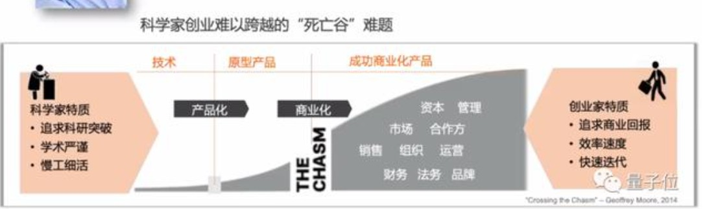
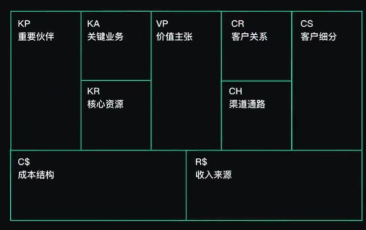
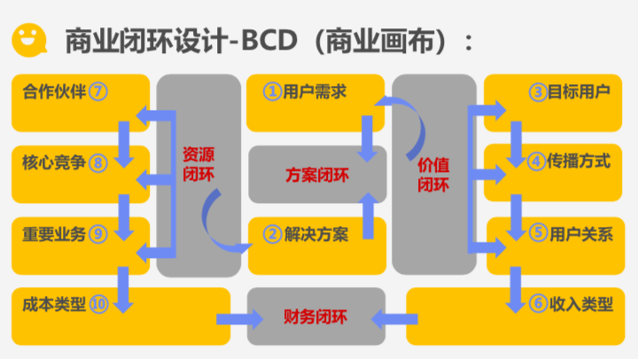
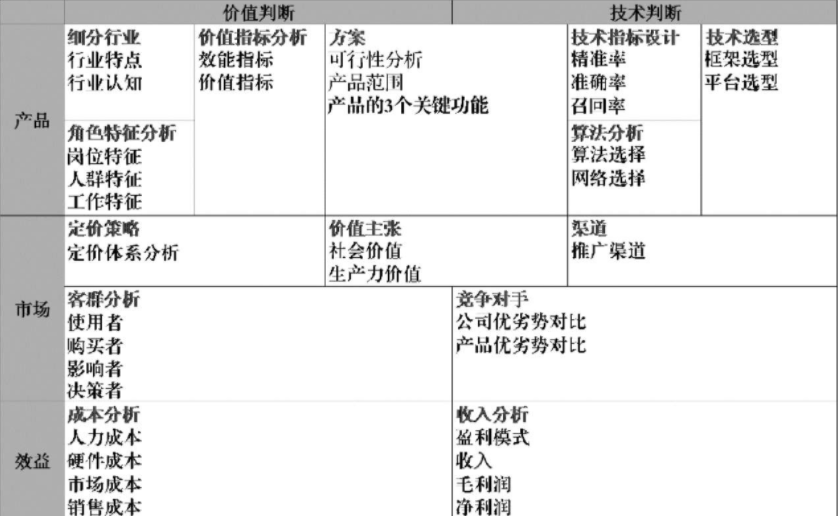

# 商业思维

## 项目主人

产品经理的确有很多时候需要驱动设计、研发、测试、市场、营销等同事才能够完成整个产品的上线运营，但这应该占产品经理的40%精力。产品经理还需要研究行业的变化，了解商业模式的变化，通过数据去看公司产品的**赢利**情况，找到可以改进的点。产品经理不仅是项目经理的角色，还是整个项目的**主人**。[12]

利润 = 收入-成本-费用；

### 目的

有些技术人天生有player的属性，所谓player，就是不满足于只做pawn的人。

技术只是手段，那手段用上了必然要有其目的。盈利？赚吆喝？布局？完成投资人的任务？Whatever you name it.

所以不论是承担项目研发，技术负责，产品负责还是自己创业，有商业思维的人，总会比没有的人看问题深一层，跟他们聊天往往能感受到犀利，不同于纯技术思维的那种“愣”劲儿。 [3]

### AI to B 要理解商业

### 精益思想

用更少资源来做更多事情的方法

1. 快
2. 流动产生价值，定期回顾需求价值
3. kiss原则。keep it simple，stupid。采取简单的方案
4. 处在联系中的事物，才能被简化。纯粹地减少，不是简化。要将被简化的部分进行转移。
5. 不害人的需求，不是完整的需求。veblen原理：无论多坏的改变，都会有一些人受益；无论多好的改变，都会有人受损。
6. 化散乱为规律，化应急为预测。没有预测，就会疲于奔命，四处救火。
7. 只可图示，不可言传。
8. 让公路排满车，就是堵车。要将工作的焦点转移到重要不紧急的事情上去。
9. 目标明确的战士，即使身陷重围，也会向着胜利而战斗。资源总是稀缺的，聚焦才能高效。
10. 持续改进，不忘初心。小心“目标侵蚀”。
11. 细节体现专业。对事物的不断细分，才能体现专业。深入到场景，最容易发现细分。
12. 不要造永动机。不要只优化细节而忽略整体，永动机就是如此。
13. 先准确，后精确。先把握需求的准确方向，再探寻正确的细节。

## 商业

商业是一种有组织的提供顾客所需产品与服务的一种行为，以货币（包括电子货币）为媒介进行交换，[21]它最本质的内容就是通过产品与服务交换实现盈利。

### 商业切入口

最初小米公司只是做手机的，当手机做的不错的时候，他们发现可以基于自己IOT的研发能力，做其它智能产品;其它产品基于小米的IOT平台，能够实现研发，品牌，供应链等联动优势，最后形成一个基于智能硬件的智能网络生态,最大化的实现了产品的商业价值。

## 商业化

创业活动，不断创新的商业模式、线上线下的商业营销活动、除了教育等几个少数行业，大部分产业成熟的标志是实现商业化等等

光做出好产品是不够的，还要在市场上真的有价值，并且能持续保有竞争力。任何新技术都会随着时间的推移而扩散，一般所拥有的时间窗口最多也就是一年多的时间。

在这一段时间内，如何看待当前所面临的场景？在这个场景中技术到底占据多大的地位? 是非关键性的应用还是关键性的应用？技术上的突破和分配，是否产生根本性的问题？在技术的壁垒期，我们能否利用这一段时间构建起技术以外的壁垒？

只有壁垒构建出来，利用时间窗口期把技术优势转化成其他的竞争性壁垒，这样的行业才值得去做。[15]

## 商业化idea

那些值得为之探索商业模式的idea应该源于创始人对某些事物长期思考和体会得到的一些不同寻常的见解。长期来看， 新的创业机会一定是技术创新引起的， 而商业化idea往往拼的是如何理解新技术给社会带来的变化。

## 商业模式 [7]

商业模式就是指企业设计完整的商业逻辑，从而实现企业的生存价值。（《商业模式新生代》[18]）

设计合理的商业模式，就要充分考虑和运用企业运行的内外要素（包括商业前景，融资和资本运作[17]），从而形成一个完整的高效率商业化运行系统，它可以保持产品独特的核心竞争力，并通过最优形式满足客户需求、实现自身价值，与此同时达成持续盈利的目标。 [10]

至少包含了四个方面：产品模式、用户模式、推广模式，最后才是盈利模式。一句话，商业模式是你能提供一个什么样的产品，给什么样的用户创造什么样的价值，在创造用户价值的过程中，用什么样的方法获得商业价值。

### 产品模式

所有的商业模式都要建立在产品模式的基础之上，没有了对产品和用户的思考，公司是不可能做大的，这样的公司注定也走不了多远。

- 成本分析。评估竞品的研发固定成本和单位客户变动成本。如果竞品为客户做了大量的定制开发，那他的单位客户变动成本就很高，可能就很难做大。
- 销售分析。看典型客户数量，代理商数，二次开发商数量，评估销售能力
- 有无辅助产品线。如果该竞品有其它辅助产品线，已经形成产品群，那要看这个产品在产品群中的定位，是个防守型产品还是进攻型产品。防守型产品负责抵御竞争，进攻型产品可能才是盈利的金牛。[23]

### 用户模式

你一定要找到对你的产品需求最强烈的目标用户。如果你说自己的产品是普世的产品，是放之四海而皆准的产品，这就说明你没有认真思考过。

- YY语音：帮助这些游戏工会在游戏对战中多对多沟通
- UC手机浏览器：解决省流量的问题，因为当时手机流量很贵，网速慢且资费高

### 推广模式

即使产品做得再好，如果只靠自然的口碑，只要还没接触到大多数目标用户，就有可能先被互联网巨头盯上。人家一模仿一捆绑，你多年的心血就算白费了。

真正的推广模式是要根据你的用户群，根据你的产品，去设计相应的推广方法。而不是拿钱去刷地铁、刷公交、刷路牌广告。

真正的推广是对产品的不断完善和提升。在推广的过程中，你要研究市场，和目标用户打交道，了解用户真正的需求，了解用户使用产品时遇到的困惑和问题，然后再反馈到产品上进行改进，由此不断帮助产品调整和完善。

**BD／销售**一个个地推式拉客户的方式能够简单粗暴地提升客户量，但这种方式自身最大的瓶颈便是时间长和边际成本线性增加。一个BD一个月拉5个客户，10个客户一个月最佳情况也就拉50个客户，同时商务的成本也扩大了10倍，在AI行业本来就人力成本高企的前提下，进一步提升了固定成本。

**采用与合作伙伴合作**的方式将AI落地，则是另外一种状态。基于共同利益，选择深耕落地行业多年的合作伙伴，一起服务好这个行业的客户。借助合作伙伴已有的资源和客户，相对自身开拓市场来讲，更为更为高效。同时也能有效抢占市场，取得竞争上的相对优势。所需要付出的，只是与合作伙伴共享收益。譬如视觉领域AI巨头拿一些政府的单子，并非自身去投标，而是与运营商背景的合作伙伴一起，共同准备投标，拿下单子，共同实施和分享收益。

在相对分散的中小型企业或组织细分领域，采用渠道合作相比BD／销售方式是一种投入产出比更为合理的方式。BD／销售搞定头部客户，中长尾市场便可以采用渠道合作的方式迅速占领。[16]

### 盈利模式

用户增长是一件很酷的事情，但是如果只追求数据的好看而不思索如何盈利，那么，寒冬之中倒下的很有可能就是这家企业。

Google的两个天才创始人做搜索引擎，好几年找不到赚钱的方法，只能是给雅虎这类的门户网站提供搜索技术服务来赚点糊口的钱。

Overture创造的付费点击模式，确实为广告客户创造了商业价值，但作为寄生于搜索引擎的企业，Overture却并没有为用户创造价值。反而是Google将搜索引擎的用户价值和Overture的付费点击模式完美地结合在了一起。

### AI VS 互联网创业[20]

要知道，在这一波人工智能的大浪潮之前，2000年前后的那一拨互联网的浪潮中，我国的诸多互联网创业公司，包括百度、腾讯、阿里等都是参考硅谷等国外相对成熟的技术与商业模式创新，所以规模化、盈利的时间相对更快一些，商业价值的实现在比较短的时间就可以体现。

但这一次的AI浪潮明显不同，前沿理论、专用芯片、算法框架都需要从底层原创，还需要与行业和数据结合，而不同行业错综复杂，**需求高度定制化**，造成AI商业价值的落地的周期，一定是相对较长。

## 价值层面

BCG的价值3层面把商业模式分成了价值定位和价值传导2个大的层面，每个层面又包括3个小的具体模块，需要分别设计和规划。 [10]

### 商业模式画布 [1]

商业模式画布（BMC）是著名商业模式创新作家、商业顾问亚历山大·奥斯特瓦德在2008年提出的概念。

商业画布是一种能够帮助创业者催生创意、降低猜测、确保他们找对了目标用户合理解决问题的工具。

商业画布不仅能够提供更多灵活多变的计划,还更容易满足用户的需求。更重要的是它可以将商业模式中的元素标准化井强调元素间的相互作用。

1. 客户细分（Customer Segments）：为谁服务？谁来买单？大众/小众市场、利基市场、区隔化市场、多元化市场、多边平台市场。
2. 价值主张（Value Propositions）：服务或产品有什么价值？颠覆式创新、更快更好、个性定制、专注把事情做好、优秀的设计、价格优势、削减成本、抑制风险、连接、方便易用等特点。
3. 渠道通路（Channels）：认知、评估、购买、传递、售后；通路有：搜索引擎、公众平台、应用商店、线下资源等。
4. 客户关系（Customer Relationships）：借助客户口碑传播获客从而维持持续收入
5. 核心资源（Key Resources）：实体资产用户基数、知识产权、人力资源、金融资产、经营资质、用户基数
6. 关键业务（Key Activities）：具体如何服务客户（驱动你做出产品、需求变化）
7. 重要合作（Key Partnerships）：非竞争者之间的战略联盟关系、与竞争者之间的战略合作关系、为开发新业务而构建的合资关系、以及买卖关系。
8. 收入来源（Revenue Streams）：售卖实体产品、使用权收费、租凭收费、“中介”收费、广告收费。
9. 成本结构（Cost Structure）：成本驱动型是越少越好

不用纠结商业模式画布是不是最好的商业模式模型，只要将其作为商业模式设计入门的初步理解材料即可 [2]

![微信读书的商业画布[22]](../img/weread_business_draw.png)

工具：[BMS（商业模式沙盘：Business Mode Sandboxie）](https://bms.your01.com/)

#### 多层次

将人工智能产品的规划、设计、实践与商业模式画布相结合，提出在产品、市场和效益3个层面进行人工智能产品设计，并列出了设计过程中涉及的14项指标。在这3个层面上，通过14项指标，产品经理可以轻松构建人工智能产品画布，如下图所示。人工智能产品画布可以帮助产品经理高效地确定产品规划、厘清产品脉络、确定产品结构，从而提升人工智能产品的设计效率。 [11]

1. **产品层面**：产品层面主要包括一些产品实现的细节：一是人工智能产品的实现方案，包括产品目标、范围、可行性及关键功能架构；二是人工智能产品应用的具体行业和场景，并确定该产品在该场景下实现的效能指标和价值指标；三是实现人工智能产品的技术选型、算法分析和技术指标设计等。
2. **市场层面**：人工智能产品是否成功关键在于产品是否可以获得市场的认可。即使产品非常优秀，如果没有被市场和客户认可，一切投入也都将化为乌有。产品经理在产品规划过程中应从市场层面完成针对产品使用者、购买者、影响者、决策者等的客群分析，完成竞争对手分析，完成产品定价策略规划，以及完成渠道规划。市场层面产品规划最关键的内容是确定产品价值主张。产品价值主张不仅指明了产品方向，而且关系到产品的成败。产品价值主张包括产品带来的社会价值、生产力价值等。
3. **效益层面**：在一个产品概念创立之初，需要建立人工智能产品的效益目标，效益目标可以从经济效益、社会效益等不同层面进行考量，作为产品经理要着重对产品的成本和收入进行分析。产品经理应对效益目标进行拆解，计算投入产出比，如果投入产出比不够理想，则研发该产品没有意义。

## 交易模型

以交易为基本单元来研究产品，目标是建立可持续交易的互惠模型

### 企业、用户、产品关系

用户选择产品：效用-成本>0：

- 直接成本：付出的时间、金钱、数据、态度等
- 间接成本：为了促成交易，付出的搜寻成本

企业生产产品：收益-成本>0

- 收益：现金收入、增加未来收益的各方信任、品牌声誉等

### 效用（欲望的满足程度）的三个属性

- 多样性：时间、欲望、心里感觉、情绪、认知
- 无限性：需求永远无法被完全满足，因为需求是会变得越来越大的
- 个体性：人会受到情境、禀赋、偏好、认知等影响，所以同一个产品带来的效用，对于不同的人来说差距很大，信息的完全性及原有的思维框架会影响每个人对效用的判断

### 交易成本

交易成本：完成一笔交易时，交易双方在买卖前后所产生的各种与此交易相关的成本。也可以理解为”所有买方（卖方）付出但是卖方（买方）没有收到的成本。

#### 分类 [19]

1. 搜寻（商品和交易对象）成本和度量（交易对象和商品的属性）成本；
1. 寻价（议价比价）成本和决策（决策和订立契约）成本；
1. 实施成本和保障（权利、违约、意外、监督等）成本。

##### 搜寻成本与度量成本

- 认知困难：要找的SKU到底在哪个导航里呢？
- 负面预期：这个ICON可以点吗，点了会不会出问题？
- 度量困难：这家餐厅装修看着不错，到底好不好吃？大众点评的评分可信吗？

##### 寻价成本和决策成本

- 供给不足导致的排队等待：软件园高峰期，在不加价的情况下，需要排队近1个小时才能打到车。
- 线下的议价流程：在线上租房信息平台达成意向后，仍需要线下与房东再面对面议价，签署合同。
- 商业化带来的决策延迟：每次打开APP，弹窗广告都要强制展示5min以上。

##### 实施成本和保障成本

- 冗余的操作：每次微信AA账单需要打开“钱包-收付款-群收款”然后发到群里，而不能直接在群聊里发起。
- 中断与重复：每次公众号文章看到一半退出回消息，要重新看需要打开公众号再把文章搜索出来（浮窗功能出来之前..）。
- 信任危机：害怕低价促销的产品质量没有保障，不敢买（在“7天无理由退货”推出前的困境）。

降低交易成本

- 标准化：把供给品尽量变成标准品，降低了度量成本，降低了不确定性带来的决策成本和保障成本
- 线上化：降低了企业与用户触发、服务、维护等成本

## 三级火箭 [9]

互联网商业就是产品、流量、转化率三个词。

- 第一级：搭建高频头部流量
- 第二级：沉淀某类用户的商业场景
- 第三级：完成商业闭环

### 例子

360的一级火箭是免费杀毒工具；二级火箭是从免费杀毒工具变为网络安全平台（360安全浏览器、360安全网址导航）；三级火箭就是它最终承载的商业闭环（从安全浏览器和网址导航的广告收入）。

搜狗现在的一级火箭是来自腾讯的头部流量；二级火箭是内置搜索，通过庞大的使用场景去释放更多搜索的需求。三级火箭即商业变现。

逻辑思维第一级火箭是罗振宇坚持了多年的免费脱口秀；第二级火箭是得到APP，沉淀用户的商业场景；第三级火箭，得到APP里面的付费课程。

小米的一级火箭是手机；二级火箭是一系列的零售场景（小米商城、小米之家、小米小店）；三级火箭是一个高利润的产品。

你要赚利润的东西，并非是他人要赚钱的地方。面对这样的竞争者，传统的生意套路会失效。你以为亚朵在做酒店，其实亚朵在做社群共创的实景电商。

### 必要条件

1. 三级火箭递推一定是高频推低频。
1. 通过一级火箭获得大量用户之后，要快速开展一个能够沉淀用户的商业场景。
1. 操控三级火箭的人，一定是个势能积累到一定程度的人。（首先要有强大的融资能力；其次在头部流量铺开的时候要有短时间聚拢资源的能力）
1. 操盘三级火箭的人一定是个狠人。（一级火箭就是抢别人流量，要能够承受他人指责）

### 原理

火箭级数越多，需要的燃料越少。但每增加一级，不可控程度越高。就像做商业，模型过于复杂，变现链条过长，就容易玩脱。

所以，三级火箭是一个成本和可控性平衡后的选择。

### AI产品的商业化

- 基于企业服务费的商业路径：参照行业内对手的收费模式，是按单收费，还是按配置收费 （朝头部客户去做，有大订单，投入产出比高，eg：金融领域千万订单）
- 基于互联网玩法的商业路径：小度音箱的模式，先近于免费抢占市场，后割韭菜。（SAAS服务一视同仁，找代理铺量）

TODO:[14]

[软件（算法）专利保护](https://github.com/scutan90/DeepLearning-500-questions/blob/master/ch19_%E8%BD%AF%E4%BB%B6%E4%B8%93%E5%88%A9%E7%94%B3%E8%AF%B7%E5%8F%8A%E6%9D%83%E5%88%A9%E4%BF%9D%E6%8A%A4/%E7%AC%AC%E5%8D%81%E4%B9%9D%E7%AB%A0_%E8%BD%AF%E4%BB%B6%E4%B8%93%E5%88%A9%E7%94%B3%E8%AF%B7%E5%8F%8A%E6%9D%83%E5%88%A9%E4%BF%9D%E6%8A%A4.md)

## 阿里云视觉智能开放平台 [4] [5] [6]

商业化提供了预付费QPS、后付费、预付费资源包、按量付费四种收费模式。

离线SDK介绍：阿里云视觉智能开放平台的离线SDK可以为终端设备提供AI能力，目前支持提供OCR、美颜、分割等常用AI能力的离线SDK。阿里云视觉智能开放平台通过license授权方式管理离线SDK。

准备工作：在安装和使用阿里云SDK前，确保您已经注册阿里云账号并生成访问密钥（AccessKey）。详情请参见创建AccessKey。

## 注意：商业化不能损害用户体验[24]

商业化不能以牺牲用户体验为代价，简单粗暴的手段也许能促进短期收入增长，却会对产品长期价值造成不可逆转的损失。

那么，如何才能在商业化设计时兼顾用户体验？

1、从形式上看，商业模式要与产品调性自然的融合。

小龙说“让商业存在于无形之中”，朋友圈正是这样做的。从形式上看，朋友圈广告无论是图片还是视频，都像朋友发的朋友圈，用户也可以像好友一样互动和评论。这种方式很好的耦合了产品形态，不影响用户阅读的连贯性，在业内也属于创新的做法。

从风格上看，朋友圈广告的品质较高，和微信的产品调性非常符合。而且最初上线推出的三款广告，还成为用户津津乐道的话题。

当商业化和用户体验存在矛盾时，要在用户可接受的范围内进行商业化，尽量寻求两者的平衡。

2、让用户有选择权。

有些产品的弹窗广告没有关闭选项，或者没有提示就自动为包月用户续费，这样的方式会让用户积累越来越多的负能量，轻则吐槽重则卸载产品。

更平衡的做法是给用户选择权，在明显的地方提醒用户，方便没有需求的用户方便的取消服务。

3、对用户行为进行分析，制定更精细化的商业策略。

朋友圈广告在这方面做了很多努力：

微信团队会对广告总量进行控制，让用户在一定时间内只收到1-2条广告，避免过度曝光。此外，对用户特征和兴趣点进行分析，尽可能推送用户更感兴趣的广告内容。

在这个基础上，还会根据用户在朋友圈里的行为特征决定推送广告的策略，针对那些看到广告就会略过或点击不感兴趣的用户，减少广告推送，避免对这些广告敏感用户带来骚扰。

[1]: http://www.woshipm.com/pmd/2180363.html
[2]: https://www.zhihu.com/question/21472586s
[3]: https://www.zhihu.com/question/348474416/answer/841775222
[4]: https://help.aliyun.com/document_detail/143096.html?spm=a2c4g.11186623.6.548.1a4a53cblCY4Zg
[5]: https://developer.aliyun.com/article/778839?spm=a2c6h.12873581.0.dArticle778839.5de439932BzTaX&groupCode=viapi
[6]: https://help.aliyun.com/document_detail/182962.html?spm=a211p3.14020179.J_7524944390.13.738f4b58g1fD6Y
[7]: https://36kr.com/p/1721542885377
[8]: https://www.jianshu.com/p/02df7160b7b0
[9]: https://www.jianshu.com/p/ff38ced05cbd
[10]: https://weread.qq.com/web/reader/40632860719ad5bb4060856kc0c320a0232c0c7c76d365a
[11]: https://weread.qq.com/web/reader/0c032c9071dbddbc0c06459k1c3321802231c383cd30bb3
[12]: https://weread.qq.com/web/reader/46532b707210fc4f465d044k6ea321b021d6ea9ab1ba605
[13]: https://www.zhihu.com/pub/reader/119583028/chapter/1057335986127769600s
[14]: https://radiant-brushlands-42789.herokuapp.com/medium.com/predict/choosing-the-right-ai-business-model-df5d81420d74
[15]: https://www.infoq.cn/article/2017/12/Ground-practice-visual-AI
[16]: https://coffee.pmcaff.com/article/1593027702113408/pmcaff?utm_source=forum
[17]: https://coffee.pmcaff.com/article/2447262389384320/pmcaff?utm_source=forum
[18]: http://www.woshipm.com/pmd/3024508.html
[19]: http://www.woshipm.com/pmd/3402762.html
[20]: https://www.weiyangx.com/382066.html
[21]: https://zhuanlan.zhihu.com/p/25965712
[22]: https://vickydyy.github.io/2019/05/26/Data-Business-Thought/
[23]: https://zhuanlan.zhihu.com/p/30423299
[24]: https://zhuanlan.zhihu.com/p/39930758
