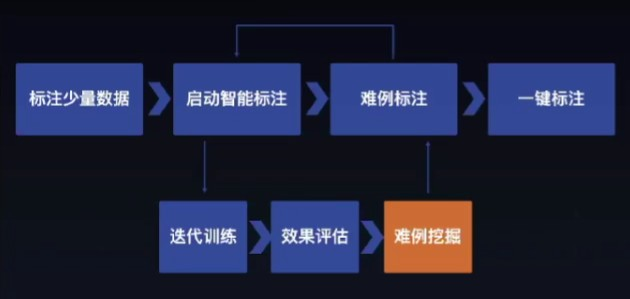

# 数据 [1]

数据通常来讲能够反应出某项业务或某类业务。

## 作用

一方面，在后续的运营计划中，数据能有效地帮助运营的小伙伴进行拉新、留存以及促活，另一方面，数据也能帮助产品经理发现用户在使用过程中出现的问题，从而进行流程的优化与布局的提升，提升用户体验。[4]

比如像很多互联网公司都成立了大数据团队，收集用户的社交、电商、搜索行为等数据，通过所搜集的大数据来制定商业决策依据，以及通过数据挖掘形式，找到创新产品的机会。

大的互联网公司在满足自己内部决策需求的同时，也成了了大数据部门给其它公司进行赋能，比如蚂蚁金服的**数据产品芝麻信用**，不仅能够成为蚂蚁内部各种金融产品的信用审核依据，也开放给了很多行业如出行、金融、共享服务公司等，极大提高了基于信用服务的门槛和便捷性。

通过数据采集处理分析驱动产品的价值验证、功能优化和业务决策

## 数据至上

数据至上包含两个方面：（1）能够量化客户所关心的问题，做一个数字化的支持者；（2）能够建立用于构建高质量 AI 模型的综合数据集。此外，还需要获取准确反映用户工作、行为、交互模式和痛点的数据。数据形式可以是像素、字符、数字或者比特。

如果能够对数据提取、数据处理以及数据可视化有基本的了解，则有助于创建更具客户价值的 AI 解决方案。[12]

**如何数据化考核设计结果？**[14]

## 伪数据

只蹭热度，没有做好产品核心功能的引流，导致最终拉新效果很差，活动很快就叫停了。如果我们只看活动的曝光量、参与量，会觉得很兴奋，但其实离产品的核心目标很远。

由于标题党导致的高点击率的数据而沾沾自喜，殊不知这种勤奋的打扰，长期来看是在损伤用户的利益，透支产品的信用[8]

## 数据分类 [20]

### 设备类：

设备类数据主要指用户客户端（如手机、平板电脑、笔记本、PC等 ）等各类参数，主要通过页面、APP内嵌入各类sdk，js脚本等方式进行采集和获取。

### 环境类：

环境类数据是指用户发起操作请求时所处环境的相关数据，可以分为虚拟环境和物理环境两大类。

- 虚拟环境数据，主要指用户所的IP、WiFi等网络环境相关数据。
- 物理环境数据，主要指用户的手机定位、基站位置等相关数据。

### 行为类：

行为类数据是指用户在网页或APP上进行各种操作时的各类数据，如用户页面停留时长、文本输入时长、键盘敲击频次等。

### 第三方数据：

第三方数据指通过从公开途径或第三方数据服务商处获取的各类数据，包括但不限于用户的运营商数据、电商消费数据、银行数据、司法数据等各类数据。

## 解决对策

把预估的数据代入到决策模型中，进行模拟仿真，来评估执行决策结果的成本以及决策风险;并相互沟通这种有依据的成本。

## 业务数据 [2]

AI产品也需要采用类似数据埋点的方式去收集产品投放前后的业务指标差异，比如：GMV差异、点击率差异、转化率差异。首先为了验证产品是否对业务产生了价值，用一个粗略的公式表示AI产品的业务价值，其次是为了分析产品的哪些品功能存在优化空间，最后还可以驱动业务决策，例如例如推荐系统在电商商品推荐和广告推荐中的应用。

AI产品价值=（提高的时效*时效成本+GMV提升）-（AI硬件资源成本+研发成本）

## 数据采集

![数据采集[21]](../img/data_collect.png)

数据的采集可以通过线下构建对应业务场景需要的环境进行拍摄采集，也可以通过平台内已有数据（线上数据、旧数据）、第三方数据（通过开源、付费购买、爬虫爬取多多种形式）获取。

1. 线上数据集的处理：多采用badcase，重新标注、增强。
1. 爬取数据集：爬取公开渠道如百度图片的对应label数据集，并区分可用不可用。

因数据集都为图片数据，并且模型是基于深度学习技术构建，故涉及到数据ETL、特征工程等一些处理暂时不需要，后续可根据业务场景和应用技术的拓展，在技术架构和平台架构补充上对应的能力。

数据集获取完成后，可以将数据按照不同的类型存放，通过数据集管理页面进管理。数据类型可以按照不同的维度区分，例如：

1. 以标品和非标品区分。

- 标品数据：标品静态状态数据、标品动态状态数据
- 非标品数据：标品多角度数据、标品静态状数据、标品动态状态数据、其他异常情况数据

2. 以数据来源渠道区分。

- 线下：构建不同的场景（静态动态）进行拍摄采集
- 线上：平台内已有数据（线上数据、旧数据）、第三方数据（开源数据集、付费数据集、爬取数据集）

3. 以数据格式区分。图片、视频、其他格式（2d、3d）。
4. 以数据使用性区分。基本数据集、训练数据集（含标注）、验证数据集、异常数据集、自定义数据集。

数据集应当有生命周期的管理和备注信息，以免在运营一段时间后数据量杂乱冗余。[18]

### 问题 [6] [7]

- 采集难:实际场景的数据很难采集完全,导致模型泛化能力有限
- 标注成本高:需要标注大量的数据,时间周期长
- 清洗成本高:难以快速获取高质量的数据

### 数据质量

- 关联度；
- 时效性；
- 范围；
- 可信性。

### 数据来源

稳定的数据来源渠道能够持续的提供深度学习“粮食”（深度学习理论上样本是多多益善，且个类别需要均衡），因此一方面可以将线上的业务样本进行沉淀，被动积累，另一方面可以针对业务样本类型，针对性的从目标网站进行爬取。当然，不能忽略的一个大的数据来源是，开源的数据集，或者竞赛的样本集，这些数据一般有较高的标注质量，可以直接拿来训练或者经过极小成本的人工审核即可以达到训练要求。

### 数据沉淀

可以将线上的业务样本进行沉淀，被动积累

AI产品除了收集业务指标数据指导产品是否需要优化，还需要进一步做好训练数据沉淀工作。AI技术在投入试点到成熟推广，训练数据一直都是必不可少的，尤其是真实场景的数据对算法迭代更是起到“致命”的作用。

因此，如果能够源源不断的回收实际场景数据并且清洗标注，就可以提升算法准确率指标，最终提高产品使用效果，例如：可以考虑通过以下流程来实现。

其他来源：直接购买行业数据和免费的数据源；自行采集和爬取；第三方合作。

### 数据标注

真实数据集（ground-truth dataset）是常规数据集，但已添加了注释。 注释可以是在图像上绘制的框，表示样本的书面文本，电子表格的新列或机器学习算法应学习输出的其他任何内容。[10]

真实数据集分为以下几类:[11]

1. 合成制作:图像由计算机模型或效果图生成。
1. 真实制作:一个视频或图像序列的设计和制作。
1. 真实选择:真实的图像从现有的源中选择。
1. 机器自动标注:采用特征分析和学习的方法从数据中提取特征。
1. 人工标注:专家定义特征和对象的位置。
1. 组合式:上述任何一种混合物。

问题：数据遮挡现象严重、数据多样性不足,例如光线差异、数据样本不均衡

图像智能标注、文本智能标注、难例识别、多人标注

更多见[3] [8]

https://wao.ai/

### 数据清洗

问题：数据质量不佳、数据分布不均、大量干扰数据、大量重复数据

数据清洗可使数据获得用于分析的正确结构（Shape）和质量（Quality）。

相似度去重、去模糊、裁剪/旋转等、自定义

- 单变量探索
- 多变量探索
- 采样 —— 平衡（Balanced）、分层（Stratified）…
- 数据分配 —— 创建训练+验证+测试数据集 …
- 数据替换 —— 剪切（Cutting）、分割（Splitting）、合并
- 缺失值处理：删除或填充（Imputation）
- 构造特征变量
- 特征工程：从已有的数据中构造出对目标变量有强影响力的特征变量
- 标准化和归一化：无量纲化
- 独热编码：将类别变量进行拆分
- 加权与选择 —— 属性加权、自动优化 …
- 属性生成 —— ID生成 …[16]
- 分箱（Binning）：数值型变量转为类别变量，或连续性变量变为离散型变量
- 数值变量和类别变量 [13]

### 数据扩充

增强、合成、生成、数据集市

### 数据读取

1. 获取数据：爬虫、数据库导出
2. 存储数据：csv、excel、json、mysql [13]

### 管理分析

数据集管理、版本管理、数据挖掘、数据可视化

## 放入真实商业环境 [3]

不止GMV=DAU*转化率*客单价

1. 剔除虚假证据
1. 深入发现问题
1. 挖掘潜在因素
1. 观察长期趋势

## 工具：

Excel、SQL

神策分析、GrowingIO、友盟、TalkingData、诸葛IO、http://www.51.la/、http://www.google.cn/analytics/ 这种工具平台

## 数据问题 [5]

1. 存不下
1. 流不动
1. 用不好

### 存不下——数字化浪潮下的海量数据存储挑战

数据量从PB级向EB级迈进，数据量将从2018年的32.5ZB快速增长到2025年的180ZB。

存储扩展性不足：传统存储由独立的控制器与硬盘框组成，当容量不足时可增加新的硬盘框进行级联，但由于控制器的处理能力受限，存储的扩展能力非常有限。

存储协议类型单一：非结构化数据逐步成为企业数据的主体。随着电商、物联网等业务扩张，80%的新增数据由各类音视频、日志等非结构化数据构成。然而传统存储协议类型单一，无法同时满足块、对象、文件、大数据等多样性数据的存取需求，企业不得不为每一种新的数据类型新增一种存储设备，增加了高效利用存储资源的难度。存储成本依然高昂：越来越多的企业选择将数据长期保存。2017年起，移动运营商因合规性要求，将其设备日志的保存周期从2个月增加至6个月。

这意味着其数据存储服务器的设备规模将增加至少2倍。传统的架构中，服务器因存储需求不断扩容，但CPU的使用率却始终处于较低的状态，资源得不到合理利用，无疑会对采购成本和维护成本造成更大的压力。企业不得不因为存储成本而放弃大量宝贵数据。

### 流不动——由来已久的数据孤岛难题

孤立的数据价值并不显著，只有当数据像水一样流动起来，才能打破“数据壁垒”，最大化释放其价值。

数据的“三类孤岛”：应用孤岛：不同应用产生的数据分别存放在不同的存储系统中，而且这些数据由于各自的特征，彼此之间是无法共享使用的，即形成“应用孤岛”问题；管理孤岛：为对生产数据加以保护和使用，会将生产数据的一个副本，拷贝到各个系统（如备份、容灾、归档、开发测试和分析系统）中进行管理和使用。即便是同一份数据，为实现不同目的，还需分别存储、管理和使用，即形成“管理孤岛”问题；地理孤岛：由于企业的更新换代，将存在多套存储设备，比如生产环境、非生产环境、云环境和边缘环境，企业的数据将存放在不同的地方，形成“地理孤岛”问题。

### 用不好——数据供应不足造成应用复杂低效

海量的数据孕育了前所未有的机遇，也带来了巨大的挑战。甚至有人说，从来不缺数据，数据多了反而成为一种负担。也有人说，数据只是资源，而不是资产，很难产生价值。其根本原因是没有用好数据，数据没有释放价值。而影响数据价值释放的主要原因是数据供应不足，无法反馈业务本质，支持业务决策：大量数据未存储。

企业每天会产生大量数据，但传统的数据录入需要预先的人工规划，这导致大量非结构化数据以及一些新型的数据无法进入系统（例如IoT数据、视频数据、图片数据等）。数据的缺失会削弱对业务的感知，无法真实及时地反映出业务本质。

找不到数据传统企业通常通过数据表来管理和分析数据，规模较大的公司数据表甚至可以达到数百万张，而且分散在各个业务系统中。如果没有统一数据目录和全局数据视图，要在上百万张报表中找到特定的数据，好比大海捞针，无法应对灵活多变的业务需求。

[1]: http://www.woshipm.com/data-analysis/2696737.html
[2]: http://www.woshipm.com/pmd/3657472.html
[3]: https://www.cnwebe.com/articles/43675.html
[4]: http://www.woshipm.com/pmd/707412.html
[5]: http://www.changgpm.com/thread-350-1-1.html
[6]: http://www.xmamiga.com/3573/
[7]: https://www.bilibili.com/video/BV1Zp4y1Q7ub?from=search&seid=1470711389248919578
[8]: https://www.zhihu.com/market/paid_column/1312360599620358144/section/1332369605311516672
[9]: https://www.appcues.com/blog/product-managers-and-artificial-intelligence
[10]: https://wao.ai/blog/dataset-vs-ground-truth-dataset#:~:text=A%20ground%2Dtruth%20dataset%20is,algorithm%20should%20learn%20to%20output.
[11]: https://link.springer.com/chapter/10.1007/978-1-4302-5930-5_7
[12]: http://www.uml.org.cn/devprocess/201910163.asps
[13]: http://www.followmedoitbbs.com/forum.php?mod=viewthread&tid=8312&extra=page%3D1
[14]: https://www.yuque.com/linyecx/abusg2/gsyrft
[15]: https://zhuanlan.zhihu.com/p/218468169
[16]: https://www.080910t.com/research/data-preprocessing-and-data-cleaning/
[17]:
[18]: https://coffee.pmcaff.com/article/2162967852132480/pmcaff?utm_source=forum&newwindow=1
[19]: https://www.yuque.com/linyecx/abusg2/gsyrft
[20]: https://zhuanlan.zhihu.com/p/59042022
[21]: http://sjrzld.com/a/AI0273.html
