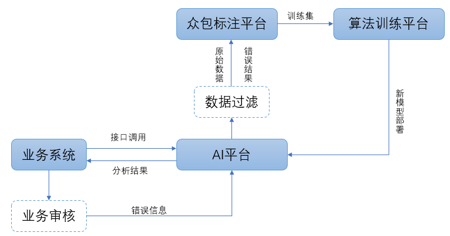

# 数据 [1]

一方面，在后续的运营计划中，数据能有效地帮助运营的小伙伴进行拉新、留存以及促活，另一方面，数据也能帮助产品经理发现用户在使用过程中出现的问题，从而进行流程的优化与布局的提升，提升用户体验。[4]

比如像很多互联网公司都成立了大数据团队，收集用户的社交、电商、搜索行为等数据，通过所搜集的大数据来制定商业决策依据，以及通过数据挖掘形式，找到创新产品的机会。

大的互联网公司在满足自己内部决策需求的同时，也成了了大数据部门给其它公司进行赋能，比如蚂蚁金服的**数据产品芝麻信用**，不仅能够成为蚂蚁内部各种金融产品的信用审核依据，也开放给了很多行业如出行、金融、共享服务公司等，极大提高了基于信用服务的门槛和便捷性。

通过数据收集处理分析驱动产品的价值验证、功能优化和业务决策

## 分析方法

### 决策支持

决策支持是通过简单的求和以及易于理解的分析模型，帮助用户做出决策，比如对比本月同比和环比用户平均消费金额，从而决定通过什么决策活动来提高本月的用户平均消费金额。比如建立一个广告投入因素和新增用户的关系模型，就能够预测投入多少广告额，能带来多少新增用户。

简单的关系模型产品经理是能通过Excel表格分析出来的，如柱状图、折线图等。

如果一项因素引发问题的因素很复杂，则需要建立一个由多个因素组成的预测模型。通过这个模型，我们可以观察模型中某个因素对整体结果造成的影响。预测模型需要用到的统计方法有交叉列表统计、统计学假设检验 、多元回归分析等，这个阶段大部分产品经理都需要求助数据分析师的帮助了。

### 系统优化

系统优化指的是帮助用户构建让计算机执行的方案算法，常用的系统优化方法有机器学习。

相比简单模型的决策模型，系统通过机器学习方法分析出系统中更详细的因素，比如系统优化能分析出广告投入多少金额，能带来新用户的快速增长，以及广告投放中具体什么投放渠道，效果最好。

机器学习的优势在于能从数据中学习出其本身包含的模式和规律，并以此来建立模型。比今日头条，就是通过分析我们过去浏览的记录，利用机器学习建立模型，从而给我们推荐类似的内容。系统优化用到的统计方法有逻辑回归分析、聚类、主成分分析、决策树分析等。

## 伪数据

只蹭热度，没有做好产品核心功能的引流，导致最终拉新效果很差，活动很快就叫停了。如果我们只看活动的曝光量、参与量，会觉得很兴奋，但其实离产品的核心目标很远。

由于标题党导致的高点击率的数据而沾沾自喜，殊不知这种勤奋的打扰，长期来看是在损伤用户的利益，透支产品的信用[8]

## 解决对策

把预估的数据代入到决策模型中，进行模拟仿真，来评估执行决策结果的成本以及决策风险;并相互沟通这种有依据的成本。

## 业务数据 [2]

AI产品也需要采用类似数据埋点的方式去收集产品投放前后的业务指标差异，比如：GMV差异、点击率差异、转化率差异。首先为了验证产品是否对业务产生了价值，用一个粗略的公式表示AI产品的业务价值，其次是为了分析产品的哪些品功能存在优化空间，最后还可以驱动业务决策，例如例如推荐系统在电商商品推荐和广告推荐中的应用。

AI产品价值=（提高的时效*时效成本+GMV提升）-（AI硬件资源成本+研发成本）

## 数据收集 [6] [7]

- 采集难:实际场景的数据很难采集完全,导致模型泛化能力有限
- 标注成本高:需要标注大量的数据,时间周期长
- 清洗成本高:难以快速获取高质量的数据

### 数据质量

- 关联度；
- 时效性；
- 范围；
- 可信性。

### 数据来源

稳定的数据来源渠道能够持续的提供深度学习“粮食”（深度学习理论上样本是多多益善，且个类别需要均衡），因此一方面可以将线上的业务样本进行沉淀，被动积累，另一方面可以针对业务样本类型，针对性的从目标网站进行爬取。当然，不能忽略的一个大的数据来源是，开源的数据集，或者竞赛的样本集，这些数据一般有较高的标注质量，可以直接拿来训练或者经过极小成本的人工审核即可以达到训练要求。

### 数据沉淀

可以将线上的业务样本进行沉淀，被动积累

AI产品除了收集业务指标数据指导产品是否需要优化，还需要进一步做好训练数据沉淀工作。AI技术在投入试点到成熟推广，训练数据一直都是必不可少的，尤其是真实场景的数据对算法迭代更是起到“致命”的作用。

因此，如果能够源源不断的回收实际场景数据并且清洗标注，就可以提升算法准确率指标，最终提高产品使用效果，例如：可以考虑通过以下流程来实现。

其他来源：直接购买行业数据和免费的数据源；自行采集和爬取；第三方合作。

### 数据标注

问题：数据遮挡现象严重、数据多样性不足,例如光线差异、数据样本不均衡

图像智能标注、文本智能标注、难例识别、多人标注

更多见[3] [8]

### 数据清洗

问题：数据质量不佳、数据分布不均、大量干扰数据、大量重复数据

相似度去重、去模糊、裁剪/旋转等、自定义

### 数据扩充

增强、合成、生成、数据集市

### 管理分析

数据集管理、版本管理、数据挖掘、数据可视化

## 放入真实商业环境 [3]

不止GMV=DAU*转化率*客单价

1. 剔除虚假证据
1. 深入发现问题
1. 挖掘潜在因素
1. 观察长期趋势

## 工具：

神策分析、GrowingIO、友盟、TalkingData这种工具平台

## 数据问题 [5]

1. 存不下
1. 流不动
1. 用不好

### 存不下——数字化浪潮下的海量数据存储挑战

数据量从PB级向EB级迈进，数据量将从2018年的32.5ZB快速增长到2025年的180ZB。

存储扩展性不足：传统存储由独立的控制器与硬盘框组成，当容量不足时可增加新的硬盘框进行级联，但由于控制器的处理能力受限，存储的扩展能力非常有限。

存储协议类型单一：非结构化数据逐步成为企业数据的主体。随着电商、物联网等业务扩张，80%的新增数据由各类音视频、日志等非结构化数据构成。然而传统存储协议类型单一，无法同时满足块、对象、文件、大数据等多样性数据的存取需求，企业不得不为每一种新的数据类型新增一种存储设备，增加了高效利用存储资源的难度。存储成本依然高昂：越来越多的企业选择将数据长期保存。2017年起，移动运营商因合规性要求，将其设备日志的保存周期从2个月增加至6个月。

这意味着其数据存储服务器的设备规模将增加至少2倍。传统的架构中，服务器因存储需求不断扩容，但CPU的使用率却始终处于较低的状态，资源得不到合理利用，无疑会对采购成本和维护成本造成更大的压力。企业不得不因为存储成本而放弃大量宝贵数据。

### 流不动——由来已久的数据孤岛难题

孤立的数据价值并不显著，只有当数据像水一样流动起来，才能打破“数据壁垒”，最大化释放其价值。

数据的“三类孤岛”：应用孤岛：不同应用产生的数据分别存放在不同的存储系统中，而且这些数据由于各自的特征，彼此之间是无法共享使用的，即形成“应用孤岛”问题；管理孤岛：为对生产数据加以保护和使用，会将生产数据的一个副本，拷贝到各个系统（如备份、容灾、归档、开发测试和分析系统）中进行管理和使用。即便是同一份数据，为实现不同目的，还需分别存储、管理和使用，即形成“管理孤岛”问题；地理孤岛：由于企业的更新换代，将存在多套存储设备，比如生产环境、非生产环境、云环境和边缘环境，企业的数据将存放在不同的地方，形成“地理孤岛”问题。

### 用不好——数据供应不足造成应用复杂低效

海量的数据孕育了前所未有的机遇，也带来了巨大的挑战。甚至有人说，从来不缺数据，数据多了反而成为一种负担。也有人说，数据只是资源，而不是资产，很难产生价值。其根本原因是没有用好数据，数据没有释放价值。而影响数据价值释放的主要原因是数据供应不足，无法反馈业务本质，支持业务决策：大量数据未存储。

企业每天会产生大量数据，但传统的数据录入需要预先的人工规划，这导致大量非结构化数据以及一些新型的数据无法进入系统（例如IoT数据、视频数据、图片数据等）。数据的缺失会削弱对业务的感知，无法真实及时地反映出业务本质。

找不到数据传统企业通常通过数据表来管理和分析数据，规模较大的公司数据表甚至可以达到数百万张，而且分散在各个业务系统中。如果没有统一数据目录和全局数据视图，要在上百万张报表中找到特定的数据，好比大海捞针，无法应对灵活多变的业务需求。

[1]: http://www.woshipm.com/data-analysis/2696737.html
[2]: http://www.woshipm.com/pmd/3657472.html
[3]: https://www.cnwebe.com/articles/43675.html
[4]: http://www.woshipm.com/pmd/707412.html
[5]: http://www.changgpm.com/thread-350-1-1.html
[6]: http://www.xmamiga.com/3573/
[7]: https://www.bilibili.com/video/BV1Zp4y1Q7ub?from=search&seid=1470711389248919578
[8]: https://www.zhihu.com/market/paid_column/1312360599620358144/section/1332369605311516672
