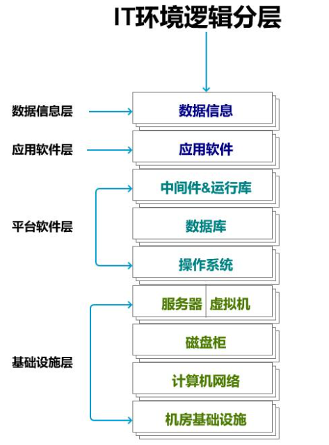

# 服务

## 普通服务

### IaaS

Infrastructure-as-a-Service（缩写：IaaS），基础设施即服务：是提供消费者处理、储存、网络以及各种基础运算资源，以部署与执行操作系统或应用程序等各种软件。IaaS 是云服务的最底层，主要提供一些基础资源。它与 PaaS 的区别是，用户需要自己控制底层，实现基础设施的使用逻辑。 客户端无须购买服务器、软件等网络设备，即可任意部署和运行处理、存储、网络和其它基本的计算资源，不能控管或控制底层的基础设施，但是可以控制操作系统、储存装置、已部署的应用程序，有时也可以有限度地控制特定的网络元件，像是主机端防火墙。

### PaaS

平台即服务（英语：platform as a service，缩写：PaaS）是一种云计算服务，提供运算平台与解决方案服务。在云计算的典型层级中，PaaS层介于软件即服务与基础设施即服务之间。PaaS提供用户将云端基础设施部署与创建至客户端，或者借此获得使用编程语言、程序库与服务。用户不需要管理与控制云端基础设施（包含网络、服务器、操作系统或存储），但需要控制上层的应用程序部署与应用托管的环境。PaaS将软件研发的平台做为一种服务，以软件即服务（SaaS）模式交付给用户。因此，PaaS也是SaaS模式的一种应用。但是，PaaS的出现可以加快SaaS的发展，尤其是加快SaaS应用的开发速度。

### SaaS

软件即服务（英语：Software as a Service，缩写：SaaS，发音：sæs或sɑs），亦可称为“按需即用软件”（即“一经要求，即可使用”），它是一种软件交付模式。在这种交付模式中，软件仅需通过网络，不须经过传统的安装步骤即可使用，软件及其相关的数据集中托管于云端服务。用户通常使用精简客户端，一般即经由网页浏览器来访问、访问软件即服务。SaaS 最大的特色在于软件本身并没有被下载到用户的硬盘，而是存储在提供商的云端或者服务器。对比传统软件需要花钱购买，下载。软件即服务只需要用户租用软件，在线使用，不但大大减少了用户购买风险, 也无需下载软件本身，无设备要求的限制

### DaaS

数据即服务（Data-as-a-Service，DaaS）是指与数据相关的任何服务都能够发生在一个集中化的位置，如聚合、数据质量管理、数据清洗等，然后再将数据提供给不同的系统和用户，而无需再考虑这些数据来自于哪些数据源。

看得见摸不着的东西就可以叫做云。传统的云计算服务模式有三种即：IaaS、PaaS、SaaS。如下图所示，我们通常把一整套IT系统的逻辑组成分为四层，从下往上依次是基础设施、平台软件、应用软件和数据信息。

## 云服务

看得见摸不着的东西就可以叫做云。传统的云计算服务模式有三种即：IaaS、PaaS、SaaS。如下图所示，我们通常把一整套IT系统的逻辑组成分为四层，从下往上依次是基础设施、平台软件、应用软件和数据信息。

### IaaS

在IaaS里，用户无需关心计算，网络，存储等基础资源，这部分用户看得见摸不着，所以叫做IaaS云服务。

### PaaS

PaaS构建在IaaS之上，在基础架构以外还额外提供业务所需的运行环境。例如阿里云最近推出的轻量级应用服务器，就是一种PaaS服务。在早期的个人网站里，很多站长会把自己的网站代码（静态或者动态）上传到虚拟主机，虚拟主机已经集成了类似Ngix或者Apache等服务容器，会自动运行这些代码，生成对应的web页面。在这种环境里，用户只需通过FTP上传下载就能完成简单的网站维护。比如博主的这个个人网站就是采用的虚拟主机。

在PaaS里，用户无需关心中间件，数据库等更下层的平台部分，这部分用户看得见摸不着，所以叫做PaaS第二云服务。

### SaaS

而SaaS是最成熟也最广为人知的云计算服务模型，SaaS的目标是将一切业务运行的后台环境放入云端，最终用户可见的只是软件服务本身，完全不需要关心软件背后的计算、所需消耗的资源等等。通常情况下，SaaS服务是由IaaS和PaaS服务开发、封装而来，使用web交付。例如现在流行的线上文档编辑、表格处理，以及阿里云提供的云上钉钉办公环境，这些都是SaaS服务的一种。

在SaaS里，用户无需关心软件功能以外的服务部分，这部分用户看得见摸不着，所以叫做SaaS云服务。

### DaaS

现在DaaS有两种解释，一种是上文提到的数据即服务Data-as-a-Service；还有一种是桌面即服务Desktop as a Service。

客户需求构建一个数据即服务平台，其中所涉及的元素主要包括：

- ** 数据采集(Data acquisition) ** 来自于任何数据源，如数据仓库、电子邮件、门户、第三方数据源等。
- ** 数据治理与标准化 ** 手动或者自动整理数据标准。
- ** 数据聚合 ** 这个有很强的服务与技术驱动的质量控制机制，不是简单地写100个ETL程序。
- ** 数据服务 ** 通过web服务、抽取和报表等，让终端用户能够更容易地消费数据。

而最近阿里发布的无影云电脑就是桌面即服务的一种。桌面即服务是指云计算服务商直接提供便捷的虚拟电脑给用户，同时优化用户体验，这样可以最大程度覆盖日常PC使用人群，也可以让人们随时随地无缝切换到云计算环境里。云电脑是一种云计算产品，云服务提供商在云中托管基础服务架构，网络资源和存储，并将虚拟电脑和可视化界面流式传输到用户的设备，在鉴别用户身份以后，用户可以在其中通过各种形式访问数据和应用程序。对小型企业来说，企业用户可以通过订阅购买大量云电脑用来远程办公，这样可以在云端划分专网，在这些场景里面非常便捷地完成数据管控。[^1]

[^1]: https://ihpm.cn/106/.html
