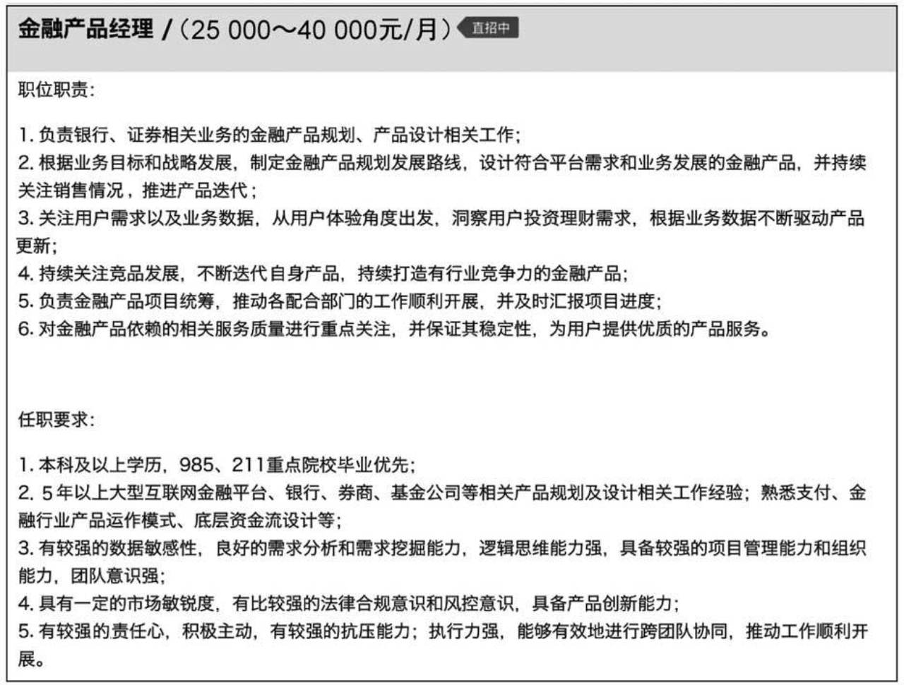
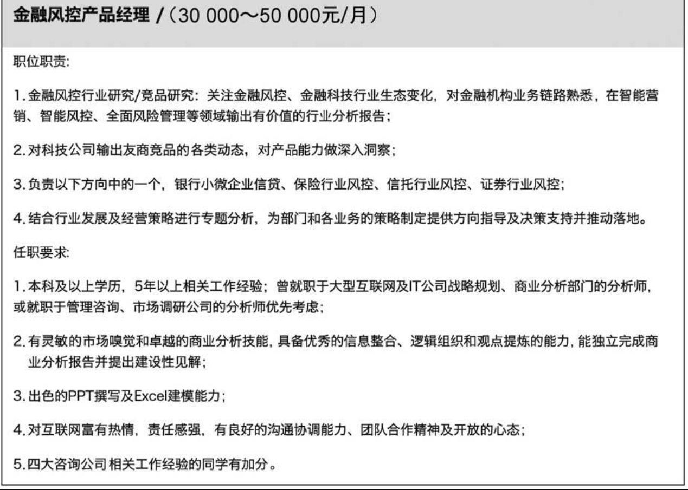

# 金融产品经理的简历 [1]

金融产品经理是最近几年才出现的新职位，早期都是从金融机构内部选拔的人才，做出来的产品没有互联网化的感觉，很多时候在用户体验上只能说功能具备了，与大家经常用的微信、支付宝等产品的体验差距较大。不过随着更多互联网人才加入金融行业，这种情况得到了迅速解决，甚至现在到了反向的阶段，也就是要求加入的互联网产品经理必须要懂金融行业的知识。

## 方向

第一种：懂金融业务的产品经理。首先这是一个产品经理职位，是负责金融业务的产品经理，要负责设计产品的前中后台，原则上这些都与金融业务相关。这种产品经理要能够非常理解金融业务。

第二种：懂产品的金融业务经理。首先这是一个业务经理职位，负责将各种金融产品落地。比如，在设计一个理财产品时，要知道**年化利率、最大购买金额、收益计算方式、赎回机制、赎回费用**等。这些都是非常专业的金融业务。同时，这个业务经理还要懂得如何展示这个产品，如何让用户更容易理解什么是年化利率、定投、起投金额、净值、债券等。这里的懂产品更像一种「翻译」工作，要把晦涩难懂的金融知识、金融产品更好地展示给用户。

## 招聘要求

懂产品的金融业务经理，从工作范围上来看要负责银行、证券相关的业务规划，还要关注产品最终的销售情况，要求有 5 年以上的相关行业经验。这充分说明了这个职位更在意金融相关知识。这样的职位更要求能够讲清楚金融业务，对产品的功能设计的要求反而是次要的。

一个懂金融业务的产品经理，要求对金融风控非常熟悉，对金融机构业务链路熟悉，这种专业知识真的不是想学就能马上学会的，并且就算学会了，这些知识还需要在实际工作中摸索运用，产品经理要不断地积累通过互联网产品实现金融业务逻辑的相关经验。但是同时我们可以看到在招聘要求中有些特别的要求，期望应聘者具备战略规划能力，有分析师或者管理咨询经验，最好在四大咨询公司工作过，最好能够有出色的 PPT 撰写及 Excel 建模能力。这都给这个职位的应聘者提出了更高要求。

所以在简历中，我觉得你要更多地展示在**金融行业积累的经验，要能够把金融行业的基本流程、基本理念**写清楚，要让面试官非常容易认可你在金融领域的能力和经验。同时，你要告诉面试官你熟悉互联网产品的相关基础知识，我认为这就足够打动面试官了。

##

[1]: https://www.zhihu.com/pub/reader/120098547/chapter/1321093149016838144
