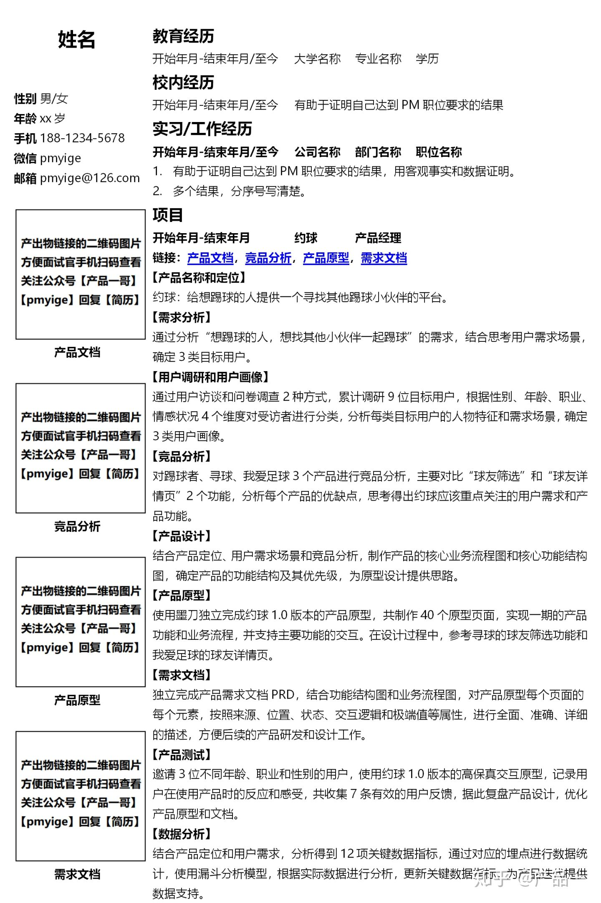

# 简历 CV

## LinkedIn and GitHub

https://career-resource-center.udacity.com/linkedin-github-profiles

## CV VS Resume [5]

- Resume，**简述**于求职相关的教育背景和工作经历，其目的在于说服用人单位雇用自己；
- CV，Curriculum Vitae事集中说明学术工作，不重视与文化程度和学习成绩无直接关系的资料，包括更多的证书、出版物、论文等成就；
- Cover letter是一种介绍自己的方式，去陈述一些简历无法完全展示的细节内容，来描述申请人的兴趣和资历。

## 设计一份与众不同的简历 [2]

简历不是写出来的，而是设计出来的，介绍如何设计一份与众不同的简历、如何在众多模板简历中脱颖而出、如何让简历真的成为敲门砖、如何在1分钟内打动面试官、简历都有哪些投递的方式等。

## 简历命名

带职级的岗位（求职意向）、行业、工作年限

高级产品经理-隔壁老王-B端金融-6年。

从基本描述的已知信息中，获取到产品经理的个人标签，以便初步判断是否具有核心竞争力。 [6]

## 简历包含

简历中通常已包含应聘者对自我各项属性的认知，反映他三观的一些迹象，以及他对本次招聘方需求与偏好的判断，所以也可以根据简历推断他是否具有产品经理的关键属性。因为产品经理是要研究市场和用户的，必须有同理心，必须能站在对方角度思考问题，所以写简历要有针对性，但对其他职业不必这么要求。正常的产品经理应该在**投递每一个不同岗位**时，都重新设计简历的。如果从简历就能看出来他没有针对性，说明他的同理心、勤奋程度、对招聘企业的兴趣至少有一样不合格。[8]

### STAR

## 0-1创业

1. 好好想想你所学的技术可以应用在哪个行业的哪个环节，可以帮助这个行业或者是某一个企业降低成本、提高效率？
2. 想象一下普通的用户是如何使用你的技术完成某项工作？
3. 把想象到的东西全部写出来画出来，整理为流程图、结构图、原型图
4. 着手开发吧，服务端和前端写的糙一点也没关系，实在不会的话就找几个接私活的，把你的需求和他们讲一遍
5. 开发出来的东西肯定又难用又难看，找几个会说真话的朋友挑挑毛病，再改改
6. 根据第一点，去找某个行业中的某个企业，推销自己的产品

- 卖出去了的话，你就可以开始集资创业了
- 卖不出去的话，你有了0-1的创业经验了
- 把1-5写出来，就是最好的简历

## 简历框架

## 原则

- 突出原则：条理清楚、重点突出、详略得当。优先级原则：根据企业岗位需求，个人经历，适当排序。
- 精简原则：把HR最想看的和自己最想展现的写出来。
- 数据原则：在内容上，能用数据表示的一就用数据表示。
- 细节原则：简历中不要出现错别字，不要忘写电话，不要写错邮箱，等等。
- 诚信原则：做人做事都要讲究一个诚信，简历亦是如此。[7]

## 问题 [1]

- 简历过度包装
- 简历过分冗长：抓主要放次要，为什么做这个产品，这个产品解决了什么问题，你在其中扮演了什么角色，做出了哪些重要策略，算法模型存在哪些劣势。
- 内容含糊不清
- 数据敏感度差：数据指标的说明（包括基础指标和对比指标），并且自己对指标有深刻的合逻辑的理解。
- 借用他人的成果
- 不诚实：从业经验从社保缴纳记录、银行工资流水、个人完税证明等多个方面都可以佐证

## 简历筛选与沟通

作为面试官，会先快速阅读：相关经验、公司经历、教育背景等信息

相关经验按照 STAR 分析法，公司经历主要是否是互联网公司，是否一线互联网公司。如果有经历，一定要写，因为有的是结果导向，有的是过程导向差别很大。同时要关注候选人做过的事情，是面向互联网用户的还是面向公司内部用户的，因为面向互联网用户更关注用户体验这些细节部分，后者则更多强调通用性、拓展性，以及开发效率。

教育背景主要作为参考。

对候选人来说，自己的职责、做的事情、取得的成绩一定要写清楚，说白了就是目的性要强、重点要突出，要让面试官很快能把握到：你的公司做的产品是什么样的，模式是什么样的，你取得的成绩是业绩、指标提升了还是效率提高了，这样才能快速把握你的亮点。

[1]: http://www.woshipm.com/zhichang/4160330.html
[2]: http://www.woshipm.com/zhichang/4371937.html
[3]: https://weread.qq.com/web/reader/46532b707210fc4f465d044k1f032c402131f0e3dad99f3
[4]: https://www.zhihu.com/pub/reader/119583028/chapter/1057335985750228992
[5]: https://www.zhihu.com/question/20355548
[6]: https://www.zhihu.com/search?type=content&q=AI%E4%BA%A7%E5%93%81%E7%BB%8F%E7%90%86
[7]: https://t.qidianla.com/1165033.html
[8]: https://zhuanlan.zhihu.com/p/95577761
