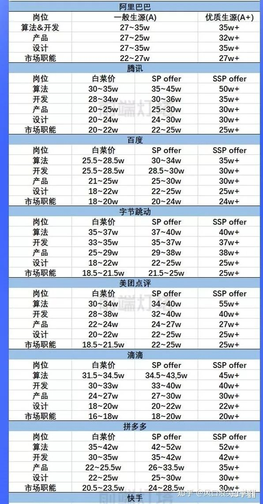
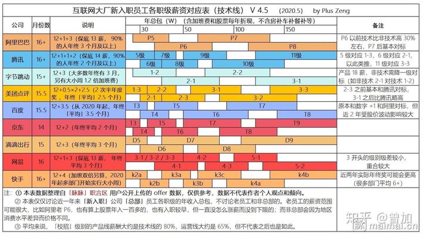
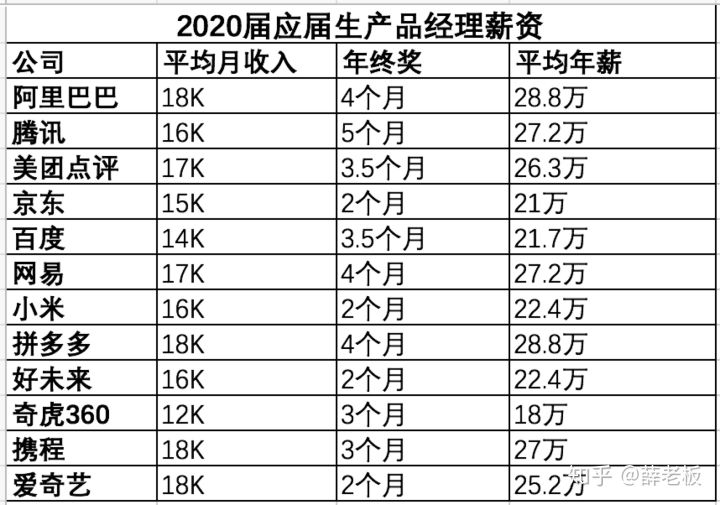

# HR

## HR是如何筛选简历的？[9]

简历中突出优势、层次鲜明是必须的，招聘专员每天面对海量简历，往往10秒钟扫下简历中是否有AI、大厂、明星产品背景，统一的筛选标准有助于提升效率。而Boss直聘等个人渠道则不太一样，Boss往往更耐心，视角更专业。

## 应聘前

已知信息：企业的业务模式，企业服务的客户，应聘岗位名称，工作职责和任职要求

你的诉求：产品面试整个阶段应该了解什么信息，向谁了解

1. 应聘者的时间相对是自由的，而HR分配到使用boss进行沟通邀约的时间是相对固定并且较少的 [7]
1. 一般大厂会直接招实习，但是这家企业没有明确说是实习岗位，而是挂产品助理，外加产品经理的标签来加持，证明企业在行业内的竞争力应该一般，至少在人才吸引方面不会太强；
1. 因为应聘者并没有表现出对岗位对公司的诚意，即到场面试。boss上的所有操作，目的是邀约而不是面试，这是两个概念，所以在什么环节干什么事，想要了解岗位的具体情况，就要到场面试，无论对于HR更好的了解你还是你更充分的了解企业，面试都是最佳选择，既体现尊重又便于双方高效的相互判断。

## HR面试是拿Offer前的最后一关 [4]

业务面试重点考察求职者的能力能否胜任产品经理的工作，HR 面试从其他方面对求职者做最终的把关，并且由于HR 负责控制公司的整体人力成本，因此与薪酬相关的内容也是在HR 面试中完成的，如果求职者和HR 没有就薪资达成一致，那么也会导致面试失败。因此，要想拿到Offer，即使轻松通过了业务面试也不要大意，HR 面试依然要好好准备。

## 谈薪资 [8]

“我相信公司会给我一个合理的薪资安排。”

增加面试官的工作负担，并将决策风险转给了面试者。对于这种不愿意当风险承担者（价高就被拒）的情况，对于一些要求比较高的或者说看中主人翁精神的面试官可能直接就会拒绝你，去选择其他明确的候选人。

当HR问期望薪资时，不要直接给出一个数，而是先详细了解一下对方公司的薪资构成，包括月base、年终奖、绩效制度，以及福利体系，如各类奖金、各类补助的制度、五险一金待遇、假期待遇等。[10]再给出一个你的期望薪资，并补上一句“我可以接受一定程度的薪资浮动”。

## 考察重点分析

传统行业HR 面试更加注重求职者的稳定性，所以HR 所提的问题更多的是私人问题（如家庭成员、籍贯等），因为HR 要确认求职者在未来几年内可以为公司持续创造价值。而互联网行业的人员流动性较大，所以互联网行业的HR 对求职者稳定性的考察会稍微弱一点，而是会重点考察其他方面。

## 性格

求职者最好是一个相对开朗、善于交际的人，也就是具有优秀的沟通能力。求职者还必须是一个对一切充满好奇、敢于质疑、追求卓越、能掌控大局，同时又心思缜密、执行能力很强的人。

### 最大的缺点是什么？

对现实的惨状太真实地吐露。

### 你最大的兴趣爱好是什么？

看书思辨与指点江山。

### 如果在需求评审时，研发人员说无法实现这个需求，你会怎么做

在遇到这个问题时不用害怕，求职者可以分3步来解决这个问题。

1. 了解无法实现的原因，是当前技术发展水平的限制，还是公司研发水平的限制？一般来说，只要是竞品可以实现的需求，理论上就不存在当前技术发展水平的限制，而更可能是公司研发水平的限制。
1. 如果确实无法实现，那么产品经理可咨询研发人员，看**有哪些替代方案**。如果直线走不通，就可以尝试绕路。只要是能实现产品效果的方案，就可以对其进行评估。
1. 如果有替代方案，就评估替代方案对项目的影响。例如，评估替代方案是否会导致项目延期、是否会导致产品方案变更。如果这些都在产品经理可接受的范围内，就可以适当地妥协。

## P8的薪资

P8的薪资=基本薪资（月薪4-5万，一年45-60万）+年终+股票。那P8能年薪200万左右，靠的是什么呢？不是靠基本薪资，是年终+股票，尤其是股票占大头。。股票要分4年才能拿完，满2年可以拿一半，如果满2年就走人，另外一半拿不到。另外股票要交税，45%，拿到手并不多的。

股票的价值来源于哪里，来源于行业的红利+阿里这个平台的成功，反馈回员工身上的。平台利润+行业红利提供了远超出你本身能力的金钱收获。

Y哥，2K对于你来讲，太小的钱了。但对于学生来说，2K意味着很多。我不知道你有没有在大学食堂吃过饭，这些学生一顿饭才花8块钱。有些学生为了省1,2块钱，盘子里都是米饭，都看不见菜。2K块钱，不是小钱，是他们2个月的生活费。对于你们来说，为什么不花这2K块钱，买来这个学生的感激涕零，为公司全力付出。就像做饭一样，已经做了8分熟，为什么不加把火，做成10分熟。少2K块钱，他心不甘，又去看这个公司那个公司，心在摇摆。咱们能不能多花2K块钱，让他彻底心安，一心一意等待入职。[2]

## 禁忌离职原因[1]

（1）因为收入低而离职

这样回答会让HR觉得你计较个人得失，认为你工作的 意义就是为了收入，并会猜想如果有更高收入的地方你会毫不犹豫的离职，而对你做出负面判断。

（2）因为分配不公平而离职

绩效工资、浮动奖金等是很多企业用来刺激员工提高工作效率的手段，用以体现努力和结果的结合，加之工资保密制度的实施，面试者用此作为借口会让HR以为你有喜欢打探别人隐私的嫌疑。

（3）因为人际关系复杂而离职

团队精神是大多数企业要求员工要具备的素质，拿人际关系复杂做原因HR可能会觉得你在人际交往中有所欠缺，没办法很好的融入群体。

（4）因为上司的为人问题而离职

一味的讲述上司的毛病，会在一定程度上说明你是缺乏工作上的适应性，同时，HR也会联想到你遇见麻烦的客户时会不会也凭好恶行事。

跳槽，只不过是一种双方解除之前的契约，重新和另外一家公司签订契约的过程而已，直面这个本质，你会抛弃很多顾虑。

我们在和其他公司合作时候，并不是说我和这家合作公司关系不好我就不合作了，而是这个渠道带来的ROI太低了，回报远远低于我的付出，那么我们会毅然决然的解除和这个渠道的合作。同样的，当你不开心了，当你觉得拿的少了，都不是你终止这份契约的标准，唯一的标准就是，你的付出回报比太低了，低于你的底线了，此时就解除这份契约吧。[5]

## 选择

Offer 的选择是综合考虑行业、城市、公司、待遇等多个方面的因素而得出的一个最终结果。

### 行业

行业发展：互联网教育、医疗有很大的发展空间，因为这两个方向的需求是刚需

### 城市

互联网发展最好的5个城市分别是北京、深圳、杭州、上海和广州

[成都](https://blog.csdn.net/Dylan_zhijing/article/details/107444119?spm=1001.2014.3001.5502)

### 个人兴趣

仅考虑发展趋势还不够，还要结合自己的个人兴趣，你只有从内心喜欢这个行业，才能发挥最大的主观能动性，最大限度地发挥自己的创意，才更有可能升职加薪。最理想的状态是自己喜欢的方向恰巧未来的发展空间很大。如果二者不能很好地融合，那么我的建议是行业发展的优先级大于个人兴趣。

### 公司

要综合比较公司规模和业务线的重要程度。如果是大型公司的核心业务和创业型公司的核心业务对比，就选择大型公司；如果是大型公司的边缘业务和创业型公司的核心业务对比，就选择创业型公司；如果是大型公司的边缘业务和创业型公司的边缘业务对比，就选择大型公司。

### 待遇

在考虑待遇时，不能只看月薪，而要综合考虑。要了解清楚季度奖、年终奖的数额，有无饭补、房补、交通补助，公积金的缴纳基数及比例（最高缴纳比例12%[12]）；，有无加班费等。

2021互联网校招薪资爆料：https://blog.nowcoder.net/n/2668a1d85a174bec94e1fea21dc01551

头条、美团、滴滴、阿里、腾讯、百度、华为、京东职级体系及对应薪酬：
https://www.cnblogs.com/dhcn/p/11983157.html

![薪资结构与公司的成本[11]](../img/salary_content.png)

### 有什么需要我特别注意的部门吗？

在大公司，他们认为「销售」部门需要特别注意，他们会让你知道销售就像是这里的神祇，不要惹恼他们。在小一点的公司，他们会告诉你这方面没什么需要注意的。通过这个问题你可以了解一些第一天工作要知道的事——实际发号施令的是谁？是否存在有些人觉得不值但也有些人很喜欢的项目？如果他们不介意告诉你一些秘辛，这会在你入职的头几周帮到你。这个问题也表示你很想融入公司，想和周围的人进行适当的沟通。

[1]: http://www.woshipm.com/zhichang/459131.html
[2]: https://www.zhihu.com/people/guosheng-hu/answers/by_votes
[3]: https://weread.qq.com/web/reader/8d232b60721a488e8d21e54kb5332110237b53b3a3d68d2
[4]: https://weread.qq.com/web/reader/8d232b60721a488e8d21e54k66f3299023a66f041e16858
[5]: http://www.woshipm.com/zhichang/906380.html
[6]: https://www.yuque.com/weis/pm/up33vm
[7]: https://wen.woshipm.com/question/detail/5tfpes.html?sf=wipm
[8]: http://www.woshipm.com/zhichang/2301423.html
[9]: https://blog.csdn.net/pA2elX78qaJTADH/article/details/80768104?utm_medium=distribute.pc_relevant.none-task-blog-BlogCommendFromMachineLearnPai2-11.control&dist_request_id=6f05adc5-b97c-4da8-ae1f-b2d8c5388ac8&depth_1-utm_source=distribute.pc_relevant.none-task-blog-BlogCommendFromMachineLearnPai2-11.control
[10]: https://shimo.im/docs/vyCrK3rQQ6KC9Ryp/read
[11]: http://www.woshipm.com/zhichang/807191.html
[12]: https://www.vdproject.cn/join/
