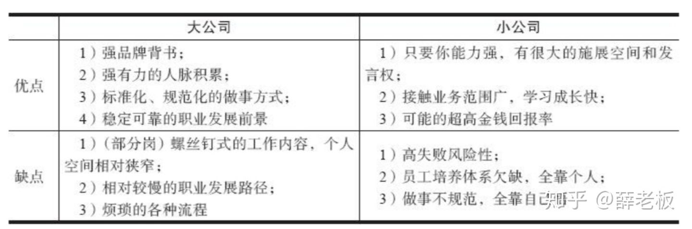

# 职场选择

## 职业价值观排序

12选3 [1]

1. 追求创新
1. 追求通过工作去帮助他人
1. 追求声望和地位

理由：

1. 创新是区别我与别人的唯一方法。
1. 帮助是我能提供的真的价值。
1. 声望与地位能反馈出我的帮助是否合适。

## 个人评估 [2]

1. 我的个性是什么
1. 我的工作兴趣是什么
1. 我在工作中的梦想是什么
1. 我想成为什么样的人
1. 我做人和做事的价值观是什么
1. 我具有什么样的天赋与特长

## 工作评估

1. 这个工作有非常好的发展空间吗
1. 这个工作可长期从事吗
1. 这个工作需要掌握一门技艺或者本领吗
1. 这个工作有创造性、不易被取代吗
1. 这个工作能激发我的成就感吗
1. 这个工作符合我的性格特点和职业需求吗

## 终极评估

1. 如果世界上所有工作的收入都一样,那么我会从事这个工作吗
1. 我希望自己的孩子以后也从事这样的工作吗
1. 如果还有十年的寿命,那么我还会从事这个工作吗

## 愿景和规划 [3]

愿景是指对未来的前景和发展方向的高度概括的描述。愿景是由核心价值观、核心目的和对未来的展望组成的。愿景最好是未来10年以上的远大目标和对目标的生动描述。稻盛和夫曾经说，要想象一个彩色的未来，越具体越好，这是成功的首要条件，不要以现在的能力束缚对未来的想象！

规划是指个人或组织制订的比较全面、长远的发展计划，是对未来整体性、长期性、基本性问题的思考和考量，是设计未来整套行动的方案。

## 行业 [4]

你回过头来看看你的简历，是在一个领域、一个行业深耕多年，还是觉得哪个行业有前途就去哪个行业工作、觉得哪个领域最近受到资本市场追捧就去哪个领域工作呢？很多人跳槽漫无目的，只要有一份工作就行，只要还是做产品经理就行，只要觉得这个公司做的事情相对靠谱，商业逻辑听上去比较合理、有趣就选择加入这个公司，完全没有认真地思考过自己在经验上的积累、在行业和领域上的沉淀，导致很多行业的工作都做过，每次都要重新调研用户需求，每次都至少要花3个月的时间才能够真正地感受到用户想要什么，这样做无疑是在浪费生命。

如果你作为产品经理，非常有心计，每次都探索用户的本质需求，并且能够跨领域、跨行业地思考它们之间的共性，探索如何将在一个行业中所获得的能力迁移到另一个全新的领域，那么这也算一种成长。

## 大公司 or 小公司

- 什么公司值得去：https://www.kanzhun.com/
- 企业尽调避坑（企业状态风险等级判断风险，舆情信息检验招聘信息是否属实，股权结构、经营状况、融资情况判断公司持续性，知识产权判断创新型）常用工具：工商局企业信用信息公示系统(www.gsxt.gov.cn)[8]、企查查等[7]
- 公司怎么找人才：http://www.hunt007.com/employee/searchlist.htm

### 做大的几种效应 [6]

- 头部效应:一步领先步步领先,资源聚集
- 规模效应:边际成本递减,供/需端某物多多益善
- 协同效应:多种事物互相促进“一鱼多吃”
- 网络效应:供需同体者的同质化网络(价值正比于N^2)
- 多边效应:供需多方(>=2)彼此强化

### 人生战略

人生战略的雏形目标。[5]

- 使命：让所有有价值的产品项目能不被扼杀在萌芽上。
- 愿景：做一款智能投研产品实现我的使命，发现别人价值，并帮助别人成长。。
- 战略：偏向投资、整合，为更多投资人与创业者建立桥梁。
- 战术：野蛮、快速试错；AI；建立更多联系。
- 价值观：推进科技进步，实现人类幸福。

[1]: https://weread.qq.com/web/reader/46532b707210fc4f465d044k8f132430178f14e45fce0f7
[2]: https://weread.qq.com/web/reader/46532b707210fc4f465d044kd3d322001ad3d9446802347
[3]: https://weread.qq.com/web/reader/46532b707210fc4f465d044kc7432af0210c74d97b01b1c
[4]: https://weread.qq.com/web/reader/46532b707210fc4f465d044k6f4322302126f4922f45dec
[5]: https://coffee.pmcaff.com/article/2147290812813440/pmcaff?utm_source=forum&newwindow=1
[6]: https://www.bilibili.com/video/BV19v411k75u?from=search&seid=11494051329064518502
[7]: https://zhuanlan.zhihu.com/p/389007507
[8]: https://news.dayoo.com/society/202012/31/140000_53734969.htm
