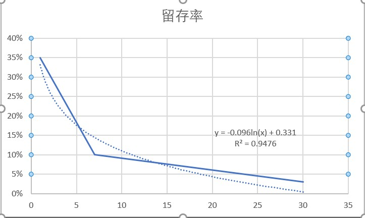

# metaapp笔试

## 最后

只招21\22届，HR说帮我骂，算了心累了。。

## MetaApp产品实习生笔试题

很高兴有机会和你沟通，以下几个问题方便我们更好的了解你，请认真回答~

1. 公司关键信息介绍：

MetaApp--中国最大的游戏平台。

MetaApp目前是C轮的明星创业公司，估值近10亿美金，旗下产品233乐园是国内最大的安卓游戏平台，注册用户过2亿，日活过千万。目前在做虚拟世界 - 全年龄的Roblox，让中小个人开发者都可以基于我们的平台和编辑器创造有意思的游戏。SIG、DST等优秀美元资本投资，创始团队耶鲁清华科大少年班硅谷背景，CEO入选《财富》中国40位40岁以下商业精英、中国及亚洲《福布斯》30u30。目前400多人，今年底扩张到近1000人。
• 注册用户过2亿，累计分发量过10亿；
• 总时长超过行业第二名到第十名的总和；
• 用户爆发式增长，长期留存率8倍于行业；
• 日时长10倍于行业；
官网下载地址：https://www.233leyuan.com
公司官网：https://metaworld.app/

创始团队介绍：
● 胡森 CEO：连续创业者，ex-Googler，Yale CS PhD退学生，中科大郭沫若奖，曾创办风云直播和章鱼TV，拿到IDG和晨兴等顶级风投，并于2015年将章鱼TV以3亿元卖给乐视体育。2011年创办云成互动为⼏乎所有⼤型视频⽹站提供webp2p视频加速服务，⽹⻚游戏产品《创世兵魂》13、14年百度搜索⻛云榜⽹⻚游戏类TOP1，累计流⽔过2亿。由于之前创立云成互动的出色成绩，被评为福布斯2014年30位30岁以下明星创业者。
● 周喆吾 联合创始人：2019年胡润30x30创业领袖，2018年领英最受瞩目的职场人，曾任摩拜单⻋Head of Mobile，负责移动端所有产品技术，曾获得App Store 5星和中国区下载榜第⼀，回国前任职LinkedIn、Uber硅谷增⻓团队。毕业于耶鲁⼤学计算机系硕⼠，14岁考入中科大少年班。
● 段进伟 联合创始人：熟练搭建⼤⽤户量⾼并发架构，擅大数据、中台，2003年云南省理科状元，清华⼤学计算机系学士、硕士。

公司地址：北京市朝阳区中轻大厦A座17、18层（地铁15号线望京东站200米）

公司作息：大小周（大周周日上班，小周双休）

本岗位情况：本岗位的职责是参与公司核心产品的规划、设计、落地；完成详细且规范的产品规划文档和原型设计文档；参与规划业务产品模型，制定产品线路图，确定产品方案；汇报给产品负责人。

根据你的实际情况，我们的办公地址、上班时间、岗位工作内容符合你个人的预期吗 ？（若认为我们的公司及岗位情况与你个人工作预期相符，请继续答题；若认为不符，可告知面试官并结束此次笔试。再次感谢你的参与！）

2、在过去的学习或实习中，做过最有成就感的事情，如何做的，并取得了什么成绩？

正试图结合AI与政治经济学的内容，见https://stevenjokess.github.io/2bPM/AI_critical.html ；
用心、脑、力、时间做的，暂时没有成绩，但我希望能更多传播共产主义、倡导公有制来应对未来时代无产阶级有可能的大规模失业现象与避免赛博朋克的高科技低生活的悲剧。

我这十几天迟迟没有回答笔试题，是因为一直在寻找所谓元世界的意义，我之前觉得它好像太奶头乐赛了，后来看了Metaverse系列第四节：巨头们的下一个战场。 - Metaverse的视频 - 知乎https://www.zhihu.com/zvideo/1388642166743453696意识到我不参与，那未来的人类很有可能视、听感受就由其他大公司垄断控制。而Metaverse系列第三节：元宇宙的经济系统。 - Metaverse的视频 - 知乎https://www.zhihu.com/zvideo/1388208836986089472提供给我一个思路：在虚拟世界预先实验不同的经济系统，尝试用AI处理公有制下生产、分配的问题。

3、举一款你最喜欢的APP, 你觉得它满足用户什么需求? 有什么需求没有被满足? 如果你是它的产品经理，你会做什么改动让它好十倍? 你怎么评估这个改动的效果?

B站。有动漫、（技术分享、二次元、鬼畜）视频、直播来共同娱乐、弹幕构造社区氛围、评论区交流、分享；

- 对于交流的需求，没有针对弹幕的回复提醒功能，有些时候视频里有人在弹幕会发关于视频的一些疑问，而后来的弹幕往往回复而不提醒。一些弹幕中有问题的视频之后是否有之前的用户反复观看有疑问处以及与回复弹幕的人有更多互动。
- 对于粉丝的需求，可以在b站内部建群，集体吹水、催更up主。目前的应援团必须要up主已经创建了应援团。https://www.bilibili.com/read/cv3764096

4、使用抖音，尝试刷足够的时间，分析一下你刷到的视频里，为什么有的视频获得百万的赞或评论? 而有的没有? 你怎么复制一个也能百万获赞的视频?

不刷抖音。抖音是主要因为看的人多，靠短时间制造幻想感、反差感带来显著的情感变化。
B站长视频的质量更高，https://space.bilibili.com/1950209
这位up主靠王者技术（战略分析、节奏把控、反常英雄操作、换装反应、调动氛围的解说）具佳，再配合剪辑把游戏过程显得极具观赏性。https://www.bilibili.com/video/BV1pv411E73N
两位大神与一位插科打诨的土匪老大，除了百万播放，评论区为了视频的拉热度、点赞竟然纷纷自发二创，这视频不比百万点赞更有感染力。
在这里分享3位up主：

- 全靠感情的老鼠人歌手：https://space.bilibili.com/5465995/
- CS入门科普：https://space.bilibili.com/6312652/
- 哲学科普：https://space.bilibili.com/362588980/

我个人觉得百万赞是不可复制的，只能利用自我风格抓住群众的爱好与凑巧的热点不停尝试结合。

5、如果你是网易云音乐的产品经理，尝试给网易云音乐的算法工程师提一个需求，能让音乐推荐的体验更好（三句话之内）

来利用类似朋友圈的功能去同时分享音乐与图片，后可以根据用户上传的图片，选择图片相似程度的选择最接近的5个图片提供与之共同分享的歌曲推荐。

6、如果一个移动App，新增次留35%，7留10%，30日留存3%，ARPU 1元/DAU，新增用户在30日内的LTV是多少钱？（LTV= 平均每用户在给定时间内贡献的总收入）

天数	1	7	30
留存率	35%	10%	3%

求y = -0.096ln(x) + 0.331在x从0到30的定积分。
其定积分=-0.096*（30ln(30)-30）+0.331*30=3.015
所以在我选择的一个月时间LT平均生命周期为3.015天。
LTV=LT×ARPU=3.01*1=3.01（元）

参考：
[1]:算LT：http://www.woshipm.com/operate/3570208.html
[2]:算LTV： https://zhuanlan.zhihu.com/p/161576566
[3]:DAU百科：https://baike.baidu.com/item/DAU/4912436#:~:text=%E6%97%A5%E5%9D%87%E6%B4%BB%E8%B7%83%E7%94%A8%E6%88%B7%E6%95%B0%E9%87%8F,%E5%8E%BB%E9%99%A4%E9%87%8D%E5%A4%8D%E7%99%BB%E5%BD%95%E7%9A%84%E7%94%A8%E6%88%B7%EF%BC%89%E3%80%82

7、如果一个移动应用（只有iOS和安卓两端），今天相比于昨天，iOS端的注册率、Android端的注册率都提升了，但是整体的注册率下降了，可能是因为什么？

可能是总注册数增长不过浏览数，而可能在有一个系统里总共浏览在下降使得注册率上升、另一个注册数与浏览量同时增长，如下所示。这是一种常见的谬论，更多统计学谬论如辛普森谬论、区群谬论。

昨天

手机系统	注册	总共浏览	注册率
Android	5	10	50%
iOS	1	5	20%
合并	6	15	40%

今天

手机系统	注册	总共浏览	注册率
Android	5	9	55.5%
iOS	2	9	22.2%
合并	7	18	38.9%
