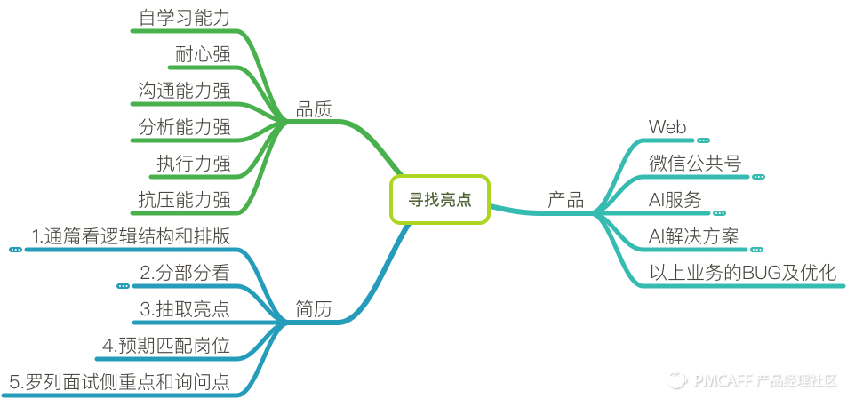

# 令人喜爱的新人[1]

## 寻找亮点

## 心态

在解决需求的过程当中，对产品产生关注和信任，在对工作方法和心态都了解之后，自然而然的就变成产品经理了。产品经理是对某个问题提出一系列解决方案和推动落实的那个人，你要对用户负责，对产品负责，更要对你自己负责

## 懂行

如果大家平时就能写一下文章，或者对一些新出的产品给一些自己的见解或者改进方案，不妨整理好放在iPad里面，面试带过去效果会很好！了解行业动态推荐关注：虎嗅网、36氪等科技媒体，学习产品基本功，推荐关注：人人都是产品经理.

## 经历

撬开BAT大门的基本配置=1-2份有料的互联网实习+1次以上的项目经历+个人作品或高质量比赛大奖。

## 识人

过来人的帮助不仅能够让你获取更多的内部信息和资源（很多实习机会都是内部消化的），还可以在关键的时候给你一些比较全面的辅导和指引。所以可以通过参加一些活动，或者进入一些交流的微信群、ＱＱ群等认识一些在互联网工作的师兄师姐或者HR

## 包装

得到了讯息，看到了机会，也有经历之外，还需要懂得如何把最好、最真实的自己呈现出来，这就很需要个人修养了。

## 学习

学会Xmind，Mindmanager，Visio，PS，Axure这些软件，另一方面还要多看书

## 更关注能力 [2]

### 在工作能力上是否与目标职位匹配

用户研究能力、产品分析能力、需求管理能力、用户体验能力、数据分析能力、技术理解能力、项目管理能力、行业和商业分析能力等。

面试官会问很多工作经历的细节信息，其实就是要听到你是怎么工作的，运用了什么方法，得到了什么结论，做出了什么决策。你千万不要以为面试官只是对你过去的公司感兴趣，对你取得的优秀业绩感兴趣，那些项目和取得的业绩数字都是历史结果，都已经不可能改变，也不可能在新公司完全复制。

面试官更关心的是你的能力是否与目标职位匹配。能力匹配不一定要经过很长时间，只要你的工作方法对、能力强，就可以在短时间内达到别人3年或5年的积累。

### 在行业经验上是否与目标职位匹配

面试官希望你在行业经验上有3年的积累，首先是希望你对这个行业很了解、很熟悉，对该行业的产品比较熟悉，知道该行业的商业模式、产品生态等宏观层面的分析结论，并且对该行业产品的全流程工作有深刻的理解，有完整的业务产品包装能力，对产品的各个环节的设计思路清晰，对数据敏感，并熟知行业内各家玩法及相关数据。

### 在思考与表达上是否与目标职位匹配

不要特别在意工作经验，要在意的是如何表达出3年工作经验所具备的工作能力、如何把以往的工作经验与目标职位的要求进行对位的复盘总结、如何在表达时讲出恰好面试官想听到的能力。在面试的时候，你要尽量表达对全流程的熟悉，能够展现出对行业的洞察力，这才能够体现出你有一定的行业积累。

## 最好不是真的“新人” [3]

进入到一个新行业，任何人都需要花时间去学习、去沉淀，对于企业方的招聘需求来说，他们要招的是产品经理而不是产品助理，产品经理的了解新领域时间对于企业来说是种浪费，企业方更倾向于招到一个能够「快速执行」的产品经理。

## 应届毕业生的成功

对于应届毕业生来说，成功是什么？最显著的标志就是转正。产品经理带领应届毕业生参与了具体的项目，如果他整体的表现得到了同事们的一致认可，那么转正也是必然的事情了。

### 融入真实的职场

众所周知，学校和职场是有很大的差别的。相对来说，学校非常单纯，虽然也有利益，但是更多的还是同学之间的感情，而在职场上，利益因素更多一些。

因此，应届毕业生要做的第一件事情就是让自己尽快地融入职场，而应届毕业生的导师要做的第一件事情就是帮助其尽快地融入职场，要告诉他们职场上的规章制度，也要告诉他们职场上的一些注意事项。

### 实际工作中的价值体现

无论通过哪种渠道，应届毕业生都会或多或少地了解到工作所带来的价值，但是了解到的和实际工作中的往往都是有出入的。因此，应届毕业生需要真正融入具体的工作中，去执行、去体会。产品经理要让应届毕业生参与具体的项目，在执行过程中感受自己所负责的工作的具体职责及最终呈现出的价值是什么。

### 认识身边的每一个人

应届毕业生通过参与具体的工作，能够提升自己的专业能力，也能够快速、高效地认识身边的每一个人。在职场中，如果两个人之间没有工作上的交集，这种认识就是流于表面的、浅层的。如果两个人曾经一起做过同一件事情，那么就更容易拉近彼此的距离和感情。在职场中，工作本身就是最重要的，想要了解一个人还是要看他在工作中的表现，一起工作意味着合作，合作就会拉近彼此的距离。

导师需要引荐毕业生，让更多的人认识他，帮助他建立人脉关系。很多时候，毕业生转正最重要的其实就是身边人的评价。即使应届毕业生到公司已经 3 个月了，也很难真正地体现出自己的能力。身边人的评价更容易说明应届毕业生是否能真正融入其中，包括主动性和意愿等。

### 系统性的知识框架

除了上述三点，还有最重要的一点就是系统性的知识框架。如果应届毕业生想要获得持续的成长，就要对产品经理这一岗位所需要的系统性的知识框架有清晰的了解。因此，导师一定要做好以下三件事。

#### 搭建知识框架

产品经理基于岗位的职责和需求可以将知识框架分为通用技能、专业技能和组织影响力。

通用技能可以进一步地拆分为沟通能力、主动学习能力、行业理解能力、执行力等。

专业技能可以进一步地拆分为用户调研能力、需求挖掘能力、原型交互能力、产品规划能力、数据分析能力、用户运营能力、渠道管理能力等。

组织影响力则可以进一步地拆分为主动分享、方法论沉淀、活动组织能力等。

当然，每一项都可以进一步地拆分成更小的颗粒。比如，沟通能力可以拆分为表达能力、思辨能力、倾听能力、说服能力等。

#### 对照打分

搭建完产品经理的知识框架以后，产品经理接下来要做的是对每一项进行权重设定，在此基础上对每一位应届毕业生进行对照打分，分值分别对应产品经理这一岗位上的相应位置和层级。

其实，这样做的目的就是让应届毕业生能够清晰地了解到自己现阶段在产品经理这个岗位上所处的位置和水平。如果想要提升自己，就要先认清自己。

#### 查漏补缺

对照打分结束之后，产品经理要有针对性地进行查漏补缺，先从两个方面入手。一方面是目前得分最高的项目，分析和总结此项目得分高的原因，思考继续保持的方法；另一方面则是目前得分最低的项目，分析和总结此项目得分低的原因，思考如何快速地提高此项目的分值。

例如，得分最高的是行业理解能力，因为这个应届毕业生在学校时就喜欢关注互联网行业的各种新闻报道，无论是官方报道、小道消息、社区论坛还是权威的行业报告，他都会在第一时间进行了解。因此，对于这一项，他只要继续保持**行业的敏感度**就足够了。

得分最低的是用户调研能力，产品经理需要制订一个专项提升计划，如一个月内学会定性调研之面访，然后让这个应届毕业生参与其中。比如，先成功地约至少 10 位目标用户来公司参加头脑风暴会议，在头脑风暴会议中担任助理，协助处理基本的会务和会议记录等。在此基础上，这个应届毕业生要不断地深入学习、实际操作、反复总结，直到此项也达到某一分值为止。

[1]: http://www.woshipm.com/pmd/284339.html
[2]: https://weread.qq.com/web/reader/46532b707210fc4f465d044kc1632f5021fc16a5320f3dc
[3]: https://www.zhihu.com/pub/reader/119583028/chapter/1057335985628672000
