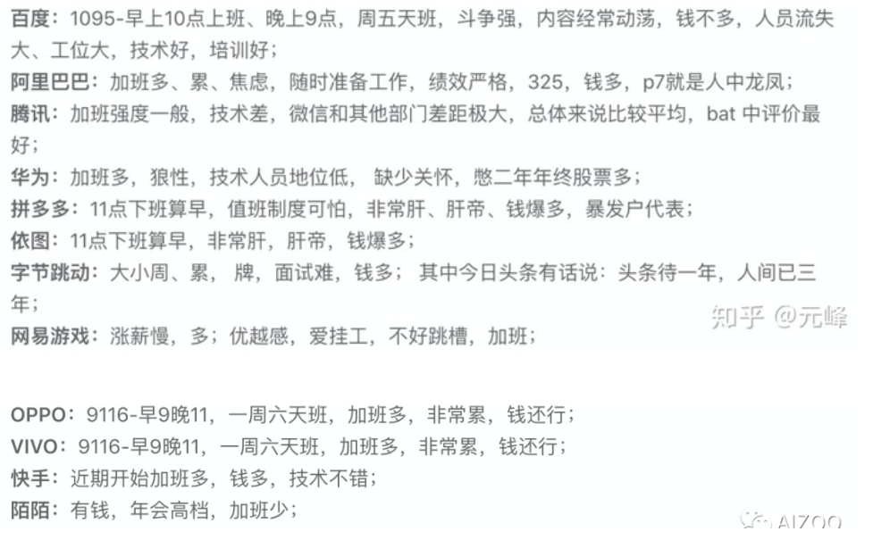

# 不能去的公司

## 公司级别的划分标准

在业内并没有严格的公司级别的划分标准，一般来说，已上市的集团型公司为大型公司，如阿里巴巴、腾讯、百度、美团、小米、网易等；经过C 轮以上融资但未上市的独角兽公司为中型公司；经过C 轮以下融资或者未经过融资的公司为创业型公司，这类公司非常多。

## 创业公司成长 [4]

公司初创时期，寻找合伙人，这是第一阶段，要做的是“长心”，即寻找与你志同道合的朋友合伙，搭建公司核心的文化与价值观；有了合伙人之后，就要开始搭建初创团队，这是第二阶段，要做的是“搭骨架”，即寻找对你和公司有信念的员工，确保公司有效运转；等到公司发展壮大，需要招聘“牛人”，这是第三阶段，要做的是“长肉”，即进行团队迭代，让公司稳步发展

## 隐患

大多数创业公司，一定一定会进入瓶颈期，这时各种隐患都会冒出来，比如加班多、薪酬不够多（还有猎头来挖人，一对比就。。）、流程制度不规范、士气不高、融资没结论等等。这时，就需要价值观、职业素养、公司凝聚力来救驾了

## 靠谱的创业

很多靠谱的创业，在公司没有注册下来的时候，就已经开始有业务了；在装修的时候，就已经开始做销售有收入了；准备期过完，已经可以步入正轨了。 [5]

## 不能去的创业公司:

1. 上一轮融资（IT桔子和36kr可知）已经烧差不多，自身盈利能力还没起来，需要靠下一轮融资继续经营。如果这时候融不到钱，就会大裁员，作为新员工、应届生，估计第一个被裁。
2. 不好好面试的创业公司。创业公司的早期员工需要是精兵强将，否则养人的费用远高于员工的产出，本身就不盈利的话会死很快。所以从面试流程可以看出这家公司是不是认真的在招每一个人。
3. 不签署劳工合同、不交五险一金的创业公司。合同是保护员工的，不签署对员工很不利，五险一金更不用说了。

## 老提当年

创始人实则是一个码人的角色，不要说自己是什么什么出身，那即代表你远离你的「出身」很久了，long long ago 的 story 不必再提，好汉不提当年弱，更不要提当年勇。

码人，就是让一直擅长某一个领域的大神、大牛、Expert 在某一个公司管理部门发挥其价值。

## 需要警惕的公司[7]

- 业务不稳定或者很难做大做强，也就是增长的天花板很低。中小公司还没有稳定可持续的盈利来源，为了生存，必须要不断的寻找赚钱的机会，及时的调整产品方向，也就没有在一个方向持续投入和积累的动力。
- 没有系统的培训机制，很少招聘应届生，都是希望有一些工作经验来了就能干活，把职工当万金油，也就是什么都会一点，但什么都不精深，因为都只是为了完成任务而已。没有时间，也没有必要深耕细作。
- 基本没有激励机制，年终双薪算是不错的了。

## 期权？ [3]

大多数初创公司的期权都是没有用的，具体情况如下。

a. 初创公司画饼

A 创业公司，招人时老板总谈降薪拿期权。当某员工降薪拿期权进入 A 公司，工作了一年多后，他发现公司的成长完全不及预期，失望之下，他试探了下外面的机会，发现同类型职位的薪资竟然是现公司的 2~3 倍。

b. 成长型公司打土豪易、分田地难

B 公司，国内风光一时的互联网上市公司，曾经期权是他们 offer 中重要的一环，不过，承诺最终难以兑现，随着原先许诺好的期权变成了 18：1 换股，早期员工也失去了憧憬。

c. 上市公司的成熟分配机制

以阿里、百度、奇虎等大公司为典型。期权被视为一种长期激励，而非利益捆绑。对优秀员工的激励方式是高薪资 + 部分期权。大公司由于已上市，兑现相对容易。

几百万的股票，即使放在一家创业公司，也是只有非常非常早期的创世团队成员在公司创业成功的时候才拿的到。我之前的创业公司，基本工资没有太多亮点，大家都奔着公司融资上市发一笔小财。但公司虽然一轮轮在融资，但是业绩一直没有起色，上市更是遥遥无期。加之期权的各种条条框框（比如分4年兑现啊，提前退出只能以极低的价格回购呀），很多同事苦熬几年熬不下去离职的时候，只能拿到几十万甚至几万的期权回购，跟之前期望相差甚远。我跳槽之后才发现，大公司给起钱来一点也不手软，每年确定到手的年年终奖就不止这么点钱了。哪怕只是近几年才加入FB的员工，手上的股票一点点涨上来，早就已经价值百万刀了。[^8]

## 黑名单

https://github.com/shengxinjing/programmer-job-blacklist

中国执行信息公开网：http://zxgk.court.gov.cn/

## 各公司加班情况

955 不加班的公司名单：955.WLB - Amusi的文章 - 知乎
https://zhuanlan.zhihu.com/p/176030428

加班之辩：https://www.zhihu.com/question/454330385/answer/2058850586

## 公司信息

https://www.zhihu.com/question/297873851/answer/1106118752

## 值得去

有一类公司是专门有人研究的，可能自己做了相关的深度学习方面的研究，这种还有点技术水平。比如商汤。

第二类公司根本就没有 研究能力，对外说做算法，实际上由于人员能力限制，根本没有做研究的能力，只是把开源的东西拿来调参。 连自己训练的实力都没有。 这类公司没啥前途，要远离。大多数对外宣传搞深度学习的小公司都这类。

第三类公司倒是可以去，自己很谦虚的说是做应用的，用第三方的人脸识别服务或者开发包。 只做应用部分，这类公司别看技术含量不如第一类，但也可以去的，毕竟脚踏实地做事。 学不到算法还能学到应用。

另外你可以看看他们发的论文数量，如果是做研究的公司，就算是涉及机密不发论文，也会多少发一些论文的。 如果一点有技术含量的论文都没发过的搞深度学习的公司，一般都是第二类。 这类公司切记远离。[^10]

怎么判断一个AI团队是否靠谱呢，

- 业务要靠谱：巧妇难为无米之炊，算法是构建在业务基础上的，有大量的数据和才能在上面设计算法。一个日均UV 1k的网站要做流量相关算法，老板想搞高科技，你能搞起来么。。；另外业务也要不断地有创新和突破，这样算法才会有更大的施展空间
- 技术实力要强大：环境很重要，一个好的AI团队里大家经常会有思想的碰撞，会不断产生新的idea，可能讨论讨论就搞个论文出来。当然如果你足够牛，并且可以忍受孤单，自己搞也可以；另外技术实力强大的团队由于资源多，所以在做事情方面也相对容易些
- 公司要有钱：机器学习还好，NLP和图像两个方向的同学还是要投靠一个有钱的公司。因为这两个方向需要大量人工标注的数据，做这方面的同学应该都懂的吧；而且背靠大树，在遇到困难的时候（现阶段AI毕竟不是工程，需要有研发时间）也有钱顶着，不至于发不出工资 哈哈[^9]

[1]: https://www.zhihu.com/pin/1264172919044583424
[2]: http://www.woshipm.com/pmd/151507.html
[3]: https://www.zhihu.com/pub/reader/119583028/chapter/1057335985750228992
[4]: https://coffee.pmcaff.com/article/2568729127965824/pmcaff?utm_source=forum
[5]: https://blog.csdn.net/liwei16611/article/details/100894158
[6]: https://zhuanlan.zhihu.com/p/308631207
[7]: https://github.com/wangwh0204/blog/blob/7a3db02bcebf0c42880516daa49980fec919622b/source/_posts/2015-12-15-my-think-about-career-specialization-rwc.md
[^8]: https://www.zhihu.com/question/344549330/answer/818527280
[^9]: https://www.zhihu.com/question/67487351/answer/253320547
[^10]: https://www.zhihu.com/question/290662567/answer/471193851
