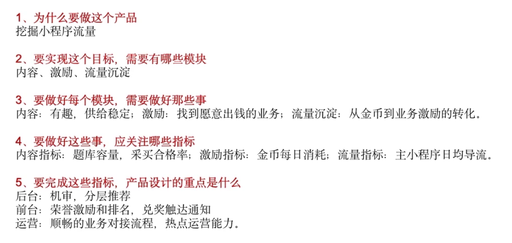
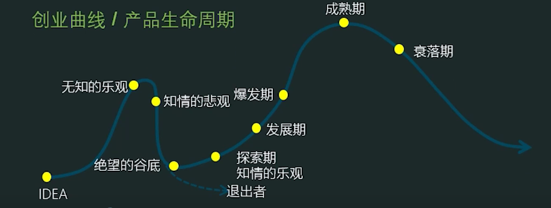
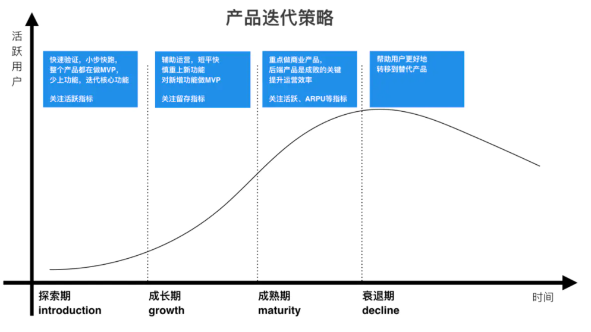
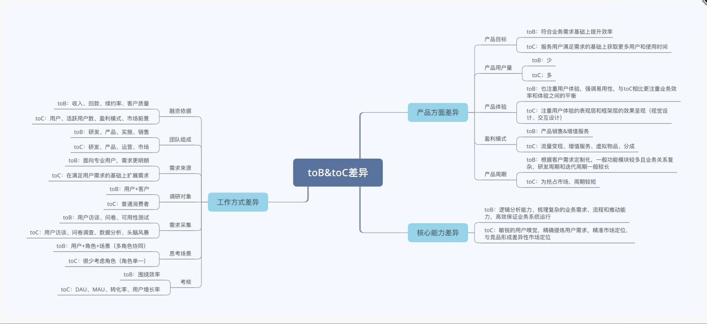

# To Customer

## 定义

C端产品为满足个人服务，满足民生生活，以提供便捷、满足兴趣、欲望、社交、工具的需求为主，不直接为产品带来利益，基本都是免费的。但是C端产品真正所销售的是其用户群体，用户注意力，用户时间、买单方式客户或广告主；

其产品经理叫用户端产品经理，也叫前端产品经理。[25]

## 方法论

To C产品有众多方法论，从PC互联网到移动互联网也经历了一些演变，但大体都围绕着“用户体验”（User Experience，简称UE/UX）阐述，百度百科上对这个词的解释是——用户在使用产品过程中建立起来的一种纯主观感受。

围绕“用户体验”，聚焦的维度通常包括内容、功能、交互、视觉等。数据驱动设计，收益可量化（UV，PV，日活，转化率），运营很重要。[8]

但我觉得这样的方法论是比较单薄的。在产品的设计和开发之外，还应该基于“产品生命周期”的视角，将产品的运营容纳进整体的方法论之中。通用性高可参考可复制。 [3]

## 用户体验就是商机

在当前这个产品同质化竞争较为严重的时代，好的用户体验就是商机，尤其是你弯道超车的策略之一。

说到用户体验，就不得不提到以其“变态服务”称霸火锅连锁业的海底捞，在顾客等待时，服务员会主动给你端上水果、饮料、零食等，如果顾客带着婴儿过来，那么服务员会主动给你拿一个婴儿床供顾客使用，还会替你为婴儿喂饭等，服务员还会细心地为长发的女士送上发夹或皮筋等，变态的服务效果使海底捞顾客回头率50%，超过火锅连锁巨头“小肥羊”的5倍。

同样，对产品来说，如果你的用户第一次使用得不到一次好的体验，他们将不再回来。如果用户在产品上体验尚好，但是对某一竞品的使用体验感觉更好，用户也将流失。

例如共享单车，如果我在大街上使用了三四辆ofo小黄车，都是坏的无法使用或者都有故障影响骑行，而工作人员并没有及时对其进行维修处理，这样带来的用户体验就很差。即使小黄车骑起来可能比摩拜要轻便许多，但一旦用户有了这样不好的用户体验后，下次使用便会转战摩拜单车。

如今相同特性和功能的产品很容易找到替代品，而某些产品靠用户体验建立起来的壁垒却很难被打破，所以“特性”和”功能”总是重要的，但是用户体验要素对于产品用户的忠诚度却有着更大的影响。[30]

## 按功能分类 [8]

- 工具类：独立功能解决具体需求
- 内容类：OGC（occupationally职业生产内容）、PGC（professionally专业）、UGC（user用户）
- 贡献：全新的销售渠道
- 社交类
- 平台类

## 业务渠道 [14]

2C业务渠道分为线下渠道、电商渠道、创新渠道。

- 线下渠道：按经营主体可分为直营门店、加盟门店，按门店位置可分为商场专柜、社区店、奥莱店、工厂折扣店、街边专卖店。
- 电商渠道：按平台可分为天猫、淘宝、京东、苏宁、唯品会、亚马逊、拼多多、有赞、微盟，及自建官方商城微商城、小程序、App等。
- 创新渠道：分为社交电商和内容电商。社交电商如拼多多、抖音、今日头条、环球、微信、微博等，内容电商如小红书、礼物说等。

## 价值 [13]

通过获取更多用户的注意力，故C端产品的用户行为涉及核心在于**塑造用户行为**，C端产品设计师通过交互设计、视觉设计的方式影响用户注意力，终极目标是使用户的使用行为尽在掌控之中，而不是产品去辅助用户行为；

## 用户 [6]

C端产品的用户比较感性；往往一款产品可以满足某个需求，或者让自己兴奋，则会直接使用。

C端产品比较重视用户体验，往往以一两个核心功能来撬动用户，希望用户能够以最短路径和时间达到“兴奋”点；

角色分工：角色单一,用户角色高度集中

C端:我可以是用户

## Buyer和User是同一个人

对于ToC产品来讲, Buyer和User是同一个人,例如手游App,实际参与使用App的用户也是最终充值消费的用户,所以在设计ToC产品的时候,不太需要把每个功能和付费途径做拆解,只要保证用户在具体使用产品的过程中可以顺畅地进行消费即可。且用户带来客户

PM本身就是用户，例如：抖音、微信、快手，侧重理解用户人群的心理模型、工作状态、所在场景、喜怒哀乐，深入到用户群体中去，从用户群中来，对用户群做跟踪访谈、用户深访、**任务流程记录、用户痛点、痒点、兴奋点记录。**带给用户最真实的感受、体验。[29]

## C端产品思维 [11]

- 用户思维：以用户为中心，认识产品的核心用户，明白运用人工智能是为了提升用户体验。
- 简约思维：不要在核心功能外画蛇添足，并不是所有功能加上人工智能就能成为好的功能。
- 极致思维：超越用户预期，人工智能可以赋予产品超越用户预期的功能。
- 迭代思维：小步快跑，人工智能有时不是那么完美，企业可以在小步快跑中达到目的。
- 社会化思维：用网络的方式完成分工与合作。许多需要模型学习的标注数据，同样可使用该方法来实现。
- 平台思维：建设开放、共享、共赢的平台，同时人工智能的能力输出实际上也能够为模型的不断进化提供支持。
- 跨界思维：要有大眼光，用多角度、多视野看待问题和提出解决方案，并结合人工智能的多项手段，提出综合解决方案。

## C端产品的设计原则

C端产品的设计十分注重细节，产品在方案设计过程中，在初期主要思考的是主体框架和流程，在后期主要注重产品细节的设计，以下是10大经典的产品设计原则，可供AI产品经理参考。

1. 状态可见或可知原则用户的任何操作，单击、滑动、按下按钮、语音唤醒等，产品应即时给出反馈。“即时”是指响应时间小于用户能忍受的等待时间，这个反馈可以是页面形式也可以是语音提示。
2. 环境贴切原则产品的一切表现或表述，应该尽可能贴近用户所处的环境（年龄、学历、文化、时代背景）。系统所使用的词、短语应该是用户熟悉的概念，而不是系统术语。如个人助理中，机器与人的交谈会非常注重人性化的回复。
3. 用户控制性与自由度原则不要替用户做决定，为了避免用户的误用、误碰，产品应该可以撤销或重复操作，在人工智能产品中，则可以用语音提示的方式告知用户。
4. 一致性原则一致性不仅指产品中的用语、功能、操作、界面的一致，还包括产品应遵循行业规则，如智能音箱的唤醒就是一个通用操作。
5. 防错原则在用户选择动作发生之前，就要防止用户有容易混淆或者错误的选择，比出现错误信息提示更好的是用更好的设计来防止此类问题发生，在语音交互系统中回声的消除、误唤起就要遵守防错原则。
6. 易获取原则尽量减少用户对操作目标的记忆负荷，无论是操作动作还是选项都应该是可见的，而系统的使用说明应该是可见的或者是容易获取的。
7. 灵活高效原则中级用户的数量远高于初级和高级用户的数量，这意味着企业需要为大多数用户设计，不要低估、也不可轻视，要保持灵活高效的产品设计原则。
8. 审美与简约设计如果用户使用产品的习惯是浏览产品，一般动作不是读、不是看，而是浏览，那么界面就需要突出重点，弱化和剔除无关信息。如果用户是在一个无法看只能听的环境中使用产品，则需要设计简单的语音沟通功能。
9. 容错原则容错指的是允许用户犯错，错误信息应该用语音表达，较准确地指出问题所在，并且提出一个用户可进行实际操作的解决方案。
10. 人性化帮助原则系统帮助性提示包含①无须提示；②一次性提示；③常驻提示；④帮助文档；提示的方式可以是文本、图片和语音，如果系统不使用文档是最好的。系统提供的任何信息应当是容易去搜索的，并且专注于用户的任务，列出了具体的步骤。

## 增长

根据具体的立足点，还可以把增长大概分为这样几类：用户增长、流量增长、交易增长。

用户增长，已经发展出了完整的方法论，例如AARRR模型：获取（Acquisition）- 激活（Activation）-（留存（Retention）- 收入（Revenue）-推荐（Refer）。

## 风口论

针对2C产品，遇到了市场新趋势，市场上竞品服务模式需要统一更改等 [4]

大家平时讨论最多的都是 to C 互联网，听到最多的一个词是「风口」。为什么 to C 那么在意风口？因为 to C 强调创新和需求体量。

to C 爆发通常靠两点：更好地解决需求、创造新需求。这个过程需要不断试错，费时费力费钱。相比之下更聪明的做法肯定是抄作业、抢风口。

既然是抢风口，比的就是谁快。什么鸡巴精益创业、敏捷开发、弹性架构、人月神话，只要业务能跑起来、让运营去做增长，管你是 PHP、Python 还是易语言写出来的代码，能 Run 就行。而且初期系统挂的越多越好，挂的多说明你业务增长快，说明你火爆。越挂越有人想注册，去投资人那这理由还能加钱。

在这种氛围的长期熏陶下，to C 产品人越发重视细节、重视核心想法的表达、越发去抓大放小、越发忽略系统的顶层架构和长远战略。

另外由于 to C 病毒传播的可行性强，产品人会觉得只要发点优惠券烧钱、广告轰炸烧钱、做足微信传播，用户自然就能指数增长。当他们涉足 to B 领域时，发现这些套路根本不 Work。

### 心态 [15]

记住，风口上能飞的从来不是猪，猪即便在风口上飞起来了，也会在后面的寒冬中冻死。寒冬虽然会过去，但春天不一定会暖，即便暖流来临，甚至成为热潮，谁能担保，下一轮寒冬，不会在资本游戏里来得更快呢？

资本带来的，除了红海，还有血海。切莫为利红了眼，为益杀红眼，在海中迷了眼。

## 竞争激烈后的马太效应

C端的平台产品显著区别于B端的是：“任一用户对平台的议价能力都很弱，单个用户的离开对业务的影响很小，并且C端平台规模有较强的马太效应（供需趋向于集中化），规模本身就是护城河。”[26]

相对于以业务为主线的B端产品，C端产品的价值竞争更激烈，因为市面上可选择的产品太多了。例如，用微信支付还是用支付宝支付，本质上解决的都是支付问题，而在线支付就是产品的价值。

最后的胜出者坐拥千万或上亿用户，自然是产品经理的成功典范，但是，我们不能只看到幸存者的风光，当初跟滴滴竞争做打车业务的团队有三百个曾经的团购市场也被称为“百团大战”,其他几百个团队现在到哪儿去了？选择做to C 产品加入生死战场，跟团队一荣俱荣一损俱损，大部分产品经理注定失败，不论你的专业能力优秀与否。[16]

## 2C思路

1. 做这个产品的目标是什么
1. 要实现这个目的,需要有哪些模块
1. 要做好每个模块,需要做好那些事
1. 要做好这些事,应关注哪些指标
1. 要完成这些指标,产品及运营的重点是什么[23]

## 过程 [9]

C端产品生命周期通常包含：需求调研、竞品分析，产品规划，产品设计、跟进开发、测试上线、冷启动期、运营推广，迭代优化等阶段。

## 产品路标规划：产品生命周期法（2C产品）[4]

**产品生命周期**：2C产品一般会经过引入期、成长期、成熟期和衰退期。

**产品生命周期法则**是按照产品不同的生命周期目标来制定产品规划。

### 引入期

引入期，即产品MVP阶段，此阶段要用最小成本快速验证产品思路在目标用户群中的接收度，减少产品走错路的风险。在这个阶段产品规划时，就要考虑如何让目标用户快速了解和使用我们的产品，如何找到种子用户，如何快速获得用户的反馈，得到反馈后如何快速根据这些反馈进行产品迭代，如何初步的推广产品等，结合这些问题去规划该阶段的产品规划。

### 找种子用户

#### 冷启动

[冷启动](https://zhuanlan.zhihu.com/lengqidong)通俗地说是指不通过大规模的市场推广，而是通过优质的内容或者熟人口碑传播进行产品启动的方法。冷启动可以有效地降低项目风险，但是启动速度比较慢。

冷启动的典型例子是知乎。知乎最开始就是周源凭借自己在互联网行业的人脉，以向专业人士发[邀请码](https://www.zhihu.com/topic/19613081/hot)的形式邀请用户进行注册的，如李开复、徐小平、周鸿祎等人都是知乎的早期用户。这些人在知识的广博性及专业性上都远胜于普通用户，这与知乎“高质量知识分享社区”的定位吻合。反过来，这些人的站台，也为知乎后续长远的发展奠定了基础。知乎在2013 年才开放用户注册。

#### 热启动

热启动，顾名思义，就是公司通过大量的资源（包含人力、资金等）投入让产品迅速启动，实现用户的爆发式增长，一般被大型公司采用，如大量的活动补贴、广告推广，像滴滴、饿了么、社区团购...[28]

热启动的典型例子是QQ 系的产品，如QQ 空间、QQ 邮箱等都是以QQ 为土壤迅速发展起来的。[7]

### 成长期

在产品的成长期，我们更关心的会是拉新（补贴、活动、邀请）和促进活跃，核心用户群要快速稳定地增长，同时也要保证一定的留存率。此时，产品规划的目标就是要考虑通过怎样的策略去实现上述目标，比如产品功能的优化、运营推广、产品性能优化（技术手段）等。产品优化：关注用户在每个核心页面的访问时长、核心页面的转化率及用户使用路径，不断提升产品用户体验；用户拉新和留存：每日新增用户数、次日留存率、7 日留存率、DAU（Daily Active User，日活跃用户数）、MAU（Monthly Active User，月活跃用户数）；推广：推广渠道数据，筛选出投入产出比最高的推广渠道并持续投入

### 成熟期

在成熟期，产品活跃用户的增长会很缓慢，因为此阶段出现有大量的竞争对手，目标用户已被市场覆盖，或者是产品的模式等原因。在此阶段，产品规划应该去关注如何提升用户的转化率、如何提高产品的盈利能力，如果是产品自身的模式原因，就要去改善现有产品的服务、模式以及运营策略等，进一步提升产品的活跃用户。重点观测的数据指标：老用户留存率、老用户流失速度、每日新增用户数、新用户增长速度。

### 衰退期

处于衰退期的产品，其实能够起死回生的几率不大，除非它的产品经理是卓越的领袖。重点观测的数据指标：每日用户流失数、用户流失速度、挽回效果数据。此阶段的规划可以尝试去发掘产品的第二春或颠覆式创新。此时如果要放弃产品，就要做好产品退出市场的相关工作 [17]。

![各阶段应该做的[24]](../img/PLC_do.png)

17年后C端流量红利的消退，获客成本越来越高，流量获取越来越难，C端绝大多数流量都集中在腾讯、头条这种大厂，中小公司在C端的生存其实越来越难。[27]

### 创新

![创新[22]](../img/innovation_life_cycle.jpg)

## 原型能力 [5]

C端的产品更重交互，所有对原型能力要求高一些，有的公司会要求产品画高保真设计图。

## 与产品价值相矛盾

C 端产品时常会遇到与产品价值相矛盾的情况，例如视频产品最核心的用户体验就是让用户不间断地看视频，但往往碍于公司生存压力，不得不在视频播放时插入广告金主的广告内容。

## 2C2B化 [18]

本来是针对C端的产品和服务，开始不断先通过B端进行推广，比如很多人已经发现，有些O2O服务与其不断打广告，还不如**搞定一个数万人大公司的HR**，变成员工福利，瞬间得到推广。

## 2B VS 2C
:label:`2B_VS_2C`

## AI PM直接合作 [10]

产品经理更有可能**直接**与功能团队合作，做更多客户驱动的工作。因为他们正在打造一款将被大众消费的人工智能产品，所以有可能(甚至是可取的)优化以实现快速实验和迭代的准确性

## AI作用 [12]

对个人端消费级产品而言，人工智能的意义在于将人类本身的感官和技能进行了技术形态的延伸。消费级产品的人工智能应用点一般集中在三个方面：一是信息采集；二是协助判断；三是协助处理。

人工智能产品是通过信息采集获取大量的数据，然后通过对数据训练得出适用性模型，接着将个人的信息数据作为输入并通过模型给出答案，因此人工智能产品必须拥有数据采集的能力，以便于进行智能化的判断。从智能穿戴设备到智能家居，从推荐引擎到预测系统，均需要通过各种传感器及输入设备获取数据。

消费级产品可以更好地帮助人类感知外部和自身的信息，能够帮助人们更为高效、快捷地处理信息。这种处理表现为两个方向：一是对个体的信息量化；二是对信息的处理进化。人们在使用一些人工智能产品的时候会发现，这些人工智能产品表现得越来越了解自己：你爱看什么类型的新闻，客户端就会给你推什么类型的新闻；你爱吃什么类型的菜，客户端就会给你推送什么类型的餐馆。原因就是这些人工智能产品已经通过采集及算法模型得出了一个量化数据的“你”。不仅如此，一些医疗保健和运动健身领域的产品通过心率、步频、身高、体重、速度、血压等信息的检测将个人信息更细致地量化。除自身信息的量化外，人们通过这些人工智能产品能够更好地感知和处理更多的数据，令信息处理能力大幅度提升。

## 常见AI产品 [19]

依托AI技术为主业务产品的风控、推广、用户运营等常规业务部门赋能，提高企业效率。[21]

1. 智能家居：智能家庭机器人、智能音箱、智能手表等等，成为智能家居控制中心（小米、360、京东）
2. 智能语音助手：Siri、Cortana、Google Assistant、度秘、Bixby
3. 其他：各类Bot、AR/VR、无人机
4. 贴近厨师的AI软体厨师产品！[20]https://bridge.ai/kitchen/
5. 用户无感身份安全验证！https://unify.id/
6. 帮用户撰写、修改、提升简历，增加面试机会，提升面试成功率！https://mosaic.ai/
7. 用AI增强决策能力！https://notion.ai/
8. 任何时间任何场景找到自己喜欢的活动！https://www.robby.ai/about/

[1]: https://tanxianlian.com/2020/03/19/%e6%88%91%e7%9a%84to-c%e4%ba%a7%e5%93%81%e6%96%b9%e6%b3%95%e8%ae%ba/
[2]: https://tangjie.me/blog/268.html
[3]: https://m.zhipin.com/mpa/html/get/share?type=4&contentId=8eaf00b18d9c5148tnVy2t-9GVI~&uid=5885ce18425348b00nR73NS6E1FX&identity=0
[4]: http://www.woshipm.com/pmd/1792966.html
[5]: http://www.woshipm.com/pmd/3755958.html
[6]: http://www.pmtalk.club/#/article/detail/6375
[7]: https://weread.qq.com/web/reader/8d232b60721a488e8d21e54k65132ca01b6512bd43d90e3
[8]: https://github.com/JoJoDU/Book_Notes/issues/2
[9]: https://zhiya360.com/50903.html
[10]: https://www.oreilly.com/radar/practical-skills-for-the-ai-product-manager/
[11]: https://weread.qq.com/web/reader/40632860719ad5bb4060856k9a132c802349a1158154a83
[12]: https://weread.qq.com/web/reader/0c032c9071dbddbc0c06459k70e32fb021170efdf2eca12
[13]: https://www.jianshu.com/p/b159b89df3f8
[14]: http://reader.epubee.com/books/mobile/12/1240b863fa87878a6e1899147685e374/text00000.html
[15]: https://www.zhihu.com/pub/reader/119583028/chapter/1057335985485971456
[16]: https://www.yinxiang.com/everhub/note/b60b7f01-4a91-473d-82a1-40fc5aa25734
[17]: https://www.zhihu.com/pub/reader/119967224/chapter/1284014013069127680
[18]: http://www.changgpm.com/thread-153-1-1.html
[19]: https://www.pianshen.com/article/2712685407/
[20]: https://zhuanlan.zhihu.com/p/294947630
[21]: https://www.zhihu.com/people/zhu-guan-jin-ming/answers/by_votes
[22]: https://www.linkedin.com/in/adnanboz?miniProfileUrn=urn%3Ali%3Afs_miniProfile%3AACoAAAFuSMgBFXwiCwojgL9ZKcAXUtKU0gz43I4&lipi=urn%3Ali%3Apage%3Ad_flagship3_feed%3B0WkZWz7WSMSnTAYrp3M2Pw%3D%3D&licu=urn%3Ali%3Acontrol%3Ad_flagship3_feed-actor_container&lici=WZ8FA0AvHxl3fvZi6nTkaw%3D%3D
[23]: https://www.bilibili.com/video/BV19a4y1s7aN?from=search&seid=11977543152973696126
[24]: https://www.zhihu.com/question/267914037/answer/741359690
[25]: http://www.woshipm.com/zhichang/807191.html
[26]: http://dadaghp.com/index/index/article_detail/id/658.html
[27]: http://www.woshipm.com/zhichang/4308504.html
[28]: https://zhuanlan.zhihu.com/p/351896990
[29]: https://www.bobinsun.cn/works/2019/03/03/ToB-and-ToC/
[30]: https://zhuanlan.zhihu.com/p/390835483
