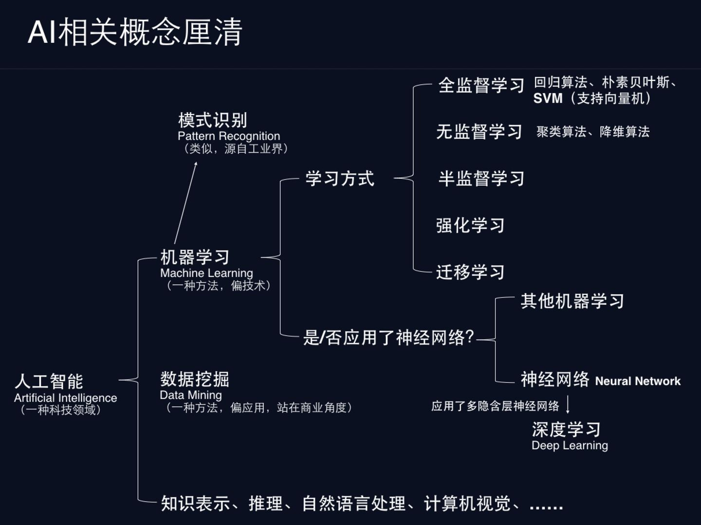
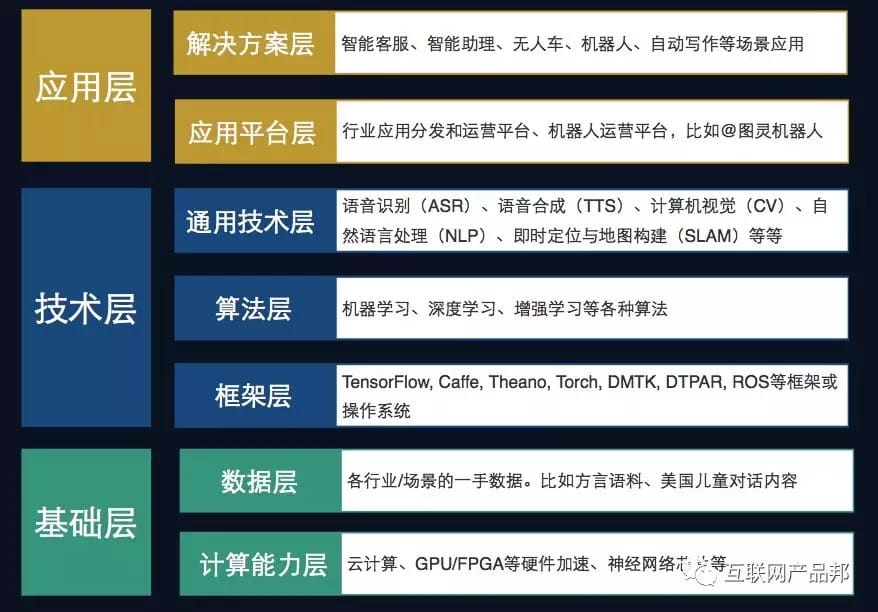

# AI

“软件正在吞噬世界，但AI会吃软件”，Jensen Huang（Nvidia首席执行官）

![AI[14]](../img/AI.jpg)

人工智能（AI），是指研究、开发用于模拟、延伸和扩展人的智能的理论、方法、技术及应用系统的一门技术科学。作为新一代信息技术的代表之一，人工智能广泛应用了计算机、数学、物理学、生物学、逻辑学等学科的理论与方法，并希望利用计算设备模拟人类思维决策过程。[29]

## 历史

![AI历史[12]](../img/AI_history.png)
![AI学派[20]](../img/AI_xuepai.png)

## 细分

## Map

![AI map[16]](../img/AI_map.jpeg)

## 分层

![AI科技[22]](../img/AI_tech.png)

![AI商业[22]](../img/AI_business.png)

## 优先级

![技术优先级[25]](../img/Tech_Priorty.png)

## 类型 [13]

- “肌肉T恤”——忽悠
- “建美男”——AlphaGo作秀
- “搏击手”——怎么实用怎么来

## HBI原则

- 高频（High frequency）
- 大数据（Big data）
- 没有规律（Irregular）

## AI在其中扮演什么角色 [6]

AI革命可以看作是生产力的革命，从生产力的角度讲，第一是将人类从现实世界的非创造性劳动当中解放出来，从而更快速的向虚拟世界迁移；第二是赋予创造性劳动更低的门槛，以建设更丰富的虚拟世界。

这两点我总结为叫做对人类的“去工具化”，就是说，人之所以为人，是有人固有的价值，比如“想象力创造力”，“理解另一个人类需求的共情能力”。这些很难被机器替代。而人类完成自我实现，却需要掌握大量复杂工具，逐渐将自己培养成工具。比如，你有很好的想象力，却不会有画笔，也难以完成一幅画作。掌握画笔本身就是“工具化”。

但是我认为AI可以帮助人类实现“去工具化”，真正“身随意动”的发挥人之所以为人的价值，具体就是依靠上述两点。

## AI思维

AI思维是一种全部数据化、全部用人工智能的方法实时的反映出来，并且根据这些数据进行调整的方式。[23]

将弱人机+好流程胜过强人机+差流程的规律称为“卡斯帕罗夫定律”[24]

## 可能优势 [9]

- 向不同的用户推荐不同的内容。比如为电影提供个性化的建议。
- 对未来事件的预测。例如，显示11月下旬飞往丹佛的机票价格。
- 个性化改善了用户体验。随着时间的推移，个性化的自动家用恒温器使家庭更舒适，恒温器更高效。
- 自然语言理解。听写软件要求人工智能能够很好地适应不同的语言和说话风格。
- 对一整类实体的识别。把每一张脸都编程进照片标签应用程序是不可能的，它使用人工智能来识别同一个人的两张照片。
- 检测随时间变化的低发生事件。信用卡诈骗不断演变，很少发生在个人身上，但却经常发生在一大群人身上。人工智能可以学习这些不断演变的模式，并在出现新的欺诈类型时发现它们。
- 特定领域的代理或机器人体验。对于大量用户来说，酒店预订遵循类似的模式，并且可以实现自动化，以加快过程。
- 显示动态内容比显示可预测的界面更有效。来自流媒体服务的人工智能建议会显示用户几乎不可能找到的新内容。

## 可能劣势

- 保持可预测性。有时候，核心体验中最有价值的部分是其可预测性，而不考虑上下文或额外的用户输入。例如，当“Home”或“Cancel”按钮停留在相同的位置时，它更容易作为逃生通道使用。
- 提供静态或有限的信息。例如，信用卡输入表单是简单的、标准的，并且对于不同的用户没有非常不同的信息需求。
- 最小化代价高昂的错误。如果错误的代价非常高，超过了成功率的小幅提高带来的好处，比如导航指南建议一条越野路线，以节省几秒钟的旅行时间。
- 完整的透明度。如果用户、客户或开发人员需要准确地理解代码中发生的一切，就像开源软件一样。人工智能并不总是能提供那种程度的解释。
- 高速和低成本的优化。对于该业务来说，开发速度和率先进入市场是否比其他任何事情都重要，包括添加人工智能将带来的价值。
- 自动化的高价值的任务。如果有人明确告诉你，他们不想要一项由人工智能自动完成或增强的任务，这是一个不要试图破坏的好任务。我们将在下面更多地讨论人们如何评价某些类型的任务。

## 人工智能行业吐槽

### 鱼龙混杂

伴随着行业持续火热，资金流不断涌入，现状却是整个行业内对技术、业务、商务都精通的产品大咖非常之少，滥竽充数的人很多。能够对行业的技术边界了然于胸，又对这个行业的产业链、利益链有深入理解的人才不可多得，大厂哄抢。有人戏称目前很多人工智能产品都是“人工智障”，可见该行业要实现真正的产业化、产品化，还有很大的空间。

### 概念空洞

我曾笑称，进入这个行业真是感觉到中华文字的博大精深，把很多早就出现的技术名词玩文字游戏包装一下，突然就变得高大上起来了。天天张口闭口“动态时空库”、“计算引擎”、“一人一档”、“端到端解决方案”、“AI赋能”等等，其实稍微了解一下就发现，“动态时空库”不就是摄像头抓拍，“计算引擎”不就是服务器、“一人一档”不就是数据分组、“端到端解决方案”不就是软硬件都有、“AI赋能”不就是算法能力。但是这个行业就是这样的现状，只有包装了才有爆点，包装了才能融资，融资了才更需要噱头去营销，你也很难说这是良性循环，还是恶性循环。AI行业的最核心还是算法，传统研发人员会在算法这个盒子外面加一层包装，用所谓的云平台、互联网接口去封装，产品设计会在研发的基础上再加一层包装，解决方案会在产品基础上再加一层包装，当用户通过品宣与销售之口了解AI时已经在怀疑AI是不是快要取代人类了。所以才导致了大众认知和现实能力之间有巨大的鸿沟，目前的行业才不断的强调AI决胜在落地。只有有开创性的产品落地，才能弥补公众认知与现实能力的缺口。

### 方案同质化

如果你稍微深入的了解过这个行业，你大概会与我有同样的想法，如果从非算法人员的角度来讲，这个行业的技术类别并没有那么复杂，相比于已经发展成熟的电力行业、电子行业、通信行业，其实它的知识宽度还算单纯，相对比较容易梳理清楚。再加上行业产品同质化严重，基本上这个行业的方案就是你抄我，我抄你，谁都说自己是首创，谁都从不同的角度去宣传自己是第一。很多概念也不知道是谁第一个提出，反正渐渐的就发现行业内各家都这么说。目前整个CV领域，基本上to B和to G就集中在安防领域，to C就集中在手机端的图像软件处理上以及金融认证比对上了，除此之外真的很难找到什么可圈可点的应用亮点。

### 企图一蹴而就

他说:“每个组织都在关注的机会是拥有适应性系统的能力。”“这是一次旅行。这不是你能买到的东西，然后突然按下开关。按照人工智能的定义，它需要时间去学习。”

## 作用

韩国生物技术公司Seegene最近将人工智能技术用于开发新型冠状病毒的检测试剂盒。该公司报告称，人工智能将开发时间从几个月缩短到几周。据美国有线电视新闻网(CNN)报道，在疫情快速蔓延期间，韩国迅速部署急需的检测试剂盒，使其能够为本国公民提供免费检测，帮助遏制病毒的传播。[15]

## 竞争优势

竞争优势来自于将AI应用到你的数据中，并创新你的商业模式。 [15]

## 人工智能层次[2]

### 基础层

人工智能基础层定义：算力、算法、数据是人工智能产业发展的三大要素。基于此，艾瑞定义人工智能基础层是支撑AI应用模型开发及落地的必要资源，主要包括智能计算集群、智能模型敏捷开发工具、数据基础服务与治理平台三大模块。

- 智能计算集群：提供支撑AI模型开发、训练或推理的算力资源，包括系统级AI芯片和异构智能计算服务器，以及下游的人工智能计算中心-
- 智能模型敏捷开发工具：包括开源算法框架、提供AI技术能力调用的AI开放平台和AI应用模型效率化生产平台。API规模经济与效率化生产平台杠杆增效共拓产业广度与深度-
- 数据基础服务与治理平台：实现AI应用所需的数据资源生产与治理，提供AI基础数据服务及面向AI的数据治理平台

人工智能基础层价值：①AI基础层可多环节提效AI技术价值的释放，解决需求方人工智能生产力稀缺问题；②依托AI基础层资源，AI企业可有效应对下游客户的长尾应用需求，将其高频应用转化为新主营业务，寻找业务增长突破点；③基础层工具属性标志着AI产业社会化分工的出现，AI产业正逐步进入各产业深度参与、双向共建的效率化生产阶段。

人工智能基础层资源向集约型发展：伴随各行业智能化转型的迫切需求，艾瑞认为人工智能基础层发展总体向好。在人工智能由技术落地应用阶段向效率化生产阶段转变的背景下，人工智能基础层的各模块工具有望走向集约型的生产模式。[28]

## 人工智能几问[3]

1. 人工智能和互联网时代的不同是什么？

互联网主要是重构生产要素（即重构商业模式），人工智能则是升级生产要素。

比如在出行领域，出行平台直接连接了司机和乘客，重构了线上、线下的出行流程；但是人工智能则是从自动驾驶技术切入，重构了车辆和司机本身。

2. 人工智能没有普及的原因是什么？

医疗领域、自动驾驶等，容错度低[5]，在准确率不够或样本不够多，满足不了安全需求，不敢普及。

计算特斯拉的事故率时，样本是很少的，对比基于整个社会上的车辆数和里程数。

只有等到特斯拉自动驾驶的车辆数和里程数积累到一定量级，样本足够大后，才能和人工驾驶的事故率进行比较，也才能真正证明自动驾驶是否更优于人工驾驶。

3. AI 在什么场景下才能发挥出最大的作用？[5]

人工的优势是：可以解决创造性质的问题，复杂判断的问题。而 AI 的优势有哪些呢？在什么场景下才能发挥出最大的作用？

（1）数据量规模庞大，人工速度拼不过的时候，比如：

- 在机场安防监控，肉眼一个个识别 拼不过 AI 人脸1：N快速识别；
- 快递行业尤其是双十一，每天都几百万的数据量，在做分拣时候，工业拍照扫描分拣和肉眼- 分拣都经常出错，10%-20%的出错率都会造成巨大的损失；
- 出版社、公众号编辑每天会处理大批量文字；

（2）简单且重复、精细的，人肉无法快速识别时，比如：

简单+重复：

- 快递员每天都要发快递和联系收件人，而输入快递单里的手机号会很辛苦，内置系统通过快- 递单 OCR 识别能快速发送到联系人；
- 微信编辑写完文章还要人工做枯燥重复的文字检查，速度很慢，出错率高，急切需要提升文字的发布速度；

精细：

- 检测人脸中两只眼睛的距离，机器是可以计算的，而肉眼做不到；
- 处理初级的错误，如形近字，肉眼也看不见如此微妙的错误；

## 在To B产品中可以替代人工劳动力的例子： [8]

- 腾讯觅影（http://t.cn/RYRDSmI ）：替代医生的部分职责；
- 百度Apollo（http://apollo.auto/ ）：完全替代汽车驾驶员的职责；
- 商汤-公安人脸识别智能（http://t.cn/RYRD0zo ）：替代公安人员的部分职责；
- 网易七鱼-智能客服（http://t.cn/RYRDYwY ）：替代客服人员的部分职责；
- UIzard（http://t.cn/RYRD89b ）：替代前端工程师的部分职责；
- 鲁班设计AI（http://t.cn/RYRD3y1 ）：替代UI设计师的部分职责；
- .Boomtrain的智能营销平台（http://t.cn/RYRDdYk ）：替代营销人员的部分职责；
- 京东仓库机器人（http://t.cn/RYRDsfH ）：完全替代仓库库管、分拣员、包装员等各种角色；
- 阿里巴巴天巡（http://t.cn/RYRkhsC ）：替代服务器运维人员30%的工作；
- Abyss Creations娃娃（http://t.cn/RCi65Q7 ）：替代….（自己去看吧）

产品经理只有先除掉PC时代的上亿PV，移动互联网时代的数亿DAU，在产品经理眼中的障碍，才能看得清AI时代并解决PC和移动互联网时解决不了的痛点。

## 物联网、大数据、人工智能的融合 [10]

![融合[11]](../img/AI_mix.jpg)

从整体闭环的角度考虑，从感知层、数据处理和传输层、决策层来看，

物联网是将终端、将感知器接入到网络中，使数据可用，他起到了感知数据的作用，在这个层面上，人工智能的感知能力也可以起到数据结构化的作用，比如语音机器人、图像识别等，能够获取到非结构化数据中的结构化信息。

大数据能够汇总所有的结构化、非结构化数据，做为数据湖泊，将各类数据做整合、做计算、做处理、做层次传输。

最终数据给到人工智能去做最终的数据计算、挖掘、预测、归类等等，给出决策再传递到物联网层面去做具体的执行。

## 场景

过去几年，AI的浪潮一波波袭来，而在过去一年，AI的风口慢慢小了，甚至之前疯狂追捧的资本也趋于冷静。从AI本身看，有两个原因： [17]

1. 目前AI的技术发展已经到了瓶颈期，除非有突破性的技术
1. AI落地难度大，各类场景还在探索中

基于第二点，简单来说，如果把AI比作一把锤子工具，真正需要这个锤子的钉子不多，甚至很多看起来是钉子，其实都是螺丝，我只需要一把轻盈的螺丝刀就可以解决问题了。面的闭环：物联网->大数据->人工智能->大数据->物联网

## 业务

![AI业务[27]](../img/AI_service.png)

## AI任务

所有的AI任务都可以划分成为两类：[21]

一种是针对某个业务领域内特定类型数据，提供对此类数据的基础AI学习、预测、分析能力的“横向”任务，例如计算机视觉、自然语言处理任务等；

另一种则是面向业务具体需求的、相对特殊化与个性化的“纵向”任务，例如金融领域的智能风控、电商领域的产品推荐以及比较常见的用户画像构建等。

就这两类AI任务来说，无论哪类任务都可以独立对外服务，也可以混合起来相互之间集成、组合，形成AI解决方案来支持更复杂的业务场景。我们构建智能化业务应用的核心就是将智能化需求分解、映射为具体的AI任务并一一实现，最后再进行合理地编排组合，实现任务目标。

但另一方面，在两类任务的实施过程中，其敏捷化需求存在着不同，对AI中台应该提供的服务需求也不同。相对而言，横向任务的敏捷化比较容易实现。

对于横向任务，除部分场景外，很多时候其本身并不直接解决业务需求，常作为基础模型对数据进行初步加工，再由一些纵向任务来对接需求。这也给算法实施团队充足的时间对横向任务模型进行充分的雕琢，对其敏捷性进行完善。

## 著名AI风投、学术机构和公司

![著名AI风投、学术机构和公司[18]](../img/AI_related.jpg)

## AI国家

![AI国家对比[19]](../img/AI_country.png)

## 课程推荐

CS 188 | Introduction to Artificial Intelligence：https://inst.eecs.berkeley.edu/~cs188/sp21/

http://aima.cs.berkeley.edu/

## 大众对AI的认知

https://www.yuque.com/weis/paper/cbgbkg

阿尔法零（alphazero）、德州扑克的人机大战、诗歌

[1]: https://www.jianshu.com/p/2659f66a57b3
[2]: https://easyai.tech/blog/ai-pm-knowledge/
[3]: https://www.sohu.com/a/364264851_114819
[4]: https://www.sohu.com/a/364264851_114819
[5]: http://www.ramywu.com/work/2017/08/20/Product-Orientation/
[6]: https://www.zhihu.com/people/hanniman-2/posts?page=2
[7]: https://www.zhihu.com/people/hanniman-2/posts?page=4
[8]: http://www.crazypm.com/zixun/102296.html
[9]: https://pair.withgoogle.com/chapter/user-needs/
[10]: https://www.zhihu.com/people/muzimuhua/answers/by_votes
[11]: http://www.changgpm.com/thread-350-1-1.html
[12]: http://www.changgpm.com/thread-248-1-1.html
[13]: https://easyai.tech/blog/test-ai-with-hbi/
[14]: https://www.jiqizhixin.com/articles/2017-12-27-5
[15]: https://www.productplan.com/ai-product-management/
[16]: https://medium.com/swlh/the-map-of-artificial-intelligence-2020-2c4f446f4e43
[17]: http://www.woshipm.com/ai/3330480.html
[18]: https://www.zhihu.com/question/282715644s
[19]: https://ciraa.zju.edu.cn/report/report20200323.pdf
[20]: http://ai.itheima.com/news/20191105/143608.html
[21]: http://www.uml.org.cn/ai/201912183.asp
[22]: https://cloud.tencent.com/edu/learning/live-2877
[23]: https://www.chenpe.com/news/215513.html
[24]: http://www.woshipm.com/ai/4416771.html
[25]: https://gw.alipayobjects.com/os/bmw-prod/6f1e0b5c-e068-49a6-bc0a-90d5e9131a72.pdf
[26]: https://www.yuque.com/weis/paper/cbgbkg
[27]: https://www.bilibili.com/video/BV11o4y1k7Vz?p=6
[28]: http://data.eastmoney.com/report/zw_industry.jshtml?infocode=AP202107221505372496
[29]: http://www.ce.cn/cysc/tech/gd2012/202109/01/t20210901_36869152.shtml
[30]: https://kouzonglai.blog.caixin.com/archives/175737
