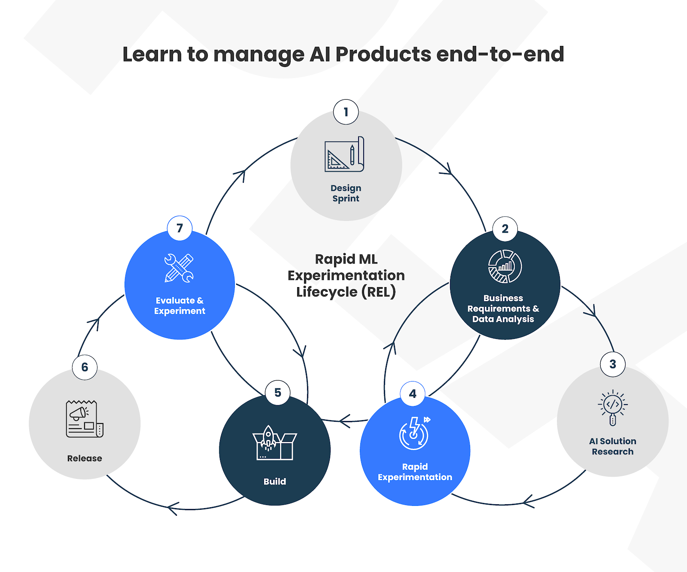

# AI 产品

## 定义 [6]

与AI三大基石（数据、算法、算力）全部有关的产品就是AI产品。它需要满足：

1. 经过数据处理（数据采集、清洗、标注、训练等），能反馈类人脑的结果；
1. 有算法运行，能随数据训练的增多，算法越发精准而强大；
1. 系统运行于算力底座上，计算形式可以多样（端、边、云），提供单元可以是CPU、GPU或NPU。

## AI产品与传统产品的区别：

1. AI产品诞生的市场背景是甚至一个垂直的细分领域均有一个APP产品的市场环境，这个时候需要AI产品做到比原来的产品好上10倍的体验或者比原来的产品快10倍以上才能赢得市场的环境。

1. 在做纯APP的时候是不需要考虑供应链的，但是由于广义范畴上的AI产品是**从数据获取到数据分析再到数据应用上，少不了硬件等外设**的采用，例如：用深度摄像头采集更多的数据，采用NB-IoT采集人和物体的行为数据，均需要硬件的融合。AI产品是更加考验产品经理综合素质的，除了设计管理好传统的软件上下游之外，还融入了供应链产业的深挖，例如：当你的摄像头与AI主体硬件产品出现BUG的时候，你需要联系的事摄像头生产厂商，而不像APP时代仅仅需要再成熟的手机上研发即可，这个时候需要产品调动的是摄像头整个研发甚至一个工厂来配合你。

1. 需求的变化有：

- 例如：新零售，用户需要货来匹配人，这里需要LBS和更多智能传感器的数据来服务人。
- 例如：线下商铺原来是不知道哪个用户来逛街，哪个潜在消费者在哪个商品前停留的更久，节假日购买热销商铺结账需要排队等等需求正好使得AI产品得以展身手的时刻。

## 形态

AI产品需要打破传统GUI的局限，AI产品对外提供的产品形态不仅可以包括前后端GUI的完整系统，还可以是**API接口和SDK的形式**；

### API、SDK类

在之前的文章《如何做一款SDK产品》中对SDK产品做了些简单描述，本文从API的形式去描述，产品需求文档中需要包括接口的输入、输出、算法准确率、误检率、漏检率、接口耗时性能和算法约束规则。

以图片识别为例，产品需要定义好的核心字段包括：

- 输入：图片格式—jpg、jpeg、png等；图片传输格式—base64或url；ROI区域—数量，默认可以是整张图片，最多支持多少个；ROI的画法—矩形（左顶点+长宽），多边形（所有坐标点）；识别类型—如果接口支持识别多个内容，这个字段可以加上指定需要算法识别的内容；其他的鉴权、时间戳之类的字段信息可以让开发定义；
- 输出：核心信息同算法需求，但是需要落实到接口字段上，如总目标数量、每一个目标的坐标信息、置信度，其他分析目标的特殊字段信息；
- 算法准确率、误检率、漏检率，这点笔者建议最好是以业务指标分析，以目标检测为例，通常算法是以mAP来衡量的，它是从目标维度来评估，但是用户通常是从图片的维度来衡量，一个图片中有误检或漏检的，用户可能就会认为这张图片识别出错；因此，需要产品定义明确好；
- 耗时性能，这里的耗时性能是指接口的**整体耗时**，即用户传入图片到返回结果的耗时，需要算法和开发一起评估，产品只需要定义产品需求。

### GUI类

如果是GUI类的形态，产品重点关注的应该是**产品原型**如何设计，用户体验，用户使用流程等，这个与传统的产品设计并没有什么区别，只需要将算法需求单独拆分给算法小伙伴。同时约定好算法的规则即可，所谓的算法规则即接受在当前的算法能力下对用户使用上的约束规则，比如要求用户上传的文件格式、命名有什么要求，算法返回给用户的识别结果有什么限制。

作为产品其实很无奈，原则上应该以用户为中心挖掘用户最自然的用户习惯，但是在AI技术不成熟的情况下，需要牺牲些用户体验。

### 对话式UI

GUI的复杂性体现在功能越多，菜单层级越多，交互的控件也越来越复杂，对于用户的学习成本是非常高的。导航与层级是GUI结构所决定的，这一点与对话式UI完全不同，对话式UI通过机器学习之后，可以无限地消灭层级关系，这样可以减少用户操作路径，直达目标。[18]

## AI 技术实际应用情况

![2018年AI 技术实际应用情况[9]](../img/AI_use.jpg)

## 常见产品

![常见产品[17]](../img/AI_product_often.png)

### 应用领域

http://www.woshipm.com/ai/4020213.html

## AI产品的趋势

![AI产品的趋势[7]](../img/AI_product_trend.jpg)

- 产品逻辑化简为繁，用户学习成本降低（PM : 尝试用“颠覆式思维”设计产品）；
- 从用户角度考虑投入产出比(PM : 选择用户最“痛”的点或者直接和利益挂钩的点作为需求切入点)；
- 算法可解释性差，产品需要逐渐获得用户的信任（PM：技术经过验证之后上市，树立了与专业形象，赢得用户信任）；
- 技术的飞速发展，带来了多元化的交互行为（PM：学会合理利用多种床设备，创造更多交互方式来满足用户需求）；
- 产品的需求不一定来源于确定的因果关系（PM:输出的未必是确定的页面内容，可能是一对规则和策略）
- PM在开始需求定义前应充分了解目前技术水平和资源的局限性，避免定义一些研发很难实现的需求

## AI产品价值 [2]

首先为了验证产品是否对业务产生了价值，用一个粗略的公式表示AI产品的业务价值，其次是为了分析产品的哪些品功能存在优化空间，最后还可以驱动业务决策

AI产品价值=（提高的时效*时效成本+GMV提升）-（AI硬件资源成本+研发成本）

## 关注产品

简单地说你使用了机器学习并不足以让你从其他科技产品中脱颖而出;他们也在使用它。让你从竞争对手中脱颖而出的是你如何使用这些数据。 [10]

### 辅助视障人士的天使眼智能眼镜

世界上首款辅助视障人士感知世界和出行的智能眼镜。最为重要的功能就是，通过人工智能的图像识别技术识别出使用者环境中的信息，并转化为听觉信号。 [4]

## 管理AI产品

## AI 蓝图

![AI 蓝图[13]](../img/AI_blueprint.jpg)

## AI 专利

### 类型

#### 发明

定义：是指对产品、方法或者其改进所提出的新的技术方案。
期限：自申请日起20年。
审查流程：2年左右

#### 实用新型

定义：是指对产品的形状、构造或者其结合所提出的适于实用的新的技术方案。
期限：自申请日起10年。
审查流程：6个月左右

#### 外观设计

定义：是指对产品的形状、图案或者其结合以及色彩与形状、图案的结合所作出的富有美感并适于工业应用的新设计。
期限：自申请日起15年。
审查流程：4个月左右[19]

https://www.darts-ip.com/de/2019%E4%BA%BA%E5%B7%A5%E6%99%BA%E8%83%BD%E7%9A%84%E4%B8%93%E5%88%A9%E7%94%B3%E8%AF%B7%E8%B6%8B%E5%8A%BF/

专利壁垒：https://wiki.mbalib.com/wiki/%E4%B8%93%E5%88%A9%E5%A3%81%E5%9E%92

## AI能力与场景的匹配

场景需求被解决到什么程度才正好？可以从三个方面进行展开：适度匹配，SOTA极限，团队资源。

- **适度匹配**的意义更多在于性能的合理利用，90%的人脸识别准确率显然不能用于金融支付场景，但是90%的人体检测准确率在人流量监测场景下却能够适用。硬要将人流量监测场景下的人体检测准确率提升到99%，暂且不谈能不能实现，单是研发投入就会极大提升，实际效用差却没有多大。金融支付场景下的人脸识别准确率对于实际效用影响巨大，是硬着头皮也要进行研发投入的点。将性能合理利用，适度匹配，根据实际调整解决程度。
- **SOTA极限**其实决定了解决程度的上限，SOTA是State-of-the-Art的缩写，有趣的是，它的意思指向“在一些benchmark的数据集上跑分非常高的模型”，代表了最优秀的一批算法。
很容易理解，如果目前行业的极限算法的能力是这样，那对于场景需求的解决程度也只能以此为上限。如果说SOTA极限来自于外部，那团队资源则是内部的上限。学界的有些算法方案在发布的时候，会切实考虑到工业应用，会将源码及部署方案一并发布到github等托管平台；有些算法方案则只有paper放出，没有相关实现资源。
- 如果最合适的算法恰好没有放出实现资源，而团队人力和时间又不足，则只能在放出过实现资源的算法里面找相对合适的，相应的解决程度也会受限。如果**团队资源充足**，就有机会通过paper进行算法复现，将需求解决得更好。

## AI产品研发生命周期

![AI产品研发生命周期[14]](../img/AI_product_life.jpg)

## 造成人工智能产品设计失败的常见原因

- 技术可行性：基于数据统计学习构建的模型，在实际使用中有很多限制。
- 组织变革：在技术和产品层面外，对于流程，组织都有一定要求，执行推进难度较大。[16]
- 技术驱动产品设计。产品应该从需求出发而非从技术出发。
- 忽略用户期望管理，华而不实的产品使用户失望。
- 单点突破带来的价值有限，产品价格与用户付出代价不成正比。
- 一味追求技术，忽略用户体验。 [12]

## 核心价值

企业的核心价值，特别是工业ML产品，如预测性维护软件，往往来自其预测的功能性能(如准确性)。[15]

[1]: http://www.woshipm.com/ai/3059898.html
[2]: http://www.woshipm.com/pmd/3657472.html
[3]: http://www.woshipm.com/ai/2705229.html
[4]: http://www.woshipm.com/ai/967258.html
[5]: https://www.zhihu.com/question/346379206/answer/826152506
[6]: https://www.zhihu.com/question/346379206/answer/1756356249
[7]: http://www.xmamiga.com/3573/
[8]: https://zhuanlan.zhihu.com/p/57849384
[9]: https://zhuanlan.zhihu.com/p/37333774
[10]: https://www.appcues.com/blog/product-managers-and-artificial-intelligence
[11]: https://www.sohu.com/a/454647822_114819
[12]: http://www.xmamiga.com/3573/
[13]: https://www.slideshare.net/Happy.Prototyper/mix2018ai-ai-vp
[14]: http://www.uml.org.cn/ai/201912183.asp
[15]: https://radiant-brushlands-42789.herokuapp.com/towardsdatascience.com/how-to-manage-machine-learning-products-part-1-386e7011258a
[16]: https://zhuanlan.zhihu.com/p/218468169
[17]: https://coffee.pmcaff.com/article/2258532879227008/pmcaff?utm_source=forum
[18]: http://www.woshipm.com/it/581011.html
[19]: https://www.zhihu.com/club/1154444201176559616/post/1395692125124681728
