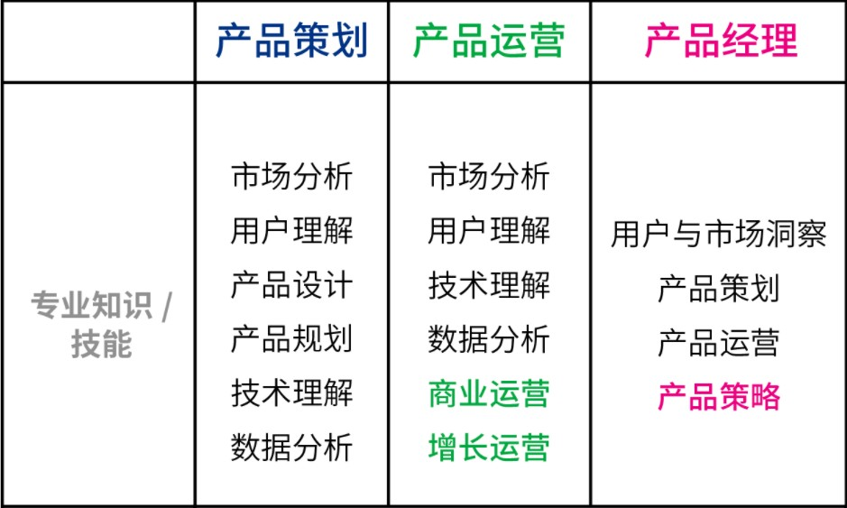
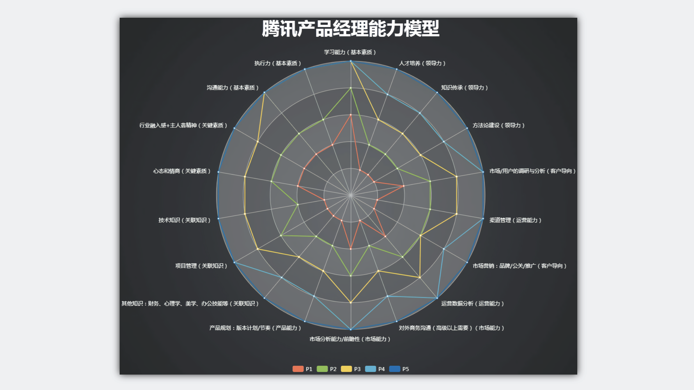
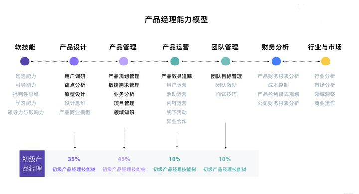
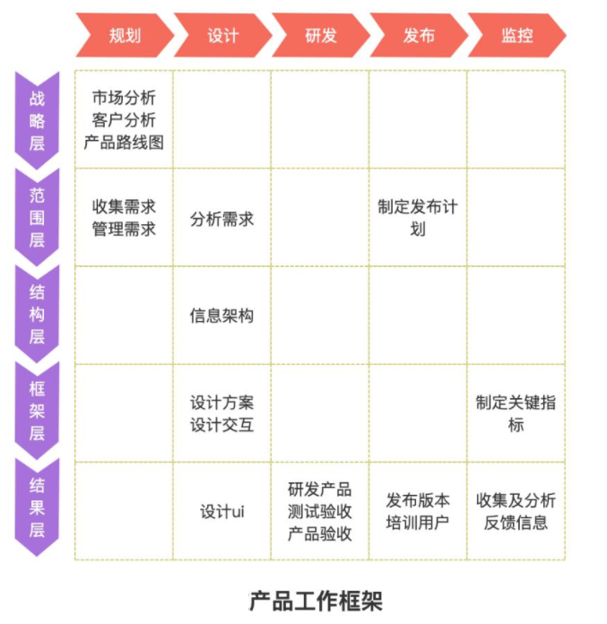
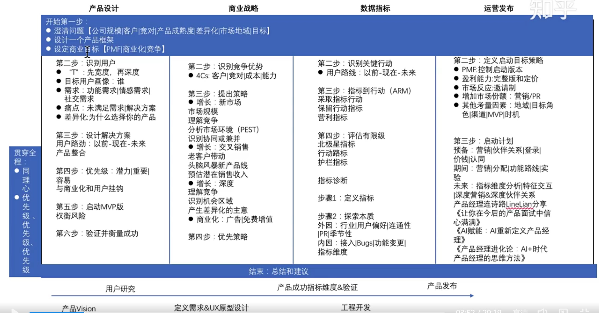
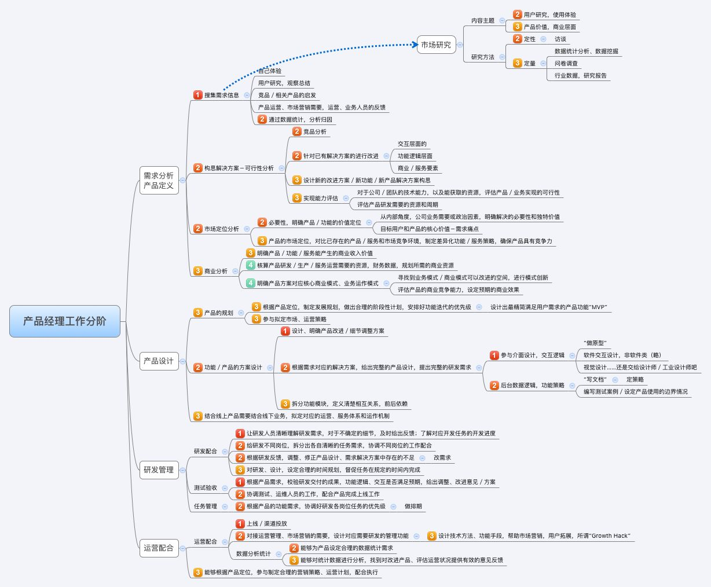
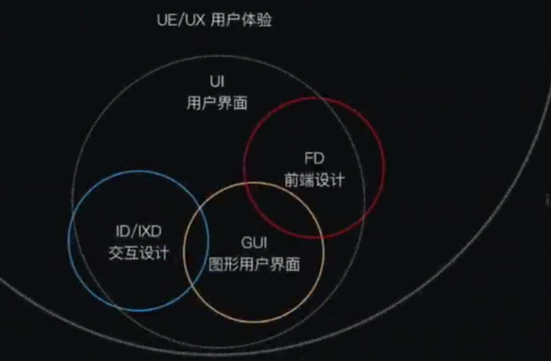
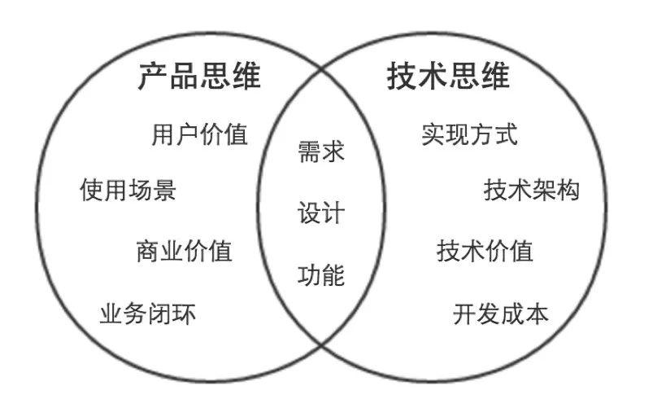
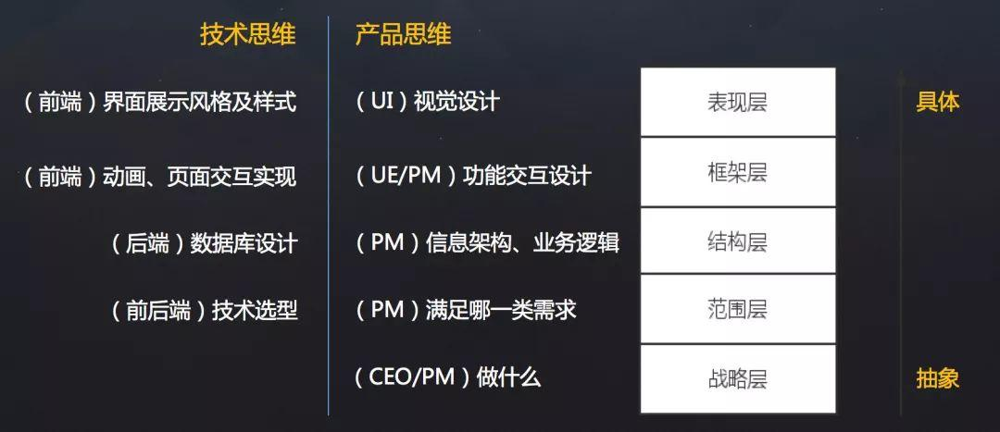

# Product Mananger

互联网上半场，资金为王，流量为王，营销为王，其典型特征是“短、平、快”；互联网下半场，存量博弈，品牌为王时代到来，能否留住用户、获得市场口碑，靠的是过硬的产品和精耕细作的产品人。 ——王超辉　58到家高级总监 [22]

## 定义

真正的产品经理懂得搭建产品矩阵，认清行业趋势，发现需求，用数据、专业度和案例事实去协调团队其他成员，保障项目准时完成，并且能让产品盈利的。 [24]是《启示录》里说的“发现有价值的、可用的、可行的产品的岗位”。其站在商业、技术和用户体验（BTC原则）三者的交点。商业指的是专注于实现产品的最大商业价值，技术指的是在产品如何被创造出来所涉及的过程，而用户体验指的是以产品去跟用户交流。[47]

能力要求（自己总结的）：用户观察、同理心、市场判断（发现机会）--》逻辑沟通来串联商业与技术（整合、争取资源）--》不断项目管理来推进执行--》推向市场来不断反馈（运营、营销、销售）

眼（洞察机会，发现目标）-》说并行（决策做什么，并规划与调度执行能力[60]）-》眼（不断针对目标修正）（结合能力）。

### 心态

只要你能够发现问题并描述清楚，转化为一个需求，进而转化为一个任务，争取到支持，发动起一批人，将这个任务完成，并创造了价值，并持续不断以主人翁的心态去跟踪、维护这个产物，那么，你就是产品经理。

### 市场满足

产品经理的价值是创造一款满足产品-市场匹配（Product-market fit，PMF）「在一个好的市场里，能用一个产品去满足这个市场」的产品 [9]

为企业获得利益回报而创造顾客价值，并与顾客建立稳定的关系；为产品的市场结果负责。

- 顾客价值，即为顾客创造的产品（包含服务，我将其归到产品里，以后所有提到产品的地方都包含服务）；
- 商业价值：利益回报，简单讲就是买产品赚取金钱收益，当然也可能是合理降低回报以获取品牌收益，但最终还是为了赚钱；
- 建立顾客关系，即持续赚钱，尽可能占领更多的市场。

### 协作

产品经理是“将不同语言的公司的所有各种功能和角色结合在一起的粘合剂” – Ken Norton，GV [7]

产品经理还是一个项目的信息汇集中心，对于公司的战略方向，产品经理比其他人更早地知道。产品经理也会经常跟运营人员、销售人员开会(“贩卖”自己的产品理念，并讨论方案的效果与技术可行性；有效回答各方问题，为什么做、做什么、如何做、什么时候做完[57])，所以对于公司的运营节奏、销售数据，产品经理都可能提前知悉。这些都是可以帮助产品经理快速成长的点，也是产品经理不断积累人脉的基础。 [15]

传统产品经理泛指传统互联网产品经理，区别于宝洁（产品经理这个职能的开创者）时期的实体工业产品经理，互联网产品经理标准化是在移动互联网的商业模式成型过程中，也就是2010s这个时期，在这个时期随着移动互联网的发展，各个公司特别是BAT为代表的巨头公司细化了产品经理所需要具备的能力模型，并且基于这个能力模型去对产品人员进行量化考核 [1]

### 核心能力

产品经理的核心能力是最大化的**资源整合管理能力**，包括资源发现，资源获取，资源管理，资源再生，资源裁剪等。 [34]

### 能力来源

产品经理的能力主要来源于三部分：业务经验、平台适配、认知能力。

业务经验，是指在特定业务场景下，产品经理对用户模型的认知程度；平台适配，是指产品经理对所处平台组织结构、决策方式等的适应程度；而认知能力更多的是，明白如何做正确的事情，以及如何正确的做事情。

业务经验和平台适配不具备通用性，且最多三到五年就会到达天花板，而认知能力无上限，且具备极强的通用性。[41]

## VS Project Mananger

**产品经理（Product Manager）**：更复合型人才，负责挖掘用户需求，并提出能够同时满足用户需求和公司利益的产品方案。对产品本身负责，对商业计划负责，对用户负责，或者说对产品发布后是否受用户认可负责。与产品运营人员共背用户数、活跃度、留存率、营收等KPI指标。[42]

多做需求快速试错: 对于大多数产品经理来说，用户是否喜欢新功能其实是未知的，不然人人都是产品经理了，免不了试错的过程。做5个新功能可能没有1个用户喜欢的，做50个呢？总能撞上几个让用户喜欢的吧。所以很多不成熟的产品经理喜欢通过增加功能点来“碰运气”。

**项目经理（Project Manager）**：更专才，负责管理整个产品开发过程的项目，负责协调产品开发中的一切资源，包含人、时间、资源、成本等。是整个项目的牵头人，对项目的开发过程和按时完成预期结果负责。也就是说，项目经理的KPI应该是项目的按时完成与完成质量。用户数、活跃度等指标一概与项目经理无关，更别说干涉需求。

按时按质完成：做得越多就错得越多，很容易影响项目按时验收，以及项目结果质量。比如APP产品的开发，大家都知道修复完一个bug后，正常情况下会出9个新bug。所以项目经理是喜欢需求越少越好，这样项目复杂程度会低，工作量与风险程度都很容易控制在安全范围内。

由目标的差异推导，项目经理更强调执行，是接到一个任务，**“多快好省”地做事**；产品经理更强调创新，是设定一个目标，**做符合商业目标的事**。

如果由一个人同时担任产品经理和项目经理，就很容易左右互搏。需求是自己的，当然希望都做。但开发过程中遇到难题怎么办。砍需求？改方案？自己预期中最完美的方案要舍弃还是挺心痛的。坚持把需求按原方案做完？项目延期，影响正常上线，责任谁担？

如果产品经理是大写的PM，那么项目经理就是小写的pm，**项目经理**可以理解成是产品经理工作**在项目管理上的细分岗位**职能。一般产品经理如果在工作中忙得过来就会负责项目管理层面的工作，但是如果产品上线，产品层面工作颗粒度变细，这部分工作产品经理就需要拆分出去给其Ta小伙伴负责。[56]

### 时代背景

过去需要的是项目经理式的工作能力，而现在更强调产品经理式的工作能力。

时代背景——产品的供给，都在从短缺走向丰饶。选择的丰富导致选择的困难。市场从从生产驱动变成了需求驱动。

## 你配PM吗

### 不是人人都是PM

他们所理解的产品经理，无非是写文档、画原型、催进度，保持一颗满足用户需求的心，再喊几句「用户永远不知道自己想要什么」便可以为所欲为的一个岗位。

既不用懂代码，也不用会设计，更不用跑业务，还有着「经理」称号，并且平均薪水一度在招聘网站的薪资报告中显示排行第一，好像是一个绝佳的工作岗位。[23]

对产品经理有洁癖的腾讯，把12级（原P4-1）以下( 总共4 级-14 级)的产品从业者都改名叫什么产品策划、产品运营，只有综合能力达标的那一小撮人，才配继续叫产品经理。[8]

### 画原型 ！= 产品经理 [26]

你无时无刻不在提醒自己，产品经理就是要画原型，因为有了原型才能去和研发部同事开需求评审会，有了原型才能第一时间和领导沟通需求，有了原型才有了能够写进周报里的工作事项。

这使得产品经理似乎成了互联网行业里最不需要专业技能的岗位，站在大街上随便叫一个人，定向培训一个月的 Axure 就可以直接上岗了。

### 沉溺于细节 [27]

很多类似按钮放左或放右的问题，如果你真的做了 A/B 测试，那么你会发现两者的数据是完全一致的，无论是第一视觉、操作的难易程度还是数据的转化等，都是一样的。

### 只看表面 [28]

产品经理要谨记自己的第一要务是基于目标用户的某个问题，提供优于市场的解决方案，目标用户需要的是解决方案，而不是简单的视觉冲击（界面设计那是设计师的活）。视觉能够在某个瞬间刺激用户，但如果没有长期吸引用户的价值点，那么他们终将会离开。

产品经理解决目标用户问题的最好办法不是花费精力去研究视觉，而是要先把视觉的外衣褪去，抓住核心的问题点去寻找更好的解决方案。

### 不只是需求分析

分清产品和需求分析师的差异--传统互联网期间对标产品岗的岗位是需求分析工程师，只是之前的需求分析工程师，更多是把业务专家或是需求方的需求转化为具体的系统功能。而产品经理更多需要从业务全局考虑进行整体的系统设计，系统不仅要能用还需要好用，更多是0~100的思考。[62]

### 需求评审会上自说自话 [29]

产品经理在需求评审会上“专注而又认真”地讲解，压根儿不管下面的听众。

执行时才发现，有很多不明白和无法实现的地方，“这里的逻辑到底是怎样的？异常情况要如何处理？这个方式实现不了怎么办？”

就这样，进度又一次被耽搁。研发人员认为产品经理的需求不靠谱，有很多功能需要花费很长时间才能实现；产品经理认为研发人员根本不用心，而且也不怎么加班；而测试则一方面认为产品经理的需求本身不够严谨，另一方面又认为研发人员写的代码漏洞百出。

或是一次性甩17个小功能需求参加需求评审会，是“自杀式”的打法，不利于产品迭代，同时更改的功能点过多，不够聚焦。动机和功能的缘由必须总结清楚，否则无法说服开发。[54]

### 对测试不闻不问 [30]

测试人员本身更关注流程、压力等方面的测试，不会过多地考虑背景、目的、核心功能，因此测试人员做的测试可以理解为走流程的测试，而产品经理做的测试则可以理解为战略性的测试。

产品经理要做的测试基于页面、流程的核心功能的还原程度，如今日头条类产品的算法推荐逻辑、淘宝类购物平台的千人千面、金融类产品背后的风控模型等。也可以说，这个核心功能等同于这个版本，如果这个核心功能没有达到预期的效果，那么这个版本本身就应该直接被废弃。

因此，产品经理不能把测试、上线这些事情全部交给研发人员和测试人员，而应参与整个研发过程，第一时间了解研发人员、测试人员对于需求本身的理解，以及现阶段实现的情况、难点和需要的支援等，从而更好地达到上线的效果。

### 上线后彻底不管 [31]

工作要产品策划和产品运营融合起来。产品经理要对结果负责，而数据能最好展示结果。

产品经理每天都要看自己负责的产品功能的数据并对其了如指掌，能够基本判断阶段性的数据起伏背后的原因和预设各种数据的埋点，这些本身就属于产品经理的基本职责。

而上线后彻底不管，就像只生不养。研发人员和测试人员只是帮助产品功能上线，而市场运营的同事才能够让产品的价值最大化。

产品上线之前，产品经理需要提前做好产品上线的市场运营工作，而不是单纯地等着自己负责的产品功能上线，然后看着它悄无声息地躺在 App 的某个角落，无人理睬，最终又悄无声息地下线。

### 产品没落很轻松 [32]

很多产品不到 3 年便走向没落了，而很多产品经理只能算自己产品的月活用户（而且一个月只登录一次），很多时候线上产品出现了漏洞，自己却是最后一个才发现的，更不用说主动去探索更多的商业化空间和优化空间了。

产品没落了，产品经理虽然不一定非要悲痛欲绝、情绪失控，但是至少要懂得抓住这样的机会快速地总结和复盘[33]，思考产品没落的原因是什么。

## 岗位稀缺？

由于产品经理负责的产品也许是一个公司的核心，产品经理的好坏直接影响一个公司的运作，所以这样的职位一般是不招聘新人的，甚至少于三年产品类工作经验都直接不考虑。并且很多公司或者团队也是很少培养这方面的新人，而大公司会通过校招等方式招聘一些有潜质的人才进行岗位培养，但是往往都是几千几万人竞争1个名额，也并非所有人都有机会。 [43]

## 要求[63]

Google对于产品经理的要求很高：

1. 一般不在应届生中招聘
1. 代码能力强（能达到Google入职水平）
1. 有咨询行业背景

腾讯校招要求：

1. 对开发、测试、运营、设计有一定了解；
1. 对互联网产品极度热爱，怀揣着做出最优秀互联网产品的梦想，具备敏捷的洞察和思维能力，并且有把思考变为现实以满足用户需求的勇气和能力；
1. 优秀的创造力、想象力、逻辑思维与系统分析能力，突出的文字组织能力和沟通能力；

## 分类维度 [38]

1. 按照行业分：金融产品经理、医疗产品经理、教育产品经理、电商产品经理等等；
2. 按照产品形态分：移动产品经理、PC产品经理、小程序产品经理、M站产品经理、后台产品经理等等；
3. 按照工作内容及方法分：功能产品经理、数据产品经理、策略产品经理、商业产品经理等等，

### 职能分类 [44]

#### 功能型产品经理

功能型产品经理主要就是设计功能，通常都是刚入门或入门不久的产品经理，像产品助理（专员）也是属于功能型。功能型产品经理一般只需要懂工作中的各类常用工具软件的使用，以及各种常见的产品模式的用户角色和功能结构，懂得这两大项就完全可以胜任功能型产品经理的工作了。常用的工具软件有Office办公软件、思维导图软件、原型设计软件等；常见的产品模式有B2C、O2O、SNS等。

功能型产品经理常见的工作情况就是执行公司的产品基础规划和设计，比如公司需要做一个B2C模式的电子商务网站（或App），功能型产品经理就只需要将B2C模式的用户角色和产品功能规划并设计出来就可以了，一般不用全局性考虑产品的运作策略，或者说功能型产品经理还不具备全局性规划产品的能力，所以功能型产品经理更像是一个工匠。

但是这类产品经理也不是轻易胜任的，需要了解各类产品模式的用户角色权限与产品功能结构是什么样的和怎么实现的。当遇到公司提出需求的时候，能够第一时间就对产品形态和功能结构有一个初步的思路，一旦明确了产品需求就能够清晰的知道如何展开工作。

#### 运营型产品经理

运营型产品经理就需要对产品进行全局性思考，负责产品的整体规划和设计，并且能够独立完成产品的一系列策划工作，同时还需要考虑产品的后续运营和拓展。所以运营型产品经理不仅仅需要考虑产品实现，还要考虑产品市场以及运营。正所谓产品和运营不分家，产品决定运营的宽度，运营决定产品的深度。

运营型产品经理就需要我们有很多行业知识的积累和思考，不仅要懂产品、懂用户体验，还要懂市场、懂运营、懂商务等。充分了解产品的市场和运营，可以帮助产品经理规划和设计出更符合实际需求的产品，避免了闭门造车。

#### 管理型产品经理

管理型产品经理就偏向于行政意义上的管理者了，比如产品部经理或者产品总监。管理型产品经理会对公司的产品线进行管理，沟通和协调公司资源，对接产品和业务，所以管理型产品经理有很强的战略思维和决断能力。通常这种职位会在大公司或者有多个产品经理的公司里出现，凡是公司里有很多产品经理，就会有管理型产品经理负责整体管理，担任产品部门的经理或总监，因此管理型产品经理不仅仅要具备功能型和运营型产品经理的职能，还要具备很强的团队和项目管理能力。

## 能力要求

软能力包括了最常提到的学习能力、执行能力、沟通能力、责任感、沟通表达能力、市场洞察能力、创新能力、影响力等等，这些能力是比较难以量化，需要通过具体项目推进去观察，带有一定的主观性。

硬能力包括了产品规划、需求调研、需求拟定（原型、需求文档等）项目管理、商务沟通、运营数据分析、市场营销等

## 工作主线

主线是围绕产品从0-1-N全周期的具体推进。

### 产品工作框架

Cobit框架： 规划-》设计-》研发-》发布-》监控

### 工作内容 [2]

1. 做行业洞察和市场调研，分析行业和产品的发展趋势，友商的竞品分析和客户的需求分析等，输出MRD，需求用例评审。
2. 根据MRD结合公司现有的技术积累、公司战略方向、客户痛点需求和市场销售预期写PRD。
   1. 先分析业务，整理出需求用例文档，需求用例评审通过[6]
   2. 用 Axure 制作原型图，原型图评审通过
   3. 用 PhotoShop 做出效果图，效果评审通过
   4. 切图出素材，再然后开始做软件架构设计，架构评审通过
3. 推动研发的开发和资源投入，项目管理（制定计划并跟踪、确定资源投入、把控质量，写周报等汇报），产品生命周期管理等
4. 负责产品的推广策略、要写一堆的产品推广资料
5. 负责产品经营性工作，要负责产品营销策略和产品销售业绩，所以经常要做产品经营性数据分析
6. 培训、拜访客户、挖坑、填坑balabala.....等其他非核心内容工作。

## 产品经理的角色理解 [5]

产品经理不做具体的开发工作，只是规划产品的功能和发展方向，然后去协调UI、UE、前端、开发、测试等部门，一起协同完成产品的开发。从这个意义上讲，产品经理是做协调工作的

首先我们要明确的一件事是：虽然称为产品经理，但产品经理是没有管理权限的，也就是说产品经理在公司几乎不能要求别人做什么事情，而只能是协调他人做什么事。

弄清楚了这一点，我们再来看产品经理在公司的角色，就可以归结为协调者。所谓协调者，可以从以下几个方面来理解：

### 信息的协调者

在前面介绍产品经理做什么的时候，也说到产品经理会接触公司大部分的部门，因此产品经理就会收集到这些部门与自身产品相关的信息。例如产品经理可以从公司领导那里获得产品战略发展的信息;可以从UI那里那里获得LOGO含义的信息;可以从开发那里获得产品底层框架的信息，等等。当这些信息达到产品经理手里时，并不是信息的终结，而是信息分析与传递的开始。产品经理需要将这些信息转化，转化成大家需要且易懂的信息，进而再传递给需要的成员。从这个意义上讲，产品经理在公司更多扮演了信息收集者和传递者的角色。

### 资源的协调者

虽然说产品经理手里没有管理权，但却在很大程度上决定产品的发展，因此产品经理可以发挥影响力来协调广泛的资源。我们都知道，产品经理需要和公司领导、UI、前段、开发、测试、客服等部门进行协调，而这些部门同事的工作基本上也都是围绕着产品经理展开的，所以两者之间是一种相互依存的关系。

在这种情况下，产品经理就可以根据产品计划来协调资源。不过，这里非常考验产品经理协调资源的能力，尤其是在产品经理手里有若干项目，或者有若干个产品经理要共享有限的资源的情况下，这时候协调的好与坏，直接决定了项目的进度与效率。

再上升一个层次看产品经理的角色，其手里可能握有产品的生杀大权。也就是说，产品经理可能会决定一个产品的成与败，一个优秀的产品经理可以化腐朽为神奇，成为人们心中的大咖，而不好的产品经理却可能化神奇为腐朽，将产品和团队带入迷茫之中。

对于很多产品小白而言，可能做的更多还是领导指派的具体事务，不过只要保持进步，终有一天会成为中流砥柱，而如果你已经小有成就，对产品也需要抱有敬畏之心，因为世界变化太快，成败往往就一瞬之间的事情。

## 产品经理接触的人

分两部分来说：产品规划与产品开发。

### 就产品规划而言，产品经理接触到的人包括但不限于：
:label:`prod_people`

**互联网公司职位分为这几种：** [39]

- 三大必备职位：技术、运营、产品。
- 三大辅助性职位：UI、测试、市场。
- 三大支持性职位：客服、行政、总经办。

1)直线领导：

当我们做产品规划时，必然要和直线领导就方案达成共识，才能进一步向外沟通确认，因此在产品规划阶段，你需要频繁地与直线领导沟通或汇报(有时候直线领导可能不参与具体讨论，但需要知道进度)。

2)公司领导

有时候，公司领导可能是某个需求的提出者。这种情况下，产品经理(或直线领导)需要向公司领导汇报相关解决方案。

3)业务人员

如果你负责的产品有业务人员的话，那他们也是产品重要的需求方，同时他们在与客户接触中，会出现种种问题。这个时候，都需要产品经理参与解决。

4)客服人员

针对产品规划，客服人员反馈的用户数据尤为重要，因此产品经理需要频繁地与客服人员进行沟通，搜集数据，整理并转化为需求。

5)用户

用户研究是产品规划阶段的核心工作之一，也是产品经理难得的接触真正用户的机会。在这个阶段中，产品经理可以采用用户访谈、调查问卷、可用性测试等方式，多多与用户进行接触。

### 就产品开发而言，产品经理接触的人包括但不限于：

1)UI/UE

当产品原型最终确定，就可以进入UI设计（多为GUI）阶段，这个时候产品经理就需要和UI探讨原型细节，进入设计阶段。用户界面是系统和用户之间进行交互和信息交换的媒介,它实现息的内部形式与人类可以接受形式之间的转换。体验其实也就是一系列感官的综合。

2)前端

UI设计完成后，就开始转入前端工作。对于前端而言，会更加关注细节，每一个按钮的状态变化，每一个交互细节，都需要详细说明。这块一般是由产品经理和UI共同提供的。

不过如果是移动端产品，前端基本上就不太会参与，页面切图和标注工作主要是由UI完成。

3)开发

开发的工作主要是参照需求文档来展开的，因此产品经理需要就需求文档细节与开发进行充分沟通，以保证开发工作的有效性。

- 研发经理:研发经理是技术研发管理职位，负责了解项目的需求，系统分析，做相关的技术选型，制定开发计划与开发规范。
- 架构师:架构师是软件系统和网络系统的设计师，负责确认和评估产品需求、搭建软件研发和网络系统的核心构架、并扫清主要难点。架构师着眼于“技术实现”，能对常见场景快速给出最恰当的技术解决方案，并能评估团队实现功能需求的代价。架构师分为软件架构师和系统架构师两类，分别专注于软件开发和系统运维两个阶段的系统设计。
- Web前端工程师:Web前端工程师是界面研发职位，负责根据架构设计文档和界面设计稿，使用Web技术（HTML/CSS/JavaScript等）进行Web产品界面开发，并调用Server端接口实现Web应用。
- APP开发工程师:APP开发工程师是APP界面研发职位，负责根据需求文档和界面设计稿开发出APP客户端界面，并调用Server端接口实现APP应用

4)测试

开发完成了项目工作，就进入了测试阶段。一般情况下，测试人员会在开始之前召开测试用例评审，然后才进入具体的测试阶段。无论是测试用例编写阶段，还是测试阶段，执行测试任务、提交测试Bug、跟进Bug修正,产品经理都是要与测试充分沟通的。

如果把产品经理比作“爸爸”，开发比作“妈妈”，那么测试就是“产检医生”，产品能不能健康出生、茁壮成长，关键看大夫的能力和责任心。当然，还有一个重要因素是“妈妈”不能太不负责任，在怀孕期间太任性，大吃大喝、喝酒抽烟、剧烈运动，完全不顾孩子死活，即使大夫再牛逼也无回天之力。[55]

事实上，项目开发的工作是阶段性的，但产品经理与团队的接触则是全程的。从需求的发生，到项目的上线，产品经理都需要与UI、前端、开发、测试等人员充分接触，对产品需求进行沟通评估。

### 在生活中锻炼产品规划 [21]

例子：小曹在北京的互联网中心上班，每到下班的时候，就会有大量的人从各个写字楼里“喷涌而出”，场面非常壮观。这些人有两个比较大的流量集散点，一个是公交站，另一个是地铁站，小曹就是在公交站等车群众中的一员。小曹边等车边思考，如何能够做一个产品来解决这个片区的人流拥堵问题呢。小曹想过公交信息查询产品，想过共享巴士产品，想过商圈引流产品，这些产品要么属于伪需求产品，要么产品路径冗长，要么没有清晰的商业模式。

1. 非常多的行业帮你建立“场景思维”。你可以通过不同场景的串联、不同行业的特点，看到用户的很多需求是如何被满足的。
2. 真的用户：大多数产品经理都是在办公室里做产品规划的，或者做一些竞品的功能截图。这都不如来到用户身边感受得更深刻。
3. 丰富真实的用户体验。在银行、医院排队的焦虑、很多线下场景的烦琐流程、很多设备的交互体验做得不够完美、很多客服对待用户不友好。

### 产品经理的交流

当产品经理与运设技一对一两个团队交流时，其实是六个方面在交流：

1. 产品经理以为的产品
1. 产品经理以为的运设技（运营、设计、技术）
1. 真正的产品
1. 运设技以为的产品
1. 运设技以为的产品经理
1. 真正的运设技

主观与客观、产品、产品经理、运设技

## 0-1/1-∞分类 [25]

](../img/PM_naotu.png)

### 需求挖掘 [25]

需求挖掘，也可以称作产品定义、从 0  到 1、模式创新等等，这类是在新要素到来时寻找巨大体验差空间的角色

在三个要素接踵而至的创业红利期，第一代产品经理做的大多是需求挖掘，而且一旦挖准，这些人也大都成为了成功创业者甚至巨头企业老板。

真正定义产品的，其实是早期产品经理或创始团队。甚至像美团的战略思路，产品模型都是要找现成的，产品研发和业务团队的职责，就是让成本和效率做到极致，逼死竞争对手。

创业红利期，产品经理可以通过印证用户需求来证明自己能力，边际成本是很低的，比如要基于 QQ 做 QQ 秀，或要基于百度搜索做百度贴吧，是产品经理可以驱动的事情。一旦成功就能奠定地位。

### 关注效率成本

关注效率成本，从体验、从交互、从增长、从问题拆解、从项目推进等维度，去实现产品效率成本的优化，不改变产品模型和业务模式。

而红利消失后，绝大多数产品经理就成为了螺丝钉，哪怕在某些公司称为 CPO 或 VP 的产品经理，也是带领产品团队做效率成本优化的角色，而非定义产品的角色。

在螺丝钉时代，产品经理往往不是定义而是优化，那就变成跟运营一样追求业务指标的角色，更多是用 KPI 证明自己的能力，且要在项目中跟运营、市场等争取自己的决策权和话语权。或者换个视角说，没有运营和业务的配合协同，螺丝钉产品经理很难独立达成业务目标。

这两年常被半开玩笑说起的，古典产品经理的时代结束了，其实就是指“做定义”的角色消失，全部褪去光环，成为跟运营一样“做经营”的角色（甚至有时不如运营）。

哪怕经常被人讲说唱衰行业制造焦虑，我还是要坚持这么讲。未来相当长期的一段时间里，各行各业需要的，更多就是**运营**一样的螺丝钉角色来制作产品，甚至有的公司就叫产品运营或者业务经理，title 已然不重要了。

## 偏技能/管理分类

### 技能型产品经理

所谓技能型产品经理，就是对某个特定领域有很深的研究，具有较高的专业门槛。为了更直观地了解技能型产品经理，我们来看一则招聘广告：

职位描述：

- 负责京准通(京东广告平台)创意审核系统，AI方向的优化升级相关工作;
- 从AI审核、人工审核、创意自动化等多个方向出发，提出优化改进方案， 最终实现审核时效及审核通过率的提升;
- AI在广告投放平台的其他应用试验：包含效果优化，预算控制等。
- 了解行业整体发展趋势，定期对相关竞品进行跟踪和分析;
关注产品运营数据和用户反馈，深入发掘用户的需求，持续改进产品。

任职要求：

- 熟悉互联网精准广告的投放流程，具备互联网商业变现或者广告行业工作经验者优先;有AI相关工作经验的优先
- 良好的需求分析、数据分析、产品设计能力，熟悉产品设计工作流程;
- 优秀的沟通协调能力，整合各相关团队资源，推动跨团队合作。
以上是京东商城招聘AI广告产品经理的招聘信息。从信息中，我们可以看到，对产品经理的要求几乎都是关于AI方面。对于此类工作，如果没有深厚的专业知识和行业经验，是很难胜任的。

### 管理型产品经理

相比较技能型产品经理，管理型产品经理的要求更多偏向于规划、协调等方面。同样，我们来看下面招聘信息：

职位描述：

- 负责规划、设计、运营管理产品，架构专车B\C端产品系统;
- 根据每个阶段的业务目标，确立需求的优先级，满足业务每个阶段的人员效率要求，支持业务快速发展;
- 负责具体系统项目的计划、需求和产品文档撰写，详细阐述产品功能和操作流程;
- 跟进协调与支持产品相关的技术团队完成产品开发任务，保证按时上线。

任职要求：

- 5年以上互联网产品设计经验，有丰富的系统设计或独立业务经验的产品架构师优先;
- 良好的逻辑思维能力、系统思维和广阔的业务视野;
- 良好的表达能力、沟通能力、抗压能力和团队管理能力;
- 富有激情和强烈的创新意识和团队合作。

## 大厂VS咨询VS创业 [11]

### 大厂产品经理

以腾讯（商户管理）产品经理的工作职责，我们可以看到大厂的产品经理需要具备的关键技能体现在 4 方面：

1. 产品设计和运营能力
1. 持续优化和运营能力
1. 组织协调和跨部门协作能力
1. 长期规划能力

大厂产品经理需要具备的技能中，有 2 个关键技能非常值得大家注意：

1. 软技能

在大公司，需要产品经理具备软技能，比如书写邮件能力、组织开会能力、整理会议纪要能力、协调资源能力。

2. 跨部门协作

在大公司，各部门的职能划分非常细，比如市场、销售、运营推广、用户调研、市场调研都是由不同的部门来承接，所以大厂的产品经理在工作中，需要跟多个部门进行跨部门协作和协调，才能把产品顺利上线。

## 咨询公司产品经理 [12]

1. 研究并理解客户的战略、商业模式，挖掘并揭示客户的痛点和诉求
1. 帮助客户识别商业机会并建议实施方案
1. 引导需求探寻和创新思考工作坊，产出客户认可的解决方案
1. 创建并清楚展示方案蓝图，确保客户和交付团队理解并达成共识
1. 定义关键目标、成功要素，识别风险、挑战、依赖和约束
1. 有效引导和促进 Product Owner、客户出资人、行业专家、技术团队、最终用户间的沟通和协作，保证产品从概念、到原型、到上线及运营的端到端交付

### 创业公司

创业公司的产品经理需要具备的关键技能

与大厂不同的是，创业公司产品经理的关键技能主要体现在 3 方面：

1. 领导力
1. 魄力
1. 凝聚力

创业公司产品经理的工作职责有 4 个关键点：

1. 制定方向和策略

在产品的初期，产品经理需要参与公司和产品愿景和规划的过程，从制定产品方向和策略开始，而不仅仅是考虑产品功能的设计。

2. 全流程参与

创业公司的产品经理需要参与到产品的所有环节，比如从产品远景、规划、原型设计、交互设计、视觉设计、开发上线的每一个环节。

3. 发挥空间大

创业公司的产品经理需要主动承担和负责产品的整个生命周期，凝聚团队成员协作，发挥空间较大。

4. 高风险

大厂的产品可能是已经成型、上线、有一定数量的客户，但是创业公司的产品需要试错，并不知道产品推向市场以后的反应是怎样的，所以具有相对较大的风险。

模拟AI创业：https://blog.csdn.net/weixin_45036344/article/details/95051856

## 小白学习

### 重心 [50]

1. 实操去落地：原型、文档、竞品分析、架构
2. 把产品认知：从用户直观的好用好玩，来解构产品。京东、淘宝等产品的组成，数据流动关系、如何管理前台等。
3. 学项目流程：了解团队的各个角色，如何配合，在不同阶段中重点把握，哪里有难点，哪里容易出现问题。区分开项目经理

### 基础

#### 视野

- 对各个行业的产品要了解。（比如：垂直电商也要了解电商平台。）
- 公司业务不止一种形态，加边缘业务。（电商、O2O、教育、咨询。。。）
- 现象级产品（比如：开心网很多用户又消亡的背后成败原因）
- 查资料（搜索引擎：谷歌，学习国外，像素级抄袭商业模式和产品形态，反copy[52]：共享单车LimeBike、移动支付[51]；天涯为何不死；）
- 虎嗅App看新闻（回顾、分析、研究、扩展）

#### 表达能力

- 作为点子、观念的阐述者
- 活在聚光灯下，作为表演者，之后给掌声或臭鸡蛋。优缺点会放大，条理不清晰。
- 原型的评审：你站在前面讲产品，下面的指出我的问题。情绪化的人还是成熟的人？
- 台下有很多人，节奏不自然。。每天都要演讲，调整好心态和情绪。

#### 技术开发

- 代码上的区别：前端（浏览器中解析呈现：HTML, CSS, JS等标记语言）、后端（在服务器中运行：jsp、javaBean 、dao层、controller层和service层等业务逻辑代码，还有数据库）
- 展现形式的区别：前台（只用户不能进行登录就可以看到的内容、页面，就像百度首页或者其他站点、博客、企业官网等等一样，是呈现给用户的视觉和基本的操作。）、后台（指程序的使用人员，管理人员经过密码或其他验证手段之后才可看到的内容，往往可以进行一些操作，比如发布文章，填写工作日报，数据的增删查改操作等等。
用户浏览网页时，我们看不见的后台数据跑动。后台包括前端，后端。）
- 训练模型的区别：动态训练（采用在线训练方式。也就是说，数据会不断进入系统，我们通过不断地更新系统将这些数据整合到模型中。）、静态训练（采用离线训练方式。也就是说，我们只训练模型一次，然后使用训练后的模型一段时间。）
- 模型推理的区别：静态推理（离线推理，是使用 MapReduce 或类似方法批量进行所有可能的预测。然后，将预测记录到 SSTable 或 Bigtable 中，并将它们提供给一个缓存/查询表。）动态推理（在线推理，是使用服务器根据需要进行预测。）[53]
- 网站、域名、服务器、IP
- 缓存、接口、数据库、H5,JAVA, PHP

#### 更多技能及实践

- 逻辑思维：可用性、易用性：逻辑正确去保证解决问题。
- 基础的电脑操作

- 多学竞品分析,少学需求分析。
- 多学数据分析,少学人性分析。
- 多学布局设计,少学交互设计。
- 多学项目管理,少学用户体验。
- 多看发展历史,少看热门案例。
- 多画流程图,少画脑图。
- 多自己思考,少听专家。
- 多做练习,少看书。

## 分成三个层次：

1. 对功能负责，就所谓做feature：根据业务方的需求主导项目，做出某个产品的功能，达到满足需求上线。
1. 对产品负责。需要负责整个产品生命周期，从需求收集、需求调研、理解用户、洞察用户，到产品实现，验证发现新的问题去反馈，最终打造出一款非常好的产品。
1. 对目标负责。目标导向，更好地去利用资源服务目标（资源并不一定是产品或者研发，也可能包括新的技术，新的资源新的商业模式，最终是服务于业务目标的）。

### 结果 [3]

1. 产品设计结果：高效快速的将需求产品化，面对同样问题或需求，更好的解决方案、更少的开发量、更快的上线。举例，用半年做出来的和用2个月做出来的同功能、扩展性、结果的东西，投资收益后者是前者的3倍，这之间的差值，是产品经理之间的差值。这里更多的强调是“把事情做对”，即事情分给你，可以以最高性价比的方式做出来，做好。
2. 数据结果：用户对产品的使用情况，更准确、更多、更系统的挖掘用户的场景，系统性的解决场景背后的问题，并使得上线之后的产品得到更多用户的认可和使用。同样是花了2个月优化了某模块，有的产品经理可以让模块使用人数增2倍，有的产品经理只可以让模块使用人数提升20%，有的甚至优化之后使用量还下降。这些数据之间的差值是产品经理之间的差值。
3. 商业结果：一方面是短期带来的收入，B端的新签价值、续约价值，C端广告费，文章阅读费用等。另一方面是长期带来的战略布局价值，如产品矩阵的构建，产品架构支撑大客户的扩展，支撑在某个领域的布局等。

## 产品思维与技术思维的区别 [4]

- **产品经理**思考的是产品的**用户价值和使用场景**，同时还需要考虑产品所承载的**业务闭环及商业价值**
- **工程师**看到产品设计后，在脑海里构建的是拆解后的技术实现要点，好比一栋房子的内部结构。对于一个产品，工程师需要先构建产品的技术架构，然后评估产品功能的技术成本。

产品是孩子,开发是妈妈,产品经理是爸爸,测试是医生[61]

![技术VS产品的区别[48]](../img/PM_vs_Engineer.png)

产品经理是发现需求后做产品策略做对的产品，例如：当快手2011年开始上市场运营，而今日头条系从2016年才开始做抖音，那么如果你是技术思维的话，你准备研究比快手更好的AI模型？然后超越快手吗？

那我们看抖音的产品负责人士怎么运用产品思维做产品策略的。

首先AI技术模型全世界都是公开的，这一点从产品角度看没有门槛。

另外抖音的产品一下子发三款，分别是：

1. 跟快手一模一样的纯粹类UGC平台火山小视频；
1. 较长视频西瓜视频平台；
1. 做一款又类PGC优质内容的平台抖音，在同时从市场收购一款。2017年11月10日头条以10亿美元购北美音乐短视频社交平台Musical.ly，与抖音合并。

如果头条是技术思维的话，通过技术逆向看Musical.ly源码，会不出意外发现我们也能做呀，我们技术比Musical.ly还好。

笔者建议以上思想想在AI时代做产品经理一定要买本《AI+时代产品经理的思维方法》一书，好好读读产品经理的本质是啥。

例如：上面的例子再分析，如果头条是技术思维抖音早就被2018年腾讯系的微视干死了，还哪里会等你慢慢开发一个Musical.ly。

## 我适合当产品经理吗 [10]

1. 你要想上班
2. 不轻松躺着赚钱
3. 发展比稳定更重要
4. 学历是影响因素
5. 轻松还赚大钱不存在
6. 想创业，产品是关键
7. 性格偏中性些

## 天赋 [17]

A 类：有深度思考能力或**超常同理心**

对产品经理来说，深度思考是指习惯思考事物背后的本质，且在同等条件下，对事物的洞察更深或更快。能深度思考的人很少见，但只有借助于深度思考，在微观场景和宏观背景下发现并理解事物的共性、差异性和各种因果关系，才能在这个现实世界中不断总结出规律和特点，提高未来决策和行为的成功率。

知人知面不知心，科学方法只能高效处理客观行为，行为背后的心理动机却无法确定和验证，这就需要产品经理带着同理心来工作。同理心是指能够站在别人的角度去思考，**并准确地察觉和判断别人的感受。**同理心是天赋本能，每个人多少都会有，后天也能通过刻意训练适度提高。当然，有超常同理心的人也很少见，但一旦有，做产品经理就极具优势。

世界上永远不会有两场相同的战争，产品经理也面临相同情况，永远要在变化的环境中去发现和解决新问题，这其实是一个要永远保持创造性的工作，如果产品经理的先天天赋占优，同等条件下的创造性和输出能力也会占优。

A 类产品经理很少见，这跟智商、经验、级别都不一定有关，更多是跟特殊天赋和潜力有关。事后分析一个产品或行业的得失和规律相对容易，很多人都能做得不错，但当产品和行业还处于**结局不确定的发展过程**中，就能**更早更深地察觉到市场需求和行业方向**的特质是企业最希望产品经理拥有的，这也是我们总在努力寻找 A 类产品经理的原因。

A 类人才里面当然也会有强弱之分，但是，只要符合 A 类标准就够了，甚至只符合 B 类标准，掌握了科学方法又经过充分实践历练，也够了。因为，对于大多数产品经理来说，创造成功产品的主要瓶颈还是机遇，如果能够抓住好的时代机遇，时代会推着你走。

潜力和优势来源： [18]

- 感兴趣的领域做到勤奋和自省
- 利他，替众人着想和想众人所想——市场导向型PM
- 产品实践经历

## 未来能成为优秀的产品经理

1. 10~20w。目标不清晰，行动能力弱。
2. 20~50w。目标清晰，行动能力强。
3. 50w+。目标清晰，有干劲、胆量。

## “抄”，“超”，“钞” [19]

- “抄”：就是抄袭，只有你研究的竞品和你现在做的业务差不多，那就直接抄，最起码人家做的这些在市场上已经验证了，用户也接收了，只要你理解了他的逻辑直接拿过来没什么问题。
- “超”：既然抄袭了，总不能一辈子跟着后面走，产品上线后接收反馈就要有超越和优化的想法，有些地方确实用户不适合的话就需要懂脑子进行优化，超越你所抄袭的竞品。
- “钞”：顾名思义就是钱了，只要产品做得好，肯定就可以给公司带来效益和价值，自然而然你也会得到更多的资源和奖励。

## 技术落地的周期 [20]

技术落地的一个必然周期，第一波是谁能造出锤子，第二波是谁能用好有限的几把锤子，第三波才是当锤子足够多的时候（工具完备），弄清楚用户需要什么，再去想用那把锤子能搞定这个需求。

## 阶段

- 产品经理阶段：我自己在做这个岗位，也会服务产品经理同行。
- 产品思维阶段：我去服务泛产品经理，抽象出背后相对通用的思维方式，去影响更多人。
- 产品创新阶段：我认识到产品思维是方法，而产品创新是目的，更直接地，从想到做，从思维方式到做事方法，更落地。

## PM 十问 [35]

1. 产品要解决什么问题？（产品价值）
2. 为谁解决这个问题？（目标市场）
3. 成功的机会有多大？（市场规模）
4. 怎样判断产品成功与否？（度量指标或收益指标）
5. 有哪些同类产品？（竞争格局）
6. 为什么我们最适合做这个产品？（竞争优势）
7. 时机合适吗？（市场时机）
8. 如何把产品推向市场？（营销组合策略）
9. 成功的必要条件是什么？（解决方案要满足的条件）
10. 根据以上问题，给出评估结论。（继续或放弃）

## 职业病[37]

1. 对陌生人天然的跪舔：平时舔客户太多了，人人都是爷，平时遇到陌生人自然地伸出手自我介绍，赔笑，跪舔
2. 对钱的绝对敏感：啥事都爱问“how much”，女朋友买了件衣服问我好不好看，我永远回答“多少钱买的”
3. 能动嘴绝不动手：产品经理一般都是下达指令的，在家也一样。。。基本上不自己干活，喜欢致使别人干活
4. 对于deadline的绝对执着：无论啥事，最后都会问一句“什么时候搞定”，因为在工作中背负太多压力，不确定交付日期的事不做
5. 缺乏安全感：工作中被开发坑惯了。。。啥事都爱问“确定能做么”，连物业帮忙修马桶，也要反复确认“能修好么”
6. 对钱的绝对敏感：啥事都爱问“how much”，女朋友买了件衣服问我好不好看，我永远回答“多少钱买的”
7. 爱热闹爱协同：平时工作的时候各种协同各种共创，平时生活里也爱热闹，愿意组织大型聚会

## 转行 [39]

培训机构像产品手记、黑马程序员。[产品经理培训的坑在哪里？](https://zhuanlan.zhihu.com/p/213734104)

互联网行业也在转行：

在互联网行业内转行情况有两种，要么是遇上了职业瓶颈，要么这个职位实在太累了。

技术，测试，UI的职业瓶颈期在28岁。到了这个年龄就已经是高龄。找工作很难找了。尤其是到了三十岁更没有公司要了。因为这种职位加班严重，到三十岁后精力很难保证加班。多数人精力已经不足。跳槽基本不可能拿高薪。这类职业转产品的关键在于累。对于不想从事这么累的同学来说，转行的两个方向只能是产品和运营，但多数人无一例外选择了产品。因为产品相比较而言要比运营薪资更高些。

运营转产品也很多，关键原因并非运营简单，而是薪资提不上去。运营提薪资比产品难得多，但干活却比产品还要多。

## 能力模型

### Baidu

![百度-产品经理能力模型[45]](../img/baidu_PM.png)

百度产品经理的职级从P3开始，至P8+。相比于鹅厂（工作能力、专业知识、专业技能、组织影响力）衡量产品经理的维度，百度衡量产品经理的维度变成了三个：软能力、硬能力、公共基础。看起来比较简洁，更接近我们平时对产品经理的认知。

## 产品经理成熟的标准是什么？ [16]

即便团队对他们没要求，他们依然会懂技术、懂设计、懂营销、懂商业、懂管理、懂业务、懂心理。

PM最终拼的是人文素养和灵魂境界，而不是职位名称、从业年数、名校背景。

看他做一款创新型产品时，更依赖竞品调研还是独立判断。站在巨人的肩膀上是没错，但前瞻性的方案更依赖人性洞察和市场嗅觉。

## 如何更好学习 [58]

### 贴标签法

比如你在本视频中知道了费茨定律，知道了锚定效应，你可以在平时就留意各种各样的产品，去寻找这些原理是怎么被运用的。把这些原理变成「标签」，每次你只要发现哪个地方有用了这样的原理，就给它贴上这个标签把这件事情当成你的业余爱好，逐渐的形成条件反射，一两个月的时间，你就会逐渐形成习惯

### 角色扮演法

先以专业人士的视角，来看这个产品背后的各种问题。然后要立刻切换到小白视角，想象一下如果是一个小白用户，在使用产品的时候，会怎么考虑，会遇到哪些障碍
一个好的产品经理，都是角色扮演的高手

### 逆向工程法

可以寻找一个你常用的app，把里面相应的功能点都列出来，用线和框来把 App 描绘出来，在与原产品对比，看看你漏掉了什么，再琢磨琢磨为什么这个产品里是这么做的，为什么你画出来的时候，就想不到每块功能区应该放什么？你能够看到他们背后的各种思考。然后再参考前面讲的两种方法，结合起来，更好的理解产品。

## 生存报告

2020年产品经理生存报告: https://coffee.pmcaff.com/article/KDLE41yRkx?rts=201105225049_nch

## 知识宇宙

![PM知识宇宙[46]](../img/PM_knowledge.png)

## 产品方法论

从⽤户模型到交易模型[59]

- ⽤户模型：以异质性、情境性、可塑性、⾃私性、有限理性的⽤户⾏为为基本单位来研究产品。
- 交易模型：以可持续交易为基本单位来研究产品。

## 更多

社区：

- UCD大社区： www.ucdchina.co
- 腾讯CDC:  http://cdc.tencent.com
- 淘宝UED:  http://ued.taobao.com
- 百度UED:  http://ued.baidu.com/
- http://www.pmtalk.club/
- https://www.pmcaff.com/
- https://www.woshipm.com/
- https://dh.woshipm.com/#section-16
- http://www.crazypm.com/
- https://pm-ren.com/
- http://beforweb.com/product
- http://masterchat.cn/
- http://tech2ipo.com/
- http://86pm.com/
- https://www.producthunt.com/
- http://ued.pm/
- http://www.masterchat.cn/
- https://www.inneed.club/

导航：

http://www.pm265.com/

信息：

- https://kenengba.com/
- http://www.aihot.net/
- https://www.aiaor.com/
- http://wiki.jikexueyuan.com/list/product
- https://www.chanpingo.com/
- http://www.wordpm.com/
- http://www.pmtoo.com/
- http://www.chanpin100.com/
- https://www.qidianla.com/
- http://www.dengta360.cn/index.html%22%20%5Ct%20%22_blank
- https://www.mockplus.cn/
- http://www.managershare.com/
- http://www.geekpark.net/
- http://www.ipmtalk.com/
- https://t.qidianla.com/
- http://www.51pmexp.com/
- https://www.yuque.com/books/share/2325abf6-ed56-4941-bf99-94edeb122076?#%20%E3%80%8A%E4%BA%A7%E5%93%81API:%E8%BF%9B%E9%98%B6%E5%85%A8%E6%A0%88PM%E6%89%8B%E5%86%8C%E3%80%8B
- http://dadaghp.com/
- https://www.jianshu.com/u/c22ccc510fb9
- https://g.yuque.com/clairewang8696
- http://www.pmdocument.com/

真题：柠檬two公众号

书籍：[产品经理必读商业思维与视野格局类书目（产品手记推荐） - 「已注销」的文章 - 知乎](https://zhuanlan.zhihu.com/p/127373717)

心态：Stay Hungry ,Stay Foolish [36]

大会：http://pm-summit.org/

课程：https://ms-product-management.cmu.edu/

[1]: https://www.jianshu.com/p/fd466ed1bda6
[2]: https://www.zhihu.com/question/343743405/answer/1237754321s
[3]: http://www.woshipm.com/pmd/3945349.html
[4]: http://www.woshipm.com/pmd/1629952.html
[5]: https://www.zhihu.com/question/31636227/answer/1251352264
[6]: https://www.zhihu.com/question/36913495/answer/252737063
[7]: https://easyai.tech/author/xiaoqiang/page/5/
[8]: https://m.k.sohu.com/d/495625828?channelId=1&page=1
[9]: http://www.ramywu.com/work/2018/05/31/AI-PM-Interview/
[10]: https://www.bilibili.com/video/BV1qv411B7J1
[11]: https://www.bilibili.com/read/cv4579443/
[12]: https://zhuanlan.zhihu.com/p/347994504
[13]: https://mp.weixin.qq.com/s?__biz=MjM5MDE0Mjc4MA==&mid=2651021510&idx=1&sn=4bf3f0b14cd59ed9dab53434c596a6ce&chksm=bdbe98958ac91183a4539daa90bfbefeba22496dee6fc6304d7cf73d35362244b018ca860121&scene=27#wechat_redirect
[14]: https://www.jianshu.com/p/65890f557a5f
[15]: https://weread.qq.com/web/reader/8d232b60721a488e8d21e54k8f132430178f14e45fce0f7
[16]: https://zhuanlan.zhihu.com/p/38392075
[17]: https://www.zhihu.com/question/22113339/answer/1418832617
[18]: https://github.com/JoJoDU/Book_Notes/issues/3
[19]: https://wen.woshipm.com/question/detail/c5toar.html?sf=wipm
[20]: https://blog.csdn.net/pA2elX78qaJTADH/article/details/79989230?spm=1001.2014.3001.5502
[21]: https://weread.qq.com/web/reader/46532b707210fc4f465d044k4e73277021a4e732ced3b55
[22]: https://weread.qq.com/web/reader/77532110721ea34a7751c9ake4d32d5015e4da3b7fbb1fas
[23]: https://www.zhihu.com/pub/reader/119583028/chapter/1057335985074978816
[24]: https://www.zhihu.com/pub/reader/119583028/chapter/1057335985074978816s
[25]: https://www.yinxiang.com/everhub/note/96c994d6-c748-419e-8d3e-eeef2c929f4d
[26]: https://www.zhihu.com/pub/reader/119980992/chapter/1284104609385250816
[27]: https://www.zhihu.com/pub/reader/119980992/chapter/1284104608756113408
[28]: https://www.zhihu.com/pub/reader/119980992/chapter/1284104609385250816
[29]: https://www.zhihu.com/pub/reader/119980992/chapter/1284104611201466368
[30]: https://www.zhihu.com/pub/reader/119980992/chapter/1284104611813195776
[31]: https://www.zhihu.com/pub/reader/119980992/chapter/1284104612782419968
[32]: https://www.zhihu.com/pub/reader/119980992/chapter/1284104613399535616
[33]: https://www.zhihu.com/pub/reader/119980992/chapter/1284104613692768256
[34]: https://www.zhihu.com/question/57815929/answer/981667560
[35]: https://coffee.pmcaff.com/article/2628979102597248/pmcaff?utm_source=forum
[36]: https://zhuanlan.zhihu.com/p/268180702
[37]: https://www.zhihu.com/question/19657029/answer/1699164788
[38]: https://www.zhihu.com/question/26679255/answer/1446764998
[39]: https://www.zhihu.com/question/26043439/answer/873138501
[40]: http://www.woshipm.com/pmd/2860477.html
[41]: https://www.jianshu.com/p/ea942a96a668
[42]: https://blog.csdn.net/zcl050505/article/details/111772891
[43]: https://tangjie.me/blog/129.html
[44]: https://tangjie.me/blog/183.html
[45]: https://g.yuque.com/zhongguodianxinyanjiuyuan/bgso10/xawnsb
[46]: https://g.yuque.com/zhongguodianxinyanjiuyuan/bgso10/ab5ucf
[47]: https://coffee.pmcaff.com/article/2447262389384320/pmcaff?utm_source=forum
[48]: http://www.woshipm.com/pmd/3024508.html
[49]: http://www.woshipm.com/pmd/859851.html
[50]: https://www.bilibili.com/video/BV1it41137Xg?p=3
[51]: https://www.wsj.com/video/china/F83E17D1-0B64-4E43-AE68-A4A6F0B1D20E.html?mod=rss
[52]: https://www.zhihu.com/question/61037384
[53]: https://developers.google.com/machine-learning/crash-course/static-vs-dynamic-inference/video-lecture?hl=zh-cn
[54]: https://t.qidianla.com/1156501.html
[55]: http://dadaghp.com/index/index/article_detail/mikuai/wenzhang/id/314.html
[56]: https://zhuanlan.zhihu.com/p/25796796
[57]: https://www.inneed.club/articles/detail/pkx0e46gew
[58]: https://www.bilibili.com/video/BV1vD4y1U7j6
[59]: https://www.bobinsun.cn/pm/2020/01/29/Talking-about-product-managers/
[60]: http://www.sohu.com/a/368966316_114819#:~:text=%E5%85%88%E4%B8%8A%E7%BB%93%E8%AE%BA%E2%80%94%E2%80%94%E4%BA%A7%E5%93%81%E7%BB%8F%E7%90%86,%EF%BC%88%E7%9B%AE%E6%A0%87%E4%B8%8E%E5%86%B3%E7%AD%96%E8%83%BD%E5%8A%9B%EF%BC%89%E3%80%82
[61]: http://www.kejilie.com/chanpin100/article/nAZnAb.html
[62]: https://zhuanlan.zhihu.com/p/158992017
[63]: https://www.zhihu.com/question/31156300
