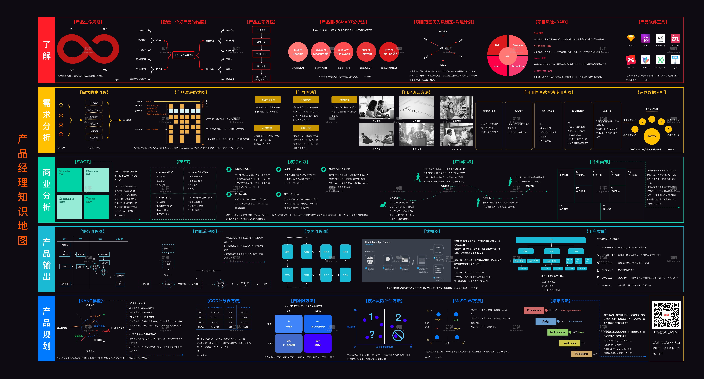
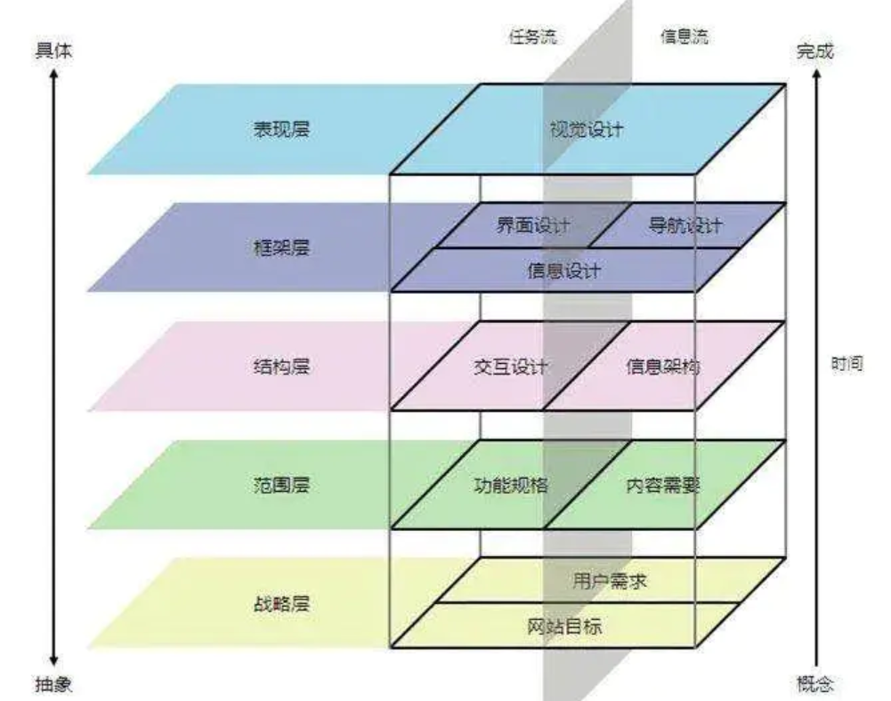

# AI产品经理的完整能力矩阵[1]

道+术+器+核心价值观来总结，“道“就是通用软技能，“术”就是具体的实现方法，“器”就是高效的实现工具，而核心价值观是作为AI产品经理的自我修养，是内功！

## 道

- 用户/客户敏感
- 自我驱动/学习能力
- 沟通表达能力
- 市场洞察能力（视野/前沿）（研究市场以了解用户需求、竞争状态、市场规模和盈利模式，发现创新或者改进产品的潜在机会；通过与用户和潜在用户进行沟通交流，明确符合该机会中的目标用户群体与特征；与直接面对用户/客户的一线同事/同行交流，获取、分析、评估用户的需求。）
- 高效执行能力 （决策力背后体现的是对过去信息的有效收集，对当下形势的清晰判断和对未来趋势的准确把握。好的产品经理总能在关键时刻，踩对点，比如我最敬佩的产品大师张一鸣，在今日头条成立初期，就定下了头条内容+算法的战略方针。[4]）
- 创新能力
- 情绪控制能力
- 时间管理能力
- 多观点整合能力
- 资源协同能力（多资源协助）
- 影响他人能力
- 团队建设能力
- 外语能力
- 产品定义和原型设计能力（产品需求文档（PRD）来进行描述，形成包含交互设计（UX）、用户界面设计（UI）的具体方案：在方案形成过程中，通常会通过原型设计是把自己的想法或者团队讨论确定的方案以具象的形式呈现出来，便于团队成员的理解或者用于用户测试，最终达成共识，形成确定的方案。）

## 术

### 产品战略与产品创新阶段

- 市场分析：PEST分析、APPEALS方法、战略定位分析（SPAN）、麦肯锡市场细分八法；
- 竞争力分析：波士顿矩阵（BCG矩阵）、GE分析、麦肯锡三层面理论等；
- 机会判断；竞品分析画布、MRD撰写；
- 用户研究：A/B test、问卷调研、可用性测试、干系人地图、用户洋葱模型等

### 产品规划与商业模式阶段

需求分析：马斯诺需求层次理论、3W2H方法、5WHY分析法、PSPS模型等

商业分析：SWOT分析、波特五力分析、精益商业画布、BRD文档；

优先级评估：火车模型、Kano模型、COD评分表方法、四象限方法、MoSCoW方法等；

数据分析：TODO:

产品规划：产品架构图、产品路线图、计划扑克工作量评估法、六西格玛、TRIZ、盈利模式设计、MVP定义、突出重点（避免认知失调）；

### 产品运营与营销阶段

产品运营：AARRR产品运营模型、OGSM工具、运营数据分析、灰度测试、同期群分析、网络推广优化、市场维护等；

持续了解和收集基本数据，追踪产品投放到市场上的效果和反馈，以便不断迭代优化。[2]
工具：Google Analytics、百度统计、TalkingData、友盟、GrowingIO 等等。

产品营销：FABE法则、电梯演讲、产品路演等；

### 产品生命周期管理

- 产品方法框架：IPD、门径管理流程、抄超钞等；
- 产品宏观思维：波士顿矩阵、多产品组合战略等；
- 团队建设：团队文化定义、组织架构建设等；

### AI产品方法

- 算法
- 算力
- 数据
- 硬件
- 业务

## 器

- 通用办公工具：office三件套、Xmind类思维导图等；
- 产品流程设计：Visio、Processon、亿图等；
- 产品原型设计：Axure、Sketch、墨刀等；
- 数据分析工具：SQL、python、powerBI等；
- 项目管理工具：Teambition、Trello、石墨文档等；
- AI工具：Python、Tensorflow
- 主要文档：MRD、BRD、PRD；

## 核心价值观

这里我要援引经典的产品设计五要素图来解释AI产品经理的核心价值观。

### 初心

作为AI产品经理要时刻记住自己做产品的初心，也就是最底层的战略层，一方面是这个产品的初衷是什么，想清楚了它才能走的长远，如果只是未来表层和框架的浅显需求而做设计，那这个产品设计是站不住脚的，只有从战略层进行思考，产品整体设计才经得起推敲，那时即使在部分表层有缺陷，也瑕不掩瑜，这就好像哲学终的“本我”。

### 自我定位

AI产品经理的自我定位也非常重要，在我的工作经历中，看过很多产品经理，因为主观或客观的产品立场不坚定，有时候把自己做成了商务、解决方案，有时候在一些技术架构方面与研发团队钻牛角尖，但往往丢失了一个产品经理的初心，最终产品走向也不是很理想。作为产品经理，我们需要把握的是整个产品的生命线，而很多细枝末节的事情，有细分领域更专业的人去做。

[1]: https://www.jianshu.com/p/fd466ed1bda6
[2]: https://www.zhihu.com/question/31636227
[3]: http://www.woshipm.com/operate/3416192.html
[4]: [产品经理的职业发展路径是怎样的？ - 呱说产品的回答 - 知乎](https://www.zhihu.com/question/31636227/answer/1162506705)
