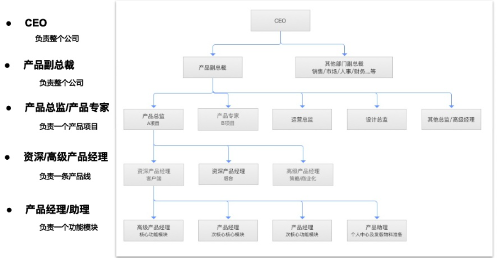
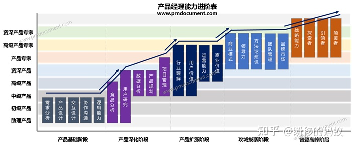
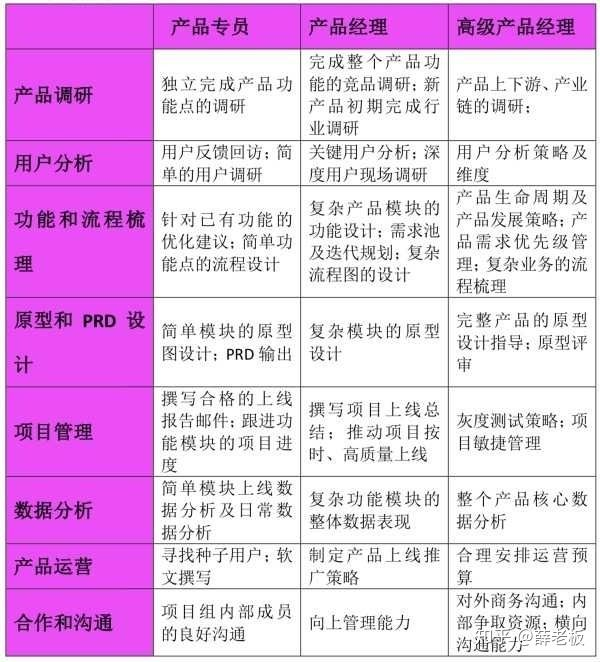
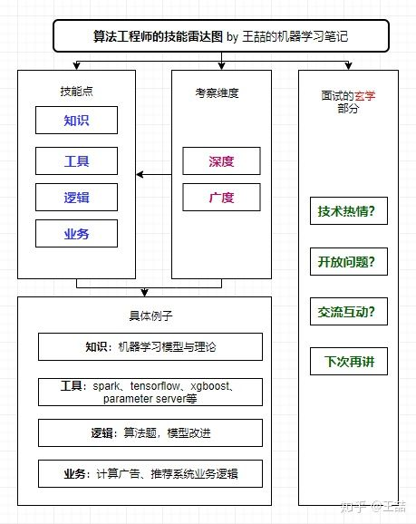
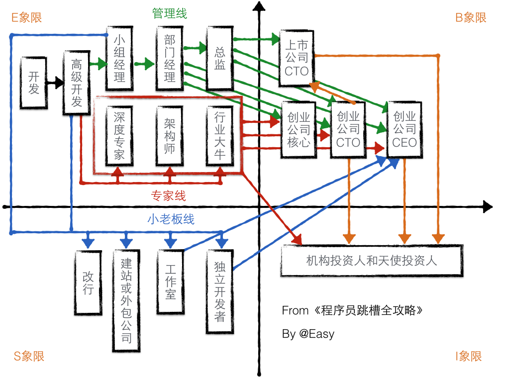
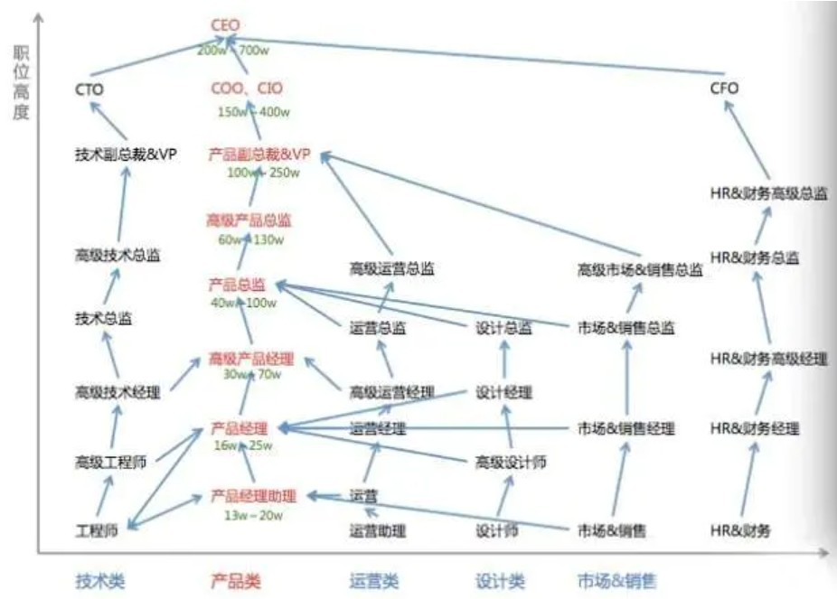

# 职业发展路径

职业生涯规划是指人和工作两个部分的结合，首先要对这个人和这个公司进行主观、客观条件的评估分析，然后再根据这个人的兴趣爱好、能力特点进行利弊分析，结合当前社会发展，以及未来几年的趋势，确定一个最佳的职业奋斗目标，并为实现这个目标做出行之有效的安排。职业生涯规划最终应该落地到目标和行之有效的安排。

![理想的职业[23]](../img/career_choose.png)

## 择业

职业是实现目标的手段,如马克思所说:“对于这个我们共同目标来说,任何职业都只不过是一种手段。”

马克思认为:“分工并不是只有正效应,同样存在负作用。负作用则表现为,分工将使工人长期处于单一技能的工作环境下,不能充分发挥工人自身特点和才能,这将导致能力减退,一旦失业,再就业的困难程度将会加大。[25]

每一次择业都是一种选择。产品经理应该慎重对待自己的每一次选择，每一次赛道的变化都可能吞噬之前的积累，每一次公司的变更都可能让自己退步。

## 产品经理

**懂用户、会权衡**

因为产品经理入门确实没有门槛，但一路上却有很多看不见的门槛；你想到的位置不同，门槛也不同。[10]

## 什么样的人适合做产品经理？

1. 喜欢体验各种新鲜事情，遇到不喜欢的设计有自己独特的想法；
2. 逻辑清晰，能用简短的语言描述复杂的事物；
3. 喜欢与人沟通，有很强的的同理心去揣测身边人的心理活动；（销售自己的理念，销售自己对这个产品的想法）
4. 对新奇的事物有新鲜感，喜欢追根刨底的问问题；
5. 喜欢发起辩论，用自己的思考和逻辑说服别人；
6. 注重细节体验，能从细节中发现问题，并对细节瑕疵不能忍。

## 三线 [16]

1. 技能线

- 月收入:10-20k
- 阶段:1-2年
- 关键词:掌握PM的全套方法论
- 核心竞争力：掌握产品经理工作的完整流程，并对每个环节有一定的实操，能产出出色的成果；

2. 业务线

- 月收入:20-30K
- 阶段:3-4年
- 关键词:了解业务
- 核心竞争力：对于公司所从事的业务有深刻的理解，对于供给双方的需求和服务有深入的认识，能够从业务的场景出发进行产品设计；

3. 商业线

- 月收入:30-40+K
- 阶段:5-6年
- 关键词:产品经理思维,判勳力
- 核心竞争力：构建出自己的产品思维，具备出色的判断力，形成自己的商业分析逻辑，能够帮公司赚钱(或具备这个意识)，有获取新用户的意识；

![PM的升级蜕变[18]](../img/PM_upgrade.png)

![PM技能树[20]](../img/PM_ability_upgrade.png)

## 衡量价值

- 产品经理(在市场上)的价值大小 = 基石能力 x 专业知识 x 行业知识 x 资历履历 x 圈子[16]
- 产品经理(对于企业)的价值大小 = 经验等级 x 智慧等级 x 平台匹配度 [22]

## 常见产品团队的配置

基本有以下三种[24]

1. “产品经理” 独苗一只，主要是小团队，创业团队，常见种子/天使公司
1. “产品经理”+“产品助理” 关注团队打造，或者天使/pre A的公司
1. “产品负责人”+“产品经理”+“产品助理” 体量上亿，或者已经A轮融资的公司

## 职级

### 影响因素

产品经理职级，其背后影响因素众多，如：[21]

• 能力：专业能力，业务能力，管理能力。
• 素质：品性，潜力。
• 岗位：业务规模，团队规模，边缘程度。
• 绩效：战功，绩优，业务增长。
• 资历：领域经验，工龄，履历背景。
• 博弈：稀缺性，谈判能力，跳槽升级，高薪倒推，离职挽留，让位补偿。
• 评审问题：随机性，临场表现，评委水平，作弊，领导强推。

### 能力进阶

### 实习生

理解产品可以从理解基础技术开始。

这里提到的基础技术包括了客户端技术分类，例如Android、iOS、H5或者微信小程序：它们各自的技术特点是什么。比如为什么开发Android和iOS应用的是两个不同的技术职能，而开发H5的是一个技术职能。

另外，产品实习生需要对产品底层的技术通信原理进行理解。（比例大约是20比1，来负责这些正式员工不愿意干的脏活杂活）

比如当我们使用客户端产品发送一条消息时，这条消息经过了哪些环节后被另一个客户端收到——这里就涉及了什么是服务端，客户端和服务端的主要职能和通信机制是什么。先从大局观上对互联网产品的技术框架有一个基本认知。

建立互联网产品技术认知，划分清楚技术职能，了解各技术的特点和应用场景，就能胜任最基本的产品工作了。

产品助理的本职： [4]

1. 需求文档：将需求整理成规范的文档
2. **框线图的完善**：将草图，概念图，补充成为整套的框线文件
3. 材料收集：收集市场，运营，案例等产品经理所需要的一些材料
4. 基础的用户调研：收集用户的反馈信息，观察用户基于产品，基于市场产生的言行，并及时向产品经理反馈
5. 反馈技巧：助理必须要学会的是如何向产品经理良好沟通反馈，

晋升能力则是以下四个技能

1. 团队沟通：与设计，研发，QA，运营等团队中的其他角色能进行针对项目的良好沟通，形成讨论氛围
2. 进度跟进：能清楚掌握到项目的执行进度，已经完成情况，剩余时间，延期风险评估。
3. 产品发布：着手了解各个渠道，平台的产品发布规则，准备相应的发布资料
4. 小模块的独立策划：这个环节需要的不仅仅是创新思维，更重要的是在一个小模块的环境下，去探索产品思维，要知道产品思维是个很全很宽的面性思维

阶段建议：[6]

1. 建立自己的知识库/资源库/模板库
1. 拥有自己的工作/设计/文档规范
1. 按照最高标准要求自己
1. 密集归纳法学习，在效率降低时开设其他学习曲线
1. 升维打击算法思考问题

**完善自身的知识体系，优化现存问题的体验。**

### 产品经理

过年的时候，大家会在微信收发红包，微信红包就是一个具体的功能模块，如果你在微信做产品经理，那或许就要从负责一个功能模块开始历练了。

要能建立完整的技术基础概念认知，能从技术角度对产品方案进行初步评估和判断。

面试考核的重点：

- 执行力：初级产品经理最重要的就是执行力，因为大部分的情况下，产品的大方向不由他控制，只负责局部的数据，用户需求往往比较明显，所以对于需求的把握能力要求并不高，能深度的做好用户调研和反馈，快速的迭代并提升数据就可以了，而以上的这些，就要求应聘者有强大的内驱力，可以有力的推动项目内成员达成目标。
- 综合能力：以逻辑能力、沟通表达能力为主，逻辑能力是PM安家立命之本，对于初级产品经理来说，能不能理清楚**功能模块、架构和整个产品的关系**非常重要，除此之外，功能的设计和迭代的节奏，也非常考验产品经理的逻辑能力，一个页面会遇到几种使用场景？不同场景之间的关系是什么？如何让一个页面同时满足多种入口和多种需求？没有优秀的逻辑，处理这些问题的时候，就会有纰漏。
- 交互设计：国内很多的一线互联网企业都有专业的交互设计师（更多地考虑用户（目标、场景）），相处过很多tx的PM，都会在入司后问到交互设计师在哪？但个人认为，PM应该兼顾交互设计师的工作，特别是初创型企业，大部分都没有专职的交互设计师。对于初级产品经理来说，可以把单个模块的交互做完整，输出整洁、清晰的产品需求交付物就算合格了，面试官可以让面试者带一些相关的设计产出，并当面提问，面试的效果就比较好。

阶段建议:

- 批量化输出能力
- 产品研发标准化
- 思考问题模型化

要在沟通中，把上交的方案落地，并按照时间节点以及实际情况（例如人员、预算等不可控因素）把任务合理细化，一一拆解，下达到各个部门，且不断跟进，每日整理问题，每日复盘，以不变应万变，化解问题，达成需求，最终让你的产品从一纸原型变为设想形态。[12]

### 高级产品经理

如果你从产品经理提升为高级产品经理，将会负责微信整个支付功能，也就是一条产品线，除了微信红包，还有涉及到支付的其他功能，比如钱包、收付款等模块。

面试考核的重点：

- 需求把控能力：这个阶段的产品经理，往往是企业招聘回来之后负责新产品的，那么对于需求的把控能力就非常的重要，把控不单单是指理解，还要包括控制，好的产品是有节奏的，特别是涉及多个部门的资源和排期，很有一种带着镣铐跳舞的感觉。
如果是我面试这部分的产品经理，我会直接问他的产品经历，重点推敲几个核心逻辑
他的产品经历，重点推敲几个核心逻辑
1、“为什么要做这个产品，需求是什么？”
2、“用户的核心场景是怎样的？”
3、“做起来之后，对业务线有什么价值？”

- **资源协调、项目推动能力**：带独立的产品，和做模块是不一样的，做一个小模块，评审通过，点对点找开发沟通就可以了，但是独立的产品包含的是一整个打包的功能List，其中涉及的开发量也往往不是一个开发可以完成的，而前后端的对接，各种语言的通讯等细节都决定了排期和节奏，这些对于一个产品经理的资源协调能力要求很高，定什么里程碑，开发之间要什么时候对接，测试什么时候进行，版本回滚的机制和风险方案，这些都是考验一个产品经理资源协调，项目推动能力的地方。

高级产品经理与普通产品经理的差异：

- 需要以产品为核心驱动与其他部门形成协作体
- 需要考虑产品的未来需求演进（做长半衰期的事情）
- 需要能更好的进行换位思考，进一步挖掘运营需求
- 需要优先考虑低成本的实现方案（用低成本实现伟大创新）
- 需要有既简练又高效的沟通方式
- 需要有清晰的项目管理流程
- 需要有高质量的文档及原型

### 产品总监

当你从高级产品经理晋升为产品总监，你就不只需要负责微信支付产品线，还要肩负微信涉及到移动支付领域的整体工作。微信支付涉及移动支付领域的工作不只是微信内部的产品上线和协调工作，还涉及到外部协调和对接，比如说与金融机构的协调。（根据百度百科的定义：移动支付是指移动客户端利用手机等电子产品来进行电子货币支付，移动支付将互联网、终端设备、金融机构有效地联合起来，形成了一个新型的支付体系。）

对于高阶产品经理，能从业务角度和产品发展角度对技术架构进行预判，能掌握新技术的基本原理并加以运用到产品和业务中，是产品综合实力的一种体现，能做出在时间、资源、效率上最优的产品决策。

高阶产品跨公司空降,天然低成功率。除非:复制,新产品,灾后重建,巨大新要素。

### 事业部负责人

除了要具备产品总监的能力还要懂运营和渠道、资金和财务，对业务业绩负责；

商业产品经理（为整个商业目标负责的角色）：在毕业后的前两年做技术工程师，后来转型做了三年的产品经理，现在开始做用户增长方面的运营工作，开始带团队，培养自己的领导力，锻炼自己的战略规划能力、总结复盘能力、汇报能力等。[8]

### 产品副总裁

如果你从产品总监，升为产品副总裁，那就需要负责微信产品部门的整体工作，不只包括微信支付，还有小程序、微信公众平台、微信广告等。

这一阶段的产品经理需要协调战略、配置资源。资源是永远不够，再大的企业，你会有更大的野心和雄心，而且永远会出现误判的情况，所以对于战略层的最大要求就是心力，要心硬如铁，该对不起你的时候，只能对不起，该牺牲你的时候，就只能牺牲你。如果还好你没有牺牲掉，你还活过来，我会再温暖地拥抱你，然后你再到那儿再去牺牲一次。

高阶的产品经理（VP）要做的是**把CEO的战略进行落地，设计组织、人才的结构**，制定 KPI考核制度，配置好资源都是这个阶段的产品经理应该关心的事。[19]

### 产品CEO

在整个产品经理职业发展路径中，如果你最后担任产品CEO角色，就像张小龙，不仅负责整个微信产品部门，还会负责腾讯的其他产品或业务，比如说FoxMail（QQ邮箱）。

这个层次需要的是资源整合能力、管理能力以及对商业的精准判断。

对产品之外的事情应该主动关注，不管是市场营销还是渠道管理，甚至也要关注财务、人力资源。如果你要想成为CEO，那么这些都是要了解、要精通的。 [7]

## 「急流勇退」

老人们的态度更值得玩味：他们之中朝着这一条路「走到黑」的人是少数，有些产品经理，往上游而去，职场路变为供应方，有人则游向下游，改做渠道。又因为产品经理是什么都要懂一点，不少老人，改做运营或设计，甚至成为程序员。[12]

## 分类

- 执行类产品经理：指只掌握需求生产能力的产品经理；
- 筹划类产品经理：指**开始参与市场工作的产品经理。**

![产品经理能力[5]](../img/PM_class.png)
:width:`400px`

**对比程序员的成长路径**

几乎所有高薪架构师，都懂得多门主流编程语言，如 C++、Java、Python 等，以确保在架构系统时局限性更小，此外，他们还可以使用如 MySQL、SQL Server、sybase、jracle、infomix 等多种数据库，他们还了解文件系统特性，如 NFS、GFS、NTDFS、XFS 等，甚至做过几年 Windows 开发。正是这些经历，才造就了一名优秀的架构师或 CTO。

## 了解产品流程 [2]

对于一年以下产品经验的应届生，我会让**他开始独立做运营类**的需求，一般这样的需求比较简单，涉及的关联系统也会单一，对核心业务的要求也没那么高，逻辑思维上也比较简洁，这也是他了解产品流程，业务流程最快的方式，而且运营类活动活动周期短，反馈快，他能快速知道自己的不足之处，快速提升产品思维，数据意识和沟通效率，快速高效的反馈，是其快速成长的关键。

产品管理流程分为：产品定义、产品设计、UI 设计、开发、测试、预发布、实验局、发布、持续运营这 9 个环节； [15]

## 当导师提升自己的领导力 [13]

产品经理要通过自身方法论的沉淀主动地寻求知识传承的机会，同时也要抓住给应届毕业生当导师的机会，快速地扩大自己领导力的地盘，从而不断地提升自己的领导力。如果有一天机会来了，那么管理岗位自然就是自己的了。

## 理解青春饭

- 体力：在行业**尚有大量新市场可开拓时**，企业由于想快速争夺用户，不可避免地会导致员工的工作强度增大。
- 脑力：要不断快速地学习大量的新知识。[17]

## 误区

### 有些人招聘产品经理的简化判断:

几年经验、大公司的、产品知名的、职级高的、管人多的、学校好的、懂技术的。

产品经理如果也按上述标准去评估自己和发展自己,那就麻烦了。

### 简历问题 [22]

1. 每个人都试图展示最好的自己,从标签最大化效应反推勾勒其能力。如 BAT TOP3
2. 简历中已经包含其对自我各属性的认知、三观、及对本次招聘方的认知。能看同理心和归纳能力;
3. 以其历史经历的应有能力作为分母,判断他的价值;
4. 以其加入后两年内的成长性和机会成本,预判留存率;

## 职级晋升 [3]

晋升和职级标准制定的理性目标应该是为公司发展服务。

最合理的标准需要考虑公司内部业务和人才的现状、未来发展预期，来决定公司未来一段时间应该侧重激励什么。比如侧重短期绩效，则人人争先，短期内公司会有较强的战斗力；如果注重潜力，优先选拔高潜年轻人，则对公司的长期竞争力有利；如果注重专业能力，则公司的产品质量或技术含量会领先；如果注重协调沟通和文化价值观，则公司的组织能力和大规模作战能力会有优势。

公司制定晋升和职级标准，还要考虑内部的文化历史惯性和理解能力，以及外部大众的接受度，考虑在相关人才市场上的稀缺性和企业的竞争力。兼顾了上述约束条件，还最有利于公司短、中、长期发展目标的，才是理性的晋升和职级标准。

产品经理绩效的定义可以差别很大，体验、收入、增长、创新、进度、效率、产品架构设计、组织建设、业务方满意度等均可作为判断标准，收入还可以分为侧重短期数字指标和长期总收入最大化。对产品经理能力的定义也可以差别很大，专业能力、业务能力、管理能力就是三种完全不同的发展方向，但它们都可能创造巨大价值，所以要把合适的人放在合适的岗位上。

资深产品经理的级别升高，在企业里越来越重要，他的素质、潜力、品性的重要性（相对专业能力）会越来越高，这是因为高阶产品经理通常是一个中枢岗位，要协调很多团队间的工作，要权衡很多员工和很多用户间的利益分配。
有些人的职级高，可能是因为他负责产品的业务规模大，或者团队规模大，或者给边缘业务的优待（边缘业务难吸引优秀人才，需要额外福利）。这样的晋升明规则或潜规则本身没有错，是符合企业利益的，但总会有聪明人会钻漏洞，比如拼命地招人以扩大团队规模，或者拼命做大业务规模以追求不健康的增长（一般是不计 ROI 的高额营销资源投入，或透支公司整体的品牌口碑）。

职级晋升看重领域经验、工龄、履历背景的企业也是有的，如果追求业务稳定发展，这也没什么错。还有些情况是因为稀缺性，某些人才很稀缺，就容易获得更高的薪酬和级别。还有些情况是，员工被猎头或朋友诱惑得到了好的工作机会，想离职，那么企业为了挽留他而给他加薪升级是很常见的。也有些公司的薪酬级别对应关系较严格，有的部门要招进某个高薪人才，就会给他申报更高职级。也有些人因为项目烂尾（不是他的过错）补偿晋级，或者被调去边缘岗位而补偿晋级。还有一些职级错配的原因，可能是评审有随机性，或者某人是擅长做 PPT 的演讲型选手，或做出把他人的业绩说成是自己业绩的作弊行为，或者领导强推特批帮助晋升等。

## 空降

空降高阶产品经理，成功率天然就是低的。这是因为，**产品经理这个职业既需要纵向深入理解业务，又需要横向跟很多团队深度协作**，所以**空降高阶人员天然就要付出很高的熟悉成本和磨合成本。**产品经理做决策还无法都用数据和事实说话，必须依赖知识和数据背后的判断和理念，而空降新人不可能与原有团队总是达成共识，这也使得基层产品经理遇到上级换人和技术运营搭档换人时，如同跳槽一样难以适应。于是，空降高阶产品经理的常见结果就是走一批原来的下属产品经理。只有在这几种情况下，空降高阶产品经理的成功率会高一些：任务是复制一个产品；开始一个新产品；灾后重建，原产品出了大问题，人心思变；有巨大新要素成熟，给产品带来创造巨大新价值的机会。

产品经理决策依赖知识和数据背后的判断和理念,注定无法总是有共识。换上级和搭档如同跳槽。

## 理解上级

产品经理不能只盯着产品功能思考问题，不能一直按照自己的产品情怀去工作，要能够理解公司的战略，要能够站在上级领导的角度思考问题，这样才能够知道到底哪个环节有问题，才知道如何提升对应的能力。比如，现在新用户的注册转化率比较低，你不能单纯地认为这是市场推广做得不够、流量下降导致的结果。你作为产品经理要能够知道当前的数据，理解市场推广的渠道效率、匹配度，然后再回到产品流程中找原因，想办法优化调整，千万不要觉得自己做的产品功能非常好、用户的交互体验非常顺畅等，一定要站在上级的角度看是否已经达到了公司的商业目标。这才是为什么产品经理要成为全栈产品经理的原因。

## 择行 [11]

消费互联网红利递减，产业互联网异军突起，产品的受众人群可能是有专属业务技能和业务知识的用户。因此，产品设计会与业务有更多的关联。此时对于产品经理来说，行业经验和业务知识的积累尤为重要。

## 产品经理的发展建议 [14]

1. 产业互联网。将具体的业务与互联网相结合，打造自身竞争力。举一个车险领域的例子，常规的互联网产品经理会停留在 App 产品策划、用户体验上，缺少对车险业务的关注。产品经理只有深入车险的具体业务中，才能成为这个产业的专家。

2. 综合发展。除了产品方向，产品经理可以培养运营、项目管理、商业分析等方面的能力，让自己成为一个综合型人才。我见过一些产品经理转型运营、转型投资，他们都非常成功，综合能力强也意味着发展的机会比较多。

## 为什么大家现在选择产品经理、设计师这些职位呢？ [16]

你会发现当你大学毕业，在找工作的时候，或者说你在转行的时候，有些工作的这种壁垒是很低的，比如说一般性的销售工作，它的门槛是非常低的，没有什么不可替代性。

但是产品经理也好，设计师也好，这个行业里面做得越久，在这个领域里面的一些垂直的领域扎根越深，那么你的领域知识，你的专业技能会越来越强，这些东西都会成为你的壁垒。

在很多传统行业里面，就算你一个人再牛，我有十个人，甚至我有一百个人，是能够比你一个人做的事情要更多的；但是在互联网领域里面，它的特点就是一个资深的/一个真正做的好的专家，产品经理 or 设计师，一个人的创造力很可能会大于几十个人甚至一百个人的创造力。

[1]: https://www.zhihu.com/question/31636227/answer/1672926904
[2]: http://www.woshipm.com/zhichang/906380.html
[3]: https://www.yuque.com/weis/pm/lto95c
[4]: http://www.woshipm.com/pmd/415296.html
[5]: http://www.woshipm.com/pmd/2466877.html
[6]: https://www.iamxiarui.com/?p=1369
[7]: https://weread.qq.com/web/reader/46532b707210fc4f465d044k70e32fb021170efdf2eca12
[8]: https://weread.qq.com/web/reader/46532b707210fc4f465d044k33e3289021c33e75ff09694
[9]: https://weread.qq.com/web/reader/46532b707210fc4f465d044k33e3289021c33e75ff09694
[10]: https://weread.qq.com/web/reader/77532110721ea34a7751c9ak1c3321802231c383cd30bb3
[11]: https://weread.qq.com/web/reader/77532110721ea34a7751c9akc1632f5021fc16a5320f3dc
[12]: https://www.zhihu.com/pub/reader/119583028/chapter/1057335985192501248
[13]: https://www.zhihu.com/pub/reader/119980992/chapter/1284104650384265216
[14]: https://www.zhihu.com/pub/reader/119980992/chapter/1284104631514009600
[15]: http://www.xmamiga.com/3573/
[16]: https://www.zhihu.com/question/20791021/answer/640398686
[17]: https://www.zhihu.com/question/20791021/answer/86421255
[18]: https://mp.weixin.qq.com/s?__biz=MjM5MzE3MDQ3Mw==&mid=2650404998&idx=3&sn=e4bf27058ac6a697bfb1ae3cbb319e14&chksm=be964dc089e1c4d613d4dcf763e01fbc65dee8b08136e34ebf62c1d22cbc7d83c58502416f2a&scene=21#wechat_redirect
[19]: http://m.74cms.com/m_view/id/1106.html
[20]: https://www.zhihu.com/question/323588594/answer/677650489
[21]: https://www.zhihu.com/question/19565317
[22]: https://www.bobinsun.cn/pm/2020/01/29/Talking-about-product-managers/
[23]: https://wen.woshipm.com/question/detail/7hghar.html?sf=wipm
[24]: https://zhuanlan.zhihu.com/p/23756089
[25]: http://www.doc88.com/p-5738403457973.html
