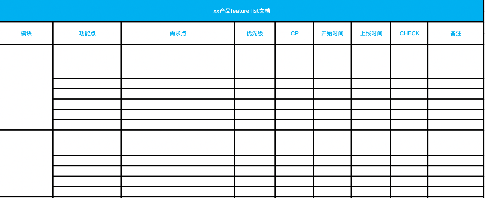

# 需求
:label:`need`

人类为了维持生活机能或健全心灵的基础满足条件，更多见[需求层次理论](https://zh.wikipedia.org/wiki/%E9%9C%80%E6%B1%82%E5%B1%82%E6%AC%A1%E7%90%86%E8%AE%BA)

需求是产品产生的前提，如果没有需求，产品也就不会存在，从而产品经理这个岗位也就不会存在了。 [9]

需求总是含混的，做需求相关的工作，就是不断地降低含混。——需求蛋模型 《探索需求》 [7]

需求决定产品核心价值：解决的需求越重要，你的产品核心价值就越大。

## 别做「传话筒」

产品经理作为需求「收纳箱」，要接收来自四面八方的需求，然后将需求串起来并进行有效的规划后，形成产品需求。可是很多时候，产品经理只是被动地接收需求，对需求不进行任何的分析和转换，直接就放到了产品规划清单里，等待着开发上线，似乎一切就这样完成了。 [8]

如果只是简单传个话，公司直接用一支录音笔是否更合适呢？而且录音笔的保真率至少能够达到 95%，而人的保真率可能连 80% 都达不到。

最糟情况，东西做出来了，对方不认可，而怪罪：

- 需求方提需求没说清楚（手机端搞成PC）
- 研发部实现不了（无第三方稳定接口、自研耗时长）
- 老板定的（先抓紧上线PC端，再慢慢研究手机端）

## 产品需求举例 [13]

- 滴滴解决了用户想要便捷出行的基本出行需求
- 抖音解决了新时代下用户的娱乐需求，表达展示自己的需求
- 美团外卖解决了用户懒和吃的需求，用户无需出门就能吃到想吃的东西

## 需求or伪需求

真需求：“客户不是想买一个1英寸的电钻，而是想要一个1英寸的钻孔！”——市场营销学教授 西奥多·莱维特

伪需求：一例子，有对大学情侣去酒店开房，和酒店的老板说开房的目的是为了考试想找个安静的地方学习。于是老板就把房间改成书房的形式，最后酒店倒闭了。从这里我们可以发现，情侣用学习来掩饰他们去酒店的真实动机，这也是人性使然。老板并没有理解到这对情侣的本质需求，以提供安静舒适的学习环境来满足情侣口中的“伪需求”，情侣的本质需求没有得到满足自然不会再来。[16]

1. 是否是围绕主路径；迅雷：搜电影-下电影-看电影，“边看边播”、影评和打分[2]
2. 该需求的使用频率；必须高频

## 需求来源

商业->市场->用户->需求[14]

## 需求职责

需求管理、需求定义、需求确认、需求跟踪等与需求相关的职责都是公司对产品经理最基本的要求。原因是产品经理是对公司产品的负责人，而产品是为用户解决某种特定需求的，因此即使我们来到了人工智能时代，产品依然是围绕用户需求定义的，这个本质是不变的。[12]

## 需求采集

直接采集与间接采集，获取到的需求分别是一手需求与二手需求。

可以从两个角度来理解它们的差异：需求的提出者是不是有需求的人、需求是原始的还是加工过的。比喻：生孩子与养孩子；

直接从用户处采集的一手需求更准确，所以产品经理一定要确保手里有足够比例的需求是直接采集的，这样才能让产品本身和自己对产品的判断更接地气。

而从销售、营销、服务人员[6]等间接采集的二手需求，有可能被扭曲，就需要带着“问号”来看，思考原始需求方和转述者分别是谁，以及它有没有被曲解过。但二手需求（比如一份客户反馈周报）可以通过更多的人，收集到更多的用户声音，而且是经过梳理的，所以获取信息的效率更高。

扩展到实践层面，团队内“全员参与采集，产品人员处理”是比较可行的模式，是一种效率和准确度的兼顾方案。

### 用户需求vs产品需求

- 用户需求：用户自以为的需求，并且经常表达为用户的解决方案；
- 产品需求：经过我们分析，找到的真实需求，并且表达为产品的解决方案；
- 需求分析：从用户需求出发，找到用户内心真正的渴望，再转化为产品需求的过程；

用户需求-（需求分析）--》产品需求

### 直接采集的途径 [3]

- 用户访谈提出需求（问题集中体现在视觉、交互或一些漏洞等体验侧层面）
- 其他参与者和关注者反馈的需求

### 间接采集的途径 [3]

- 老板提出的战略性需求（往往体验侧的，给老板时间去深度思考）
- 产品经理根据产品方向规划需求
- 推广规划的活动和数据分析出来一些需求（反馈能够产生实际收益，更关注业务的优化空间）

## 满足需求 [6]

由于理想与现实的差距产生需求，所以满足需求有3种方式

1. 改变现状
1. 降低理想
1. 转移需求

### 降低理想

#### 商业化与用户体验冲突

对于中小企业的产品经理来说，生存才是第一要义，因此中小企业的产品经理一定要优先考虑商业化。产品经理只有在对利益诉求没有那么高的情况下，才会优先考虑用户体验。[10]

#### 先满足哪类用户？

如果说，普通用户有一个需求，核心用户也有一个需求，而且，两种用户群体的需求都是比较重要的大需求，那么，你觉得应该先满足哪类用户？

答案是先满足普通用户。

因为核心用户属于平台忠诚度非常高的用户群体，在产品里已经投入了较多的时间和精力，并不会因为你的需求稍微晚一些就选择离开；即使离开也只是暂时的，他还会回来的，因为这是沉没成本，而且你并没有做出严重伤害他们的行为。

不论运营还是产品，都应该重视用户留存，也必须绝对肯定的要重视，甚至在产品的爆发期，留存大于一切。

#### 小众需求

区别是小众还是大部分用户的需求，优先满足大部分用户的需求。[15]

### 转移需求

需求延期

## 需求的checklist

## 需求管理附加值

通过对需求各项属性的统计，进行需求管理；统计提交人的需求数量、提交时间等信息、每个模块的需求数量、每个分类的需求数量等；

## 需求管理软件

除了excel，还有Mantis、Mercury Interactive公司的Quality Center、IBM的Rational RequisitePro等；

## 需求评审

统一思想,明确需求,确定实现过程的会议

## 量化需求 [11]

### 为什么要量化需求

基于概率 –> 需求量化 –> 技术可行性预研 –> 得出结论 –> 开发、测试、上线 –> 复盘

在产品开始之前提出量化标准，方便对工作成果进行衡量； 一般有三种结果：

- 存在“小数据”或若标注的情况 –> 保持上线时间不变，需求更改：在算法精度上进行妥协【尽量避免】；
- 存在“小数据”或若标注的情况 –> 保持量化标准不变：申请更多的资源【尽量避免】；
- 基于现有资源在规定时间内可以实现量化要求；

### 需要考虑的点

- 预研期间：衡量数据质量、算力资源、上线时间，在算法精度上给出合理量化标准，或者要求增加资源投入；
- 开发、测试、上线后：对量化的目标进行精准地验证，进行 A/B 测试时可以比较 A、B 两个方案的效果；
- 复盘期间：总结量化评估经验，和研发团队沟通，了解团队技术实力和算法能力边界。争取量化更靠谱，减少需求变更和额外申请资源。

## 示例

同花顺问财功能需求分析文档：https://www.jianshu.com/p/130fb4f1036a

[1]: https://www.shujike.com/zixun/101445.html
[2]: http://www.woshipm.com/pmd/2903334.html
[3]: http://www.woshipm.com/zhichang/459131.html
[4]: https://m.k.sohu.com/d/495625828?channelId=1&page=1
[5]: https://www.jianshu.com/p/5517a5d180b9
[6]: https://quizlet.com/129588206/%E4%BA%BA%E4%BA%BA%E9%83%BD%E6%98%AF%E4%BA%A7%E5%93%81%E7%BB%8F%E7%90%86-%E7%AC%94%E8%AE%B0-flash-cards/
[7]: https://www.yinxiang.com/everhub/note/f9ab87ee-73e6-4241-9428-9507cbfd007f
[8]: https://www.zhihu.com/pub/reader/119980992/chapter/1284104607329615872
[9]: https://www.zhihu.com/pub/reader/119980992/chapter/1284104614460440576
[10]: https://www.zhihu.com/pub/reader/119980992/chapter/1284104619489460224
[11]: http://www.xmamiga.com/3573/s
[12]: https://zhuanlan.zhihu.com/p/36871139
[13]: http://www.shuahuangpu.com/articles/110937.html
[14]: https://zhuanlan.zhihu.com/p/25965712
[15]: https://www.zhihu.com/question/59911327/answer/259895734
[16]: https://zhuanlan.zhihu.com/p/390835483
