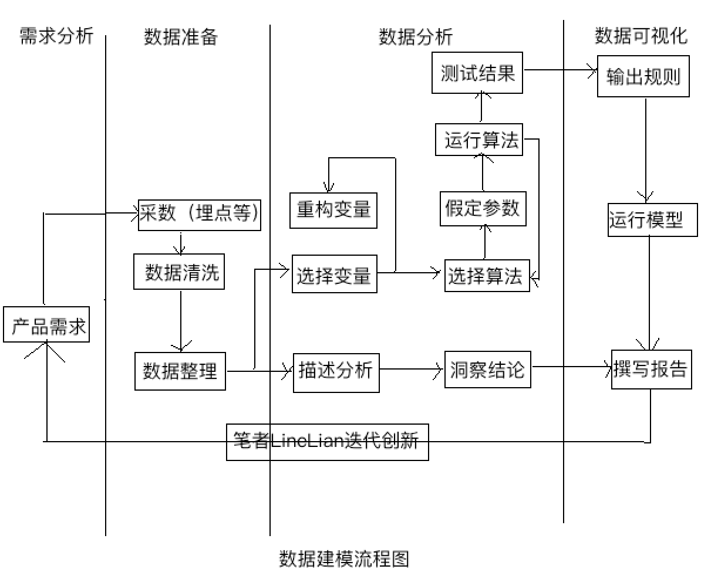
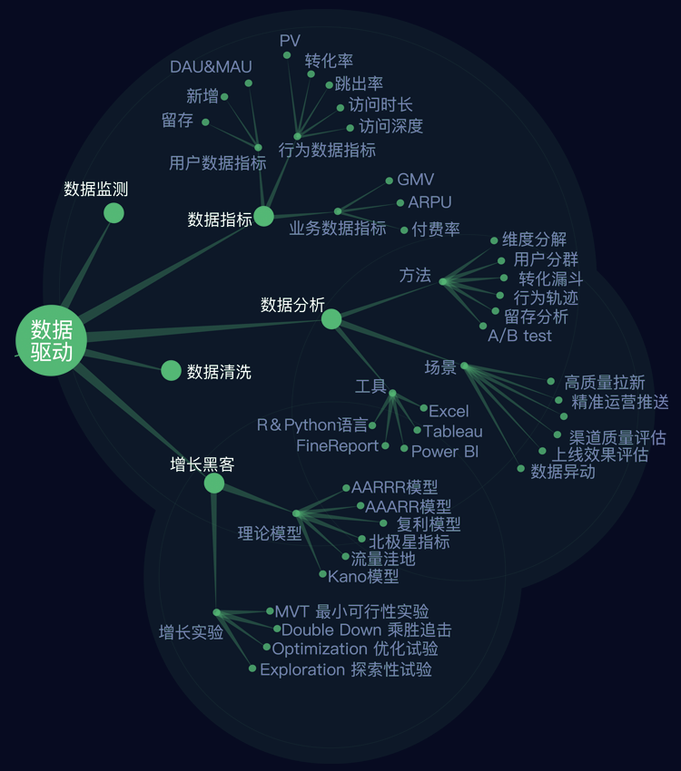
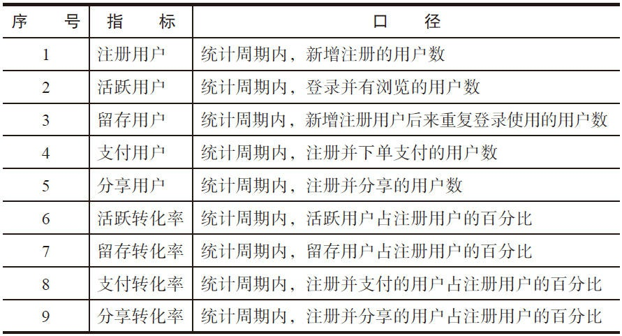
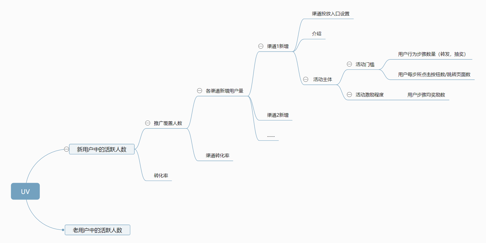

# 数据分析
:label:`data_analysis`

数据分析能力，基本的Excel、SPSS、R语言等工具只是锦上添花，更重要的是，产品经理是否有数据意识，是否针对思考的问题（例如要解决什么问题，为什么要解决这个问题，解决这个问题可能带来的收益，方案上线后问题解决的效果等），去寻求相应的数据支撑，以数据分析的结果为重要参考来解决。举个例子，用户的埋点数据跟踪，能够帮助我们了解用户实际使用产品的路径，通过判断其是否与我们预期一致，便能为该功能的后续优化提供很好的参考。 [6]

AI产品经理同样要具备数据产品的能力，因为数据也是AI的三大要素之一。需要熟练使用sql和hive相关数据查询语言。对于一个AI产品经理来说，使用sql和hive是基本，因为这两门语言学习的门槛相对降低，自学都可以很快上手。通过数据分析可以快速找到后续模型效果优化和策略调整的方向，有据可依。对于使用Tableau这种，实话实说真的是小儿科，这种可视化的界面查询只能做一些简单的结果分析和精美图表，对于更好的策略调整和模型效果优化必须进行数据库查询。对于AI产品经理来说，仅仅只会数据分析也不够，还需要很强的数据sense才可以。 [8]

## 数据建模过程

数据获取、SQL数据库、Python、统计学、数据分析核心模块、可视化、报告撰写，更多查看[13]

## 数据分析－》商业价值 [7]

足够熟悉产品－方向性假设——提取应用数据分析－得到（未留意）现象－解释现象——用户调研修正解释——指导产品发展方向

## 数据分析的四种模式 [11]

1. 描述性分析（Descriptive Analytics），即将已经发生事实用数据表述出来。
1. 诊断性分析（Diagnostic Analytics），即回答为什么会发生，通常使用数据钻取的手段就可实现。
1. 预测性分析（Predictive Analytics），即通过历史数据对未来的趋势进行预测。这个阶段会引入一些高级算法。
1. 决策建议性分析（Prescriptive Analytics），即通过分析可能影响行为结果的动态指标（或行为）并将指标和结果的关联关系进行量化，从而给出对结果产生最重要影响的指标，以及对应每个指标对结果产生不同影响程度的描述。有了以上这些分析，决策者可以将数据驱动决策真正落地。

## 分析方法

### 决策支持

决策支持是通过简单的求和以及易于理解的分析模型，帮助用户做出决策，比如对比本月同比和环比用户平均消费金额，从而决定通过什么决策活动来提高本月的用户平均消费金额。比如建立一个广告投入因素和新增用户的关系模型，就能够预测投入多少广告额，能带来多少新增用户。

简单的关系模型产品经理是能通过Excel表格分析出来的，如柱状图、折线图等。

如果一项因素引发问题的因素很复杂，则需要建立一个由多个因素组成的预测模型。通过这个模型，我们可以观察模型中某个因素对整体结果造成的影响。预测模型需要用到的统计方法有交叉列表统计、统计学假设检验 、多元回归分析等，这个阶段大部分产品经理都需要求助数据分析师的帮助了。

使用你收集的额外信息——比如点击率、页面停留时间、搜索历史和产品偏好——来了解用户在做什么，并帮助他们了解为什么你是最佳选择。 [9]

![指标分析[12]](../img/index_analysis.png)

### 系统优化

系统优化指的是帮助用户构建让计算机执行的方案算法，常用的系统优化方法有机器学习。

相比简单模型的决策模型，系统通过机器学习方法分析出系统中更详细的因素，比如系统优化能分析出广告投入多少金额，能带来新用户的快速增长，以及广告投放中具体什么投放渠道，效果最好。

机器学习的优势在于能从数据中学习出其本身包含的模式和规律，并以此来建立模型。比今日头条，就是通过分析我们过去浏览的记录，利用机器学习建立模型，从而给我们推荐类似的内容。系统优化用到的统计方法有逻辑回归分析、聚类、主成分分析、决策树分析等。

## 经营分析

用户画像系统的标签数据通过API进入分析系统后，可以丰富分析数据的维度，支持进行多种业务对象的经营分析。

## 数据类型:

- 用户数据分析
- 活动数据分析
- 流量数据分析
- 销售数据分析
- 内容数据分析
- 商品数据分析
- 订单数据分析
- 渠道数据分析

### 用户数据分析

留存、活跃、新增这个优先度递减。

用户数量：

- 新用户数
- 老用户数
- 新/老用户数量比；

用户质量:

- 新增用户：第一次启动应用的用户；
- 每日新增用户 DNU（Daily New Users）：每日应用中的新登入用户数量
- 新增独立用户：全体应用的新增用户的总和（去重）

- 活跃用户 AU（Active Users）：当天启动一次的用户即为活跃用户，含新用户和老用户；
- 活跃独立用户：当天应用的活跃用户总和（去重）
- DAU:DAU（Daily Active User）日活跃用户数量。常用于反映网站、互联网应用或网络游戏的运营情况。
- MAU：MAU（monthly active users）月活跃用户人数。
- 用户参与度
- 沉睡

这些用户价值指标，会导向一个最终的产品指标——付费用户：

- 客单价
- PU （ Paying User）：付费用户
- APA（Active Payment Account）：活跃付费用户数
- ARPU（Average Revenue Per User） ：平均每用户收入
- ARPPU （Average Revenue Per Paying User）： 平均每付费用户收入

#### AARRR模型

- Acquisition-如何获取用户
- Activation-如何提高用户活跃度
- Retention-如何提升用户留存率
- Revenue-如何提高收入
- Refer-如何引导用户推荐产品给其他人

摆地摊用法[10]

### 渠道数据分析

用户活跃：

- 活跃用户：UV、PV
- 新增用户：注册量、注册同环比

用户质量：

留存：次日/7日/30日留存率

- 用户留存率：在互联网行业中，用户在某段时间内开始使用应用，经过一段时间后，仍然继续使用该应用的用户，被认作是留存用户。这部分用户占当时新增用户的比例即是留存率，会按照每隔1单位时间（例日、周、月）来进行统计。

用户留存率中的40-20-10法则：如果你想让游戏、应用的DAU超过100万，那么日留存率应该大于40%，周留存率和月留存率分别大于20%和10%。

- 次日留存率：（当天新增的用户中，在往后的第1天还活跃的用户数）/第一天新增总用户数；
- 第2日留存率：（第一天新增用户中，在往后的第2天还有活跃的用户数）/第一天新增总用户数；
- 第7日留存率：（第一天新增的用户中，在往后的第7天还有活跃的用户数）/第一天新增总用户数；
- 第30日留存率：（第一天新增的用户中，在往后的第30天还有活跃的用户数）/第一天新增总用户数。

渠道收入：

- 订单：订单量、日均订单量、订单同环比
- 营收：付费金额、日均付费金额、金额同环比
- 用户：人均订单量、人均订单金额

### 流量分析

- 流量来源；
- 流量数量：UV、PV；
- 流量质量：浏览深度（UV、PV）、停留时长、来源转化、ROI（投资回报率，return on investment）；

#### PV > UV：

- PV（访问量）：即Page View, 具体是指网站的是页面浏览量或者点击量，页面被刷新一次就计算一次。如果网站被刷新了1000次，那么流量统计工具显示的PV就是1000 。
- UV（独立访客）：即Unique Visitor,访问您网站的一台电脑客户端为一个访客。00:00-24:00内相同的客户端只被计算一次。

- 另外就是APP的埋点数据，这个功能的点击率是多少？这个功能有多少人打开，又有多少人使用了？有多少人在频繁使用这个功能？等等，这些埋点数据要时常关注。结合数据变化来反思功能设计的问题，从而优化产品。

#### 数据埋点

定义：产品上线前，提前写入代码，去统计一个产品的关键页面或关键动作的数据，以便产品上线后进行数据统计分析和产品迭代。[9]

B端埋点工具：Google Analytics（GA）、百度统计。开发埋入工作量小，可扩展性强，百度统计提供的数据可视化后台基本能应付一个产品的常规数据需求，性价比非常高。

人工智能时代：如何写一份高质量的埋点文档：https://www.jianshu.com/p/b791a7b37326

**数据分析：**

- 基本分析：网站的全体用户、分群用户、个体用户的浏览行为进行全面准确地监控和分析，从而优化站点 内容，提高留存率、转化率等；可统计：访客来源、设备信息、访客属性、页面访问量、停留时长、流转去向等
- 桑基图（能量分流图）
- 概要的迅速观察用户的整体访问路径和习惯，以及在哪些页面、什么情况下用户会终端访问
- Cohort分析图（队列分析）：留存分析法
- 访客分析
- 客观分析全面的用户行为数据
- 热力图
- 页面不同区域的热度图表

*B端和C端数据埋点的区别*

诉求

- B端（尤其业务系统）：观察研究用户对各项产品功能的接受程度、使用情况、用户操作习惯等，进一步评估功能是否合理，能否帮助用户提升效率
- C端：提升用户体验，细致的、全面的数据埋点

方案

- B端：web埋点（URL访问、跳转、按钮点击、文本框录入）
- C端：app（交互行为进行细致的埋点，全面掌握用户的动作）

### 产品数据分析

- 搜索功能：搜索人数/次数、搜索功能渗透率、搜索关键词；
- 关键路径漏斗等产品功能设计分析；

## 警惕指标作弊

- DAU（日活跃用户数）：买垃圾流量，做各种不靠谱的活动。
- 下载量：虚假宣传，夸大产品价值。
- 注册用户数：不考虑留存的注册返现。
- 活跃度：在“分子 / 分母”的公式上做文章，在分子、分母的定义上玩花样。
- 人均 PV：一篇文章分 N 页，人均停留时间也类似。
- 点击率：软件下载站上，各种花花绿绿的“下载”按钮，点好几次也不一定能点到真的下载链接。
- 使用时长：后台运行，或者故意“迷惑”用户，让用户无法快速完成任务。
- 付费用户数：首单 1 分钱。
- 复购率：首单 9 块 9，第二单 1 毛。
- 不只是制订指标的人，哪怕经常完成指标的你，也一定对上面这些投机取巧的做法深恶痛绝。但人性使然，我们不能去正面挑战它。

真正的成功指标可以反映出用户的“非受迫、无诱导的成功行为”。衡量指标要在执行开始前制订，而不是过程中根据“做的情况”调整。如果没有重大变化，不可以不断调整目标

- 非受迫：用户没有被逼着做没价值的事情，比如有些 App 里的签到才能获得某个价值；
- 无诱导：用户的行为不是“奖励就有，没奖励就没有”，比如有红包才会转发；
- 成功行为：指的是指标考察的行为，本身就为用户创造了价值，而不只对公司有价值。

### 商品数据分析

- 商品动销：GMV、客单价、下单人数、取消购买人数、退货人数、各端复购率、购买频次分布、运营位购买转化；
- 商品品类：支付订单情况（次数、人数、趋势、复购）、访购情况、申请退货情况、取消订单情况、关注情况/；

### 订单数据分析

- 订单指标：总订单量、退款订单量、订单应付金额、订单实付金额、下单人数；
- 转化率指标：新增订单/访问UV、有效订单/访问UV；

## AI 数据

从“数据”这个角度来说，从收集（TTS，3个月）、分析（看大量聊天对话数据，才能自己提炼规则feature）、应用（产品早期，数据的价值甚至大过技术模型算法）到测试（产品需求、TE测试、用户使用，数据集都是不一样的，越来越不可控）等等，每个环节都有很大不同。

从结果看，即使是大公司中级产品经理（总监级），也至少3-6个月来适用AI产品工作，甚至都很难有自己真正独到而深入的理解认知

### 和基线比较 [5]

我们通常孤立地看待早期/MVP产品:我们只做一件事，然后把它推出去看顾客的反应。

ML产品是不同的，因为性能总是相对的——即使是第一次迭代。例如，如果您的高级ML算法是95%的准确性，但您的简单基线是94%的准确性，那么您投资了大量的工作，以获得1%的收益。另一方面，如果您的ML算法的准确率是75%，但简单的基线是50%，那么您已经取得了巨大的飞跃。

这里有两点很重要:首先，性能总是相对于某些东西:您需要一个基线（baseline）。其次，为了能够进行比较，您需要定义良好的指标。

在ML产品中，这些指标通常分为离线指标(例如，“算法预测历史数据的准确性有多高?”)和在线指标(例如，“当我们使用这种算法部署产品时，我们能获得多少转化率?”)。

[1]: https://blog.csdn.net/eickandy/article/details/80294224
[2]: https://www.jianshu.com/p/cb6ae5a3f3fa
[3]: https://www.jianshu.com/p/93e2335569b3
[4]: https://www.zhihu.com/people/hanniman-2/posts?page=4
[5]: https://neal-lathia.medium.com/machine-learning-for-product-managers-ba9cf8724e57
[6]: https://zhuanlan.zhihu.com/p/353225318
[7]: https://quizlet.com/129588206/%E4%BA%BA%E4%BA%BA%E9%83%BD%E6%98%AF%E4%BA%A7%E5%93%81%E7%BB%8F%E7%90%86-%E7%AC%94%E8%AE%B0-flash-cards/
[8]: https://www.zhihu.com/question/57815929/answer/1730120649
[9]: https://www.jianshu.com/p/a57a927a112b
[10]: http://www.shuahuangpu.com/articles/110936.html
[11]: https://www.zhihu.com/people/terrypm/posts
[12]: https://www.zhihu.com/question/412642864/answer/1784905476
[13]: https://www.huaweicloud.com/articles/5aa4be414ac9d338001dd7112587e496.html
