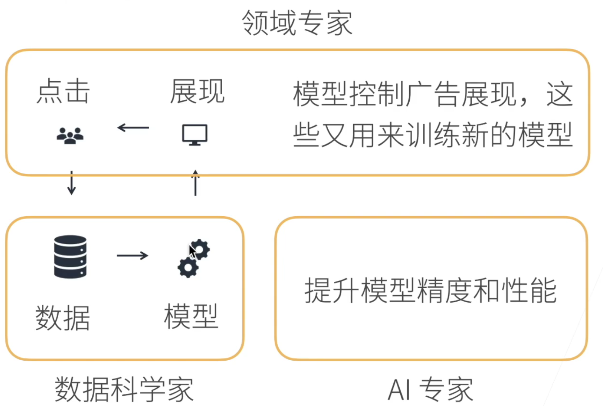

# 全流程知识
:label:`chap_skill`

![整个产品实现的流程和生命周期[1]](../img/whole_process.png)



![产品经理的工作职能[6]](../img/PM_work.png)

- 领域专家：用无人机看书，农业专家对二月份的树该有大致的样子是清楚的。甲方翻译成任务交给数据科学家（乙方）去提高。
- 数据科学家：关心实际业务问题。不断开发新领域。
- AI专家：不仅能用，精度性能。领域做深。[4]

自然语言处理不如图片应用做的好。

https://i.am.ai/roadmap

AI产品经理的进阶地图 - 知乎
https://www.zhihu.com/club/1266018382773624832/post/1266047295663403008

AI产品经理是“产品经理”这个职业的一个分支，在成为AI产品经理之前，你需要先成为一名合格的产品经理（拥有产品思维、产品经理相关的知识体系）

第0阶段：产品经理基础知识
————————————————
产品经理知识架构（C端产品经理、B端产品经理、策略产品经理、数据产品经理）

1. 商业分析、市场分析、需求分析；
2. 产品设计：整体设计、详细设计；
3. 项目管理：需求池管理、版本迭代管理；
4. 产品运营：市场运营、用户运营、内容运营；

第1阶段：AI产品经理的基础知识

————————————————
1.AI产品经理基础：人工智能概论、AI产品经理职责、资源管理（数据集、算法模型、策略、软硬件资源、需求管理）、工作流程、核心技术、行业应用
2.机器学习：数据采集、数据探索、数据预处理、ML模型、模型训练、场景应用
3.深度学习：基于深度神经网络的模型应用（CNN、RNN、GAN）
4.强化学习：基于智能体/环境接口的马尔科夫过程模型；

第2阶段：AI领域的纵向深度挖掘

————————————————
1.模式识别：图像识别、人脸识别、语音识别、视频识别等；
2.自然语言处理（NLP）：自然语言理解（NLU）、自然语言生成（NLG）、知识图谱[2]等
3.智能语音：语音识别、语音合成、声纹识别
4.智能软硬件：芯片[5]、智能软硬件项目流程；
5.专家系统：基于专家知识架构的AI综合应用
6.机器人：基于生物智能的AI应用
7.其他领域的纵向深度挖掘

[1]: https://ke.qidianla.com/courses/pmcamp?channel=bbs
[2]: http://www.mysecretrainbow.com/ai/18035.html
[3]: https://coggle.it/diagram/XDvxtYllM9x_N_j9/t/%E6%88%90%E4%B8%BA%E8%85%BE%E8%AE%AF%E4%BA%A7%E5%93%81%E5%9F%B9%E8%AE%AD%E7%94%9F%EF%BC%88ai%E4%BA%A7%E5%93%81%E7%BB%8F%E7%90%86%EF%BC%8C%E7%AD%96%E7%95%A5%E4%BA%A7%E5%93%81%E7%BB%8F%E7%90%86%EF%BC%8C%E4%BA%91%E8%AE%A1%E7%AE%97%E4%BA%A7%E5%93%81%E7%BB%8F%E7%90%86%E7%AD%89%EF%BC%8C%E6%9C%80%E5%A5%BD%E6%98%AFtob%E7%9A%84%E4%BA%A7%E5%93%81%EF%BC%89
[4]: https://www.bilibili.com/video/BV1J54y187f9/?p=2&spm_id_from=pageDriver
[5]: https://mbb.eet-china.com/tech
[6]: https://zhuanlan.zhihu.com/p/340058145


```toc
:maxdepth: 2

steps
BRD
industry_analysis
market_analysis
goods_analysis
users_analysis
demand_analysis
experience_report
compete_analysis
MRD
PRD
product_design
prototype_design
static_page
IXD_design
MVP
service_analysis
strategy_analysis
project_manage
collaborate
data_analysis
upgrade_manage
resource_manage
research
tools
Valuation
price
more_users
```

