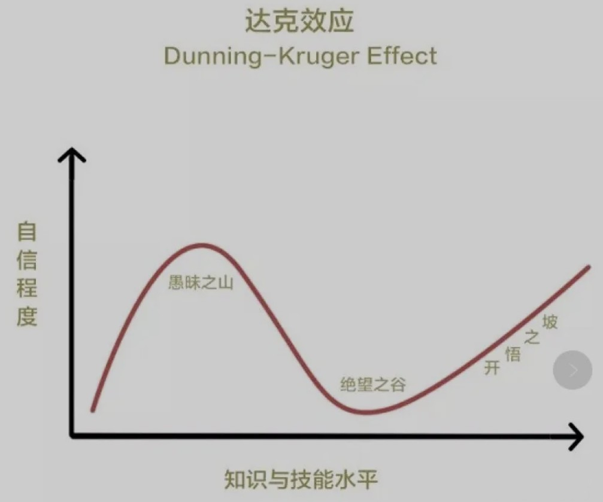

# 行业分析
:label:`industry_analysis`

行业(industry) ：指一组提供同类相互密切替代商品或服务的公司。[16]

## 目的

产品经理需要随时了解市场和行业的变化，**提前**做好对行业变化的预判工作，找到机会点。这样，才能保证我们做出的产品能够更好的顺应市场。

1. 在研发面前就可以用有前瞻性的行业发展视角讲解需求，取得技术人员的认同和全力配合。
2. 在老板面前要用行业内技术的发展趋势和如何将技术商业化角度阐释产品的设计方向和目标，取得资源上的支持。
3. 在客户面前可以从行业标准和历史角度阐释今天的产品定位，并将产品置于竞争环境中进行客观的横向比对突出产品优势和价值。[14]

使自己具备无需通过隶属关系或公司内部权利就能够成功的影响的技术团队和其他跨职能团队，完成任务的能力。

## 如何了解一个行业？ [15]

第一步：行业认知

1. 行业分解认知
2. 行业组合认知

第二步：行业分析

1. 业务流程分析
2. 产业链分析
3. 商业模式分析

第三步：行业常识

1. 业内知名企业
2. 行业领导者

## 分析出机会点

产品小白如何快速做行业分析，找到机会点，最后能够做出分析结论：我们在哪些产品链条上的市场规模如何？存在哪些机会点？我们会面临上下游及竞品等哪些挑战？从中可以得到哪些商业价值？（需要日常练习，积累经验）

最后，针对我们的目标用户的典型需求，进行MVP。

## 套路

## 行业分析的思路如下：

1. 了解市场规模（这个市场有多大？市场变化趋势如何？目前处于生命周期的哪个阶段？这个市场的中头尾部企业有哪些？他们的商业模式？细分市场趋势如何？这个产品会影响什么？技术壁垒、竞争壁垒是什么？指标：市场销售总量，年复合增长率，标志性现象看前瞻性）见 :ref:`market_size`
2. 产业地图分析（这个市场现状如何？行业如何运转？行业如何拆分？上下游关系如何？所在的竞争环境如何？细分市场的产品如何？指标：细分市场比例，增长率）见 :ref:`industry_map`
3. 行业典型产品分析（针对我们要做的产品，来了解竞品怎么做？竞品核心业务逻辑如何？功能架构如何？运营动作如何？用户评价如何？优缺点如何？）:ref:`goods_analysis`
4. 用户分析（针对我们要做的产品，来分析用户画像，从中挖掘需求，用户行为如何？机会点是什么？）:ref:`users_analysis`
5. 总结（分析结论：我们在哪些产品链条上的市场规模如何？存在哪些机会点？我们会面临上下游及竞品等哪些挑战？从中可以得到哪些商业价值？）

## 了解市场规模
:label:`market_size`

### 估算市场规模（增长空间）

主要研究目标产品或行业的整体规模，可能包括目标产品一定时间内的行业产量，产值等 [17]

**案例讲解**：全中国共享巴士的市场规模

先收集到以下的基本数据：

1. 中国人口基数：M人
2. 每天出行用户规模：M*60%人
3. 其中的私家车用户：N人
4. 公共交通每日运力：X人
5. 人均城市内交通消费：R元

然后进行计算得，总规模预计：（0.6M-2N-X*R）* 365

### 趋势 [10]

趋势代表着风向。顺风or逆风？

例如：抖音是 2016 年才成立的，为什么能够快速杀出重围，占据重要地位呢？

除了自身推荐算法的优势，还有趋势这个核心关键词，在它的背后又隐藏着两个核心的数据指标：

1. 智能手机出货量，2011 年中国智能手机的出货量为 1.18 亿部，而 2016 年中国智能手机的出货量为 4.65 亿部；
1. 运营商流量，2011 年流量主要还是以 3G 为主且流量费约为 50 元 500MB，而 2016 年以后三大运营商逐步推出了不限流量套餐包，基本上套餐包的费用为每月 100 元左右。

因此，抖音推出的时间无论是在硬件覆盖，还是软件的各种指标和要求方面，都实现了近乎完美的匹配。因此，抖音在强大的自身推荐算法基础上，结合趋势这一关键指标，取得阶段性的胜利也是正常的。

### 宏观趋势

- 我国：中国政府网、国家统计局、各部委及地方网站
- 世界：「互联网女皇」玛丽·米克尔每年都会发布的《互联网趋势报告》

### 技术成熟度 Hype Cycle

我们倾向于高估技术短期内的影响，并低估长期效应。——罗伊·阿马拉

Hype Cycle, 直译为炒作周期， 又称为技术成熟度曲线。 名为炒作，实是为了表示技术的受关注程度。这个模型由著名咨询公司Gartner发布，包含了Gartner对技术发展周期的预测。 Hype Cycle提供给我们Gartner公司对各种技术所处的发展阶段和趋势的预测。

Hype Cycle曲线的横轴表示技术的成熟度， 纵轴表示技术受关注程度。

#### 关键阶段 [6]

每个技术成熟度曲线都将技术的生命周期划分为五个关键阶段：

- 技术萌芽期：潜在的技术突破即将开始。早期的概念验证报道和媒体关注引发广泛宣传。通常不存在可用的产品，商业可行性未得到证明。
- 期望膨胀期：早期宣传产生了许多成功案例 — 通常也伴随着多次失败。某些公司会采取行动，但大多数不会。
- 泡沫破裂谷底期：随着实验和实施失败，人们的兴趣逐渐减弱。技术创造者被抛弃或失败。只有幸存的提供商改进产品，使早期采用者满意，投资才会继续。
- 稳步爬升复苏期：有关该技术如何使企业受益的更多实例开始具体化，并获得更广泛的认识。技术提供商推出第二代和第三代产品。更多企业投资试验；保守的公司依然很谨慎。
- 生产成熟期：主流采用开始激增。评估提供商生存能力的标准更加明确。该技术的广泛市场适用性和相关性明显得到回报。

#### 工具

- 百度的一系列工具，如百度舆情、百度司南、百度指数等工具，这些工具可以帮助你全方位分析互联网舆论
- Think with Google，该产品提供了丰富的营销工具和行业趋势分析报告。 [13]

## 产业地图分析

### 市场调查 [3]

市场调查是指用科学的方法，有目的、系统地搜集、记录、整理和分析市场情况，了解市场的现状及其发展趋势，为企业的决策者制定政策、进行市场预测、做出经营决策、制定计划提供客观、正确的依据。

专业知名机构： [6]

- China Ceidea Market Research 策点市场调研公司
- Acorn Marketing & Research Consultants 毅群市场研究咨询股份有限公司
- 上海伊霍珀信息科技股份有限公司
- 北京新数易博（EBMRS）信息咨询有限公司
- 华通明略（MillwardBrown ACSR）信息咨询有限公司 中机系（北京）信息技术研究院
- 中国商业数据中心
- 尼尔森市场研究中心
- 数字100市场研究公司
- 益普索（中国）市场研究咨询有限公司
- 凯度（中国）购物者指数（Kantar Worldpanel Chin- a）
- 上海AC尼尔森市场研究公司
- 盖洛普（中国）咨询有限公司
- 华南国际市场研究公司
- 百维数元信息科技（北京）有限公司
- 艾斯艾（北京）市场调查有限公司（SSI China）
- 欧睿（Euromonitor）市场调查机构

### 关注以下几个重要指标

- TAM：即Total Available Market，总有效市场或者市场规模，这是行业空间的天花板。然而，这是一个庞大的、基本没用的数字；
- SAM：即Serviceable Available Market，可服务市场，在基于公司内外部资源的客观条件下，所能服务到的市场范围。这个数字小了很多，基本有点用了；
- SOM：即Serviceable Obtainable Market，可获得市场，在能服务到的市场范围内，有能力拿下来的市场范围。这个数字进一步缩小，可以作为业务目标了；
- Market Share：市场占有率，关注该产品在TAM中所占有份额；
- Market Growth：市场成长性，关注整个行业TAM的增长或下降趋势；
- Market Net Value：公司实际收入，基于SOM所推断出来的公司实际收入（非流水，流水有可能只是过账户一道手，不一定是收入）。

### 三四规则分析竞争地位 [5]

三四规则可用于分析企业在一个成熟市场中的竞争地位，它将参与市场竞争的企业分为三类，分别是领先者、参与者和生存者。三四规则描述了这样一个市场规律：在有影响力的领先者之中，企业的数量绝对不会超过三个，而在这三个企业之中，最有实力的竞争者的市场份额又不会超过最小者的四倍。

一般来说，领先者是指市场占有率在15%以上、可以对市场变化产生重大影响的企业，体现在价格、产量等方面；参与者一般是指市场占有率为5%～15%的企业，这些企业虽然不能对市场产生重大的影响，但是它们是市场竞争的有效参与者；生存者一般是局部细分市场的填补者，这些企业的市场占有率都非常低，通常小于5%。

三四规则的成立也有两个假定条件。

1. 在任何两个竞争者之间保持2∶1的市场份额均衡点时，无论哪个竞争者要增加或减少市场份额，都显得不切实际而且得不偿失。
1. 当市场份额小于最大竞争者的1/4时，就不可能有效参与竞争。

我们通过“三四规则”可以了解一些市场规律（只有把握好市场规律，才可能不会由“先驱”成了“先烈”。[18]），倘若两个竞争者拥有几乎相同的市场份额，在竞争时谁能提高相对市场份额，谁就能同时取得在产量和成本两个方面的增长，而在任何主要竞争者的激烈争夺情况下，最有可能受到伤害的却是市场中最弱的生存者。

### 行业标准 [7]

了解行业中规范的设计和开发标准不仅能缩短产品设计中的基础探索周期，而且能避免未来由于产品不符合行业标准或规则而带来的风险。如果公司能参与行业标准的制定最好，即使不能，熟悉行业标准和规范对于产品定义、设计都非常关键。

例如《机器人性能规范》《机器人安全要求》可以指导产品非功能需求设计，《机器人系统与集成标准》可以保证产品的集成设计方案是合理且通用的，《服务机器人模块化设计总则》可以指导机器人的模块化设计等。

### 行业数据分析

和企业内部数据（特别是财务数据）相比，完全不是一个量级的准。

### 渠道获取

1. 内部市场、运营部门、管理层等信息收集
1. 艾瑞咨询、DCCI互联网数据中心、Alexa、Appstore、企鹅智库、猎豹智库、易观、比达咨询、IT 桔子、199IT 互联网数据中心[13]、https://www.yanbaoke.com/index 、https://www.qianzhan.com/、 https://www.cyzone.cn/等平台 [12]
1. 竞争对手网站、交流互动平台、产品历史更新版本、促销活动、最新调整、招聘信息等
1. 竞争对手的季度/年度财报
1. 行业媒体平台新闻、论坛、QQ群等
1. 调查核心用户、活跃用户、普通用户不同需求弥补和代替的产品
1. 使用对方的产品、客服咨询、技术问答等等
1. 搜索国外同行业的官网及行业信息订阅（市场竞争可能不大，但盈利模式和功能定义用户群体具有一定前瞻性和市场趋势导向性）

## 成为一个行业专家

如何快速深入一个行业，笔者基于自身经验，罗列了如下6个维度：行业特点、行业运行趋势、商业模式、竞争力因素分析、行业整合、政府管制。以个人/家庭服务机器人为例。

#### 深挖“点”，变成“线” [7]

现代管理学之父彼得·德鲁克（Peter F.Drucker）曾经说过“企业的目的是创造和留住顾客。”在人工智能行业初期，一定是由技术驱动形成单个的场景应用和创新，随着市场同质化竞争日趋严重，企业一旦在某个“点”建立起竞争优势后，就需要快速转向“线”，即为客户创造更丰富的产品和服务，让客户不断看到新的价值和惊喜，最终积累更多的忠诚客户。

拥有对“点”的把控力，只是产品经理修炼成为行业专家的第一步。人工智能产品经理还要通过深挖场景价值，完善产品链条，即形成从“点”到“线”的变化。如果说互联网时代的主流价值观是“流量为王”，那么人工智能时代的产品就是“获得更多的超级用户”，这些超级用户创造了绝大部分的企业利润。企业靠“点”的创新只会保证其在第一阶段获取更多的初始客户，如果想要保住这些用户，而且要让他们变为忠诚的“超级用户”，就需要定制化、一站式的完整解决方案。

人工智能产品经理可以从下面几个方面进行从“点”到“线”的积累。

（1）深挖用户在场景中的需求，为用户提供解决方案而不仅仅是产品。举个例子：作为电商平台，给用户提供完美的网购体验并没有完，有些平台还会自建物流体系，延长服务链条，这么做在赚取额外利润的同时，还积累了大量会员。

当发现用户口袋里的钱不够时，没关系，用户还可以赊账，这样又衍生出了金融服务。按照这种逻辑规划出来的产品本质上就是解决方案，因为用户永远都会不停地挑剔、比较，只有产品的链条足够长，才能保持品牌持久的竞争力。而找到这样的“线”，就是产品经理尤其是人工智能产品经理重要的使命。

（2）挖掘用户数据中的价值，为用户创造惊喜。例如，如果你是做线上房屋租赁平台产品的，可以通过分析每个用户线上的行为和习惯数据建立个人的消费和信用模型，筛选出一些优质用户，以免租金和免租房押金的方式，定期提供福利和惊喜，甚至可以通过用户所在行业、兴趣爱好帮助用户匹配最适合的房东，当用户想换个地方住的时候还可以提供个性化建议。这就是一种典型的从“点”到“线”的思路。人工智能产品经理要通过人工智能技术挖掘那些从量变到质变的潜在机会，最终实现产品服务链条化，积累更多的忠诚用户。

#### 横向拓展“线”，变成“面”

当人工智能产品完成从“点”到“线”的变化后，需要进一步巩固自身优势，让产品变成“面”。“面”包括两方面的含义，一是通过引入外部资源建立紧密的协同关系并构建更宽广的产品覆盖度，与用户产生更多的联系；二是指通过整合公司内部资源打通各产品线的数据和基础服务，形成公司内部的产品生态。

人工智能产品经理可以从两个方面进行从“线”到“面”的整合。

（1）整合外部资源，实现多元化协作：由于人工智能产品的架构复杂，数据、算法、计算能力想要实现快速积累并整合，在某种程度上可以通过对外协作和资源整合的方式实现。因此需要人工智能产品经理做好整合资源的准备并提出解决方案。例如高质量有效数据的共享及交易；和传统行业解决方案公司或业内具有影响力的客户从数据、行业资源等方面进行深入合作、优势互补；如果是做软件的公司，就和一些硬件供应商进行软硬技术的融合，通过整合上下游资源形成利益结盟。

人工智能行业的产业链协作还处于初期，未来越来越多的公司在研发自己的人工智能产品时会主动选择协作，人工智能产品经理在市场竞争中应保持和外部资源的密切关系，这不仅对公司来说是一种积累和扩大优势的方式，而且对于产品经理个人来说也是一种扩大个人在行业中影响力的途径。

（2）布局内部产品生态化：当公司的产品线变得丰富后，产品经理应通过构建人工智能统一平台，实现各条产品线的优势联合与价值共享。比如公司有三条产品线，每条产品线有大量的交叉用户，而且都包含搜索引擎、推荐引擎、智能售后机器人等通用功能，这个时候就可以考虑整合三条产品线的用户数据和算法（例如智能交互、语义搜索、智能匹配等），统一研发公司级别的搜索平台、个性化推荐引擎和知识图谱等。这样的公司级别的平台反过来为三条产品线的用户提供全方位的个性化决策服务。随着各平台对基础服务的优化，会增强各条产品线的竞争力，进而产生更多有价值的数据，最终形成良性循环。另外，当公司有新的产品线成立时，可以在公司现有平台基础上快速建立自身优势，快速融入公司的产品生态。

#### 每日

主要包括阅读行业新闻、行业分析报告，关注行业意见领袖的公众号等，每天至少需要30分钟，要保证质量。

## 行研框架

腾讯5G生态计划负责人 余一列出了一个做行研的基本框架：

1. 确定研究目标；
1. 圈定已有资料的概览范围，上市公司财报及分析报告、咨询公司报告、数据机构资料、行业专业网站、政府网站、招聘网站、媒体网站等；
1. 需要圈定时间和目标，不要迷失在资料中。
1. 输出初步框架，行业现状（规模、结构、阶段）、行业趋势（发展推动要素、推动力分析）、竞争格局、其他。
1. 业内访谈 ，产业链、公司、专家、技术。
1. 输出。

Envolve Group Co-founder 刘嘉培Alex详细拆解了查阅报告材料和思考的六个步骤，即要Top-down地思考一个行业：第一，先看整体市场规模，再看CAGR年复合增速，并思考：a) 容得下几家巨头公司？ b) 增长的驱动因素是什么？ 第二，了解最新资本市场活动：投资总额、IPO数量、兼并收购数量，思考:a) 行业受资本青睐吗？为什么？b) 大家是想靠估值倍数、分红、增长、并购重组挣钱？第三，利用MECE的方式把市场分割成多个不同的赛道：a) 关注不同赛道的行业规模、增速、市场活动、趋势、龙头、商业模式b) 考虑行业上下游之间的关系：整合还是分散？竞争还是合作？会一家独大还是百花齐放？c) 不同赛道里面最容易出现商业模式成熟、盈利模式清晰的公司的是哪个？ 第四，关注最新行业动态、趋势和"催化剂"：a) 趋势是利好还是利空？对巨头有利还是对挑战者有利？b) 看行业垂直媒体c) 看公司研报。第五，研究行业巨头3-5家，新兴挑战者企业8-15家，做总结：a) 总结领先产品、品牌策略、用户positioning，b) 总结商业模式、盈利模式、经营模型、竞争策略，c) 二级市场估值倍数和市值变化规律，d) Where they started and how they got here。第六，从创始人、投资人、客户/用户、投行咨询四个角度问：a)如果现在进入市场的话，会怎么做？b)如果投股票、收购公司、天使投资、债券的话，分别怎么投？为什么？在赌什么？c) 作为一个用户，最希望看到的是什么？为什么？

在实操过程中，Red Tripod captial Investment Director Vivian Young特别强调了供需分析的重要性：一般的行业分析员大部分的时间就是在做供需分析，分析时要注意当前的供求结构关系，区分国内还是全球，存量还是增量。另外，需要重点关注：需求周期，产能周期，需求传导的逻辑，传导的节奏等。除了供需，还要研究行业未来发展趋势，其中，政策影响很关键。

除了具体的方法与步骤，阿尔法公社投资经理Gang Liu还提醒大家，在做行研的时候不能求快，要以慢为快，在有限的时间段里，花更多的时间在研究上，方式方法重要，但执行同样重要。同时，要敬畏专业性，尽可能的找到这个领域的一线从业者或者专家，多跟他们交流。交叉验证，保持思辨性很重要。

## 如何才能加强行业理解？[11]

只有一个办法就是**进入这个行业**。

以我个人为例，我在做某互联网金融平台之前没有专门接触过金融。因此，我所做的事情本质上就是按照他人的想法原原本本地实现，没有任何自己的想法，唯一有的就是互联网人一直所提倡的用户体验。实际上，在产业层面，核心的体验远远不是界面上所展示的，更多的还是底层的业务本身。

于是，我兼任了受理部管理的工作。这个岗位可以理解为前端销售和后台系统的中间层，工作主要是与前端进行业务对接并进行后续的实际操作，同时完成系统侧的录入、审核等。

这样的经历让我明白了业务本身到底是如何流转的，也让我了解了销售人员、合作渠道和受理的同事的利益诉求分别是什么。除此之外，我还知道了风控、财务、合作的资金方和中间的保险公司考虑的都是什么。

此后，我又兼任了分公司的负责人，能够更好地走到市场的前线，了解市场的状况、合作渠道现阶段的情形和现阶段市场上的缺失，考虑自己是否能够抓住其中一些机会。

总之，产品经理要想真的加强对某个行业的理解，一定要沉浸其中。

## 形成行业认知 [9]

产品经理在一个行业待久了，大量的行业研究、竞品分析、用户访谈、数据分析、一轮又一轮的项目试错经验，最后都会沉淀为这个产品经理的行业认知，而这都是公司花大量真金白银买来的经验。比如，特定用户在打车的时候，究竟是对等候时间更敏感，还是对价格更敏感，抑或是对安全更敏感？如果这一敏感要素是等候时间，那么多久是用户的心理底线？如何通过产品策略来提升这个忍受值？这些问题的答案可能是产品经理花了大量时间、不断做实验摸索出来的认知。而如果能把这样的产品经理招到自己的团队，那么我们将瞬间获得这些宝贵的行业认知和经验。

### 广度 [14]

1. 行业特点：增长能力、与宏观经济周期的关系、固有风险等。
2. 商业模式：挣钱的手段，产业链逻辑是怎样的，价值链是如何构成的等。
3. 行业运行趋势：国内外的行业发展趋势和方向，供应商谈判能力，购买者谈判能力，现有同行竞争的局面，龙头企业（不应该只限定一家）目前面临的主要问题，有哪些陈宫的管理和技术经验，这些经验是否可以借鉴或复制，新进入者威胁，替代产品和服务威胁等。
4. 竞争力因素分析：价格、品质、质量、分销能力、上游资源、成本、产品差异、技术壁垒、管理水平、地理位置等。
5. 行业整合：行业集中度、国家法规、外资进入、收购兼并等。
6. 政府管制：准入门槛、价格、税收、进出口等。

### 深度

对行业理解的深度通常会针对具体用户的痛点和使用场景进行分析，我相信这部分工作大部分产品经理都会做，因此这方面的具体做法不在我本文中做过多描述。我仅提出几个总结下加强学习和制造创新思维的方式：

1. 不要拘泥于现存的技术手段去完成某种客户的需求，可能解决同一个需求的方式有很多，只是你所在行业对于前沿技术的使用比较慢，可以从其他行业将技术历年移植过来进行解决。
2. 不要被用户传统的解决问题的手段所局限，往往所谓外行的办法解决了传统方式无法解决的问题。
3. 做用户的助手，不要做用户的老师。如果你没有对行业有特别深入的理解，请不要轻易创造某种需求。因为产品经理是要对整个产品生命负责，而不只是创造哪些看起来好看，一味追求技术的时髦，到头来发现其实用户真实需求没被解决，而你却创造出一堆你认为的需求，而你却乐在其中。

获得以上所有信息的方式，你可以通过与行业专家面对面沟通，可以通过直接购买数据报告，还可以每天与你的用户泡在一起，多与其他行业的人交流。无论哪种办法，把你的精力多分配到对于行业的学习和信息获取方面，你就拥有越多的信息帮助你进行判断和产品设计。

## 更多

在咨询公司工作的人、金融业做投研、行业研究的人，这些人在写报告的时候，通过什么渠道来获取资料和数据？：
https://www.zhihu.com/question/278003245/answer/397609947

在哪里能找到各行业的分析研究报告？ - 曹婷婷的回答 - 知乎
https://www.zhihu.com/question/19766160/answer/92693568

[1]: http://www.woshipm.com/zhichang/2124682.html
[2]: https://www.linkedin.com/news/story/%E6%8A%95%E8%B5%84%E4%BA%BA%E8%AF%A5%E5%A6%82%E4%BD%95%E5%81%9A%E5%A5%BD%E8%A1%8C%E4%B8%9A%E7%A0%94%E7%A9%B6-5372810/
[3]: https://baike.baidu.com/item/%E5%B8%82%E5%9C%BA%E8%B0%83%E6%9F%A5/170622#:~:text=%E5%B8%82%E5%9C%BA%E8%B0%83%E6%9F%A5%E6%98%AF%E6%8C%87%E7%94%A8,%E6%8F%90%E4%BE%9B%E5%AE%A2%E8%A7%82%E3%80%81%E6%AD%A3%E7%A1%AE%E7%9A%84%E4%BE%9D%E6%8D%AE%E3%80%82
[4]: http://www.woshipm.com/pmd/3487853.html
[5]: https://weread.qq.com/web/reader/40632860719ad5bb4060856k283328802332838023a7529
[6]: https://www.shangyexinzhi.com/article/1924707.html
[7]: http://reader.epubee.com/books/mobile/f4/f4c52db61d39acb835e2709cbed1585e/text00005.html
[8]: https://weread.qq.com/web/reader/46532b707210fc4f465d044k37632cd021737693cfc7149
[9]: https://weread.qq.com/web/reader/8d632bc07208ed1c8d697c4ka5732aa0226a5771bce9dc4
[10]: https://www.zhihu.com/pub/reader/119980992/chapter/1284104614602792960
[11]: https://www.zhihu.com/pub/reader/119980992/chapter/1284104632479215616
[12]: http://www.woshipm.com/pmd/1792207.html
[13]: https://www.zhihu.com/pub/reader/119919151/chapter/1283860049233436672
[14]: https://zhuanlan.zhihu.com/p/36869482
[15]: http://shujuren.club/a/AI0102.html
[16]: https://baike.baidu.com/item/%E8%A1%8C%E4%B8%9A
[17]: https://t.qidianla.com/1156537.html
[18]: http://www.woshipm.com/pmd/786109.html
