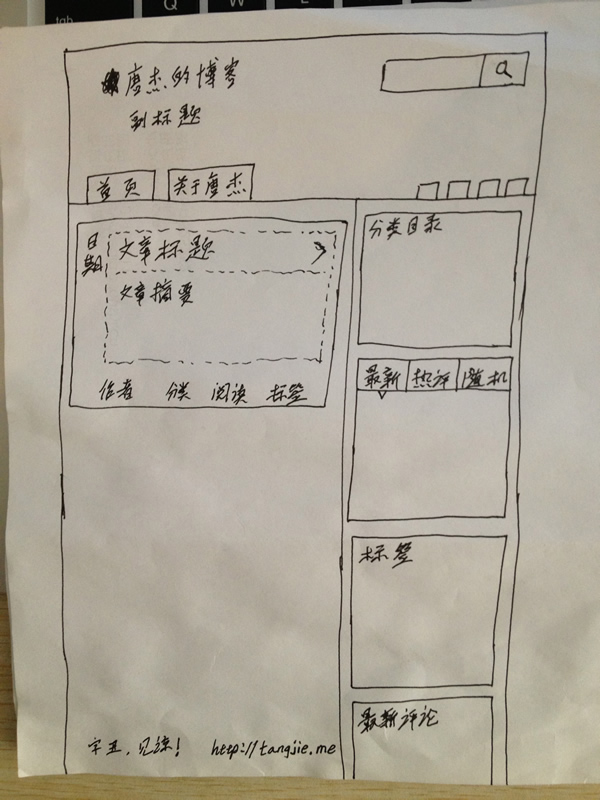
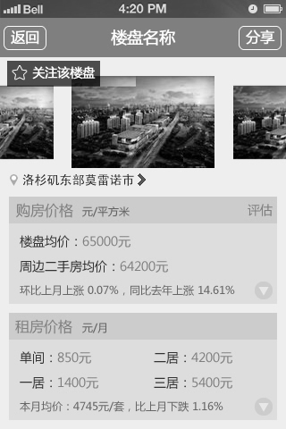

# 原型设计

重点：**可视+互动**

在产品定义阶段，用户参与产品设计和体验，解决75%的问题才是最高效的。

原型的定义:是产品方案的输出物 [1]。

**目的**：将想法转化为高效传达给其他人（程序员和ui）或者与用一起测试的形式,并且随看时间的推移,可以持续进行调整。你可以用它来自如的测试未完成的想法,从而达到最佳的结果。接受反馈,将反馈再次融入到你的原型设计中。只要对方能够听懂看懂就可以了，所以**使用手绘原型**是最高效率的方法。

## 原型设计和评审

由产品经理主导的。基于运营的需求设计原型，在原型设计完后，要经过内部评审和外部评审。

在内部评审中，产品经理要召集数据中台的架构师、模型设计师、数据开发工程师、后端开发工程师、前端开发工程师、UI设计师、测试工程师，说明整个功能的价值和详细的**业务流程、操作流程**，确保大家理解一致。

接下来，产品经理和运营人员要针对原型做一次外部评审，把**有歧义的地方一并解决**。

对于比较重要的功能，产品经理需要发邮件让运营人员进一步确认，并同步给所有的产品/运营人员，保证大家的口径一致。[11]

## 原型设计时需要思考的问题 [9]

1. 原型需要达到的目的是什么？
1. 此原型的用户是谁？
1. 用户的使用场景是什么？
1. 需要提供什么样的用户体验？
1. 后续的工作流程如何把握？

### 目的 + 用户 + 使用场景：

1. 将需求可视化：产品经理通过调研或发掘，或者是Leader直接向下传达的需求，将其可视化，需要形象准确地描绘出来，以便对方可以直观理解，快速达成共识；

2. 完成设计协作：在产品开发流程中，对于确定的需求和功能策划，需要在进入UI设计阶段之前将原型稿确认，便于在正式投入精美的设计之前可以先把产品的方向以及功能结构确定下来，避免设计返工；

3. 向甲方爸爸展示：对于一些外包服务型公司，在跟甲方或者客户爸爸确定需求后，需要第一时间将双方理解的内容快速展示出来，以便快速发现问题然后沟通调整，为之后交付正确的解决方案做准备，也同时尽量避免因前期客户信息不同步造成的项目风险。

针对以上三个场景，就诞生了三种典型的原型稿绘制形态：草绘线框图、低/中保真原型、高保真原型。

## 用户体验，即提供不同原型

### 草绘/手绘原型

线框图，不可交互，手绘来最快速的表现产品轮廓手绘原型在初期验证想法时非常高效，也方便讨论和重构，同时也适合敏捷开发时快速出原型；只展示大概的原型界面框架、关键内容和核心的页面流，可以是手绘或使用软件工具。特点是：快。[11]

### 低/中保真原型

低保真原型：由图形设计软件制作而成，不可交互。最常用的软件是Photoshop和Fireworks，相对手绘原型，灰模更加清晰和整洁，也适用于正式场合的PPT形式宣讲，或打印在纸上，来展示主业务流程。平面原型：如果不会使用图形软件也可以使用Axure RP设计，相比交互原型，灰模原型只是缺少交互效果，仅仅是将产品需求以线框结构的方式展示出来，让产品需求更加规整的直观展现。[8]低保真 Axure实战:ref:`page_Axure`

中保真原型：可简单交互（点击页面跳转），在保证原型基础的规范性基础上，还可以让专业的交互、视觉设计师有一定的发挥空间来简单配色并配图，但字体、配色和配图不完美；该种形态多用于上述第二种场景，多用于在工作流程中的交互、设计协作，

### 高保真原型

开发和设计参与，原型可交互，可录入信息，可以实现所有流程，有动画效果，字体、配色和配图与真实产品一致。该种形态多用于上述第三种场景，即在向客户交付方案前的成果展示，为了便于趋近真实的产品，方便客户可以快速理解和决策是否要直接投入开发成本；高保真 Axure实战:ref:`page_done_Axure`

### 线框图

![线框图[7]](../img/lineframe_chart.jpg)

## 反馈

## 反馈圈分类

- 团队成员或朋友：团队成员，公司员工，社交圈朋友。特点：容易找到，易与沟通。使用低保真原型，了解主要流程是否存在问题。
- 行业专家：相关领域产品经理和产品专家，他们了解目标市场。特点：能提出逻辑清晰的意见。使用低，中保真原型。
- 客户：目标市场的客户。使用中、高保真原型，他们会提供非常棒的反馈意见
- 客户的客户：特定人群应用，如投资人等。使用高保真原型展示，获取真实反馈。

## 信息收集工具

- 记笔记；
- 手机录音；
- 在用户允许的情况下，录入表情；
- 原型操作过程手机或电脑页面录制。

## 工具推荐

- 低保真-线框-纸质原型：可以用于产品团队内部交流使用，通过头脑风暴，跑通住业务流程。确定MVP（Minimum Viable Product, MVP）方案，确定中保真原型方案。
- 中保真原型--墨刀或axure：对于朋友、专家和客户可以提供具有交互功能的可录入信息的中保真原型，设计尽量保证完成，以便于手机用户的全部操作行为。
- 高保真原型：开发资源富裕的团队，如微信团队，可以实现每个想法的高保真原型快速输出和范围测试。

### 墨刀

墨刀[3]是一个款移动端原型制作工具，原型制作制作方便，可以快捷添加一些简单的交互动画，信息录入，逻辑判断等功能，支持微信分享，便于传播手机信息。

挑一种学一下就可以了（最易学习的是墨刀，Sketch学会了用起来最顺手快捷，Axure应该算是最不好用的一个了

## 产品演进路线图 [2]

产品演进路线图是为了给产品的利益相关者以及团队呈现产品长远发展的构思。使团队内部和利益相关者对项目的长远发展一目了然并达成共识

- 近期:为了满足需求必须要包含的功能
- 中期:关注范围广、有一定的灵活性的功能
- 远期:顶层设计、宽泛的范围、更加灵活的功能

## 绘制操作流程 [9]

- 对于交互比较复杂的操作，需要绘制操作流程图，可以是Visio图，也可以是页面跳转说明
- 操作流程图中形状需要根据标准进行选择
- 需要包含正常操作逻辑和异常操作逻辑

## 原型发布和导出 [9]

- 原型发布时选择生成HTML文件，在相应的文件夹中，点击start.html就可以通过浏览器打开发布的文件（在线太慢，一般建议导出使用）
- 原型导出时，也可以将所有相关页面导出为PNG图片
- 给前端提供原型时，最好分别提供HTML文件和PNG图片

## 验证（Validate） [4]

验证产品原型

![验证产品原型后续工作[10]](../img/after_validate.png)

## 题目 [5]

Axure文件的后缀名RP（Rapid Prototyping）指快速原型

- Action sheet：动作菜单/动作面板/行动列表
- Picker：选择器/拾取器
- Toast：吐司提示 产品设计中常把出现在屏幕中、用以引起注意，短暂出现后消失的提醒控件叫做
- Status bar：全局修改状态栏
- More: [6]

[1]: https://www.zhihu.com/question/55997614/answer/615628989
[2]: https://www.bilibili.com/video/BV1254y1D7Ht?from=search&seid=14167562900175777805
[3]: https://zhuanlan.zhihu.com/p/33997501
[4]: https://www.jianshu.com/p/cb6ae5a3f3fa
[5]: https://blog.nowcoder.net/n/9bd8651faead4a73ae344be0b74128de
[6]: https://www.jianshu.com/nb/9076183
[7]: https://www.bilibili.com/video/BV1Yx411f7d6?from=search&seid=9942601070785163162
[8]: https://tangjie.me/blog/114.html
[9]: https://zhuanlan.zhihu.com/p/56954145
[10]: https://mp.weixin.qq.com/s?__biz=MjM5MzE3MDQ3Mw==&mid=2650404998&idx=3&sn=e4bf27058ac6a697bfb1ae3cbb319e14&chksm=be964dc089e1c4d613d4dcf763e01fbc65dee8b08136e34ebf62c1d22cbc7d83c58502416f2a&scene=21#wechat_redirect
[11]: https://www.zhihu.com/question/461160785/answer/2007476874
