# 静态页面

导航信息、组件元素、页面布局-栅格系统、文案信息、重要备注 [1]

## 低保真 Axure实战
:label:`page_Axure`

大小 [2]：
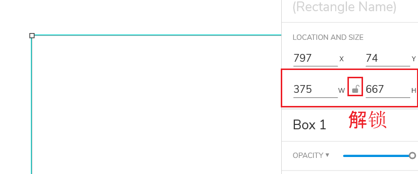

锁定：
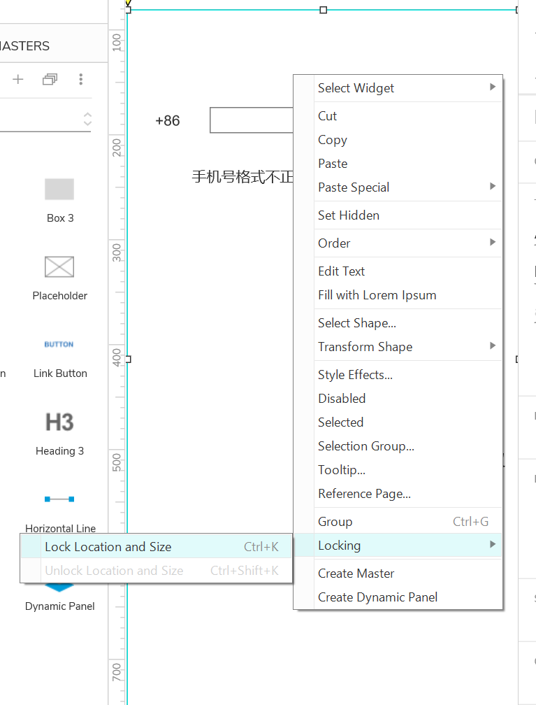

关闭按钮：
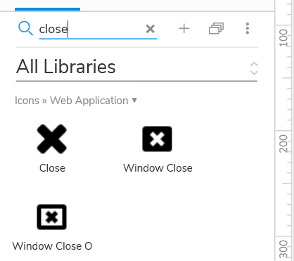

整体：
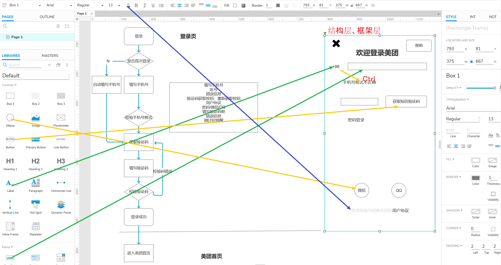

## 高保真 Axure实战
:label:`page_done_Axure`

https://library.ant.design/

下载，解压

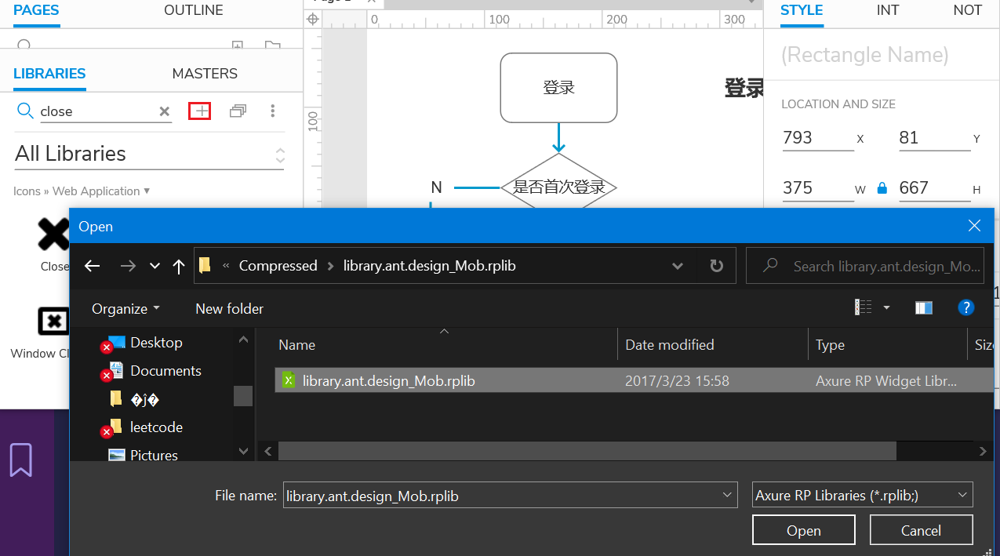

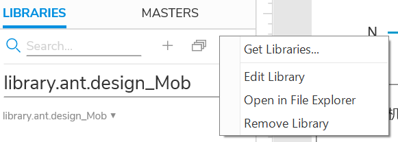

图标：https://www.iconfont.cn/

登录失败。。

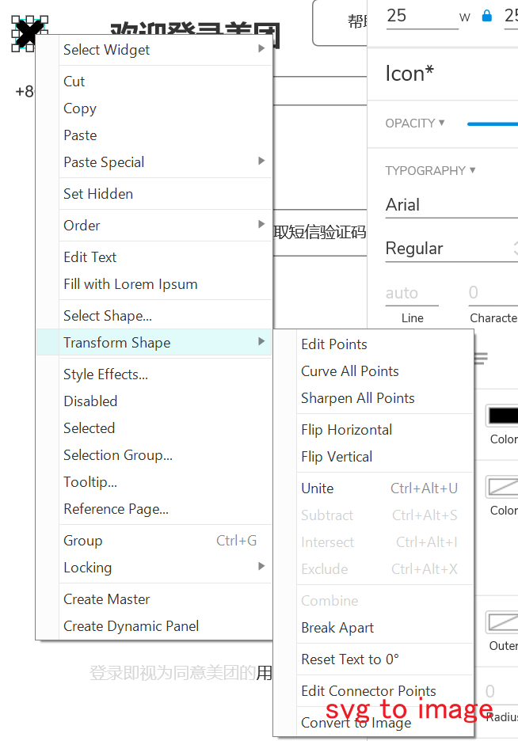

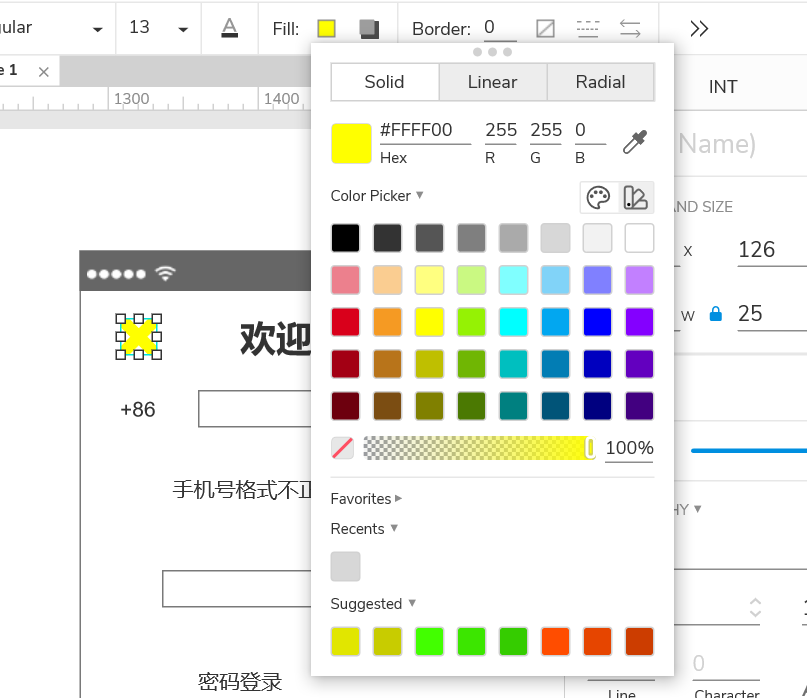

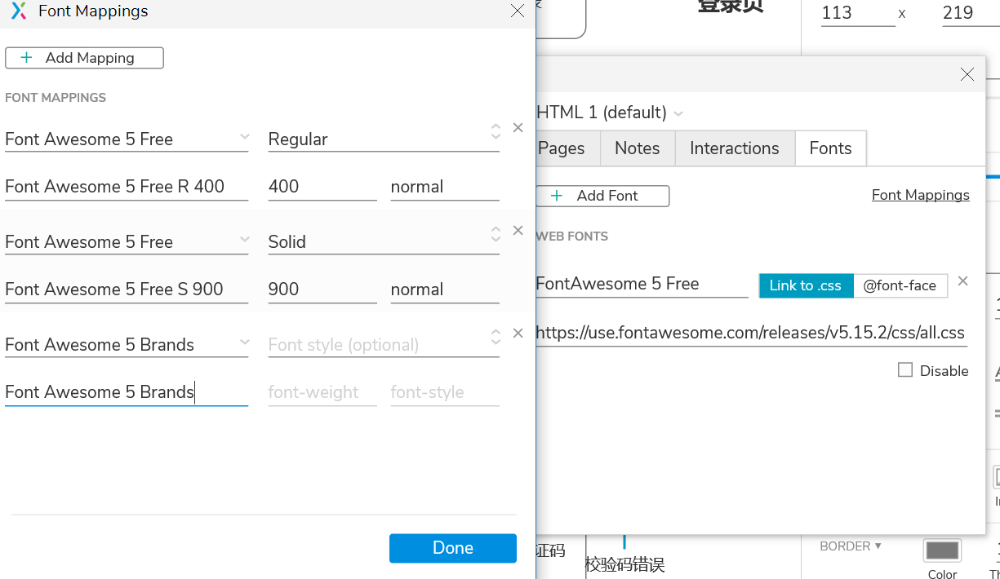

https://www.flaticon.com/search?word=close

对齐：先圆形后图标，居中

卡死了，为啥？

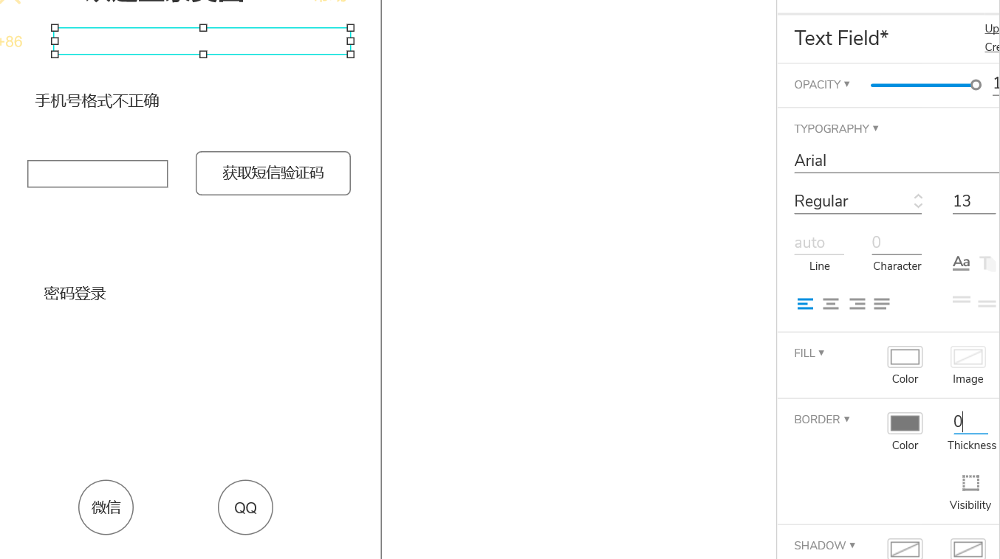

勉强做完，实在登不上iconfont..QQ找不到，wechat用的flaticon

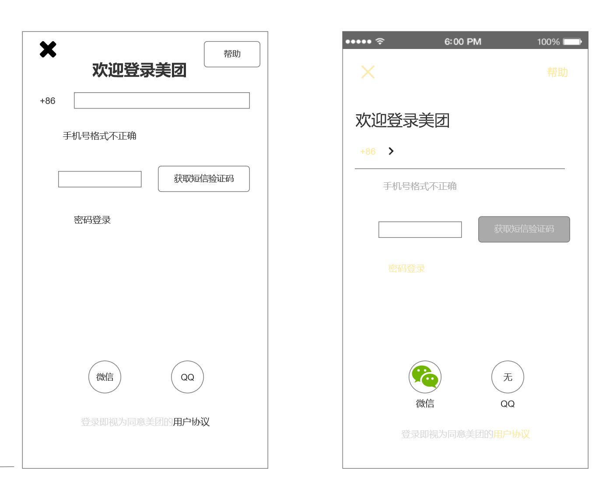

## 交互设计图 —— 只做交互相关解释
:label:`UI_design_docs`

### 什么是「交互文档」？

- 交互文档也称DRD，是用来告诉别人「页面设计细节」的一个说明文档。
- 包括页面跳转逻辑、页面交互逻辑、页面显示状态等细节的说明。[4]

### 为什么要写交互文档？

- 交互设计师的工作就是完善细节设计，那你设计的这些细节应该如何告诉开发呢？口述当然是不行的了，第一是记不住，第二是会理解错误，第三就是最重要的一点，没有历史记录。
- 现在办公用的聊天软件非常多，但是所有企业依然使用邮件的方式沟通，这正是因为邮件可以作为沟通证据保存下来，没有沟通记录就等于没说，交互文档也是一个道理，你要把你做的所有细节都写下来，给其他人发邮件，告诉对方要做什么、要怎么做。

### 交互文档给谁看？

**交互设计文档**主要是**给前端和UI看的文档**，所以文档的说明应**不包含业务解释、规则说明**相关的内容。可以借用需求文档的思路，还是先排版，页面分为“准高保证原型图”、“注释说明”、“交互”、“其他补充内容”。[3]

- 给产品经理看：交互逻辑、交互方式，需要与产品经理确认。产品经理是把控整个产品的一个角色，任何事情他都需要做到心里有数，包括交互设计。
- 给UI设计师看：交互设计会包含很多状态、很多细节、很多页面，UI设计师要确保每一个状态、每一个页面都画出来，这样在开发的时候才不会漏掉东西。
- 给开发人员看：代码逻辑和我们普通说话的逻辑不同，说话的时候可以是点击这里跳转页面，而程序员需要知道点击什么位置，使用什么方式跳转到哪一个页面，中途需要判断哪些规则，如果中途失败怎么办...因此交互文档就更重要了。
- 给测试人员看：测试岗位也称QA，属于研发部门旗下的一个岗位（很多小公司没有这个岗位），你需要把你所有的设计细节都告诉他，然后他去测试一遍最终效果与你设计的是否完全一致（不包括UI）。

### 内容

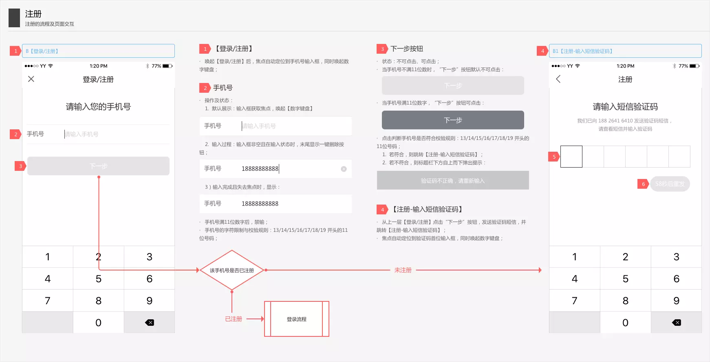

- 文档页面标题：一般在每一页文档的顶部。写明当页内容是属于哪个模块或流程的，让看的人不容易迷失；
- 界面标题：注意命名，方便交互稿中的互相联系，如“跳转【XX页面】”，“回到【XX界面】状态”；
- 界面：界面尺寸建议按实际界面的比例缩小，避免你想当然的设计并不符合规范，也避免一个界面太大影响阅读效果；
- 设计说明：逻辑关系、操作流程或反馈、元素状态、字符限制、异常/特殊状态 等等，都可以放在设计说明中；
- 交互说明：提示弹框样式、功能实现方式、提示内容等响应用户物理操作的反馈画面。
- 流程线：说明界面间逻辑关系；
- 跳转链接：指向其他页面，例如某子流程，开发伙伴阅读起来会很方便。
- 注释说明：应该包括输入检测标准、缺省值、界面元素变化、显示上限等情景的说明。

## 更多

- https://www.axurethemes.com/axure-icon-packs
- https://fontawesome.com/download
- https://forum.axure.com/t/4-steps-to-get-fontawesome-5-11-2-free-axure-9-working/65942
- https://fontawesome.com/icons?d=gallery&p=2&q=close
- https://github.com/bsdfzzzy/iconfont-all-in-one
- http://caibaojian.com/font-awesome.html

[1]: https://www.yinxiang.com/everhub/note/f9ab87ee-73e6-4241-9428-9507cbfd007f
[2]: https://www.bilibili.com/video/BV1WE411w7LW?p=3
[3]: http://www.woshipm.com/pmd/418829.html
[4]: https://www.zhihu.com/question/19825650/answer/758117107
